# S1 | Introduction
---

## S1 | What is Node.js
---
### Lecture Snapshots
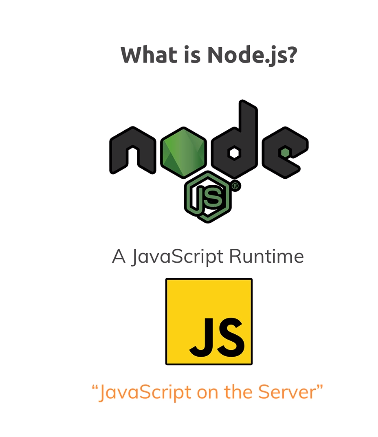  
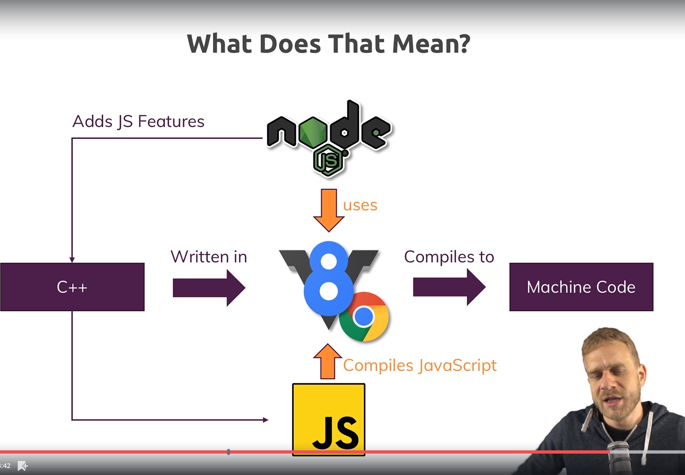  

## S1 | Installing Node.js and Creating our First App
---
### Lecture Snapshots
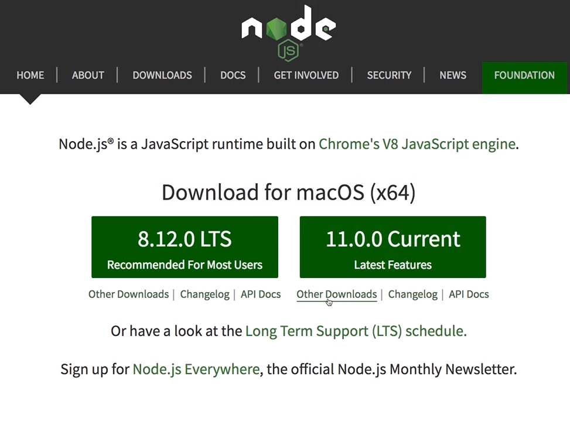  
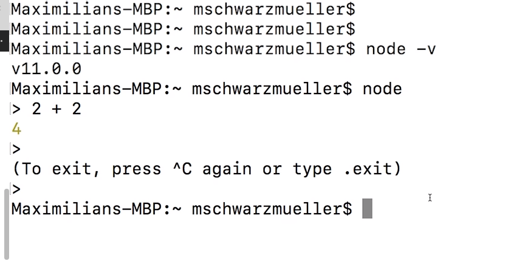  

Open the folder you created. This is the project folder
Writing to a local file...
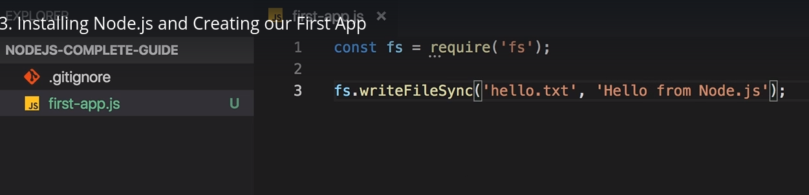  

## S1 | Understanding the Role & Usage of Node.js
---
### Lecture Snapshots
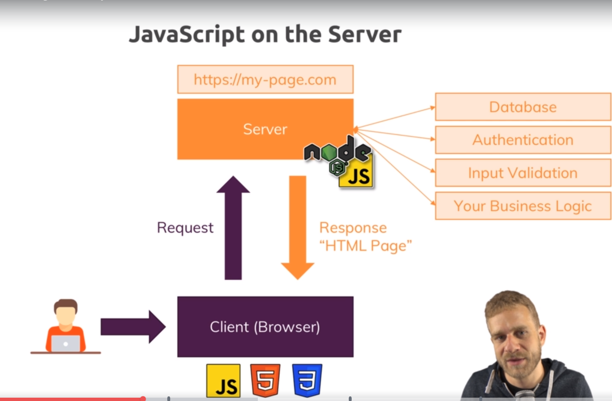  
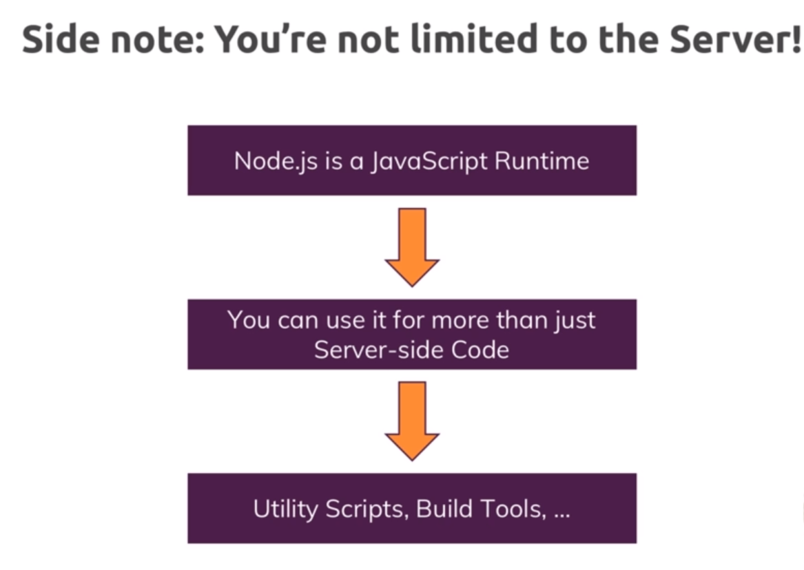  
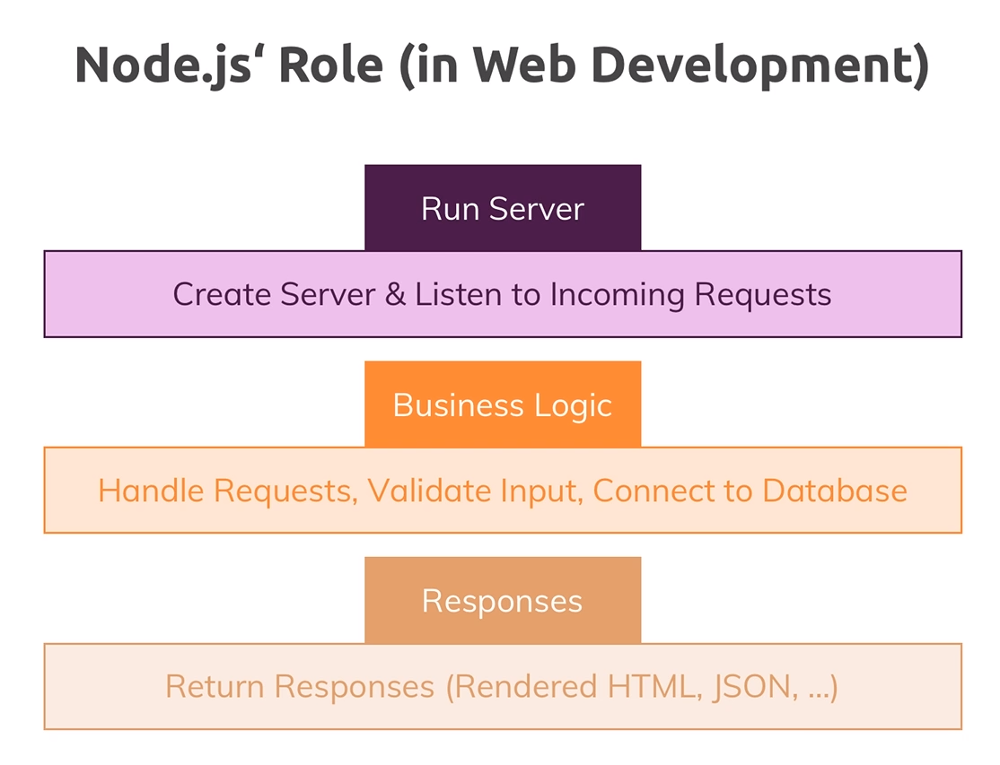  
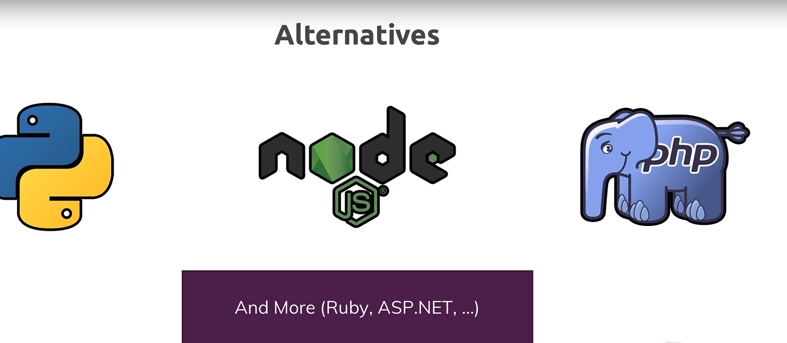  

## S1 | Course Outline
---
### Lecture Snapshots
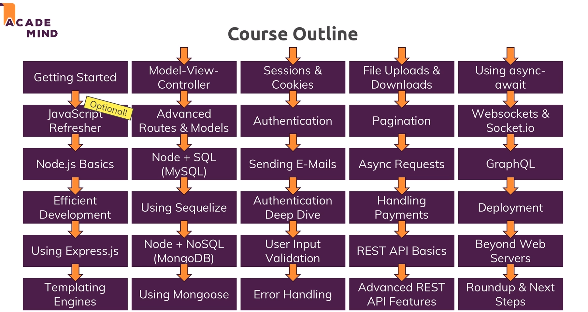

## S1 |  Working with the REPL vs Using Files 
---
### Lecture Snapshots
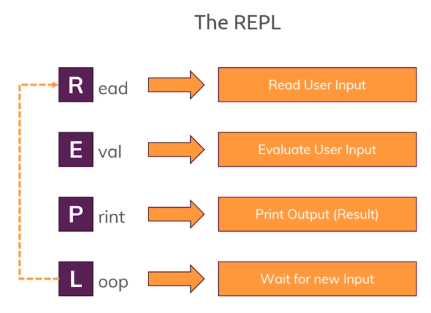
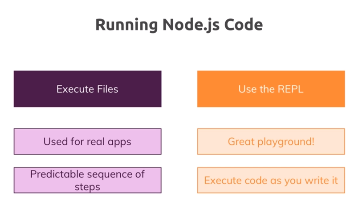