# S2 | Javascript - A quick refresher
---

## S2 | JavaScript in a Nutshel
---
### Lecture Snapshots
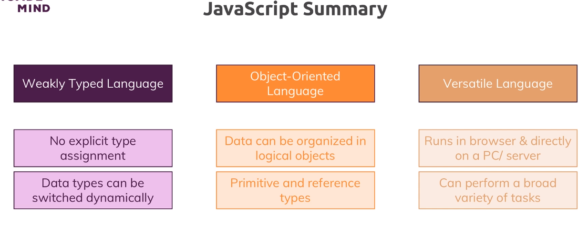  

## S2 | let & const
---
### Lecture Snapshots
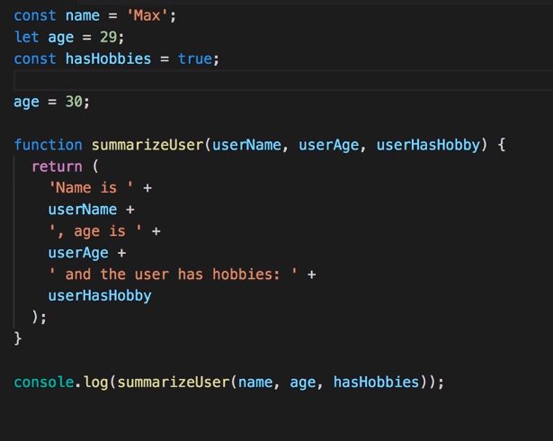  
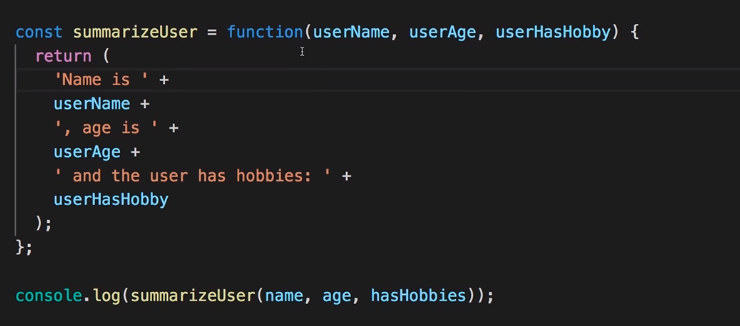  

The this keyword is different for Normal functions and Arrow functions.
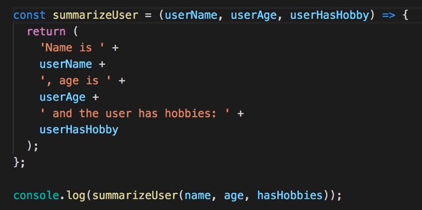  
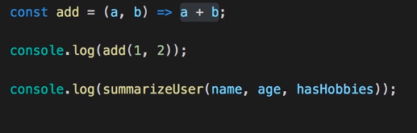  
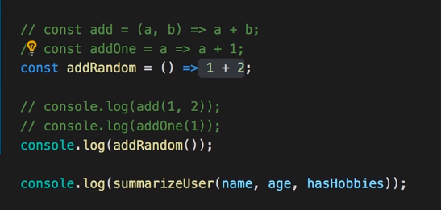  

## S2 | Working with Objects, Properties & Methods
---
### Lecture Snapshots
Why the output is `Hi, I am undefined` ?
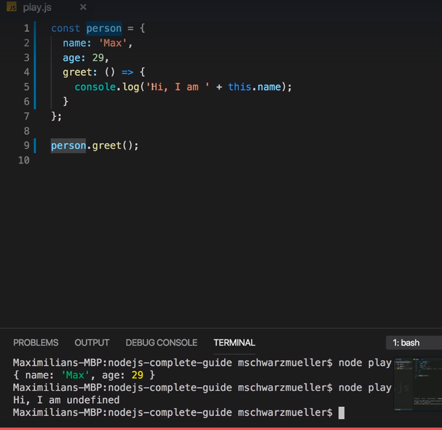

Because of the arrow function, the `this` keyword refers to the global scope and not the person object. To change this behaviour we have to remove the arrow function and use the old syntax of writing functions:
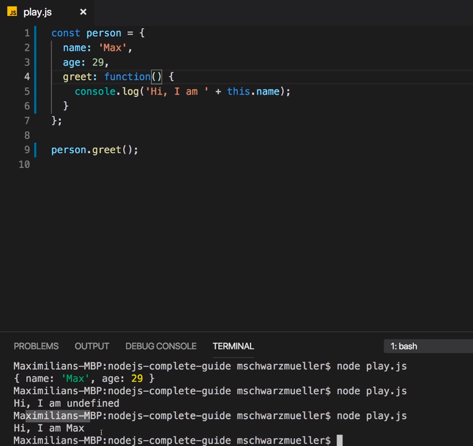
Or use greet like below : 
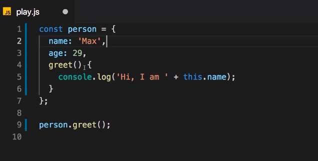

## S2 | Arrays & Array Methods
---
### Lecture Snapshots
 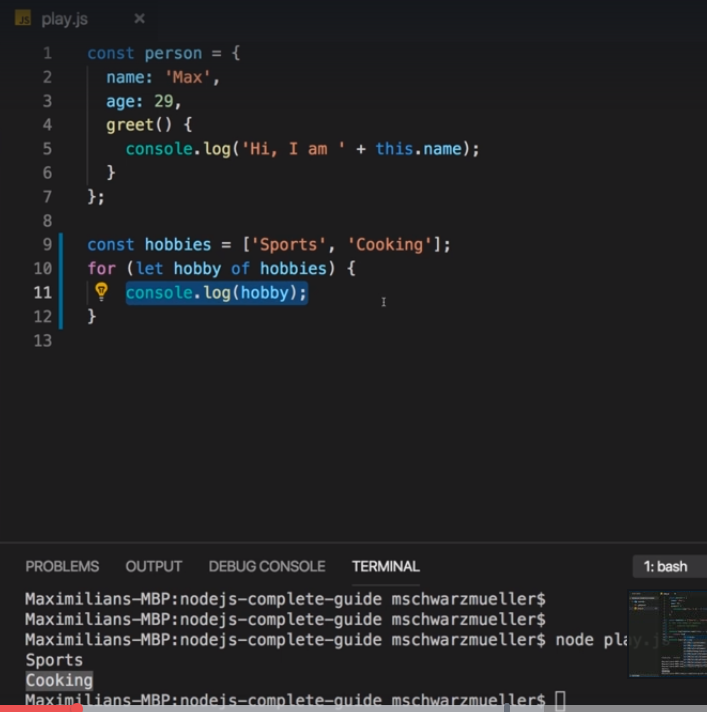
 
 `Array.map()`
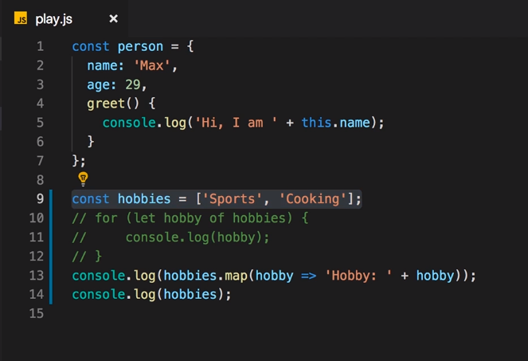

## S2 | Arrays, Objects & Reference Types
---
### Lecture Snapshots
Editing a thing the const is pointing at
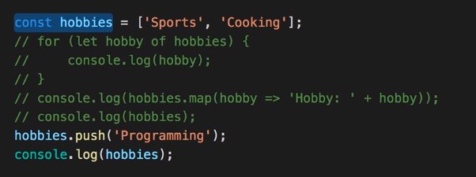

## S2 | Understanding Spread & Rest Operators
---
### Lecture Snapshots
Create a new array with all the existing value copied from the old array and also add some new property without editing the existing array.

copy with `slice()`
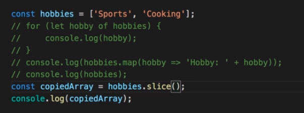

copy with the `spread` operator
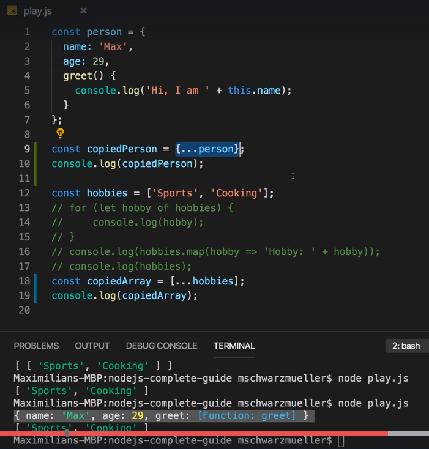

the `REST` operator - used to merge elements
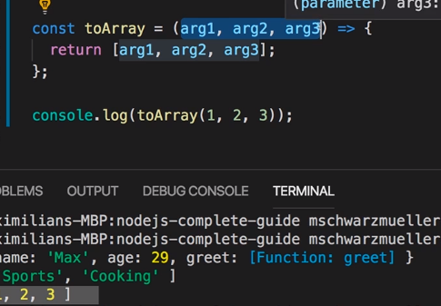
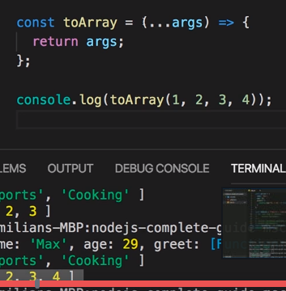

## S2 | Destructuring
---
### Lecture Snapshots
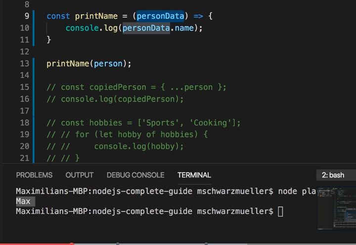
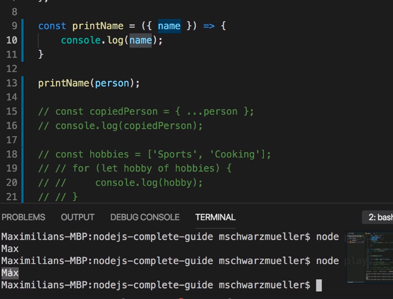
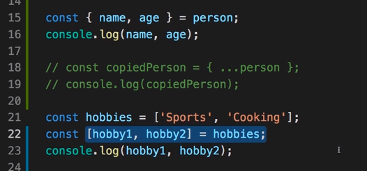 

## S2 | Async Code & Promises
---
### Lecture Snapshots
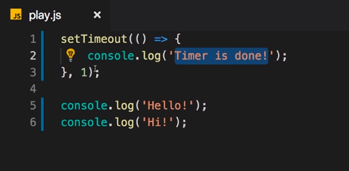 

Nested callback 
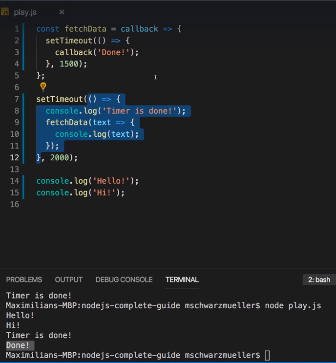 

Promises
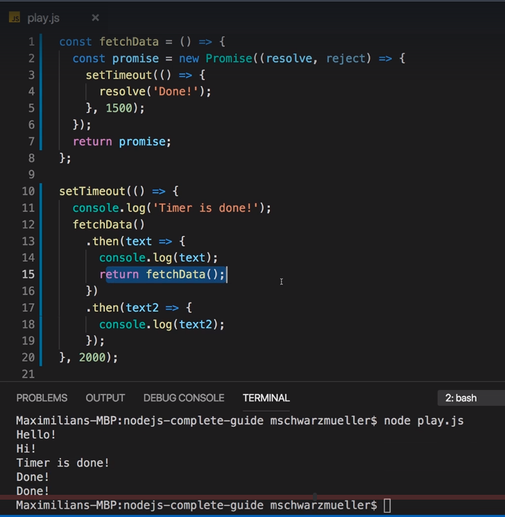 

## S2 | Template literals 
---
### Lecture Snapshots
It's a different way of writing strings.
Instead of using double or single quotation marks:
'A String'
or
"Another string"

you can use backticks (`) . 
`Another way of writing strings`

Now why would we use that way of creating strings?
With that syntax, you can dynamically add data into a string like this:
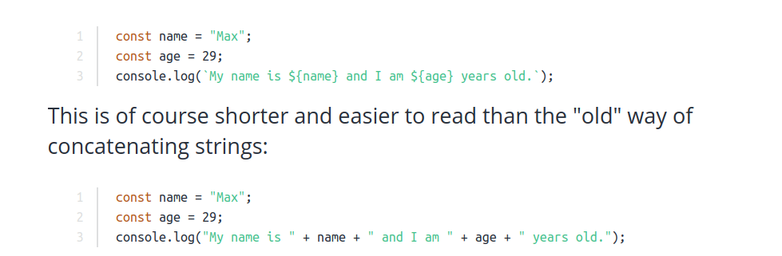 