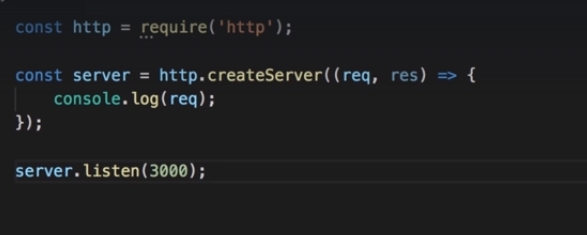
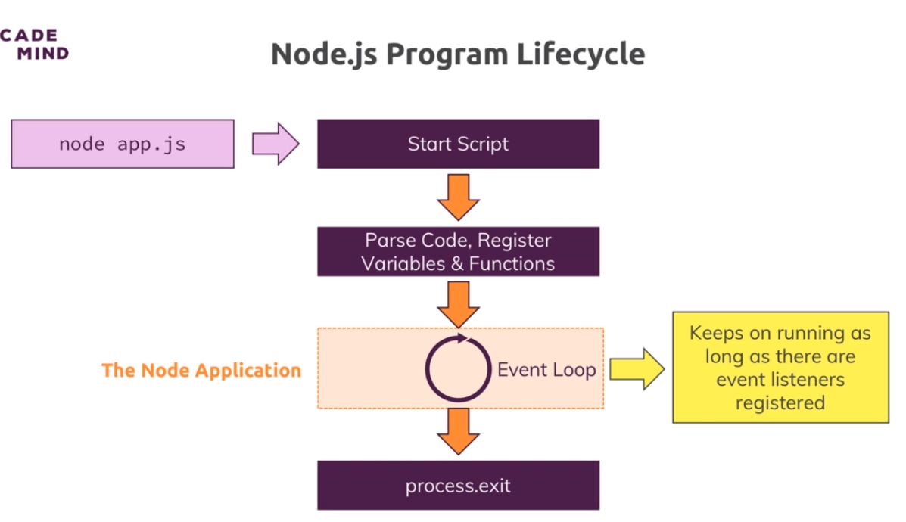
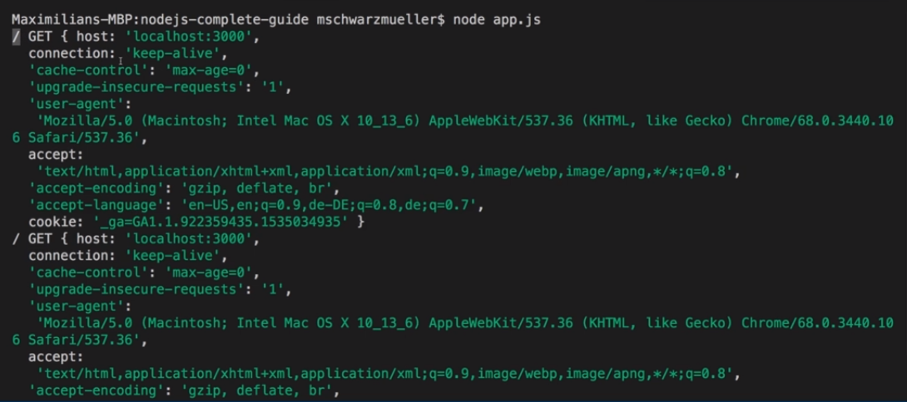
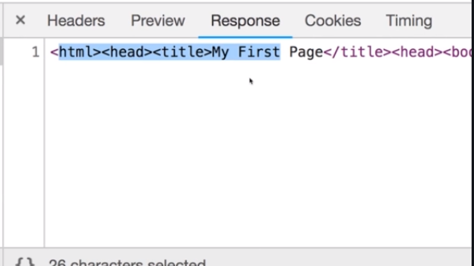

# S3 | Understanding the basics
---

## S3 | Module Introduction
---
### Lecture Snapshots
 

## S3 | How The Web Works 
---
### Lecture Snapshots


## S3 | Creating a Node Server
---
### Lecture Snapshots


#### importing the global module


For importing local modules created by yourself you have to add `"/"(absolute path)` or `"./"(relative path)`.

#### creating a server


A request listener is a function that will execute for every incoming request. It recieves 2 arguments: **request, response.**


This function will always be executed for all requests reaching our server.


You can also pass an anonymous function.


ES6


console the req 


#### one important part is missing 

this function only returns the server. But we do not know the location of the server


The `listen()` method starts a process that keeps on listening for incoming requests. It takes as argument the **port and the hostname**


look at the cursor. The file execution did not finish. Its listening for requests.


#### see the server in action

your req is logged.


## S3 | The Node Lifecycle & Event Loop
---
### Lecture Snapshots




The process hard exited and gave the control back to the terminal.


## S3 | Understanding Requests
---
### Lecture Snapshots
The req is generated by the nodejs server once we visit the url `localhost:3000`.


lets output only few properties of the req object.


the url, method and header. url is anything after our localhost.


## S3 | Sending Responses
---
### Lecture Snapshots

#### the response object needs to be filled with data

Like we can set the header types.


Write some data to the response (html) line by line


After finishing the html code you have to end the response by writing end(). We must not write anymore after end(). Otherwise we will get an error .


#### output




## S3 | Routing Requests
---
### Objective 
Route different urls to different pages 

### Lecture Snapshots
Lets write some case statements on the url of the request.


Send a **POST** request to '/message'


A name attribute in the form input elements causes the request sent to the server to have that as request data .


So we render this html code for `url = "/"`


A `return` statement is needed to end the code execution of the listener function so that after returning the response with a particular html the next piece of code that might return some other html is not executed.


Enter something and click Send


We see 


since the url is now `/message`


So this code runs


## S3 | Redirecting Requests
---
### Lecture Snapshots
Lets do something when the send button is clicked
1. Redirect user to the page with `url="/"`.
2. Write a new file with the message entered by the user on the root home page 


write file with `writefileSync`. Will explain later.


Redirection Code with some js object using writeHead


Or you can do this separately by setting the statusCode = 302 which is for redirection and set the Header (Location) to '/'. Then you have to end the res so that the later codes are not executed


We got redirected to `localhost/` after we clicked send in the form.


We get the messgae.text file with DUMMY inside.


Lets parse the data user sent us and write that data instead of DUMMY.

## S3 | Parsing Request Bodies
---
### Lecture Snapshots
* There is nothing like request.data. 
* Instead the incoming data is sent as a stream of data. For example a large file uploaded to the server comes in smaller chunks so that the server can start processing those chunk before the whole file gets uploaded.
* There is a connected concept called buffer.
* Request is read in chunks by node


* Buffers are required to work with such chunks of flowing data. It acts as **bus stop** for the chunks so that you are able to work with them before releasing them.


* Register an event listener in the req called `"on"` and listen for a `"data"` event. 


* The data event will be fired whenever a new chunk is ready to be read. The 2nd argument is the function that should be executed for every data event. 


* This listener receives a chunk of data. Lets log the chunk and see whats inside.


* We need to register another event listener, `end`. This will be called when the data parsing /incoming request parsing is done. Now all chunks are stored in the body.
* To work with these chunks we need to use `Buffer`, our **bus stop**. Then we need to concat the body to it and convert to string and console.log the `parseBbody`.


* Output


* Store the input in our file


## S3 | Understanding Event Driven Code Execution
---
### Lecture Snapshots
* Wrong way of setting up the response if we want that the event listener should affect the response


* Correct way. Put all the code inside the event listener.


* In nodejs we can register code which will fire at a later time but this will not block the codes immediately placed after it. Its non-blocking.


* To avoid execution of the code after listener we need to return.
 

## S3 | Blocking and Non-Blocking Code
---
### Objective
What is wrong with the `writeFileSync` here !
 

### Lecture Snapshots
* **`writeFileSync`** is a synchronous method which will block code until the file is created.
* Instead we should use `writeFile` which is synchronous in nature and does not block the code. It also accepts a 3rd argument which is a callabck, the function that should be executed after the file writing is done. The event handler receives an **error** object in case there is an error.
 

* Lets move the response code inside the event handler because we want this to execute only when we finish writing the file.
 

So nodejs is non-blocking. It tells the OS (milti-threaded), do this and do that and continues execution. Once the OS finishes execution it executes the callback which was an event handler registered.

```javascript
    // 1 - save the info entered in the form in a file
      //[Blocking]
      fs.writeFileSync("message.txt", data); // writeFileSync operates sequentially and blocks the following code execution. Instead use "writeFile" func 

      // writeFile executes asynchronously and does not block code until file is written to disc. It also accepts a 3rd argument which is 
      //[Non-Blocking]
      fs.writeFile('message.txt', data, (error) => {
        // 2 - redirect the user to url = '/'
        res.statusCode = 302; // redirection code
        res.setHeader("Location", "/"); // redirection url
        return res.end(); // return from the function after res prepared.
      });
```

## S3 | Node.js - Looking Behind the Scenes
---
### Objective
How Nodejs manages its work!

### Lecture Snapshots
* Nodejs uses only one `SINGLE THREAD` (a process in your OS).
* How is it then able to handle multiple requests if its single threaded.
* The `EVENT LOOP` will only handle Callbacks with fast finishing code.
* Instead out file system operation and other long taking operations are sent to a `WORKER POOL`. This worker pool does the heavy lifting and can have `MULTIPLE THREADS`. This is close connected to the OS we work on. This is `DETACHED` from the nodejs code, event loop and from the event loop. Once the worker is done it will trigger the `CALLBACK` for that operation (e.g readFile, wrtiteFile) which will be picked up by the event loop.
 

* **Event Loop (Advanced)**
 

## S3 | Using the Node Modules System
---
### Objective
Improving our code with multiple files.

### Lecture Snapshots
* Create routes.js
   

* Cut all `if..else` code from the `app.js` and paste to `routes.js`
   

* `app.js`
   

* `routes.js`
  * Create a `requestHandler()` function in the routes.js file which will be    connected to the `app.js` file.
     
  
  * **Export** the `requestHandler()` method so that app.js can use it
      
  
  * **Import** in app.js
       

  * Other syntax to export many things
       
       
      short cut supported by nodejs..you can remove the module
       

  * Other syntax to import many things
       

### Lets split the code into multiple files and use them together. Here we create a routes.js file to handle the routing.

```javascript
//[routes.js]
const requestHandler = (req, res) => {
    if (url === "/") {

    }
    if (url === "/message" && method === "POST") {

    }
}
/**
 * module.exports is a global object exposed by node js which has a exports property.
 * Assigning something e.g function or object to it allows node.js to use the registered object
 * by importing it whereever it is required.
*/
module.exports = requestHandler;
```

```javascript
//[App.js]
const http = require("http");

const routes = require('./routes'); // will cause node.js to look for any module.exports in the path, grab that and assign that to const routes.

const server = http.createServer(routes);
  
server.listen(3001); // servers starts listening to incoming requests.
```

### Exporting multiple things 

```javascript 
//[Way-1]
module.exports = {
    handler: requestHandler,
    someText: 'Some hard coded text'
}

//[Way-2]
module.exports.handler = requestHandler;
module.exports.someText = 'some hard coded text';

```

## S3 | Wrap up
---
### Objective

### Lecture Snapshots


## S3 | Useful Resources & Links
Useful resources:

[Official Node.js Docs:](https://nodejs.org/en/docs/guides/)

[Full Node.js Reference (for all core modules): ](https://nodejs.org/dist/latest/docs/api/)

[More about the Node.js Event Loop: ](https://nodejs.org/en/docs/guides/event-loop-timers-and-nexttick/)

[Blocking and Non-Blocking Code: ](https://nodejs.org/en/docs/guides/dont-block-the-event-loop/)