# S4 | Improved Development Workflow and Debugging
---

# S4 | Module Introduction
---
## Objective
## Lecture Snapshots
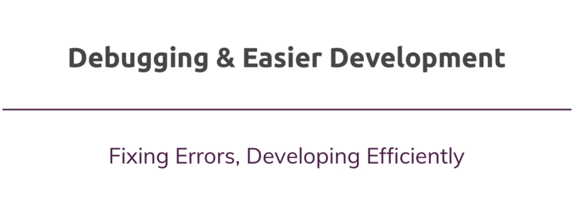

# S4 | Understanding NPM Scripts
---
## Objective
## Lecture Snapshots

### npm init
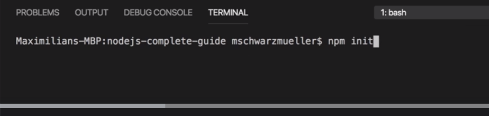

### you get `package.json` file 
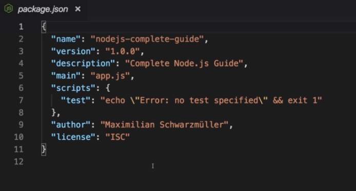

### scripts section
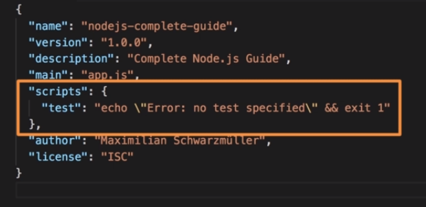

### add a new script command 
This is a good practice. Whenever you share the project the **entry point** need not be known. The user just has to type `npm start` to run the project.
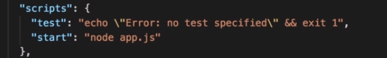
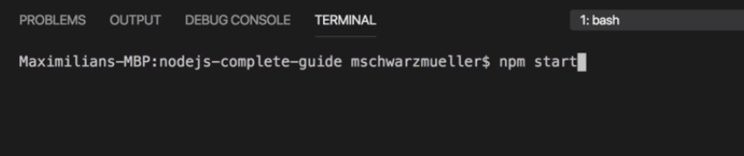

For normal script command like `start-server` you have to run `npm run start-server` unlike `npm start`.
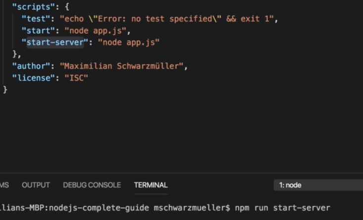

# S4 | Installing 3rd Party Packages
---
## Objective
## Lecture Snapshots
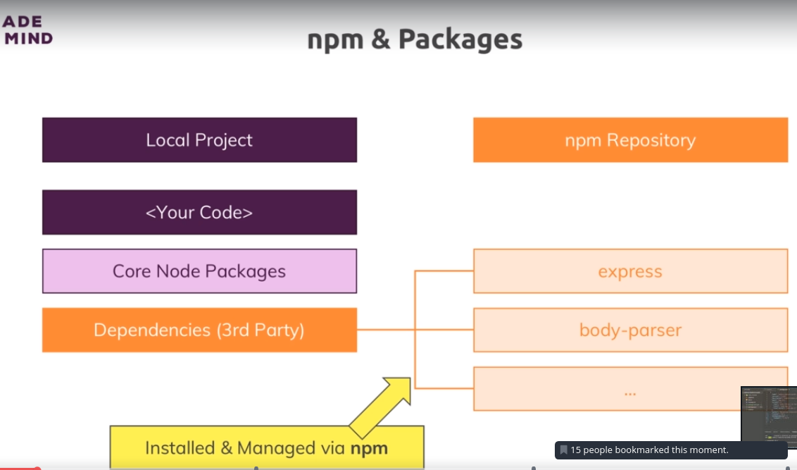

### live reload on server code update 
* i.e auto refresh without manually quitting server and restarting after changing code
* package Installation - `npm install` 
* package name : nodemon
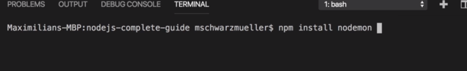

### define how you want to install
#### install as production dependancy
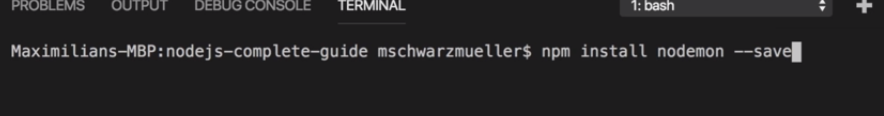

#### install as development dependancy
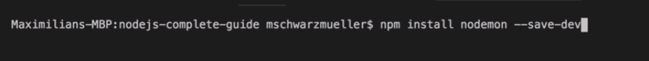

#### install globally on machine
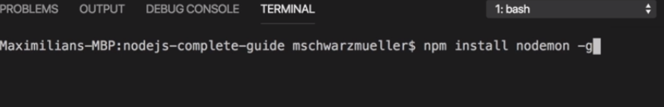

### installing
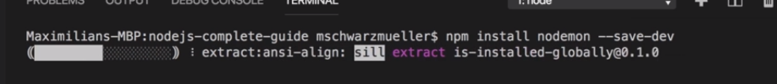
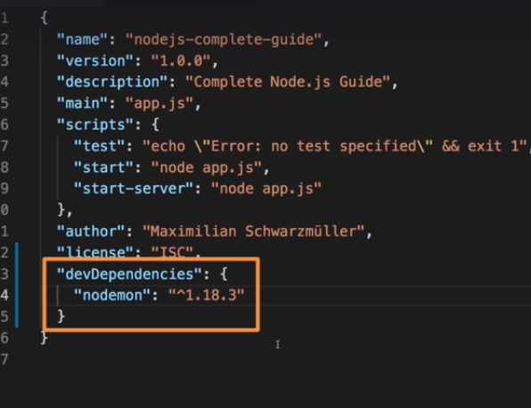

### free up space and npm install to re-install all dependeccies
`npm install`

# S4 | Using Nodemon for Autorestarts
---
## Objective
## Lecture Snapshots

### change the script start command 
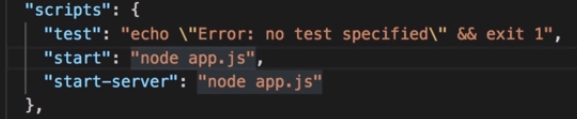
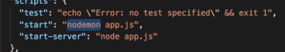

### npm start
starts the server and nodemon watches the file for any changes and auto restarts server when code changes and the files are saved.
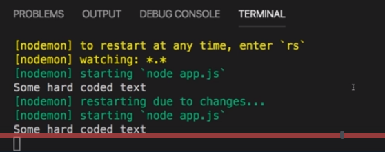

### Global & Local npm Packages
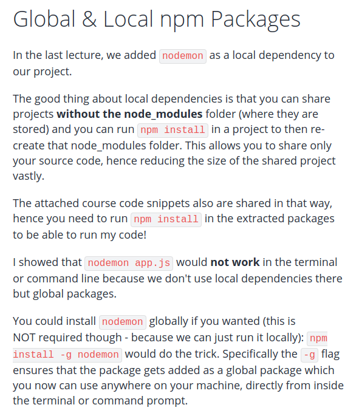

# S4 | Understanding different Error Types
---
## Objective
## Lecture Snapshots
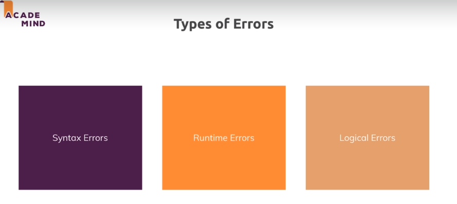 

# S4 | Syntax Error
# S4 | RunTime Error
# S4 | Logical Errors
---
## Objectives
## Lecture Snapshots

### stop the node server and then start debugging as below

### debugger
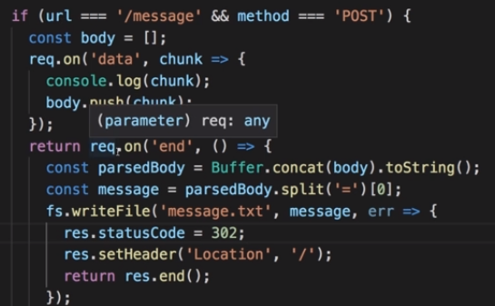
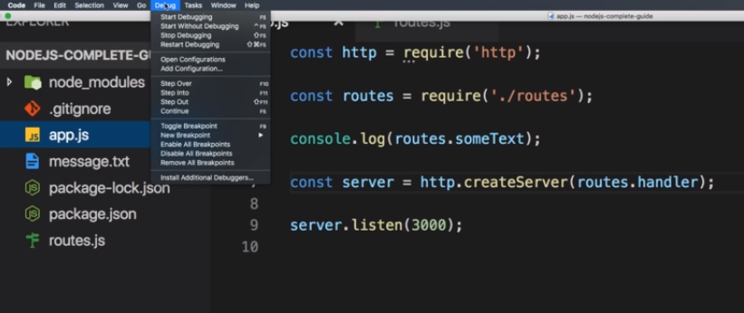
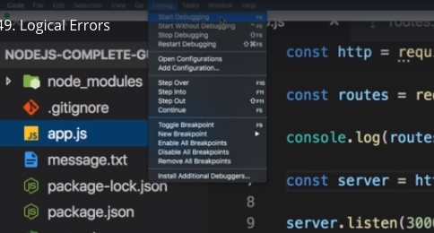
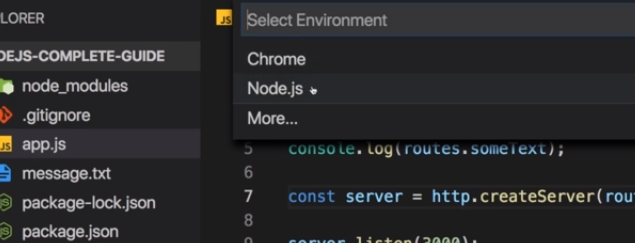 
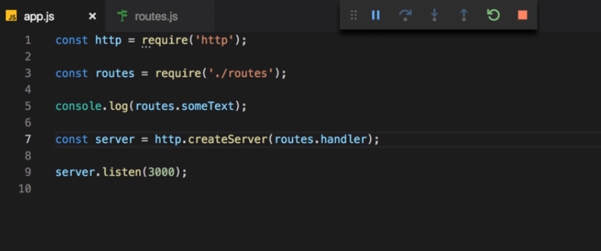 
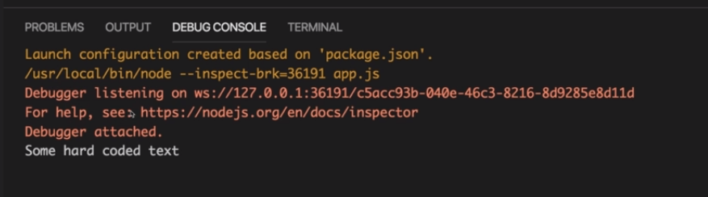 
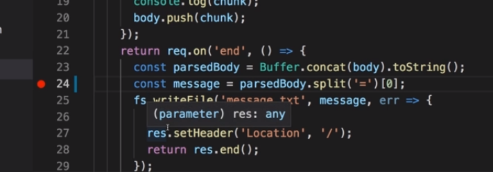 
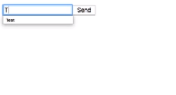 
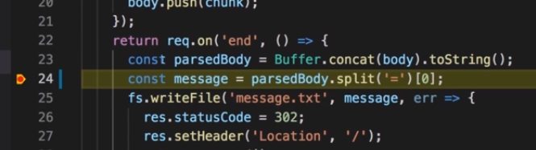 
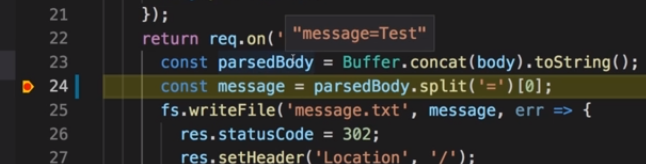 
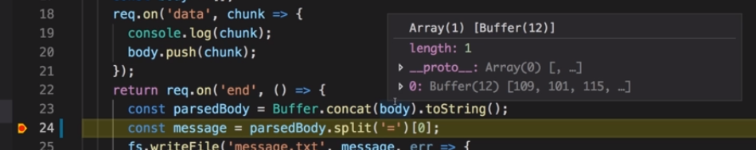 

### view - debug
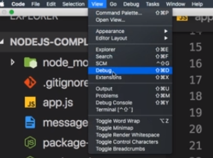 
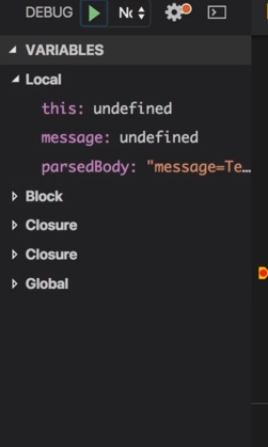 
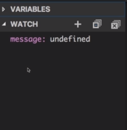 
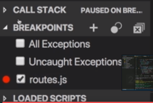 
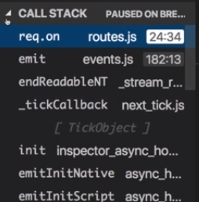 
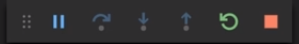 

# S4 | Using The Debugger
---
## Objectives
## Lecture Snapshots

### debug configuration
set the source as the starting point of debug
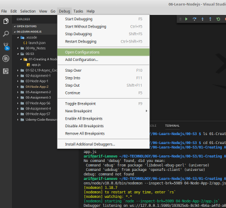
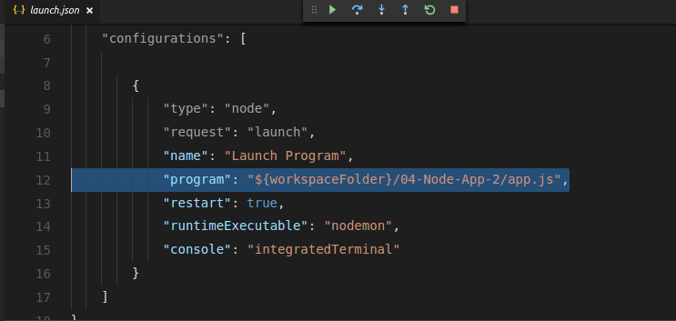
 
### run code in debug console to view the stored value in variable.
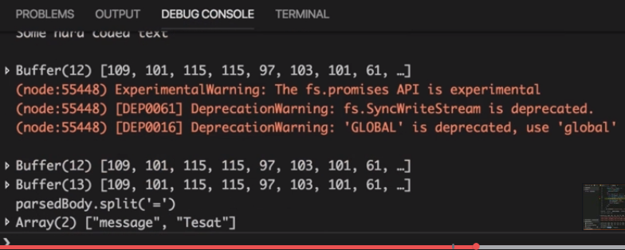

# S4 | Restarting the Debugger Automatically After Editing our App
---
## Objectives
After editing our code we want the debugger to start automatically.

## Lecture Snapshots
### Add configuration
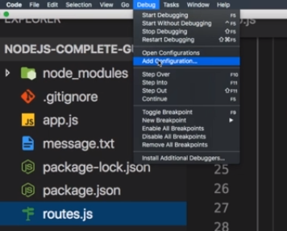
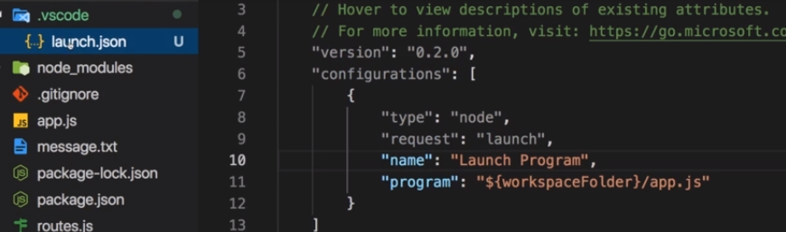

### restart=true
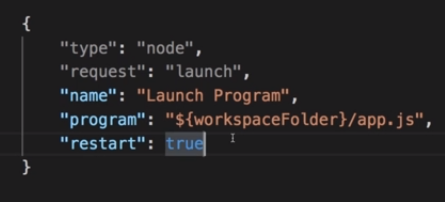

### make sure nodemon is used - so that the debugging is auto restarted when code changes.
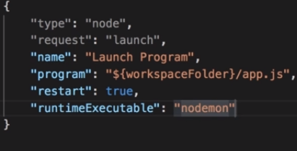

### you can changed the terminal where things are logged.
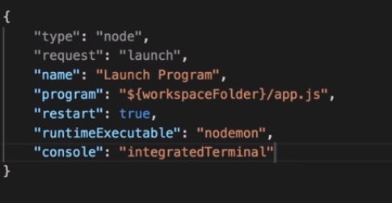

### debugger looks nodemon globally installed
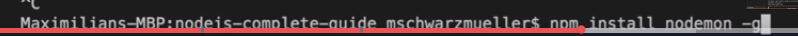

### If you are using the nodemon process then you should use the integrated terminal.
This is useful when you stop debugger and then have to quit the nodemon separately using Ctrl + c which would not have been possible with the **debug console**

## Debugging Node.js in Visual Studio Code
Want to dive super-deep into the latest debugging capabilities Visual Studio Code gives you (for Node.js apps)?

[This article will be very helpful](https://code.visualstudio.com/docs/nodejs/nodejs-debugging)

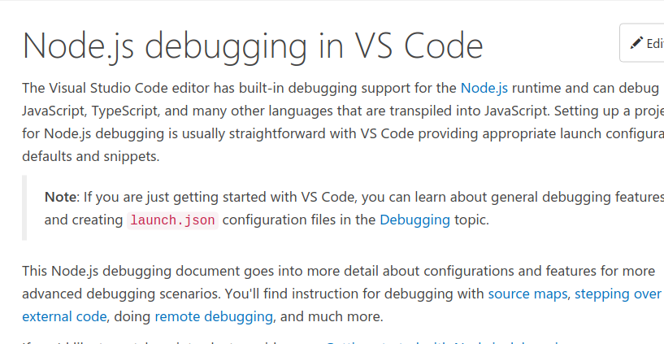

# S4 | Changing Variables in the Debug Console
---
## Objectives
## Lecture Snapshots
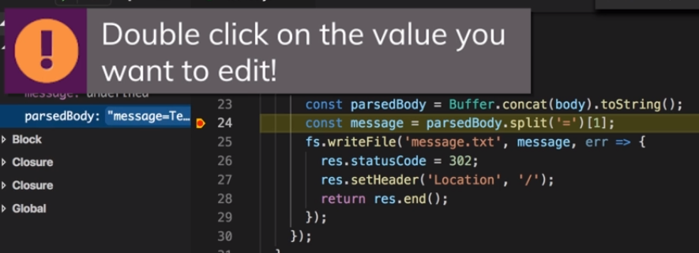
This will affect the runtime.

# S4 | Wrap Up
---
## Objectives
## Lecture Snapshots
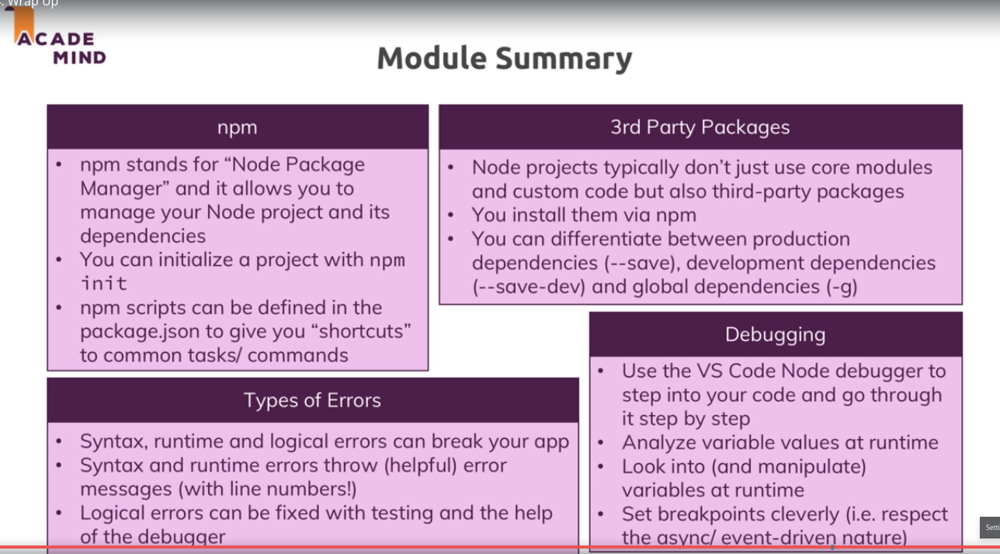