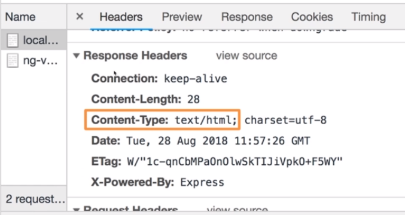
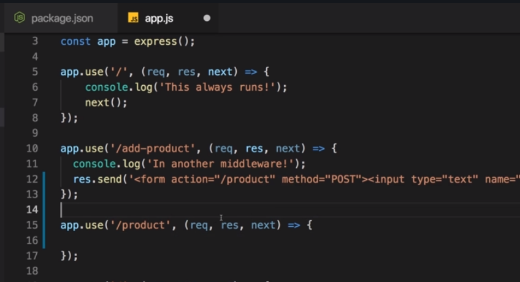
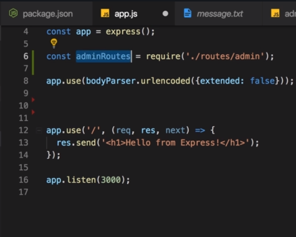
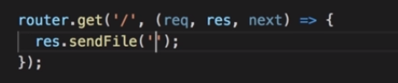
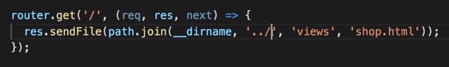
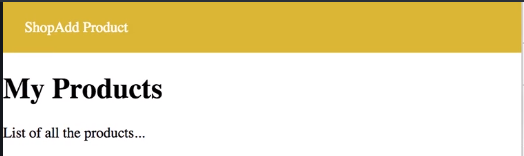
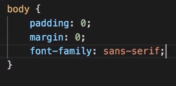
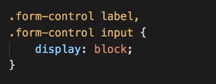
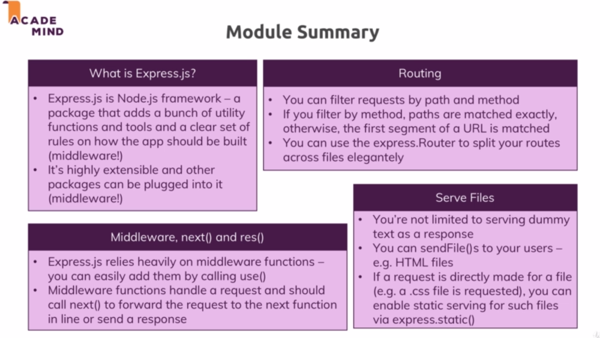

# S5 | Working with express.js
---

# S5 | Module Introduction
---
## Lecture Snapshots
 

# S5 | What is Express.js
---
## Lecture Snapshots


# S5 | Installing Express.js
---
## Lecture Snapshots

### Installing 
Express js is a production dependency as well as dev dependency, so we need to install it such that it will ship to the prod env once we deploy the app.


`$ npm install express --save`

### package.json


Check the package.json file 

```js
  "dependencies": {
    "express": "^4.16.4"
  }
```

### Using express.js


#### code
```javascript 
const http = require("http");

const express = require('express');

//you can create an express application and store it in a constant named app
const app = express(); 

/*
* Now the app here actually also happens to be a valid request handler, so
 you can pass app here to createserver

* It will not handle any requests though because we haven't defined any logic
 that should happen for incoming requests

* It does one thing for you and that is it sets up a certain way of handling
 incoming requests that defines or that is a key characteristic of expressjs 
*/

const server = http.createServer(app);
  
server.listen(3000); // servers starts listening to incoming requests.

```
#### npm start 


  
    This will start the server but the app function won't do anything at this point. It does one thing for you and that is it sets up a certain way of handling incoming requests that defines or that is a key characteristic of expressjs and we'll have a look at that in the next lecture.


# S5 | Adding Middleware
---
## Lecture Snapshots
### illustration


### app.use
**`app.use`** : 
  * use" accepts an array of RequestHandlers
  * accepts a request handler function which in turn accepts 3 arguments : req, res, next.

**`next`** : 
  * this is a function which is passed by express  
  * it needs to be executed to allow the request to move to the next middleware.
  
  
  
  

  * **Add another middlewaire.**
  
  

  * **Why dont you see another middle text in the console ?**
    - Reason is that you would have to add `next()` in the first middleware to allow the req to pass to the next middleware.
    
    - So the req basically goes from top to bottom through all middleware if you call next. If you dont call `next()`, the req dies,
    - If you decide not to pass req to next middleware then you should at least send a response, otherwise you never send a response.
  * After adding `next()`
    

### Middleware Overview 
Middleware functions are functions that have access to the request object (req), the response object (res), and the next function in the application’s request-response cycle. The next function is a function in the Express router which, when invoked, executes the middleware succeeding the current middleware.
<br>
Middleware functions can perform the following tasks:

1. Execute any code.
2. Make changes to the request and the response objects.
3. End the request-response cycle.
4. Call the next middleware in the stack.

**If the current middleware function does not end the request-response cycle, it must call next() to pass control to the next middleware function. Otherwise, the request will be left hanging.**

### Elements of a Middleware function call


See to the **Revision Links** below for more details on middleware:
  1. [Writing middleware for use in Express apps](https://expressjs.com/en/guide/writing-middleware.html)
  2. [How Node JS middleware Works](https://expressjs.com/en/guide/writing-middleware.html) 
  3. [Using middleware](https://expressjs.com/en/guide/using-middleware.html) 

### Implementing middlewares 

`app.js` (updated)

```diff 
const http = require("http");

const express = require("express");

//you can create an express application and store it in a constant named app
const app = express();

/*
* "use" allows us to add a new middleware function
* "use" accepts an array of RequestHandlers. A RequestHandlers is a function which takes 3 args : 
req, res, next.
* "next" argument is a function, you're receiving here that has to be executed to allow the
request to travel on to the next middleware.
*/

//Middleware-1
+app.use((req, res, next) => {
+    console.log("In the middleware")

+    next(); // if we don't call next, we should at least send back a response because otherwise the request can't continue its journey to the next middleware and just dies.
+});

//Middleware-2
+app.use((req, res, next) => {
+    console.log("In another middleware")
+});

const server = http.createServer(app);

server.listen(3000); // servers starts listening to incoming requests.

```

# S5 | How Middleware Works
---
## Lecture Snapshots
1. `next()` - allows the req to pass to the next middleware below.
2. express.js does not have a default response.
3. `res.send()` - can be used due to express.js, to easily send response. 




`app.js`

```diff

//Middleware-1
app.use((req, res, next) => {
    console.log("In the middleware")
    next(); // so if we don't call next, we should actually send back a response because otherwise the request can't continue its journey to the next middleware and just dies.
});

//Middleware-2
app.use((req, res, next) => {
    console.log("In another middleware")
+    // sending a response using express.js
+    res.send('<h1>Hello from Express!</h1>')
});

```
_Output_

 

# S5 | Express.js - Looking behind the scene
---
## Lecture Snapshots
### Express Source Code


### We can shorten the highlighted code of setting up the server


Source code of listen function - 

Now we can remove the http import - 

Final code - 


### Code 
1. The following code snippet sets the Content-Type of the response automatically to 'html' due to Express.js framework.

```javascript
app.use((req, res, next) => {
    // sending a response using express.js
    res.send('<h1>Hello from Express!</h1>')
});
```
2. The following code does the same thing. But with express.js we can write shorter code. 

```diff
- const http = require("http");

//...Previous Code...

- const server = http.createServer(app);
- server.listen(3000); // servers starts listening to incoming requests.

+ app.listen(3000); // Does the same thing as above
```

# S5 | Handling Different Routes
---
## Lecture Snapshots

### Express.js - home page


### So this middleware gets executed for both pahts `/` and `/add-product`. This is because the match occurs when the url starts with the `path` given as argument.


### We can resolve this and make sure that only one middleware is executed for a given path. We can try the below setup.

 

Here the middleware with `/add-product` path should come first without calling `next()` so that it never reaches the middleware below it.


So now we are routing our request to different middleware.

### To always run a middleware before passing the req to other middlewares


### app.use() Overloads

Read the documentation for better understanding [Here!!](https://expressjs.com/en/4x/api.html#app.use)
> I have read this -**arif**

### Functionality Summary - `app.use([path,] callback [, callback...])` 

#### Description 

1. `app.use()` - Mounts the specified middleware function or functions at the specified path: the middleware function is executed when the base of the requested path matches path.
2. `path` - The path for which the middleware function is invoked
3. `callback` - Callback functions; can be:
    * A middleware function.
    * A series of middleware functions (separated by commas).
    * An array of middleware functions.
    * A combination of all of the above.

#### Example 

1. For example, this middleware function will be executed for every request to the app:
```javascript 
app.use(function (req, res, next) {
  console.log('Time: %d', Date.now());
  next();
});
```
2. Middleware functions are executed sequentially, therefore the order of middleware inclusion is important.
```javascript 
// this middleware will not allow the request to go beyond it
app.use(function(req, res, next) {
  res.send('Hello World');
});

// requests will never reach this route
app.get('/', function (req, res) {
  res.send('Welcome');
});
```

### Routing - Code snippet

**Rules of a thumb:**
1. Does the URL match the express app route?
2. Does your callback call next() or return response?
3. Is the ordering of the routes accurate (e.g., /users before just /)?

```javascript
/**
 * This is the code that allows us to route our requests into different middleware
 */
app.use("/", (req, res, next) => {
    console.log('This middleware always runs and propagates the req to the next middlewares!')
    next(); //this propagates the req.
});
app.use("/add-product", (req, res, next) => {
  console.log("In add-product middleware");
  console.log(req.url);
  // sending a response using express.js
  res.send("<h1>Add Product Page!</h1>");
});

app.use("/", (req, res, next) => {
  console.log("In default middleware");
  console.log(req.url);
  // sending a response using express.js
  res.send("<h1>Hello from Express!</h1>");
});
```

### Solving common issue - redundant request sent to the server

```javascript
/**
 * Browsers will by default try to request /favicon.ico from the root of a hostname, in order to show an icon in the browser tab.
 * Avoid this request by returning a 404 as below :
 */
app.get("/favicon.ico", (req, res) => res.status(204));

```
See this [Stackoverflow link](https://stackoverflow.com/questions/35408729/express-js-prevent-get-favicon-ico/35408810#35408810) for details 

# S5 | Assignment-2 : Time to practice Express.js
---
## Lecture Snapshots


# S5 | Parsing Incoming Request
---
## Lecture Snapshots

### Form to POST a request to the server


### Middleware to handle the POST request sent to the server



### Redirect 


### Extract the body of the req


We are redirected


But - we see **undefined** in the console. why ?


By default req body is not parsed. To do that we need to register a parser.

### Parser

1. the **parser middleware** should be at the top before all other routing middlewares because the parsing of the body should be done before whichever routes the request ends up.
2. We need to install a 3rd party package : **body-parser**

3. Import the body-parser and use the middleware function `bodyParser.urlencoded()` which parses requests bodies like the **form**. The middleware then calls on `next()` to pass on the **req** to other middlewares below.

4. Pass the required configuration


### Output
Now we have output for `req.body`. It just returns an object with property names as the form input name property value (**"title"**).
 


### Issue 
This middleware will also get executed for incoming **GET** request but we want to execute this only for **POST** request. How can we ensure that ?

Lets see in the next lesson.

### Code
Check the following portions for the code below: 
1. Import Body-Parser
2. Parsing Incoming Request
3. Form to send user request
4. Handling Incoming request

**Execute `$ npm install --save body-parser` to install a incoming request parser**

```javascript
// # Import Express 
const express = require("express");

// # Import Body-Parser
const bodyParser = require('body-parser')

// # Creating express app
const app = express();

// # Middleware

// ## Parsing Incoming Request
/**
 * 0. Parsing should be done at the top of the middleware calls
 * 1. Install 3rd party package `$ npm install --save body-parser`
 * 2. bodyParser.urlencoded - 
      * it will do that whole request body parsing we had to do manually in the previous core sections.
      * this registers a middleware function 
      * call next() in the end to propagate the parsed request to our middlewares
      * This parser only parses requests like <form> contents. Not json, files, etc. For that we can install other packages.
      * Need to provide some config info : {extended : false}
 */
app.use(bodyParser.urlencoded({extended : false}));

// ## Issue resolved 
app.get("/favicon.ico", (req, res) => res.status(204)); 

// ## Form to send user request
app.use("/add-product", (req, res, next) => {
  console.log("In add-product middleware");
  res.send(
    `<form action="/product" method="POST">
        <input type="text" name="title">
        <button type="submit">Add Product</button>
     </form>  
    `
  );
});
// ## Handling Incoming request
app.use('/product', (req, res, next) => {
  console.log(req.body); //-> undefined
  /**
   * console.log(req.body); //-> undefined - why ?? 
   * because request gives us this body convenience property here but by default, request doesn't try to parse the incoming request body. To do that,we need to register a parser and we do that by adding another middleware.
   * and you typically do that before your route handling middlewares because the parsing of the body should be done no matter where your request ends up
   */
  res.redirect('/');
});

app.use("/", (req, res, next) => {  
  // sending a response using express.js
  res.send("<h1>Hello from Express!</h1>");
});

app.listen(3000); // Does the same thing as above

```
#### Input 


#### Output


It parses the request as a json object which is easier for data extraction.

#### Something still missing !!

The following code will get executed even for incoming **GET** request but we only want to execute that for **POST** request

```javascript
app.use('/product', (req, res, next) => {
  console.log(req.body); //-> undefined
  res.redirect('/');
});
```

# S5 | Limiting Middleware Execution To POST Requests
---
## Lecture Snapshots

### Problem 

The following middleware always executes, not just for **POST** requests but also for **GET**
requests, what can we do regarding that?

```javascript
// ## Handling Incoming request
app.use('/product', (req, res, next) => {
  console.log(req.body); //-> undefined  
  res.redirect('/');
});
```

### Solution

Use `app.post()` instead of `app.use()` - `app.post()` will only fire for incoming **POST** request.


```diff
// ## Handling Incoming request
-app.use('/product', (req, res, next) => {
+app.post('/product', (req, res, next) => {
  console.log(req.body); //-> undefined  
  res.redirect('/');
});
```

Similarly we have `app.get()` which will fire only for **GET** requests.

# S5 | Using Express Router
---
## Objective

Outsourcing routing into other files.

## Lecture Snapshots

### Folder Structure - by Convention


**We will extract and split the routing logic from app.js into the above two files `admin.js` and `shop.js`**

### `admin.js` - Setting up the first route


We now have to use the router to register things. 

The `router.use()` works exactly the same way as the `app.use()`

Change the middleware type to GET


### `app.js` - Import routes in the file

Add a **relative path** to the `./routes/admin.js`. 


The router imported is a valid middleware function. So we can register it with `app.use()` as shown.

Now it will consider our routes in the admin.js while funneling the request through the middlewares in the `app.js` file.

The order still matters. If you place the route middleware below the general middleware function then you can never reach the routes defined.

**DONT DO THIS !!** 

### shop.js - Setting up the 2nd Route


`.get()`, `.post()` method mathces the path exactly unlike `.use()` which matches if the url begins with the path string.


### app.js - with both routes.


### Code

#### Files With Routing Logic

`admin.js`

```javascript
const express = require("express");

/** Initiating Router : 
 * This router is like a mini express app tied to the other express app or pluggable into the other express app
 * This router is a valid middleware function
*/
const router = express.Router();

/** Use the Router to register Routes : 
 * This works same as the app object
 * It has .use(), .get(), .post() functions as well 
*/

// ## Form to send user request
router.get("/add-product", (req, res, next) => {
  console.log("In add-product middleware ");
  res.send(
    `<form action="/product" method="POST">
          <input type="text" name="title">
          <button type="submit">Add Product</button>
       </form>  
      `
  );
});
// ## Handling Incoming request
router.post("/product", (req, res, next) => {
  console.log(req.body); //-> undefined
  res.redirect("/");
});

// Export the Router
module.exports = router; // This router is a valid middleware function

```

`shop.js`

```javascript
const express = require("express");
const router = express.Router();


router.get("/", (req, res, next) => {
  res.send("<h1>Hello from Express Shop!</h1>");
});


module.exports = router;
```

#### App.js uses the above routing files

_app.js_

```diff
// # Import Routes 

+ const adminRoutes = require('./routes/admin');
+ const shopRoutes = require('./routes/shop')

// ## Using Routes 
/**
 * the router "adminRoutes" is a valid middleware function so we can use it as below :
 * We can use this here and now this will automatically consider our routes in the admin.js file when funneling the request through this middleware. 
 * The order of placing `app.use(adminRoutes)` also matters as before. Since placing it after another middleware function which is fired and sends a response will result in the router never being reached. 
 * get(), post() methods do an exact match of the paths unlike use(). Since inside the admin.js and shop.js route files we have used get() and post() methods, the order of routes below does not matter.
*/
+ app.use(adminRoutes);
+ app.use(shopRoutes);

app.listen(3000); // Does the same thing as above

``` 
# S5 | Adding a 404 Error Page
---
## Objective 

Handle unhandled routes and show an error messgae

## Lecture Snapshots

### Unhandled routes now results in this.


This happens because the router middleware below does an exact match with the path. Remember `.get()` does an exact match. So we have no fitting middleware.


### We can add a catch all request middleware 

Which will catch all request which reaches the bottom without any response being sent.


### Set the 404 status code

By chaining the `.status()` method with the `.send()` method.


### Output 

See the status code set as 404.


### Code 

```diff
// ## Using Routes 
app.use(adminRoutes);
app.use(shopRoutes);

// ## Handle Unknown request
+ app.use('/', (req, res, next) => {
+   res.status(404).send('<h1>Page Not Found</h1>')
})
```

# S5 | Filtering Paths 
---
## Lecture Snapshots

### Suppose we have a setup where the paths have a common starting path


**Note** : The same path can be used if the methods differ.

### Then we can filter the routes in the `app.js`

Only routes starting with `/admin` will go into the `adminRoutes` file. 


### Express will ignore the `/admin` in the url when it tries to match routes inside `adminRoutes`


See the `/admin` can be omitted now.

### One small correction 


### Actual urls for which these routes are reached 
That is given in comments. But the `/admin` is not checked further as it was mentioned as a filter in the `app.js` file.


### Same path can be used if methods differ

_admin.js_

```js
router.get("/admin/add-product", (req, res, next) => {...})

router.post("admin/add-product", (req, res, next) => {...})
```

Here the path `"admin/add-product"` wont conflict since the http methods are different.

### Routes Having Common Starting Path

In _admin.js_ the common segment in the path is `/admin`. We can ommit this here and add it in the _app.js_ file where we use **adminRoutes**.

_admin.js_

```js
//...
// # Import Routes 
const adminRoutes = require('./routes/admin');
const shopRoutes = require('./routes/shop')
//...
```

```diff
-router.get("/admin/add-product", (req, res, next) => {...})
// /admin/add-product => GET
+router.get("/add-product", (req, res, next) => {...})

-router.post("/admin/add-product", (req, res, next) => {...})
// /admin/add-product => POST
+router.post("/add-product", (req, res, next) => {...})
```

_app.js_
```diff
-app.use(adminRoutes);
+app.use('/admin', adminRoutes);
```
1. **Now only routes starting with `/admin` will go into the _admin_ routes file**
2. **expressjs will also omit or ignore this `/admin` part in the url when it tries to match these routes**

# S5 | Creating HTML Pages
---
## Lecture Snapshots

So long we have been using html inside the .js files as string. Now we will move towards serving real html files for different routes.

### Create new views folder

This will hold the html pages we will serve.


### Views - add-product.html


### Views - shop.html


### Code 

_add-product.html_
```html
<body>
    <header>
        <nav>
            <ul>
                <li><a href="/">Shop</a></li>
                <li><a href="/add-product">Add Product</a></li>
            </ul>
        </nav>
    </header>
    
    <main>
        <form action="/add-product" method="POST">
            <input type="text" name="title">
            <button type="submit">Add Product</button>
        </form>
    </main>
    
</body>
```

_shop.html_
```html
<body>
    <header>
        <nav>
            <ul>
                <li><a href="/">Shop</a></li>
                <li><a href="/add-product">Add Product</a></li>
            </ul>
        </nav>
    </header>
    
    <main>
        <h1>My Products</h1>
        <p>List of all the products...</p>
    </main>
    
</body>
```

# S5 | Serving HTML Pages
---
## Objective 

Serving html files in our routes.

## Lecture Snapshots

### Serving html files in our routes 

#### shop.js


#### How should the path look like



##### Will this work - absolute path ?


No - The `/` at the begin refers to the root folder of the operating system and not this project folder.

#### Solution - path and dirname

`path` : helps build path. `path.join()` helps build correct path depending on the Operating system.
`__dirname` : this is a global variable given by nodejs that holds the absolute path to the current project folder i.e. the `folder path` of the **file we use the variable in**.
`routes` : So here `__dirname` will refer to the `routes` folder.


#### Solution - fixing the destination folder

Go one level up


##### Will this work - relative path ?


No - path must be absolute is the error


### Output


### Serve add-product.html 

When the route below gets loaded serve the html:


Content type set by default


### Refering the _shop.html_ file from the router in _shop.js_
 
modifying | _shop.js_

```diff
router.get("/", (req, res, next) => {
-   res.send("<h1>Hello from Express Shop!</h1>");
+   res.sendFile("/views/shop.html")
});
```

#### Problem

**But** after the above modification we get the following error :
```
TypeError: path must be absolute or specify root to res.sendFile
    at ServerResponse.sendFile (/home/arif/TECHNOLOGY/06-Learn-Nodejs/04-Node-App-2/node_modules/express/lib/response.js:421:11)
    at router.get (/home/arif/TECHNOLOGY/06-Learn-Nodejs/04-Node-App-2/routes/shop.js:8:10)
    at Layer.handle [as handle_request] (/home/arif/TECHNOLOGY/06-Learn-Nodejs/04-Node-App-2/node_modules/express/lib/router/layer.js:95:5)
    at next (/home/arif/TECHNOLOGY/06-Learn-Nodejs/04-Node-App-2/node_modules/express/lib/router/route.js:137:13)
    at Route.dispatch (/home/arif/TECHNOLOGY/06-Learn-Nodejs/04-Node-App-2/node_modules/express/lib/router/route.js:112:3)
    at Layer.handle [as handle_request] (/home/arif/TECHNOLOGY/06-Learn-Nodejs/04-Node-App-2/node_modules/express/lib/router/layer.js:95:5)
    at /home/arif/TECHNOLOGY/06-Learn-Nodejs/04-Node-App-2/node_modules/express/lib/router/index.js:281:22
    at Function.process_params (/home/arif/TECHNOLOGY/06-Learn-Nodejs/04-Node-App-2/node_modules/express/lib/router/index.js:335:12)
    at next (/home/arif/TECHNOLOGY/06-Learn-Nodejs/04-Node-App-2/node_modules/express/lib/router/index.js:275:10)
    at Function.handle (/home/arif/TECHNOLOGY/06-Learn-Nodejs/04-Node-App-2/node_modules/express/lib/router/index.js:174:3)

```

**Why ?** - The reason for this is that an absolute path would be correct but slash like this actually refers to our root folder on our operating system not to this project folder.

#### Solution

1. Need to use a core module provided by node.js i.e the `path` module.
2. We can create a path by calling the join method like `path.join()`
3. We're using `path.join()` instead of manually concatenating because this will automatically build the path in a way that works on both Linux systems and Windows systems. (e.g **Linux**: '/user/products', **Windows**: '\user\products')
4. `join()` returns a path by concatenating the different segments.
5. Now the first segment we should pass here is a global variable made available by nodejs `__dirname`. 
6. `__dirname` - This is a global variable which holds the <span style="font-size:24px; text-decoration: underline">absolute path of a folder</span> on our operating system in which the <span style="font-size:24px; text-decoration: underline">"file where we use `__dirname`"</span> is located.
7. Now we can build the path by `path.join(__dirname, 'views', 'shop.html')`

    ```js
    const path = require('path');

    router.get("/", (req, res, next) => {
        res.sendFile(path.join(__dirname, 'views', 'shop.html'))
    });
    ```
    But `__dirname` currently points to **routes** folder when we are using it in the shop.js file. So we need to go up one level.

8. Go up one level and then access the sibling of **routes** which is the **views** folder.

    ```diff
    const path = require('path');

    router.get("/", (req, res, next) => {
    -     res.sendFile(path.join(__dirname, 'views', 'shop.html'))
    +     res.sendFile(path.join(__dirname, '..', 'views', 'shop.html'))
    });
    ```
    Now if we go to the url "http://localhost:3000/"
    


### Refering the _add-product.html_ file from the router in _admin.js_

```diff
// # Import path
+ const path = require('path');

// ## Form to send user request

router.get("/add-product", (req, res, next) => {

-  res.send(
-    `<form action="/admin/add-product" method="POST">
-          <input type="text" name="title">
-          <button type="submit">Add Product</button>
-       </form>  
-      `
-  );

+  res.sendFile(path.join(__dirname, '..', 'views', 'add-product.html'))

});

```

# S5 | Returning a 404 Page
---
## Lecture Snapshots
1. Same as above.
2. Create a 404.html page in the views folder.
3. Then in the _app.js_ file use `path` module to construct a path to the 404.html page and use `res.sendFile()` to send the html file as a response when invalid url has been hit.

### Construct the 404.html


### Return the 404.html 

middleware

path

sendfile()

 ### Output
 

# S5 | Using a Helper Function for Navigation
---
### Objective 

Smartly get the **rootDirectory** of the project and resuse that whereever required.

## Lecture Snapshots

### Alternative to using `../`

Instead of `../`

We can also use `..`

This is better since it does not imply the operator specific separator.

### Alternative to using `../` - Nicer way

We can get the parent directory with the help of a helper function.

Creating Path.js


Coding 

`dirname` - gives the directory of the argument file path.
`process.mainModule` - refers to the main module that started the application. i.e the module we created in `app.js` file.
`process.mainModule.filename` - gives us the name of the file in which the module was spun up. i.e. `app.js`
So it gives us the path of the **file responsible for running the application**.


Go to admin.js and import from `util.path`

Use the imported `rootDir`


Output


### Do the Same for `shop.js`

Before

After - 
 


# S5 | Styling Our Pages
---
## Lecture Snapshots

### [Sidenote] - How to kill a node server running at a port

* `sudo kill -9 $(sudo lsof -t -i:3000)`

* See the link below : 
    [Kill any service running at a specific port](https://unix.stackexchange.com/questions/140482/kill-any-service-running-at-a-specific-port)

### Adding Styles to the head section using style tags since external link to css files wont work for now.

`shop.html` - Style tag - before adding css
 
BEM way of naming classes
 
Style

Output
  
 
 
 
 
 
 
 
 
Output
 
 
 
 
 
 

Format document - keyboard shortcut
 

add-product.html - styling
1. Copy the styles from the shop.html
2. Copy the header tag as this is common for both shop and admin.

Active class
 

add-product.html - form styling 
 

Form takes the full width
 

Form input styling 
 
 
  
 

Button styling 

 

 

  
 

404.html
1. Copy the styles from the shop.html
2. Copy the header tag as this is common for both shop and admin.

### Bug solving 

Fix the link used to reach add-product.html
 
 

### Output

 

### We will apply the following style in all the current html files 

* **Applying Styles in the following files :**

    `shop.html`, `admin.html` and `404.html`

    ```css
    <style>
        * {
        margin: 0;
        padding: 0;
        /* border: 1px solid burlywood; */
        }

        html {
        font-size: 16px;
        }

        body {
        font-family: sans-serif;
        }

        main {
        padding: 1rem;
        }

        /* header styles */
        .main-header {
        width: 100%;
        height: 3.5rem;
        background: #e3e712;
        padding: 0 1.5rem;
        }

        .main-header__nav {
        height: 100%;
        display: flex;
        align-items: center;
        }

        .main-header__item-list {
        list-style: none;
        display: flex;
        }

        .main-header__item {
        margin: 0 1rem;
        }

        .main-header__item a {
        text-decoration: none;
        color: black;
        }

        .main-header__item a:hover,
        .main-header__item a:active,
        .main-header__item a.active {
        color: #291beb;
        }

        /* form styles */
        .product-form {
            width: 20rem;
            max-width: 90%;
            margin: auto;
        }

        .form-control {
            margin: 1rem 0;
        }

        .form-control label,
        .form-control input {
        display: block;
        width: 100%;
        }

        .form-control input {
        border: 1px solid #e3e712;
        border-radius: 2px;
        font-family: inherit;
        }

        button {
        font-family: inherit;
        color: #291beb;
        border: 1px solid #291beb;
        background: white;
        border-radius: 3px;
        cursor: pointer;
        }

        button:hover,
        button:active {
            background-color: #291beb;
            color: white;
        }
    </style>
    ```

# S5 | Serving Files Statically
---
## Objective 

Use external css files. 

## Lecture Snapshots

### How would we theoretically want to import css files. (Although this wont work) ?

We want to create a css file somewhere 
And then later point to that file when the application gets served

Generally we do not have access to the file system.
 
All these files are not accessible to the user directly. These are served by the nodejs server by using routes and middleware.

Like the Link below wont work.
 

But we want to make an exception here.
We want that **For Some Request** the css file that we create can be accessed without any permission and is exposed to the public.

We want to point to a css file from an html like this below.
 

We would imagine the `.css` file to be inside the public folder as below. We want to serve this file using the link above.
 
**But this would not work!**

`main.css` - Lets move the styling from the style tags in our html to the `main.css`
 

Remove the style tag from shop.html
 

Styling is Gone!
 

Because it cannot find the main.css file
 

You could say the path is incorrect. Its `/public/css/main.css`
 

This does not work either. Although this now looks into the `public` folder.
 

### We can solve the problem by - Serving Files Statically

Serving statically means - not handled by `routes` or other `middleware` but instead directly forwarded to the file-system

Use the `express.static()` built-in middleware function that serves static files
 

Then we have to pass the path of the folder we want to serve statically. i.e The Folder for which we want to grant read access.
 

But it still is not working. Why?
 

The reason is that the path is starting with `public`. And this is wrong.
 

We should ommit the `public` from the href in the link.


We have to act as if we are already in the public folder.
 

Its the job of the express. It automatically forwards any request for static files to the `public` folder. Thus we can ommit mentioning the `public` in the static file links.
 

### Output - after referring to external css file
 

### We can also have multiple static folders 
The request will funnel through all of them until it has the first matching hit for the file its looking ofr.
  

### Do the same setting for the `add-product.html` file 

1. This file has extra css code for which we need to create additional `product.css` file which we will import in the `add-product.html` as a static file link
 

2. Add the imports
    

### Do the same setting for the `404.html` file 
Same as above

### Note

Through this method you can **serve js, css or image files etc**

## Legacy Documentation (Old)
---------
* The convention is to call it public because you want to indicate that this is a folder that holds content which are always exposed to the public crowd where you don't need any permissions to access it.
   

* Normally you can never access the file system on the server from the client. Express will try to find a matching route instead and fail to find it.

* But now I actually want to make an exception, I want that some requests can just access the file system.

* Because ultimately let's say in shop.html, I want to have something like a link in here where I simply point at something like "/css/main.css" anything like that. `<link rel="stylesheet href="../public/css/main.css">`

* And my imagination would be that in public, I have a css folder with a main.css file in there and that is the file I want to serve with this link. 

    

* The css in the _main.css_ file which we transferred from _shop.css_
    ```css
        * {
        margin: 0;
        padding: 0;
        /* border: 1px solid burlywood; */
        }

        html {
        font-size: 16px;
        }

        body {
            font-family: sans-serif;
        }

        main {
            padding: 1rem;
        }

        .main-header {
        width: 100%;
        height: 3.5rem;
        background: #e3e712;
        padding: 0 1.5rem;
        }

        .main-header__nav {
        height: 100%;
        display: flex;
        align-items: center;
        }

        .main-header__item-list {
        list-style: none;
        display: flex;
        }

        .main-header__item {
            margin: 0 1rem;
        }

        .main-header__item a {
        text-decoration: none;
        color: black;
        }

        .main-header__item a:hover,
        .main-header__item a:active,
        .main-header__item a.active {
            color: rgb(41, 27, 235)
        }
    ```
* But the link in the shop.html file `<link rel="stylesheet href="../public/css/main.css">` does not work **because we cannot access the file system**. The styling is lost from the shop.html page.

    

* Solution ? - For this we need a feature expressjs offers us, we need to be able to serve files statically and <span style="font-size: 24px">statically</span> simply means not handled by the express router or other middleware but instead <span style="font-size: 24px">directly forwarded to the file system.</span>

* we use the express object itself, so this object we're importing there and this does have a `static` method and this is a built-in middleware which serves static files. So we can execute this function. and now we just have to pass in a path to the folder which we want to serve statically, so basically a folder which we want to grant read access to.


* In _app.js_ add the following 

    ```diff
    // # Middleware 

    // ## Parsing Incoming Request
    app.use(bodyParser.urlencoded({extended : false}));

    +// ## Serving Static Files e.g main.css, etc
    +// pass in a path to the folder which we want to serve statically
    
    +app.use(express.static(path.join(__dirname, 'public')));

    ```
* But the styling still does not work. Why? 

    

* Because the path is wrong 

    _shop.html_

    ```diff
    -<link rel="stylesheet" href="../public/css/main.css">
    +<link rel="stylesheet" href="/css/main.css">
    ```

    Instead here, we should omit this and directly act as if we are in the public folder already because this is basically what express will do here, it will take any request that tries to find some file and that's important, it looks at the extension, so anything that tries to find a .css or a .javascript files, if we have such a request, it automatically forwards it to the public folder and therefore then the remaining path has to be everything but that "public", so therefore we strip the public out of this path and just act as if we already are in the public folder because this is where file requests will be forwarded to.

    

* And by the way, you could register multiple static folders and it will funnel the request through all of them until it has a first hit for the file it's looking for.

    ```diff
    // ## Serving Static Files e.g main.css, etc
    app.use(express.static(path.join(__dirname, 'public')));
    +app.use(express.static(path.join(__dirname, 'public2')));
    ```

* And you're not just limited to css and javascript files, you can also serve images and so on.


# S5 | Assignment-3
---
## Lecture Snapshots    
### Problem 


### Solution


# S5 | Wrap Up
---
## Lecture Snapshots
 


## Useful Links
[Installing Express](https://expressjs.com/en/starter/installing.html)

Section 6: Working with Dynamic Content & Adding Templating Engines