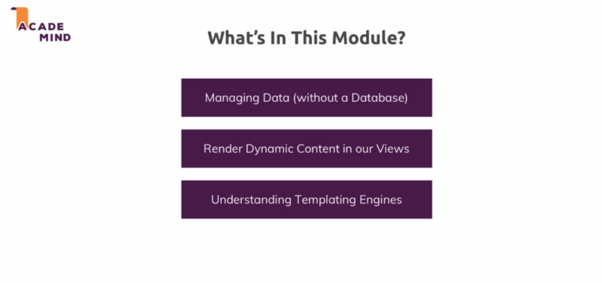
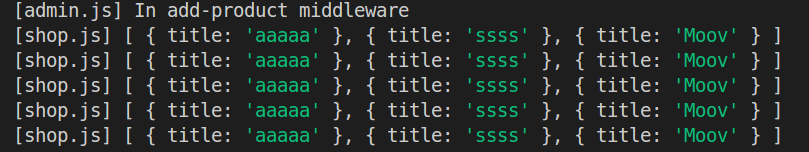
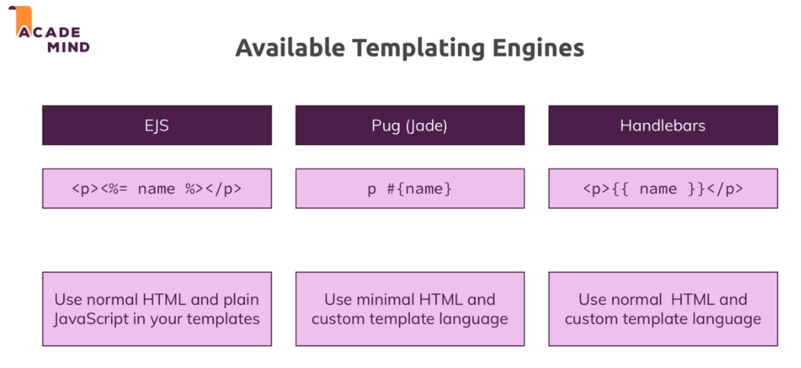
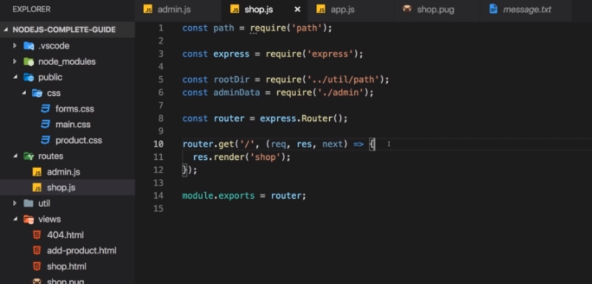
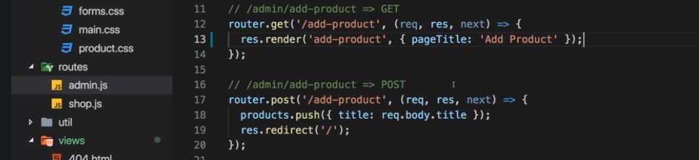
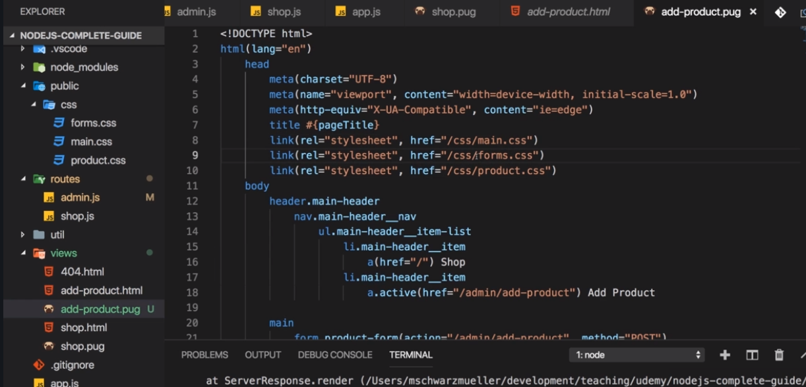
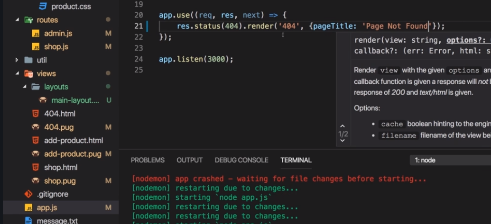
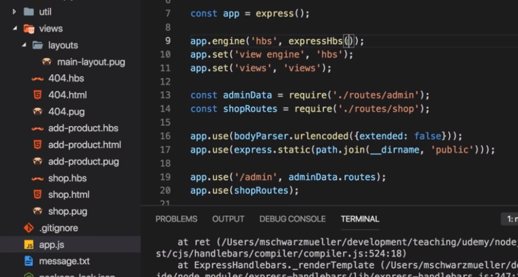
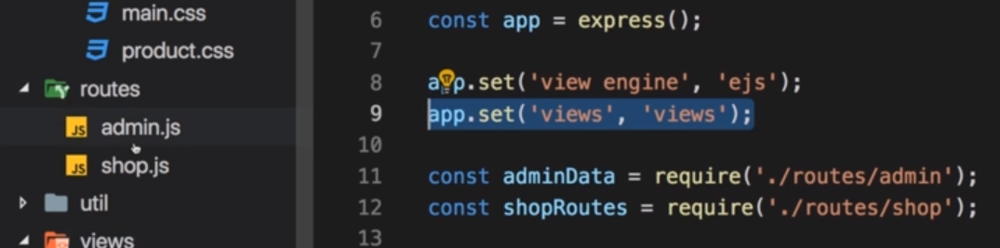
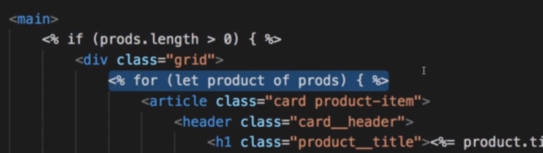

# S6 | Working with Dynamic Content & Adding Templating Engines
------------------------

# S6 | Module Introduction
------------------------


# S6 | Sharing Data Across Requests and Across Users
------------------------
## Objective
Store the input from user in an array in nodejs server and console.log the products in another route by importing the products.

## Lecture Snapshot

### Folder Structure and Current Look


### What we are currently doing with req bodies ? 


#### Just console logging the `req.body` on form submission


### How can we store this ? 

Variable


Export the products


Change the way routes are imported in the `app.js`


Push Into the New **Products** Variable and form submitted by http post request (`app.js`)


### Sharing Data - We need to get access to the products in the shop.js. 

Here we will need to list all the produts at some point


### Output ? 

When we reload the the home page , we get an empty array in the console.log.


Add a Book


We see an object in the console.log. From where did it come ?


Its coming from the `shop.js` file here. Lets make it clearer.


The first empty array [] was also from the shop.js
So we are able to pass an object from one route to another.
**This is one way of sharing data !**

### Disadvantage of using this approach to share data.
If you reload shop, we still have the products.


Lets open up a different browser (firefox). And go to localhost:3000  the port where the application is running.


You will see that the product is still logged. Thus another browser from a different machine is able to access the product data.

This data is inherent to the node server as it is running. And therefore its shared across all users.
 


### We dont want to share data like this Across Users and Across Requests.
There is a way to do this. (Later)

### How to get this data into our view.
Next videos

### Code

_admin.js_

```js
// ...

// # Store the products
const products = [];

// ...

// ## Handling Incoming request
router.post("/add-product", (req, res, next) => {
  // Add incoming product to products list
  products.push({ title: req.body.title });
  res.redirect("/");
});
```

Change how we exported previously in _admin.js_

```diff 
// Export router, products
+module.exports.routes = router;
+module.exports.products = products;

```

Since we have changed the exports in admin.js we need to modify app.js which uses admin routes.

_app.js_

```diff
-const adminRoutes = require('./routes/admin');
+const adminData = require('./routes/admin');

-app.use('/admin', adminRoutes);
+app.use('/admin', adminData.routes);

```

In _shop.js_ use the products exported from _admin.js_

_shop.js_
```js
const express = require("express");

const path = require('path');

// # Import rootDirectory variable from Utility > path.js
const rootDir = require('../utility/path') 
// # Import admin data
+ const adminData = require('./admin');


const router = express.Router();

router.get("/", (req, res, next) => {
+    console.log('[shop.js]', adminData.products);
     res.sendFile(path.join(rootDir, 'views', 'shop.html'))
});

module.exports = router;

```

### Output
When you add producs from the admin route by visiting the url `/admin/add-products` url, and submitting the form, you can see the following output :




### Problem
Even if you open a brand new browser ( **user2** ) and visit localhost, you can view the products entered by **user1** from the previous browser. This is not a secured form of sharing data. i.e. Both distinct users have access to the data.

We will learn a better approach.


# S6 | Templating Engine - Overview
------------------------

## Intro


## Available Template Engines 



# S6 | Installing and Implementing Pug
------------------------

## Lecture Snapshots 

### Installing all 3 packages 

* Installing all 3 packages : `$ npm install --save ejs pug express-handlebars`.
 

### Register pug with express

We can just tell express **"hey we got a templating engine that is express conforming that we installed so please use it to render dynamic templates."**

`app.set()` : helps in setting a global configuration value on our express application
 

Documentation
 
 

Pug auto-registers with express - we want to compile dynamic templates with pug engine
 

We can set an extra configuration - i.e. where to find our dynamic templates or views. Here is the default settings.
 
-->> Main directory / views

But still lets configure ... (`app.js`)
 

### Add Templates
 

### Default Pug file template
 
Lets make it same as the shop.html and then we willadd dynamic content.

Identation defines nesting in pug
 

`shop.pug`
 

compare with 
`shop.html`
 

Running npm start wont render this template in `shop.pug`. Because we are not telling express to do so.

### Tell express to render the template
So that it uses the pug engine to render 

**Current Response**
 

**We have to change the response.**
 
We do not need to mentione `views/shop.pug`. We already configured that our templates reside in `views` folder by setting global settings. Also `.pug` need not be added.

### Output - of pug
 

We will add dynamic content in next section.

## Legacy Notes (Old)
------------------------

* **Set a global configuration value** - We can set a global configuration value in the _app.js_ file using `app.set()`

    * Now what is that? - `app.set()` allows us to set any values globally on our express application.

    * We could actually read them from the app object with `app.get()` and this would be another way of sharing data across our application.

* See the [documentation](https://expressjs.com/en/4x/api.html#app.set) for details about `app.set()`

* See the link [Using template engines with Express](https://expressjs.com/en/guide/using-template-engines.html) for better concept.
    * Summary :
        1. **A template engine** - enables you to use static template files in your application. At runtime, the template engine replaces `variables` in a template file with actual values, and transforms the template into an HTML file sent to the client. This approach makes it easier to design an HTML page.

            Some popular template engines that work with Express are Pug, Mustache, and EJS.

        2.  **To render template files** - set the following application setting properties, set in app.js in the default app created by the generator:

            * **`view engine`** : 
                
                * the template engine to use. For example, to use the Pug template engine: app.set('view engine', 'pug').

                * allows us to tell express hey for any **dynamic templates** we're trying to render (_and there will be a special function for doing that_), please use this engine we're registering here and

            * **`views`** :
                
                * allows us to tell express the directory where the **dynamic templates** files are located. Eg: app.set('views', './views'). This defaults to the views directory in the application root directory.


* So **Step-1** :

    * _app.js_

        ```js
        // # Set Global Configuration Value for Template Engine
        + app.set('view engine', 'pug'); // registering pug as the template engine 
        + app.set('views', 'views'); // setting the folder where the templates are stored
        ```


* **Step-2** : Create the template file

    _shop.pug_

    ```pug
    <!DOCTYPE html>
    html(lang="en")
    head
        meta(charset="UTF-8")
        meta(name="viewport", content="width=device-width, initial-scale=1.0")
        meta(http-equiv="X-UA-Compatible", content="ie=edge")
        title My Shop
        link(rel="stylesheet", href="/css/main.css")
        link(rel="stylesheet", href="/css/product.css")
    body
        header.main-header
            nav.main-header__nav
                ul.main-header__item-list
                    li.main-header__item
                        a.active(href="/") Shop
                    li.main-header__item
                        a.active(href="/admin/add-product") Add Product
    ```

* **Step-3** : Render the template file

    _shop.js_

    ```diff
    router.get("/", (req, res, next) => {
        console.log('In shop middleware')    
    -     res.sendFile(path.join(rootDir, 'views', 'shop.html'))
        // Render the shop.pug template as response
    +    res.render('shop') // i.e render shop.pug
    });
    ```

* Output

    

    We dont see the main content because we did not add this. 

# S6 | Outputting Dynamic Content (with Pug template engines)
------------------------
## Lecture Snapshots

### shop.js 

Now


We have the list of products in the adminData object.


We want to render the tenplate shop.pug dynamically by injecting the products into it and output the products there. 


### How to inject data into the template ? 


We have to pass at is a object with a key value pair. `{prods : products}`
`prods` is the key that would be available in the template.

We can pass more that one field to the template


### Lets output the `docTitle` field passed to the template.

Notice the title


 Use the docTitle field
  

Output
 

### Lets output the `prods` field passed to the template.

main-section (`shop.html` file)
 

main-section (`shop.pug` file) - static product grid content 
 

We need to make it dynamic and this iterate over all the products. Using the `each` keyword and the `prods` field which was passed to the template.
 
 

Recall
 

### Output
 
 

### Condition checks to render products (in case no products to display)

 
 
 
 

### Pug Official Doc

Official Pug Docs
Want to learn more about Pug? Check out their official docs: https://pugjs.org/api/getting-started.html

## Legacy Notes (Old)
------------------------
* Passing data to the template

    _shop.js_

    ```js
    // # Import rootDirectory variable from Utility > path.js
    const rootDir = require('../utility/path') ;
    + const adminData = require('./admin');

    const router = express.Router();

    router.get("/", (req, res, next) => {
        console.log('In shop middleware')    

        // res.sendFile(path.join(rootDir, 'views', 'shop.html'))

        // Pass products to the shop.pug template 
        const products = adminData.products;

        // Render the shop.pug template as response
    -   // res.render('shop') // i.e render shop.pug

        // Passing products to the template as key-value pair
    +    res.render('shop', {prods: products, docTitle: 'Shop'});
    });

    ```

* Using the data passed inside the template

    _shop.pug_

    ```diff
    + title #{docTitle}
    ```

* Next Step : Lets add the product card in the template. Check the div `div.grid`

    _shop.pug_

    ```diff
    body
        header.main-header
            nav.main-header__nav
                ul.main-header__item-list
                    li.main-header__item
                        a.active(href="/") Shop
                    li.main-header__item
                        a.active(href="/admin/add-product") Add Product
    +    div.grid
            article.card.product-item
                header.card__header
                    h1.product__title Great Book                
                div.card__image                    
                    img(src="https://cdn.pixabay.com/photo/2016/03/31/20/51/book-1296045_960_720.png", alt="A Book")                
                div.card__content
                    h2.product__price $19.99
                    p.product__description A very interesting book about so many even more interesting things!                
                div.card__actions
                    button.btn Add to Cart      

    ```
    Currently the data used is static.

    Try to understand the css behind the scene responsible for styling : _main.css, product.css._

* Output (till now)

    

    We want to add dynamic content to the template now and for that we need to iterate over the list of products.

* Next Step : Display Product List Dynamically Using Template

    * Recall how data was passed to the template : `res.render('shop', {prods: products, docTitle: 'Shop'});`

    * Update the _shp.pug_ file to use the product data : 

        _shop.pug_

        ```diff
        main
        +    if prods.length > 0                         
                div.grid
        +            each product in prods 
                        article.card.product-item
                            header.card__header
        -                       h1.product__title Great Book                
        +                       h1.product__title #{product.title}
                            div.card__image                    
                                img(src="https://encrypted-tbn0.gstatic.com/images?q=tbn:ANd9GcTS1z_4LS_mq4H0Ptl8zp6h7xYlrmI7Q93nWUghlfL-iG6J_SAL", alt="A Book")                
                            div.card__content
                                h2.product__price $19.99
                                p.product__description A very interesting book about so many even more interesting things!                
                            div.card__actions
                                button.btn Add to Cart                
        +    else 
        +        h1 No Products To Display 
        ```
* Output

    Enter some book titles from the url `admin/add-product`

    

# S6 | Official Pug Docs
------------------------

## [Official Pug Docs Link](https://pugjs.org/api/getting-started.html)

# S6 | Converting HTML Files to Pug
------------------------

## Lecture Snapshots

### add-product.pug

body and main


modify `admin.js`
 


template 


### 404.pug

template


`app.js`


# S6 | Adding A Layout
------------------------

## Lecture Snapshots

Folder 


### How can we resuse the skeleton ? 


1. Well we can extend this layout from inside our other pug views and 

2. We can actually define some placeholders, some hooks in this layout where other views can then enter their content.

3. For example here in the links, we get a base layout which looks like this but in other views that should extend this layout, they might use this layout and add more links in this place. We can define such a hook by adding the **block** keyword which pug understands and then defining any name of our choice, styles for example. Now we will be able to add more styles from inside other files here.


2 hooks in the layout template : `block styles` and `block content` which we can popupate dynamically from inside ohter files. 


### 404.pug - Use the main-layout with this file ?

Extend the layout you want to use


Set the content block


Recall the layout 


Output - with layout 


### add-product.pug - using the layout


### Issue 

We dont have the active class anymore. Cause we dont define which link is active in the default layout.


### How can we dynamically set the active class ? 

Now


### Legacy Notes (Old)
---
1. Create a layout template 
    
    * File structure
        
        

    * Code

        _main-layout.pug_

        ```diff
        <!DOCTYPE html>
        html(lang="en")
            head
                meta(charset="UTF-8")
                meta(name="viewport", content="width=device-width, initial-scale=1.0")
                meta(http-equiv="X-UA-Compatible", content="ie=edge")
                link(rel="stylesheet", href="/css/main.css")
                title Main Layout

            <!-- This adds a placeholder where more style links can be inserted where the template is extended or used  -->

        +        block styles
            
            body
                header.main-header
                    nav.main-header__nav
                        ul.main-header__item-list
                            li.main-header__item
                                a(href="/") Shop
                            li.main-header__item
                                a(href="/admin/add-product") Add Product

            <!-- This adds a placeholder where the main page content can be inserted dynamically  -->

        +        block content

        ```

2. Use the layout

    * _404.pug_

        ```diff
        <!-- We need to extend the layout to use it  -->

        +    extends layouts/main-layout.pug

        <!-- This lets us insert the h1 element in the layout "block content" dynamically -->

        +    block content 
                h1 Page Not Found ! Try Again.
        ```

    * _add-product.pug_
    
        ``` diff
        extends layouts/main-layout.pug

        # Adding style links in the layout template

        + block styles 
        +    link(rel="stylesheet", href="/css/forms.css")
        +    link(rel="stylesheet", href="/css/product.css")     

        # Adding page main content 

        + block content   
            main
                form.product-form(action="/admin/add-product", method="POST")
                    div.form-control
                        label(for="title") Title
                        input(type="text", name="title")#title  
                    button.btn(type="submit") Add Produc
        ```

3. Output

    

4. Issue :
    * **But** the active class is missing. "Add Products" nav link should be yellow in this page. 
    * **How** can we dynamically set this and the page title using a layout template ? 


# S6 | Finishing the Pug Template 
------------------------

## Lecture Snapshots 

### How to set the active class dynamically on the nav links ? 

We need to set the active class on the links.

### Solution - By Passing A `path` Variable To The Layout Template

We can pass a `path` variable in the `render()` method of the response object and then use it in the `main-layout.pug` file to conditionally set the active class depending on which path the user is visiting.

`admin.js`


`main-layout.js`

 

Add product link is now yellow. Because it is marked as active.


### Set the active class for shop.pug

`shop.pug` - modify the template to use the main-layout.pug


`shop.js` - pass the `path` parameter. The path can be anything you like.


Correction


`main-layout.js`


Now the shop link is also Yellow/active while on the page


### Set the page title dynamically..

Now 


Expect a page title from the `render()` functions in the routes.


`admin.js`


`shop.js`


`app.js`



### Legacy Notes (Old)
---

#### Add-Product (_admin.js_)

1. Pass a  variable (`path`) as a object property which is passed as a 2nd argument in the render() method used to render the template.

    _admin.js_

    ```js
    // ## Form to send user request
    router.get("/add-product", (req, res, next) => {
    console.log("[admin.js] -> get -> /add-product");  

    // Rendering the template "add-product.pug"
    +  res.render('add-product', {title: 'Add Product', path: '/admin/add-product'})
    
    });
    ```

2. Use the `path` variable in the main layout template (.pug) file

    _main-layout.pug_

    ```diff
    # // Conditionally assign the active class 
    + a(href="/admin/add-product" class=(path == '/admin/add-product'? 'active': '')) Add Product
    ```

3. Now the Add Product is yellow when clicked due to the active class assignment. 

    

#### Shop (_shop.js_)

Follow the same approach as above.

_shop.js_

```js 
router.get("/", (req, res, next) => {
    console.log('In shop middleware')    
    // res.sendFile(path.join(rootDir, 'views', 'shop.html'))
    // Pass products to the shop.pug template 
    const products = adminData.products;
    // Render the shop.pug template as response
    //- res.render('shop') // i.e render shop.pug
    console.log(products);
    /**
     *  Passing products to the template as key-value pair    
     *  Passing path variable to decide active class on the navbar link in the main-layout 
     */
+    res.render('shop', {prods: products, title: 'Shop', path: '/'});
});

```

_main-layout.pug_

```diff
+ a(href="/", class=(path == '/'? 'active': '')) Shop
```

### Fix the title dynamically 

1. Pass the `title` variable from all the render() methods 

_admin.js_
```js
 res.render('add-product', {title: 'Add Product', path: '/admin/add-product'})
```

2. Use the `title` variable 

_main-layout.pug_

```diff
title #{title}
```

# S6 | Working With Handlebars
------------------------

## Lecture Snapshots

### Setup the view-engine for handlebars


This is not auto installed by express like it does for `pug` 
We manually have to tell express that there is such an express handlebars engine available.

Import handlebars 


Setup the `app.engine` - This has to be done for engines which are not built into express. Set the alias name of the engine used.
Setup the `view engine` global configuration for express. 


Now you are ready to use handlebars in your code. 

### How to Use Handlebars after initial setup ? 

`404.hbs` - name the template files according to the engine alias (here `hbs`) 


The way you pass data from the render method to the template does not change.


The way you use the data passed in the template changes from engine to engine.


### Legacy Notes (Old)
---

### Intro

Unlike Pug , Handlebars is a package that is not auto installed by express. We have to manually tell express that there is such an express handlebars engine available.

### Implementation

1. Import and Register Handlebars as the View Engine

    _app.js_

    ```js

    // # Imports
        //...

    // # Import Handlebars template engine
    const expressHbs = require('express-handlebars');

    // ## Register Handlebars template engine
    /**
    * We have to tell express that Handlebars exists, that this is an engine by using app.engine()
    * app.engine() : initialises this view engine
    * `hbs` : used as the first argument value is the name to be used to refer to the actual view engine instance
    * The package exports a function (expressHbs) which can be invoked with no arguments or with a config object and it will return a function (closed over sensible defaults)which can be registered with an Express app. It's an engine factory function.
    * expressHbs() : function that returns the "initialised view engine" / "engine factory function".
    * now you're ready to use handlebars in your code.
    */
    app.engine('hbs', expressHbs()); // You can use any name. Here we use "hbs"
    app.set('view engine', 'hbs');
    app.set('views', 'views');

    // # Import Routes
        //...

    // # Middlewares
        //...

    ```

2. Create handlebars template file

    * `.hbs` - the .hbs suffix is becuase we registered the engine with this name above.

    * Code the _404.hbs_ file - its mostly normal html with placeholder for dynamic content inside `{{ }}`

    _404.hbs_

    ```diff handlebars
    <!DOCTYPE html>
    <html lang="en">

    <head>
        <meta charset="UTF-8">
        <meta name="viewport" content="width=device-width, initial-scale=1.0">
        <meta http-equiv="X-UA-Compatible" content="ie=edge">
    +    <title>{{ title }}</title>
        <link rel="stylesheet" href="/css/main.css">
    </head>

    <body>
        <header class="main-header">
            <nav class="main-header__nav">
                <ul class="main-header__item-list">
                    <li class="main-header__item"><a class="active" href="/">Shop</a></li>
                    <li class="main-header__item"><a href="/admin/add-product">Add Product</a></li>
                </ul>
            </nav>
        </header>
    +    <h1>{{ title }} Page Not Found</h1>
    </body>

    </html>

    ```

3. Use the created handlebars template file from the middlewares.

    _app.js_

    ```js
    // ## Handle Unknown request
    app.use('/', (req, res, next) => {  
        res.status(404).render('404',{title: '404'})
    })
    ```

    **Usage of template engines follow the same syntax. The way of passing values inside object as the second argument of render() method is also the same. e.g. {title: '404'}**

# S6 | Converting Our Project To Handlebars
------------------------

## Lectures Snapshots

`add-products.hbs` - use the data passed

this is just like normal html but just different syntax for using dynamic data. 

`shop.hbs`
`{{# if }}` : this syntax is for placing a block statement. Wraps some content which should be output conditionally or in loop.

if block


else block


error


Statements like this is not supported by handlebars

It just supports the output of Keys that are true or false. So we have to move this logic from the template logic to the node express code where We render the template. And pass the result of this check.

Moving the logic


Chaning the template


error

no # tag


### Output


### Handlebars - How is it different ?

The **`LOGIC`** is always in the node express code.
The template **`ONLY`** shows the values of variables which is **`PASSED`** from the `render()` function

**`LESS LOGIC`** in the template and **`MORE LOGIC`** in the nodejs code.
No Javascript expression in the template.

### Change the hardcoded data 

We want to loop thtrugh all the producs in the template.
Use a each block statement.

else-start


else-close


**How can we access the product ?**
`this` : refers to the element in the each block for the current iteration.
 i.e . here it will refer to one product.


recall

 
### Official Document - Handlebars

Check out the express-handlebars doc here - [Document Link](https://github.com/ericf/express-handlebars)

### Legacy Notes (Old)
---

### Converting The shop.html To shop.hbs

1. Passing variables to drive logic inside the template files rendered by **handlebars** view engine.

    _shop.js_

    ```js

    /** Render the template (pug, hbs, ejs,etc) as response
     * res.render('shop') // i.e render shop.pug when using pug as the view engine
     * `products`: passing this variable to the template as key-value pair    
     * `path`: variable to decide active class on the navbar link in the main-layout
     * hasProducts: boolean variable to flag whether product list is empty. Keeps logic inside the node.js express content and not template
     */
    res.render('shop', {prods: products, title: 'Shop', path: '/', hasProducts: products.length > 0 });

    ```

    Handlebars does not allow logical expressions like `products.length > 0` inside the template files. So we need to drive the logic from the node.js express code. 

2. Creating the _shop.hbs_ template without layout.

    * But we will generate the product list dynamically with if block and loop

        _shop.hbs_

        ```handlebars
        <!DOCTYPE html>
        <html lang="en">

        <head>
            <meta charset="UTF-8">
            <meta name="viewport" content="width=device-width, initial-scale=1.0">
            <meta http-equiv="X-UA-Compatible" content="ie=edge">
        +   <title>{{ title }} .hbs</title>
            <link rel="stylesheet" href="/css/main.css">
            <link rel="stylesheet" href="/css/product.css">
        </head>

        <body>
            <header class="main-header">
                <nav class="main-header__nav">
                    <ul class="main-header__item-list">
                        <li class="main-header__item">
                            <a class="active" href="/">Shop</a>
                        </li>
                        <li class="main-header__item">
                            <a href="/admin/add-product">Add Product</a>
                        </li>
                    </ul>
                </nav>
            </header>

            <main>    
                {{!-- block statements simply are statements which are not just outputting some text but which actually wraps some content that should be output conditionally or in a loop --}}

                <!-- {{#if prods.length > 0}} -->

                {{!--

                * The problem we have here is that handlebars doesn't actually support statements like this above, it just supports the output of keys that yield true or false.

                * Now this means that we have to move that logic from the template into our node express code and pass the result of this check into the template.

                * We can't run any logic in our handlebars template

                * We just can output single property, single variables and their value and we can only use these in if blocks too.
                --}}

        +       {{#if hasProducts}} 
                    <h1>My Products</h1>
                    <p>List of all the products...</p>
                    <div class="grid">
        +               {{#each prods}}
                            <article class="card product-item">
                                <header class="card__header">
                                    <h1 class="product__title">{{ this.title }}</h1>
                                </header>
                                <div class="card__image">
                                    
                                </div>
                                <div class="card__content">
                                    <h2 class="product__price">$19.99</h2>
                                    <p class="product__description">A very interesting book about so many even more interesting things!</p>
                                </div>
                                <div class="card__actions">
                                    <button class="btn">Add to Cart</button>
                                </div>
                            </article>
                        {{/each}}
                    </div>
        +       {{else}}
                    <h1>No Products Yet</h1>     
                {{/if}}
            </main>
        </body>

        </html>    

        ```
3. Here is the output when you add two products from the add-products url
    
    

### Next Steps 

* Add the layout
* Use handlebars template engine to create a generic layout and use in all .hbs files


# S6 | Adding The Layout To Handlebars
------------------------

## Lecture Snapshots

### Configure - in the `app.js` file

Now


**Pass options**
`layoutsDir` : Where my layout lives 

`defaultLayout` : layout.hbs file that should be used by default for all files


### main-layout.hbs - Code this

Copy from the 404.hbs file


title should be dynamic


**Styling ? - In pug we used this.**


**What about Handlebars ?**
We cannot have block syntax like we had in pug layout.
We can only use placeholders exactly like this `{{{ body }}}` 

You can then target this `body` placeholder in the layout from the template files.

**Links for Styling can be included differently**
We can se if statements to solve this.


Active Class - Add dynamically ?  


If we dont pass these boolan fvaues they will be treated as false by default

### shop.js - Code this

Now


Configure - pass the fields required


We can also stop using the default layout by setting the special `layout` key to false.


Lets us the Default for now 


### Shop.hbs - Code this 

Whatever should replace this {{{ body }}} tag in the main-layout should be added to the `shop.hbs` and nothing else
 

Error

it does not take the `.handlebars` extension for the layout file.

You have to tell handlebar to consider `.hbs` files differently


`extname` : this sets the `extension` to be used for the **`LAYOUT`** files only
The first argument `hbs` sets the extension for other files except the layout.

### Output 


### add-product.hbs - Code this

This should Only have the html that will replace the placehodler `{{{ body }} }` in the `main-layout.hbs` template


Why the style is missing ? 

We did not pass the `formCSS`

Now

Change admin.js code


### Output


### Legacy Notes (Old)
---

### Implement handlebars template engine for the home page url("/") i.e shop

1. Register the handlebars template engine manually - _unlike pug_

    _app.js_

    ```js

    // # Import Handlebars template engine
    const expressHbs = require('express-handlebars');

    // ## Register Handlebars template engine
    /**
     * We have to tell express that Handlebars exists, that this is an engine by using app.engine()
     * app.engine() : initialises this view engine 
     * `hbs` : used as the first argument value is the name to be used to refer to the actual view engine instance
     * expressHbs() : function returns the initialised view engine 
     * now you're ready to use handlebars in your code. 
     * expressHbs({ ..config.. }) : We set some config for setting up the layout
     */

    app.engine(
    'hbs',
    expressHbs({
    +      layoutsDir: 'views/layouts', //set the layout directory
    +      defaultLayout: 'main-layout', //set default layout as "main-layout.hbs"
    +      extname: 'hbs' //the extension name needs to be set for the main-layout explicitly
        })
    );
    app.set('view engine', 'hbs');
    app.set('views', 'views');

    ```
2. Pass the required variables to the layout

    _shop.js_

    ```js
    router.get("/", (req, res, next) => {
        console.log('In shop middleware')    

        // res.sendFile(path.join(rootDir, 'views', 'shop.html'))

        // Pass products to the shop.pug template 
        const products = adminData.products;
        console.log(products);

        /** Render the template (pug, hbs, ejs,etc) as response
         * res.render('shop') // i.e render shop.pug when using pug as the view engine
         * `products`: passing this variable to the template as key-value pair    
         * `path`: variable to decide active class on the navbar link in the main-layout
         * hasProducts: boolean variable to flag whether product list is empty. Keeps logic inside the node.js express content and not template
         */
        res.render('shop', {
            prods: products,
            title: 'Shop',
            path: '/',
    +        hasProducts: products.length > 0, //boolean used in if..else loop
    +        activeShop: true, //boolean used to add active class dynamically to nav links
    +        productCSS: true, //boolean used to add css links conditionally as contents
    +        // layout: false // ** can do this to stop default layout being used ! **
        });

    });

    ```

3. Prepare the layout - with placeholders which will be replaced by dynamic content

    _main-layout.js_

    ```handlebars

    <!DOCTYPE html>
    <html lang="en">

    <head>
        <meta charset="UTF-8">
        <meta name="viewport" content="width=device-width, initial-scale=1.0">
        <meta http-equiv="X-UA-Compatible" content="ie=edge">
        <title>{{ title }}</title>

        {{!-- Unlike pug we cannot place block styles --}}

        <link rel="stylesheet" href="/css/main.css">
    +    {{#if formsCSS}}
            <link rel="stylesheet" href="/css/forms.css">
        {{/if}}
    +    {{#if productCSS}}
            <link rel="stylesheet" href="/css/product.css">
        {{/if}}

    </head>

    <body>
        <header class="main-header">
            <nav class="main-header__nav">
                <ul class="main-header__item-list">
                    <li class="main-header__item">
                        <a 
                            class="{{#if activeShop}}active{{/if}}" 
                            href="/">Shop
                        </a>
                    </li>
                    <li class="main-header__item">
                        <a 
                            class="{{#if activeAddProduct}}active{{/if}}" 
                            href="/admin/add-product">Add Product
                        </a>
                    </li>
                </ul>
            </nav>
        </header>

        {{!-- We must use this FIXED `body` placeholder to populate the content dynamically.We cannot name this anything else --}}

    +    {{{body}}}

    </body>

    </html>

    ```

4. In the _shop.hbs_ template file - only have content that will be replaced in the layout

    _shop.hbs_

    ```handlebars
    <main>
        {{#if hasProducts}} 
            <h1>My Products</h1>
            <p>List of all the products...</p>
            <div class="grid"> 
                {{#each prods}}
                    <article class="card product-item">
                        <header class="card__header">
                            <h1 class="product__title">{{ this.title }}</h1>
                        </header>
                        <div class="card__image">
                            
                        </div>
                        <div class="card__content">
                            <h2 class="product__price">$19.99</h2>
                            <p class="product__description">A very interesting book about so many even more interesting things!</p>
                        </div>
                        <div class="card__actions">
                            <button class="btn">Add to Cart</button>
                        </div>
                    </article>
                {{/each}}
            </div>
        {{else}}
            <h1>No Products Yet</h1>     
        {{/if}}
    </main>

    ```
# S6 | Working With Ejs
------------------------

## Lecture Snapshots

### Supported by express internally 

Handlebars was not supported so we needed extra configuration


Ejs config - same config as pug


### Advantage of Ejs
1. html ish structure  - as handlebars 
2. can use logic in the .ejs template files - as pug

### Notes 
1. Ejs does not support layout 

### Start coding for `ejs`


### 404.ejs

#### Making the title dynamic


Handlebars


Pug


Ejs


Recall


Output


### add-product.ejs 


### shop.ejs 

header


**if-loop**

The syntax 

you can write vanilla-js code here inside the **`<% %>`**

Recall - shop.js

it passes a product array to the template

if-statement (just like normal javascript code)


else-block 


for-loop

for-loop close


accessing product inside for-loop


### Output


### Legacy Notes (Old)
---

### Official documentation

[Link of doc](https://ejs.co/#docs)

1. Register Ejs - same as pug. Its built in within node express

    _app.js_

    ```js
    // ## Register Ejs as view engine  
    /**
    * Ejs does not support layout like pug and handlebars
    */
    app.set('view engine', 'ejs');
    app.set('views', 'views');

    ```
2. Use the render() method to pass variables to the template - same as before. No change at all. But ejs lets you do conditional checks within the template itself.

    ```js
    res.render('shop', {
        prods: products, 
        title: 'Shop', 
        path: '/', 
        hasProducts: products.length > 0, //boolean used in if..else loop
        activeShop: true, //boolean used to add active class dynamically to nav links
        productCSS: true, //boolean used to add css links conditionally as contents
        // layout: false // ** can do this to stop default layout being used ! **
    });
    ```

3. Prepare the template - with if..else loop and conditional checks
    * The great thing about Ejs is that you can write normal javascript code inside `<% %>`
    * If its a variable that you need to refer then you can write `<%= variable %>`

    _shop.ejs_

    ```html
    <!DOCTYPE html>
    <html lang="en">

    <head>
        <meta charset="UTF-8">
        <meta name="viewport" content="width=device-width, initial-scale=1.0">
        <meta http-equiv="X-UA-Compatible" content="ie=edge">
    +    <title> <%= title %> .ejs</title>
        <link rel="stylesheet" href="/css/main.css">
        <link rel="stylesheet" href="/css/product.css">
    </head>

    <body>
        <header class="main-header">
            <nav class="main-header__nav">
                <ul class="main-header__item-list">
                    <li class="main-header__item"><a class="active" href="/">Shop</a></li>
                    <li class="main-header__item"><a href="/admin/add-product">Add Product</a></li>
                </ul>
            </nav>
        </header>

    +    <% if(prods.length > 0) { %>
        <main>
            <h1>My Products</h1>
            <p>List of all the products...</p>
            <div class="grid">
    +            <% prods.forEach( prod => { %>
                    <article class="card product-item">
                        <header class="card__header">
    +                        <h1 class="product__title"><%= prod.title %></h1>
                        </header>
                        <div class="card__image">
                            
                        </div>
                        <div class="card__content">
                            <h2 class="product__price">$19.99</h2>
                            <p class="product__description">A very interesting book about so many even more interesting things!</p>
                        </div>
                        <div class="card__actions">
                            <button class="btn">Add to Cart</button>
                        </div>
                    </article>
    +            <% }) %>
            </div>
        </main>
    +    <% } else { %>    
            <h1>No Products Found</h1>
    +    <% } %>
    </body>

    </html>

    ```
4. Output

    

# S6 | Working On The Layout With Partials 
------------------------

## Objective 

Ejs does not support layout. So 
We want to create shared code blocks of templates which can be merged to create the desired view matching with the layout.

## Lecture Snapshots

### Folder

includes - `head.ejs, end.ejs, navigation.ejs`


### 404.ejs - `head.ejs` 

#### The head section


#### Import the head.ejs and render it

Now we need to import this where needed
We will import it in the `404.ejs` template

With the syntax **`<%- include() %>`** we can import html code into the ejs template file.

Enter the path where the imported html coee belongs.


#### Output - head.ejs


#### What if you used an `=` sign in the includes ?

 

This renders the html as text and protects you from code injection.

### 404.ejs - `navigation.ejs` 


#### Import the navigation.ejs and render it


### 404.ejs - end.ejs


### add-product.ejs - Lets try the same for this template

Take out the common code


Take out the header


End of the document


### Issue - with `add-product.ejs `

The active class is gone
 
we need to mark it as active if we are on th add-prodcut page.

recall - we are passing the path from the `admin.js` 

we can use this in the navaigation.ejs to add a logic 

`navigation.ejs`

inline code logic - to check the path and assign the active class accordingly


### shop.ejs - Lets try the same for this template


### Legacy Notes (Old)
---

### Introduction

* The idea here is that you have some code blocks which you reuse in different parts of your templates.
* You can therefore just share them across your templates, so it's a bit like the opposite of a layout, instead of having one master layout where you put your individual view parts into, you have a couple of separated shared view parts which you can merge into the views you're creating.

### New Folder


We create a couple of shared files or shared code blocks : head.ejs , end.ejs, navigation.ejs.

### Implementing layout with partials in the 404 page.

1. The partials or includes are as follows :

    * _head.ejs_
        
        ```html
        <!DOCTYPE html>
        <html lang="en">

        <head>
            <meta charset="UTF-8">
            <meta name="viewport" content="width=device-width, initial-scale=1.0">
            <meta http-equiv="X-UA-Compatible" content="ie=edge">
        +    <title><%=title%> .ejs</title>
            <link rel="stylesheet" href="/css/main.css">

        ```

    * _navigation.ejs_

        ```html
        <header class="main-header">
            <nav class="main-header__nav">
                <ul class="main-header__item-list">
                    <li class="main-header__item">
                        <a
        +                   class = "<%= path === '/' ? 'active' : '' %>"
                            href="/">Shop
                        </a>
                    </li>
                    <li class="main-header__item">
                        <a 
        +                   class = "<%= path === '/admin/add-product' ? 'active' : '' %>"
                            href="/admin/add-product">
                            Add Product
                        </a>
                    </li>
                </ul>
            </nav>
        </header>
        ```

        `"<%= path === '/admin/add-product' ? 'active' : '' %>"` - Inline javascript logic can be written within `<%= %>`. We dont need a block quotaion `<% %>` here.

    * _end.ejs_

        ```html
        </body>

        </html>

        ```

2. _404.ejs_

    ```html
    <%- include('includes/head.ejs') %>
    </head>

    <body>
        <%- include('includes/navigation.ejs') %>
        <h1>Page Not Found!</h1>

    <%- include('includes/end.ejs') %>

    ```

    `<%- include('includes/head.ejs') %>` 

    * `<%-` - now with a minus and you use that if you want to output unescaped html code. That by the way means that by default if you have this syntax with the equal sign `<%=`and you would render some variable that holds a string that holds html code, it would **not** render that `html code` but render it as text to avoid cross-site scripting attacks, with a minus you can avoid this and really render the html code.

    * `include()` - the `include` keyword allows us to include a certain element into this page. Now here in include, you simply add a string which holds the path to the file you want to include.

3. Must define `path` variable in app.js for the unknow request handler middleware.
    
    ```js
    // ## Handle Unknown request
    app.use('/', (req, res, next) => {  
    // res.status(404).sendFile(path.join(__dirname, 'views', '404.html')) 
    +  res.status(404).render('404',{title: '404', path: '/404'})
    })
    ```

    This is becuase the `path` is used in conditional check inside the ejs partial _navigation.ejs_ to assign active class. Otherwise `path is undefined` error occurs when visiting unknown route.

### Implementing Layout With Partials For Other Pages

1. shop.ejs
2. add-product.ejs

Same as above. Just replace the common portions with views inside partials / includes.

# S6 | Wrap up 
------------------------

## Lecture Snapshots

### Since we are using `ejs` : 

WE dont need the layout folder


### Recalling the flow of how things are working till now : 






1. render() --> tries to render through the registered view engine which we set up with app.set( 'view engine', XXX ). 
2. We can also pass object properties individually to the template view through the render() method as the second argument
3. We can use javascript code inside the template files (.ejs) like if..else, for loop, etc.

# S6 | Assignment-4 ( Templating Engines )
------------------------


* Install a template engine e.g. ejs.
* Use layout/includes to practice reusable code.

# S6 | Useful Resources 

## Useful resources:
* Pug Docs: https://pugjs.org/api/getting-started.html
* Handlebars Docs: https://handlebarsjs.com/
* EJS Docs: http://ejs.co/#docs


 