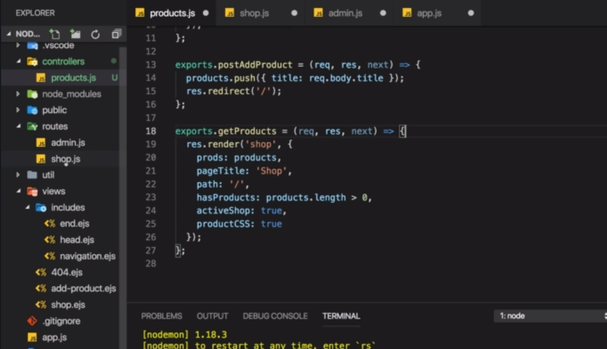
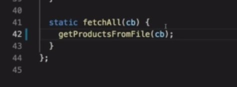

# S7 | Module Introduction

 

# S7 | What Is The Mvc
---
 

## How Routes Fit Into This Picture

**Routes** - are basically the things which define upon which path for which http method which **controller** code should execute 

**Controller** - is then the thing defining with which model to work and which view to render.

**[Note]** - An express app (like ours) heavily relies on middleware concept. 
The controllers are also kind of split up across middleware functions or some of the logic might be separated and moved into another middleware function
But we'll see all of that and we'll get there step by step.

# S7 | Adding Controllers
---

## Initial folder structure 

 

## Identifying Controllers In Our Project

**Controller** 

It connects model (`products`) with views.(`render`) So our routers (`admin.js , shop.js`) already has the controller logic inside.
 
 

But if we tend to put all logic at the same place it would make our route files too big. So we can break the logic into separate controllers and manage better.

## Lets Make a Contoller

Folder
 

Each **Router** might have a single **Controller**.
Or there might be multiple **Controllers** for a single **Route** and vice versa.
We will store all product related logic in the **`products.js`** controller.
 

Transfer logic from `admin.js`
 

To `controllers/products.js`
 

Export the function
 
this is same as a middleware function through which requests are funnelled. 

All product related logic should reside in this controller.

Import controller in `admin.js` and use it as middleware functions as before.
 

pass the reference to the function
 

Repeat this for adding a new product
 
 

To `controllers/products.js`
 

But we dont have the products array variable ! Let add the array after removing from the `admin.`js file
 

**`admin.js` - add the func ref and remove the exports**

Before
 

After 
 

## Adjust the app.js where we are importing the routes.

Before
 

After
 

## `shop.js` - Lets add controller to this.

Before adding controller function
 

**After adding**
`controllers/products/js`
 

`shop.js` - add controller func ref after removing imports 
 
 

## Output
 

## Legacy Notes (Old)
---

* We already had controller logic inside our route files namely : _admin.js_ and _shop.js_

* Now we will extract those logic and place them in a separate .js file which we will call controller.

* As we know from above the controller is responsible for the internal logic and connecting the models and views.

* We will have separate controllers according to what they deal with e.g product.js will only deal with logic relevant to products.

### Lets Code! (I mean lets extract!)

#### Step-1

_admin.js_ (before extraction)

```js

// # Import rootDirectory variable from Utility > path.js
const rootDir = require('../utility/path') 

// ## Form to send user request
router.get("/add-product", (req, res, next) => {
  console.log("[admin.js] -> get -> /add-product");  
  // Rendering the template "add-product.pug"
  res.render(
    'add-product', {
      title: 'Add Product', 
      path: '/admin/add-product',
      activeAddProduct: true,
      formsCSS: true,
      productCSS: true
    })
  
});

```

_controllers/products.js_

```js
// extracted from admin.js
exports.getAddProduct = (req, res, next) => {
  console.log("[admin.js] -> get -> /add-product");
  // Rendering the template "add-product.pug"
  res.render("add-product", {
    title: "Add Product",
    path: "/admin/add-product",
    activeAddProduct: true,
    formsCSS: true,
    productCSS: true
  });
};

```

_admin.js_(after extraction)

```js
// # Import rootDirectory variable from Utility > path.js
- const rootDir = require('../utility/path') // we dont need this rootDir

// # Import Controller
+ const productsController = require('../controllers/products');

// ## Form to send user request
+ router.get("/add-product", productsController.getAddProduct);
```

#### Step-2

_admin.js_ (before extraction)

```js

// # Store the products 
const products = [];

// ## Handling Incoming request - Add incoming product to products list
router.post("/add-product", (req, res, next) => {
  products.push({title: req.body.title});
  res.redirect("/");
});

// Export router, products
module.exports.routes = router;
module.exports.products = products;

```

_controllers/products.js_

```js
// # Store the products
const products = [];

// Extracted from the admin.js route
exports.postAddProduct = (req, res, next) => {
  products.push({ title: req.body.title });
  res.redirect("/");
};

```

_admin.js_ (after extraction)

```js

// ## Handling Incoming request - Add incoming product to products list
router.post("/add-product", productsController.postAddProduct);

// Export router, products
module.exports = router;

```

#### Step-3

_shop.js_ (before extraction)

```js  
//...

router.get("/", (req, res, next) => {
    console.log('In shop middleware')    

    // res.sendFile(path.join(rootDir, 'views', 'shop.html'))

    // Pass products to the shop.pug template 
    const products = adminData.products;
    
    /** Render the template (pug, hbs, ejs,etc) as response
     * res.render('shop') // i.e render shop.pug when using pug as the view engine
     * `products`: passing this variable to the template as key-value pair    
     * `path`: variable to decide active class on the navbar link in the main-layout
     * hasProducts: boolean variable to flag whether product list is empty. Keeps logic inside the node.js express content and not template
     */
    res.render('shop', {
        prods: products, 
        title: 'Shop', 
        path: '/', 
        hasProducts: products.length > 0, //boolean used in if..else loop
        activeShop: true, //boolean used to add active class dynamically to nav links
        productCSS: true, //boolean used to add css links conditionally as contents
        // layout: false // ** can do this to stop default layout being used ! **
    });

});

//...

```

_controllers/products.js_

```js
// This is extracted from the shop.js route
exports.getProducts = (req, res, next) => {

    /** Render the template (pug, hbs, ejs,etc) as response
     * res.render('shop') // i.e render shop.pug when using pug as the view engine
     * `products`: passing this variable to the template as key-value pair
     * `path`: variable to decide active class on the navbar link in the main-layout
     * hasProducts: boolean variable to flag whether product list is empty. Keeps logic inside the node.js express content and not template
     */  

    res.render('shop', {
        prods: products, 
        title: 'Shop', 
        path: '/', 
        hasProducts: products.length > 0, //boolean used in if..else loop
        activeShop: true, //boolean used to add active class dynamically to nav links
        productCSS: true, //boolean used to add css links conditionally as contents
        // layout: false // ** can do this to stop default layout being used ! **
    });

}
```

_shop.js_ (after extraction)

```js
const express = require("express");
const path = require('path');

// Import product controller
+ const productsController = require('../controllers/products');

const router = express.Router();

// Use the function exported by the product controller
+ router.get("/", productsController.getProducts);

module.exports = router;

```

### Step-4

_app.js_ (after)

```diff

// # Import Routes
- const adminData = require('./routes/admin');
+ const adminRoutes = require('./routes/admin');

// ## Using Routes
- app.use('/admin', adminData.routes);
+ app.use('/admin', adminRoutes);

```
# S7 | Finishing the Controllers
---

## 404.js - adding controller to the 404 route

Before  


`controllers/error.js`


`app.js` - import the errorController and use it 


## Legacy Notes (Old)
---

### Handle 404

_error.js_

```js 
exports.get404 = (req, res, next) => {
  res.status(404).render("404", { title: "404", path: "/404" });
};

```

_app.js_

```diff 
// ## Handle Unknown request
- app.use('/', (req, res, next) => {  
-    res.status(404).render('404',{title: '404', path: '/404'})
- })

+ app.use('/', errorController.get404);
```

# S7 | Adding Product Model
---

## Whats the current model in our project

Its the product array.


## Creating the product model

`models` - folder


`model/product.js` - the Product Model

You can have the model as a constructor function
 

You can also use the Es6 syntax and created classes.


Store the product object in an array (immitating a DB) 


Fetch All Products. 
This should be a class level function not an object level function. 
`Static Method` -  So that we can call the function directly on the class.


## Modifying the Product controller - to use the Product Model

`controllers/products.js`
**Delete** : line - 1 , line - 14, line - 18 
So that no product array related logic is left in the file


Import the Product Class - And use it in the middlewares


the `req.body.title` is coming from the `name` property in the form input.

 Save the product 
 

Fetch All Products 


## Output - using a Model


## Legacy Notes (Old)
---

### Create The Product Model

_models/product.js_

```js 
const products = []; // later will be replaced by DATABASE

module.exports = class Product {
  constructor(t) {
      this.title = t;
  }

  save() {
      products.push(this);
  }

  static fetchAll() { // static functions can be directly called from the class
      return products; // return the product list
  }
}
```

### Modify The Controller To Use The Product Model

_controllers/products.js_

```diff 
// # Store the products
- const products = [];

// Import the Product class as the model
+ const Product = require("../models/product");

// this function will get the Add Product form
exports.getAddProduct = (req, res, next) => {
  // Rendering the template "add-product.pug"
  res.render("add-product", {
    title: "Add Product",
    path: "/admin/add-product",
    activeAddProduct: true,
    formsCSS: true,
    productCSS: true
  });
};

// ## Handling Incoming request - Add incoming product to products list
exports.postAddProduct = (req, res, next) => {

- products.push({ title: req.body.title });

  //Create local product object and then push in the products list exposed as a global variable in the file "../models/product.js"

+  const product = new Product(req.body.title);
+  product.save(); // stores the product in the product list
  res.redirect("/");
};

exports.getProducts = (req, res, next) => {
  // use static method of the class to retrieve the product list  
+  const products = Product.fetchAll();


  res.render("shop", {
    prods: products,
    title: "Shop",
    path: "/",
    hasProducts: products.length > 0, //boolean used in if..else loop
    activeShop: true, //boolean used to add active class dynamically to nav links
    productCSS: true //boolean used to add css links conditionally as contents
    // layout: false // ** can do this to stop default layout being used ! **
  });
};


```

### Output Same As Before - But Now We Use `Model`


# S7 | Storing Data In Files Via Model
---

## Objective 

* We will use a file to store the products
* Before adding a new product -  
  * We will retrieve existing products by parsing the file.
  * Then push the new product and then write the file with the updated list.

## Working with the file system

import the `fs and path` packages


rootDir 


data/products.json


save()


readFile( _path, callback )


## Output

Add product 


crashed


undefined from the save() function console


logging the error

no such file or directory

## Working with `save()` function 

Retrieve products from file if file exists i.e. no error.


Append my new product


The `this` keyword will refer to the Product class only when we use an arrow function. Otherwise it will loose the context of `this`.
**Arif(to check) - Test to check what becomes the context if arrow finction was not used**


**Save back the file with the newly added product**
Use `writeFile( _path, _data, _callback )` method 
Use JSON.stringify


`save()`


## Output


## Fetch the data from the file

return empty array in case of error.


add the file path variable `p`


## Legacy Notes (Old)
---

### Code 

#### Step-1 - Code The Model To Use File As Data Storage

Check the comments carefully!

_models/product.js_

```js 
- // const prods = []; // later will be replaced by DATABASE

const fs = require("fs");
const path = require("path");
const rootDir = require("../utility/path");

module.exports = class Product {
  constructor(t) {
    this.title = t;
  }

  save() {
-    //   products.push(this);

    const p = path.join(rootDir, "data", "products.json");

    // Read products from file if exist
    fs.readFile(p, (err, fileContent) => {
      let products = [];

      if (!err) { // products.json exists
        products = JSON.parse(fileContent);
      }

      /**
       * Add either to empty array or to the products we get from the file.
       * `this` refers to the current product.
       */
      products.push(this);

      /**
       * Write the updated product list back to the file
       * if file does not exist it will be created
       */
      fs.writeFile(p, JSON.stringify(products), err => {
        console.log(err);
      });
      
    });
  }

  static fetchAll() {
    const p = path.join(rootDir, "data", "products.json");
    fs.readFile(p, (err, fileContent) => {
       if(err) {
           console.log("fetchAllError->>", err);
           return [];
       }
       console.log(JSON.parse(fileContent));
       return JSON.parse(fileContent);
    })
-    // return prods; // return the product list
  }
};
```

  1. We have to update almost everywhere. Compare with the previous version of the model : `product.js`
  2. Note that the data/products.json file should not exist initially.
  3. For the first created product, the product.json file gets created.
  4. If we start with a manually created empty product.json file we get the following error with the code above.
   

#### Recall The Controller `_controllers/products.js_` Code 

Note how the controller interacts with the Model product.js.

```js 

// Import the Product class as the model
const Product = require("../models/product");

// This function will get the Add Product form
exports.getAddProduct = (req, res, next) => {
  // Rendering the template "add-product.pug"
  res.render("add-product", {
    title: "Add Product",
    path: "/admin/add-product",
    activeAddProduct: true,
    formsCSS: true,
    productCSS: true
  });
};

// ## Handling Incoming request - Add incoming product to products list
exports.postAddProduct = (req, res, next) => {

  //products.push({ title: req.body.title });

  //Create local product object and then push in the products list exposed as a global variable in the file "../models/product.js"
  const product = new Product(req.body.title);
  product.save();
  res.redirect("/");
};

exports.getProducts = (req, res, next) => {
  // use static method of the class to retrieve the product list  
  const products = Product.fetchAll();
  
  res.render("shop", {
    prods: products,
    title: "Shop",
    path: "/",
    hasProducts: products.length > 0, //boolean used in if..else loop
    activeShop: true, //boolean used to add active class dynamically to nav links
    productCSS: true //boolean used to add css links conditionally as contents
    // layout: false // ** can do this to stop default layout being used ! **
  });
};

```

### Output 

We get an error after the above steps when we add a product from the UI. But the product gets added to the product.json file.

#### _product.json_

**the file** 


**file content**


#### Home Page Error


#### Question?

Do you know why we see this error.

**Hint:** Asynchrounous!!


# S7 | Fetching Data From The Files Via The Model
---

## Why Do We See The Error ? 


## The Reason - Analyse The Code Snippet and Comments

Whats wrong with this code ?

The highlighted portion is an asynchronous callback which runs at a later time ! So the function that returns a array for the retrieved products from the file only registers itself and executes only when the file has been read fully in an asynchronous manner.

So `fetchAll()` does not return anything and therefore its undefined

This gives rise to an error when we try to access the length in our `shop.ejs` file


**Note** : The error happens when we try to visit the root url `"/"`

## The Solution - Introduce Callback


line 27, 35, 37. We will call the callback function passed to the `fetchAll()`.


**`contorllers/product.js`** - define the callback

`fetchAll`

`fetchAll`

`fetchAll`


The callback uses the product it gets from `fethAll()` to render the template.

## Output


## Legacy Notes (Old)
--- 
_models/product.js_
_
```js 

  static fetchAll() {
    const p = path.join(rootDir, "data", "products.json");

    /**
     * readFile runs the 2nd arg which is a callback function once it finishes reading from the file. Meanwhile the code below this block continues to execute. So the controller code that calls fechAll() expecting a product does not immediately receive a product.
     * We need to setup a way so that fetchAll() can do the desired task once it gets the product list asynchrounously.
     */
    fs.readFile(p, (err, fileContent) => {
       if(err) {
           console.log("fetchAllError->>", err);
           return [];
       }
       console.log(JSON.parse(fileContent));
       return JSON.parse(fileContent);
    })    
  }
};

```


_controller/products.js_

```js
exports.getProducts = (req, res, next) => {
  /** Model Static Method - to Retrieve the product list  
   * fetchAll() - does not return the product list immediately since it runs an asynchronous code. 
   * i.e. it does not wait for reading the whole product.json file
   * thus `products` in the code below is "undefined"
   */
  const products = Product.fetchAll(); // products = "undefined" 
  
  res.render("shop", {
    prods: products,
    title: "Shop",
    path: "/",
    hasProducts: products.length > 0, //boolean used in if..else loop
    activeShop: true, //boolean used to add active class dynamically to nav links
    productCSS: true //boolean used to add css links conditionally as contents
    // layout: false // ** can do this to stop default layout being used ! **
  });
};


```

#### The Solution - Introduce Callback

_models/product.js_

```js
+  static fetchAll(callback) {
    const p = path.join(rootDir, "data", "products.json");

    /**
     * readFile runs the 2nd arg which is a callback function once it finishes reading from the file. Meanwhile the code below this block continues to execute. So the code that call fechAll() expecting a product does not immediately receive a product.
     * We need to setup a way so that fetchAll() can do the desired task once it gets the product list asynchrounously.
     * Lets have a callback function as an argument of fetchAll() which will be executed once the products.json file has been read.
     */
    fs.readFile(p, (err, fileContent) => {
      let products = [];
      if (err) {
        console.log("fetchAllError->>", err);
        //return [];
        products = [];
+       callback(products); //pass products to the callback
        return;
      }
      console.log(JSON.parse(fileContent));
      //return JSON.parse(fileContent);
      products = JSON.parse(fileContent);
+      callback(products);
    });
  }
};

```

_controllers/products.json_

```js
exports.getProducts = (req, res, next) => {
  /** Model Static Method - to Retrieve the product list
   * fetchAll() - does not return the product list immediately since it runs an asynchronous code.
   * i.e. it does not wait for reading the whole product.json file
   * thus `products` in the code below is "undefined"
   */

  /** Solution
   * lets define a callback funtion `renderShopWithProducts` which will be called with the returned json products inside the fetchAll() function block once the product.json file has been read completely.
   * `renderShopWithProducts` function will accept the retrieved `products` as the argument and render accordingly
   */
+  const renderShopWithProducts = products => {
    res.render("shop", {
      prods: products,
      title: "Shop",
      path: "/",
      hasProducts: products.length > 0, //boolean used in if..else loop
      activeShop: true, //boolean used to add active class dynamically to nav links
      productCSS: true //boolean used to add css links conditionally as contents
      // layout: false // ** can do this to stop default layout being used ! **
    });
  };

-  // const products = Product.fetchAll();
+  Product.fetchAll(renderShopWithProducts);

};
```

# S7 | Refactoring The File Storage Code
---

## Refactoring the Product - Model

### `fetchAll()` - refactoring 

structure


`getProductsFromFile()` - this should do all that `fetchAll` does

` return cb([]); ` - the return is to make sure that code below does not execute

`fetchAll()` - modified
Forward the callback `cb`


### `save()` - refactoring 

Before refactoring


**Refactorinig...!**
- Getting the products from the `getProductsFromFile()`


Define the anonymous callback function that will be executed after getting the products!

- make sure to have the => function so that `this` always refers to the class and consequently the object of the class
- we no more need to readFile
- we will just write to the file once the product list has been updated

## Output - Error


- `p` is not defined inside `save()`

 

## Solution

Declare the `p` variable as global

- so all the functions can access this now

## Output


## Legacy Notes (Old)
---

_models/product.js_

```js
const fs = require("fs");
const path = require("path");
const rootDir = require("../utility/path");
const p = path.join(rootDir, "data", "products.json");

// Helper Method - getProductsFromFile(callback)
/**
 * getProductsFromFile accepts a callback function which gets executed once it gets the products from the file.
 */
const getProductsFromFile = callback => {
  fs.readFile(p, (err, fileContent) => {
    if (err) {
      callback([]); //pass products to the callback
    } else {
      callback(JSON.parse(fileContent));
    }
  });
};

module.exports = class Product {
  
  constructor(t) {
    this.title = t;
  }

  save() {
    // Read products from file if exist
    getProductsFromFile(products => {
      products.push(this);
      fs.writeFile(p, JSON.stringify(products), err => {
        console.log(err);
      });
    });
  }

  static fetchAll(callback) {
    getProductsFromFile(callback);
  }
};

```

# S7 | Wrap

---

 


# S7-L101 | Useful Links

---

## To Know More on **MVC** [Click Me](https://developer.mozilla.org/en-US/docs/Web/Apps/Fundamentals/Modern_web_app_architecture/MVC_architecture)

 