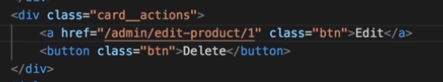
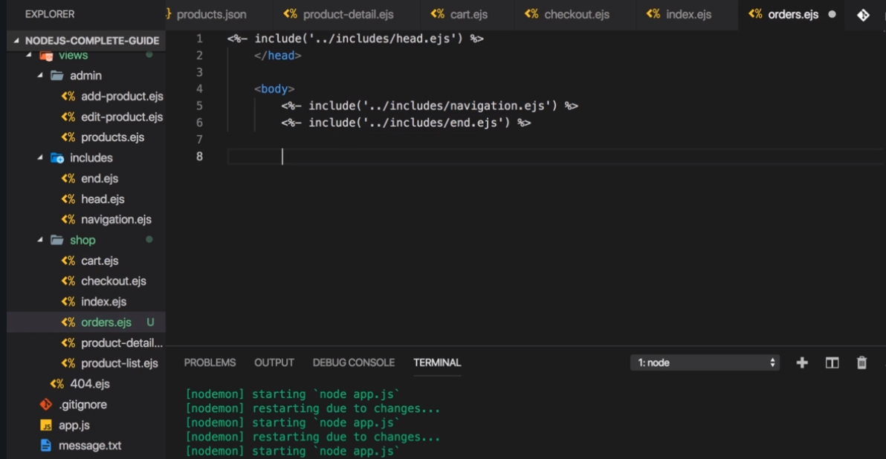

# S8 | Enhancing the Course Project
---

# S8 | Module Introduction
---
 

# S8 | Creating the Shop Structure
---
## Folder Structure
Adding subfolders and new ejs template in the `view` folder
 

# S8 | Working On The Navigation
---
## Adding a new Links to the navigation 


- `/products` - Products
- `/cart` - Cart
- `/admin/products` - Admin Products - Loads a list of all the products. Which can be clicked and will show the edit-product view

## We should see the links as below


## Mobile View

- Lets not focus on css for now 
- Only focus on node logic 

## Quick Task
Make the links added work as expected

# S8 | Registering The Routes 
---
`routes/shop.js`


`routes/admin.js`


New Controllers


- admin.js
- shop.js - it was product.js before

Remove the `getAddProduct` and `postAddProdcut` from the `controller/shop.js` and move it to the `controller/admin.js` file


**Fix the references in the**
`routes/admin.js`


`routes/shop.js`


`routes/shop.js` - adjust the functions called by each route


## Lets Code the Above !! 
[YES] - Coded ? 

`controllers/shop.js` - Add middleware functions for the new routes


`routes/shop.js` - add the new middleware functions added in the shop controller.


`controller/admin.js` - Add middleware `getProducts`. Same as that in the shop controller 


## Output is blank - we need to modify the `index.ejs` template 


## `index.ejs` - copy code from the `product-list.ejs`


## Output - Shop ! 


## Cart - for now


## Admin Products


## Correction in the admin routes


## Correction in the `controller/error.js`. Set the path field


## Lets Code the Above !! 
[YES] - Coded ? 

# S8 | Storing Product Data
---
## Objective 
We want to add more properties to our product

## Product Model (updated)
Constructor - add more argument


## Views - `admin/add-product.ejs` 
Add more form controls


Output of the form


`forms.css` - Styling 


## Output 


## Modify the admin controller

`controllers/admin.js` - modify `postAddProduct` to pass all the newly added fields for product to the product constructor.


# S8 | Displaying Product Data
---
`shop/product-list.ejs` - this lists all the products
We need to modify this to show other properties along with title


`index.js` - Do the same as above

`add-prodcut.ejs` - make the proce field accept decimal by adding `step` property


## Issue - CSS not loading
### After I add product and  when it redirects to '/' route, it doesnt load css.
 
 
### Solution
Finally got this fixed. The problem is a package setting difference - nodemon. On my machine, nodemon restarts  every time I add a product (ie. edit the products.json file) and this somehow intercepts access to the css files. If I use 'npm run start-server' (without nodemon), the css files are found successfully.  The solution from the following question/answer: nodemon restarting problem, solves the problem. You need to configure nodemon not to restart when  the products.json file changes - add the following to your package.json:

```js
"nodemonConfig": {        
    "ignore": ["data/products.json"]  
}
```
Restart with nodemon, add a product and the products page should load with CSS styles.

If anyone understands why a nodemon restart impedes access to CSS files, I'd be interested to hear an explanation : )

## Output


## Lets Code the Above !! 
[YES] - Coded ?  

# S8 | Editing & Deleting Products
---
## Lets Improve the Admin Products Tab 

Copy code from `prodcut-list.ejs` to `admin/products.ejs`


Add buttons


Later we will add link for the Edit and Delete button like below.


  - But we would have to pass the `ID` of the product clicked.
  - And then retrieve the `ID` in the **route** that we are loading so that we know which product we need to fetch from the database.

Update the Delete button so as to initiate a POST request when clicked. 


Output - Admin Products


## Same Problem In Add To Cart
`shop/product-list.ejs` - Looks like this now


Lets convert this to a from which will POST a request to add the selected product into the cart.
 
 - route should contain the info - which `ID` ? 
 - method should be - `POST`

# S8 | Adding Another Item
---
Adding the Orders - `order.ejs`


Add Orders to Navigation - `navigation.ejs`


Add Orders to Routes - `routes/shop.js`


Add new action in the Controller - `controller/shop.js`


## Lets Code the Above !! 
[YES] - Coded ? 