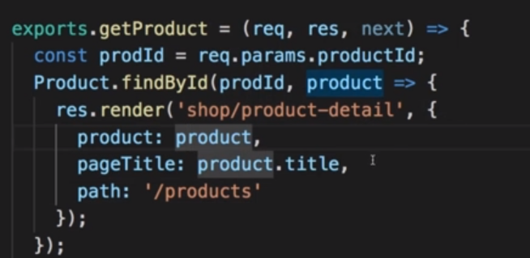
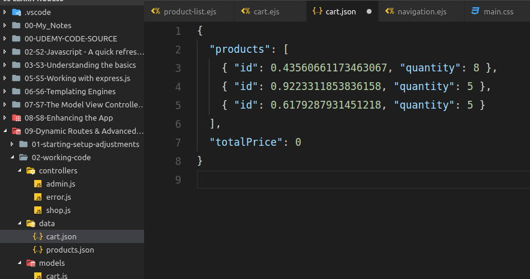
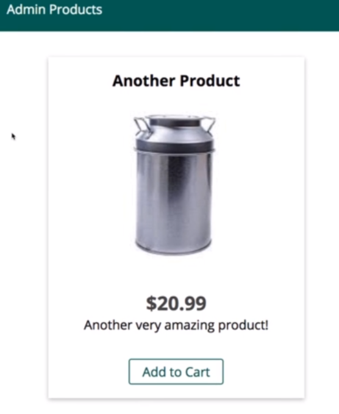
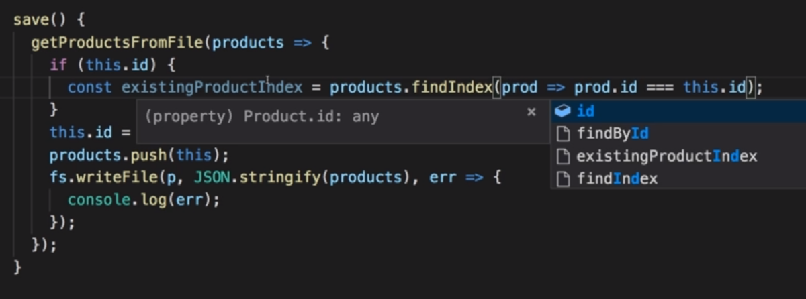
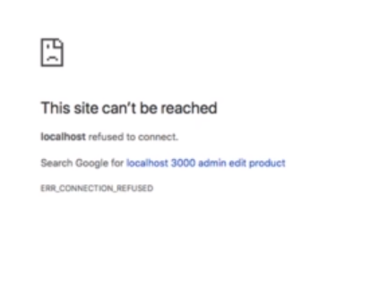
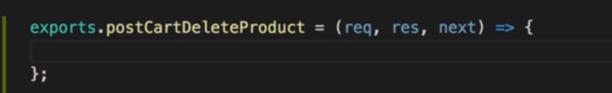
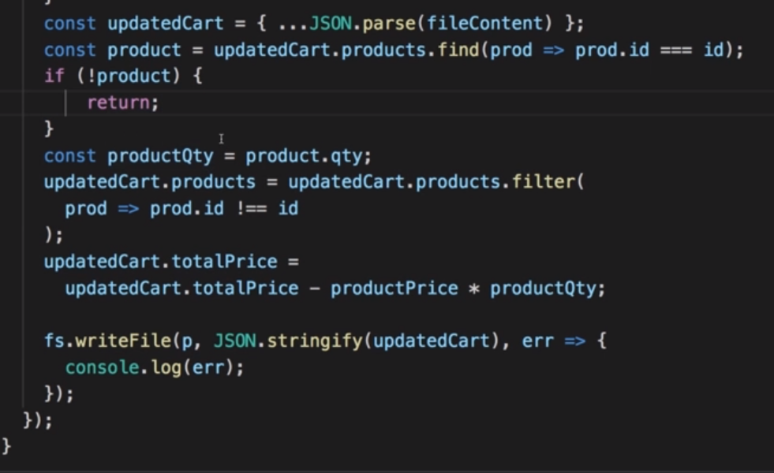

# S9 | Dynamic Routes & Advanced Models 

# S9 | Module Introduction
---


# S9 | Adding the Product ID to the Path 
---
## We need a way to load the detail page for a product

`shop/product-list.ejs` - Add a new button in actions

Before adding button


Add Details button


UI


But we need to pass the `ID` of the product for which we want to see the details. Somthing like this : 


## Lets ensure every product has a unique `ID`

Using `random()` to have an ID for each product while saving. - `models/product.js`


## Pass the unique ID to the path

Which path ? - `shop/product-list.ejs`


Adding the `product.id` to the path


How might the path look ?


## Extract all the data we need for the product (`ID`) from the controller
We send some information as part of the path so that we can extract all the data we need for the product from the controller or inside of the controller because we can't really send the entire product as part of the url but we can send this key information.

Add id to the products in the `products.json` file


Click on Details and see the url


- Page not found since we are not handling the route yet

#### Next step 
- Extract the ID 
- Thus know which product to load

# S9 | Extracting Dynamic Params
---
## Handle a new route with a dynamic segment i.e the productId 

Register new route - 
`routes/shop,js`

- we can tell the express router that there will be some variable segment by adding a colon and then any name of our choice like `productId`
- This will get matched to urls like `/products/1234`, where 1234 will be the `productId`

- But this will also get matched to urls like `/products/delete`
- So the ordering matters here. We should have the more specific route first and general routes later in the code.


## Extract the dynamic productId in the controller
Add a function in the controller to extract the productId - 
`controllers/shop.js`.


## Output


# S9 | Loading Product Detail Data
---
## Designing the function that returns the selected product from the DB (i.e file for now)

`models/product.js`

- Now we need to fetch all the products from the file
- IF it was a database we could run a query to fetch only the expected product

`findById()` - finds product by ID


## Use the product found in the controller

`controllers/shop.js` - Logging the prodID


Getting the product by id 


## Output - console


## Lets Code the Above !! 
[YES] - Coded ? 

# S9 | Rendering The Product Detail View
---
## Design the ejs template file for Product Details View
`shop/product-detail.ejs`
 

Adding the css for `centered`
`css/main.css`


Adding the html for Product detail page
`shop/product-detail.ejs`


## Render the Product Detail view

`controllers/shop.js` - Render the product detail view


- `path: '/products'` : ensures that the **Products** tab is highlighted when viewing product details

Output


## Add To Cart Button 
`product-detail.ejs`


Output


# S9 | Passing Data With POST Request
---
## Objective
We want to add a product to the cart
But we need to know which product should be added to the Cart ?


## Idea  
1. We can pass data in the request (`req`) body.
2. This is not possible in a `GET` request.
3. But this is the convention when we pass data in the `POST` request.
4. **REMEMBER** - The same thing happens when we add a product.
All the fields and their values were put in the `req.body`

- But this is only for `POST` request not for `GET` request.

## Add Hidden Inputs with Name property 
Add **Hidden Inputs** with `name` property in a `form` so that the `req.body` is automatically populated by express.


## Add Function to the Controller
`controllers/shop.js`
 
- `req.body` is populated by express due to a form `POST` request

## Connect the Router to the Controller
`routes/shop.js`
 


## Output
Click on Add to Cart 


See the `productId `in the console

- This is Working !! Great 

## Use the same Add to Cart form everywhere
The Form 


`product-list.ejs`


`index.ejs`


We can add an `add-to-cart.ejs` in the includes folder


## Use the add-to-cart include
`index.ejs`


`product-detail.ejs`


`product-list.ejs`


## Output

#### Error

- Include does not get the loop variable (`product`) by default.
  

#### Solution
We can pass the variable by passing an object as the second argument.

- We need to do this for all our add-to-cart includes where it is used inside a loop.

#### Works Now !


## Lets Code the Above !! 
[YES] - Coded ? 

# S9 | Adding a Cart Model
--- 

## Adding the cart class
`models/cart.js`


#### Probable approach is to have a constructor like this.
`models/cart.js`

- a list of products 
- total price 

#### But we will take a different approach 
- Its not that a cart will be created everytime whenever a product is created.
- Since the cart will always be there in our application 
- We just need to manage the products

`models/cart.js`


`models/cart.js` - The cart.json file will represent an object tha t represents our cart.


## Lets Code the Above !! 
[YES] - Coded ? 

## Lets Code Myself Before I See Anymore !! 
[YES] - Coded ? 

#### `cart.json` - by @ams


#### `cart.ejs` - by @ams


#### `models/cart.js` - by @ams
```js
const fs = require("fs");
const path = require("path");
const rootDirPath = require("../util/path");

const p = path.join(rootDirPath, "data", "cart.json");
// const p = path.join("..", "data", "cart.json");

class Cart {
  static addProduct(id) {
    // Fetch the previous cart
    fs.readFile(p, (err, data) => {
      const cart = JSON.parse(data);
      // Analyze the cart => Find existing products
      const products = cart.products;
      let product = products.find(p => p.id == id);
      const isNewProduct = product ? false : true;
      // console.log({ products, isNewProduct });
      // Add new product / increase quantity
      if (isNewProduct) {
        // Add new product 
        const quantity = 1;
        product = { id, quantity };
        products.push(product);
        console.log(products);
        fs.writeFile(p, JSON.stringify(cart), err=>{
          console.log(err);
        })
      } else {
        // Increase quantity
        product.quantity ++;
        console.log(products);
        fs.writeFile(p, JSON.stringify(cart), err=>{
          console.log(err);
        })
      }
    });
  }
  static getCart(cb) {
    fs.readFile(p, (err, products) => {
      // console.log(JSON.parse(products));
      // show the products in the UI Cart - using a callback
      cb(JSON.parse(products));
    })
  }

}
module.exports = Cart;
// Cart.addProduct(0.6179287931451218);
```

#### controllers/shops.js - Cart controller functions

```js
exports.getCart = (req, res, next) => {
  Cart.getCart(cart => {
    // console.log(cart);
    res.render("shop/cart", {
      products: cart.products,
      pageTitle: "Your Cart",
      path: "/cart"
    });    
  });
};
exports.postCart = (req, res, next) => {
  const prodId = req.body.productId;
  // console.log(prodId);
  Cart.addProduct(prodId);
  res.redirect("/cart");
};
```
#### `routes/shop.js` - by @ams


## Lets Code the Above !!
[x] - Coded ?

## Lets Proceed to Lecture 

## `models/cart.js`
#### Reading from the file
`models/cart.js`

- create the file if err with `cart` object
- otherwise read from the file and parse

Find if the product we want to add already exists in the cart
`models/cart.js`


#### Update the quantity if product exists
`models/cart.js`

- using spread operator to copy object fields 

If new product
`models/cart.js`


#### Update Product cart `totalPrice`
`models/cart.js`

- expect to get the individual product price as argument.
  
#### Add the `productPrice` to the cart `totalprice`
`models/cart.js`


#### Cart should contain the updated product.
For new product add the product to the existing cart products list.
`models/cart.js`

- using spread operator

#### For existing product we want to replace the product with the updated product (quantity incremented)
`models/cart.js`

- get the index of the product in the cart

Replace the existing product with the updated product
`models/cart.js`


#### Save the cart back to our file
`models/cart.js`


## `controllers/shop.js`
Get the Product by Id from the `DATABASE` i.e `products.json` file
`controllers/shop.js`

- We can use this product information to update the cart.

Use the `Cart` model
`controllers/shop.js`


Add the product to the cart
`controllers/shop.js`

- pass arguments : `prodId` and `price`

## Output
Click Add to Carts


See `cart.json`

- totalprice does not seem alright. We have to work on that

`models/cart.js` - convert the price to number


Output after correction


## Lets Code the Above !! 
[YES] - Coded ? 

# S9 | Using Query Params
---
## Ignoring For Now 
- Displaying the Cart
- Deleting a Product from the Cart

## Editing a Product

#### Creating a Common template for Add and Edit Products
The `edit-product.ejs` should be same as `add-product.ejs`


Transfer the code from `add-product.ejs` to `edit-product.ejs` 
Delete the `add-product.ejs`.

#### Fix the `add-product.ejs` template
`edit-product.ejs`

- keeping on the `edit-product.ejs` since its more generic 
- also we will resuse the template

Do not use the `add-product.ejs` template in the controller.


Use the `edit-product.ejs`


Output - **Add Product** still works


#### Edit Product Controller


- Question is how should we reach this controller action ?

**Edit Button** in the "**Admin Products**" Tab


Current `Url`


But we want the `Url` to contain the ProductID

- then the form will be pre-loaded with the product properties
- And Saving the form will cause to replace the existing product in the DB (file)

`routes/admin.js` - Add the route for editing the product

- adding dynamic segment in the route i.e `ROUTE PARAMETERS`

`controllers/admin.js` - add a bollean to know whether the user wants to edit or add a product


We want a confirmation from the user if they want to edit or not - using a **Query Parameter**

- Example of a query parameter
- This is optional data
- Multiple query params are separated by `&` sign

The path reached is determined upto the question mark 


So we dont need to add any query parameter information in the `routes file`


But we can always check for query parameters in our controllers using the `req.query.paramKey`
`controllers/admin.js`

- The value of query param extracted is always string like `"true"` and not `true`

Now we can set the editmode and enter the edit mode if this value is set.
`controllers/admin.js`


Doing a redundant check and redirection

- redundant because we already know that we want to edit

Output - Edit product


# S9 | Pre-Populating the Edit Product Page with Data

## Controller
Now in the edit mode I want to get my product information
`controllers/admin.js`
 

Remember : we get the prodId from the route dynamic segment.
`routes/admin.js`
 

Get the productId from the `req.params.productId`
`controllers/admin.js`


Use the product Model to fetch the product
`controllers/admin.js`


Render the Edit Product Page once the product is fetched.
`controllers/admin.js`

- pass the product as a variable to the template

Add a check if the product is not found. Redirect in that case
`controllers/admin.js`
 

## View
#### Toggle the Button
We want to change the button `Add Product` in the edit mode
`admin/edit-product.ejs`


Change the text when in edit mode
`admin/edit-product.ejs`


- if check to toggle button text

Output - when we go to Edit Product


Output - when we go to Add Product 


Set editing to `false` when adding product 
`controllers/admin.js`


Output - when we go to Add Product Now


#### Toggle the Action

We need to change the route we are sending th request to (the action property of the form)
`admin/edit-product.ejs`


Make the action dynamic depending on the editing property
`admin/edit-product.ejs`


Output - click on the Update Product button should take you to the edit route


#### Pre-populate edit page with product information
Recall that we are passing product
`controllers/admin.js`


We can use that in our view
`admin/edit-product.ejs`


Make the input dynamic using if condition
`admin/edit-product.ejs`


 
Output


# S9 | Linking to the Edit Page
We have to change the `href` which takes us to the edit page.
`admin/products.ejs`


Add the id of the product
`admin/products.ejs`


## Output - till now - before we set the editing mode


We get redirected ! 

- What could be the issue here ?
  - We are not sending any query parameter : `edit`
  `controller/admin.ejs`
  


## Lets set the query parameter
`admin/products.ejs`


#### Output - after adding query parameter


## Lets make sure update product does something


#### Route
Register this route
`routes/admin.js`

- this is a `POST` request. So data can be sent in the request we are sending.

#### Controller
Add the middleware function in the Controller to handle the request
`controller/admin.js`

- we want to construct a new product and 
- replace the exiting one with this product.
- this means : we need to work on the product model

#### Product Model
Next lecture

# S9 | Editing the Product Data

We have to edit the save method of the Product model so that it can save an existing product.
`models/product.js`


Have an id property in the constructor
`models/product.js`

- Now we can use this id to edit existing product

Modify `save()` method logic   
`models/product.js`

- if id exists new id wont be created 
- it will update the existing one

But we need all the products
`models/product.js`


Find the product you want to edit
`models/product.js`


Update product 
`models/product.js`

- `this` refers to the updated product
- using `spread` operator to copy the array.

Write to file - the new product list.
`models/product.js`

- `save()` can now add new products and 
- edit existing products


## Controller
#### `postAddProduct()`
We need to set null as the id - since this is what we have set as the constructor
`controllers/admin.js`

Set `null`
 

#### `postEditProduct()`
`controllers/admin.js`

**Next Actions**
- fetch info of the product
- create a new product instance 
- populate the product with that info
- call `save()`

Get the product id from the `req.body`
`controllers/admin.js`


Set the updated information of the product
`controllers/admin.js`


Save the edited product
`controllers/admin.js`


## View 
Add a hidden input which stores the existing productId
`admin/edit-product.ejs.js` 


Output hidden input if in editing mode
`admin/edit-product.ejs.js` 


Value as the product.id
`admin/edit-product.ejs.js` 


Give a name to the input 
`admin/edit-product.ejs.js` 

- so that you can access it in the  `req.body` in the controller  

## Route
Register the route
`routes/admin.js`


## Output
Click update with some !!! in the title
This will create an error since no response was sent but the product will be edited successfully.




See the json file


## Controller
Send the response to avoid error
`controllers/admin`

f
## Output
After redirection after editing 


## Lets Code the Above !! 
[YES] - Coded ? 

# S9 | Adding the Product-Delete Functionality
---
## Objective 
1. Delete products from Admin

## Lets Code Myself Before I See Anymore !! 
[YES] - Coded ? 

## View
We need to handle this route. 
`admin.products.ejs`


Add a hidden input with `name=productId` property so that we can access it in the request handler as `req.body.productId`
`admin.products.ejs`


## Route
Register a route for deleting product
`routes/admin.js`

- we can pass data as req.body since this is a `POST` request

Connect to the controller
`routes/admin.js`


## Controller 

Add a middleware function to handle the delete request
`controllers/admin.js`


Get the prodId
`controllers/admin.js`


## Model
Add a static method `deleteById`
`models/product.js`


Use `filter` to keep all products except the one to delete
`models/product.js`

- save the updated products back to the file.

Remove the product from the cart as well. Since it actually does not exist in the store.
`models/product.js`


# S9 | Deleting Cart Items - 
- ( When product is deleted from the Admin Page ) 
---
## Lets Code Myself Before I See Anymore !! 
[YES] - Coded ? 

## Model - Cart
Define a new static method in the cart model
`models/cart.js`


Read My Cart file
`models/cart.js`


If error then just return - nothing to delete
`models/cart.js`


If cart found then 
`models/cart.js`

- find the prodcut to delete
- use `filter()` so that updatedCart has all products except the on to delete
- update the totalPrice of the cart

Write back the cart
`models/cart.js`


Bug - use `fileContent` instead of `cart`
`models/cart.js`


## Model - Product
Use the Cart model to delete the product from the cart when admin deletes the product from the store  
`models/product.js`


Find the product using `filter` and pass the `product.price` 
`models/product.js`


## Controller - Admin
Use the Product model to delete the product from store and cart if required
`controller/admin.js`


Redirect to the `admin/products`
`controller/admin.js`

- It would be best to have a callback in deleteById
- So that we only **redirect** only when we are done deleting the product. Something like this : 
  ```js
    Product.deleteById(prodId, () => {
      res.redirect('/admin/products');
    })
  ```

# S9 | Displaying Cart Items on the Cart Page
---
## Lets Code Myself Before I See Anymore !!
[YES] - Coded ? 

## Model - Cart
Define `getCart` function to retrieve the entire cart 
`model/cart.js`


## Controller - shop.js
Use the getCart method in the controller
`controllers/shop.js`


We will also fetch the products as a nested callback - after we get the cart
`controllers/shop.js`


Check which products among the retrieved exist in the cart
`controllers/shop.js`


Add the products from the product.json file that already exsits in the cart to an array `cartProducts`
`controllers/shop.js`


But we also need the quantity of the product - which is a part of the cart data
`controllers/shop.js`


Use info from product.json and cart.json to fillup the cartProducts with latest data
`controllers/shop.js`


Pass the `cartProducts` to render the cart
`controllers/shop.js`

- If there is no products in the view, the cart will be an empty array and we can check that in our template

## View - `cart.ejs`
Lets have the basic common structure first and main section
`shop/cart.ejs`


Render products conditionally
`shop/cart.ejs`


Use the productData nested as an object property
`shop/cart.ejs`


Recall what the object passed to render holds


`shop/cart.ejs`


## Output


# S9 | Deleting Cart Items -  
## ( from inside the cart itself  ) 
---
## Lets Code Myself Before I See Anymore !! 
[YES] - Coded ? 

## View - `cart.ejs`
Lets add a `Delete` button inside a form - to delete a cart product
`shop/cart.ejs`


Add a hidden productId input so that it is passed as req.body to the controller.
`shop/cart.ejs`


Output 


## Router - `shop.js`
Register a route
`routes/shop.js`


Register a route
`routes/shop.js`


## Controller - `shop.js`
We need a middleware to handle this request
`controllers/shop.js`


Find the product and then delete by passing the required info
`controllers/shop.js`


Redirect to the cart 
`controllers/shop.js`


## Output


## Next Action
1. Add Database to our project
2. Redirect in callback - i.e - once the file access is complete

# S9 | Fixing a Delete Product Bug
---
## Bug
If we try to delete a product which is not in the cart then we get an error. 


We get an error because we try to access the qty of a prodc which we do not have 


## Fix
#### Model - Product
We are deleting the prodcut from the cart here
`models/shop.js`

- Problem is that not every product is in a cart

#### Model - Cart
We need to check if the given product is part of the cart 
`models/cart.js`

- Here we need to check 

Return if product is not found inside cart
`models/cart.js`

- This should solve the issue.

# S9 | Module Summary 
--- 


## Lets Code the Above !! 
[YES] - Coded ? 

# S9 | Useful Resources
Useful resources:
Official Routing Docs: https://expressjs.com/en/guide/routing.html