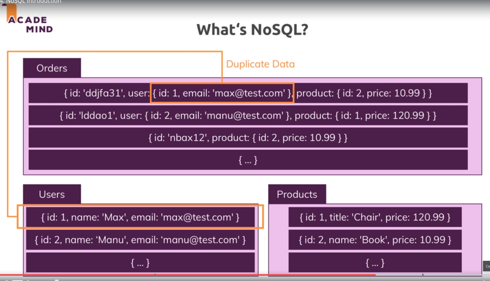
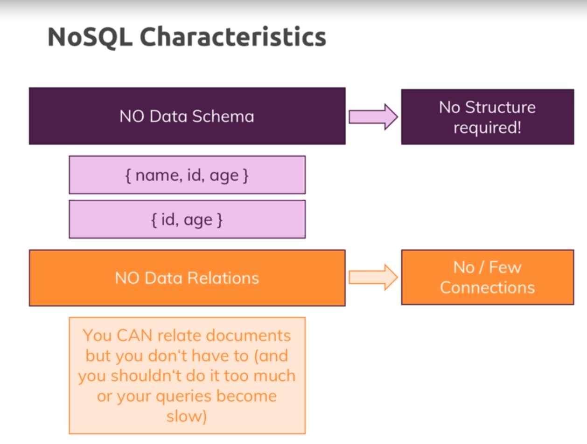
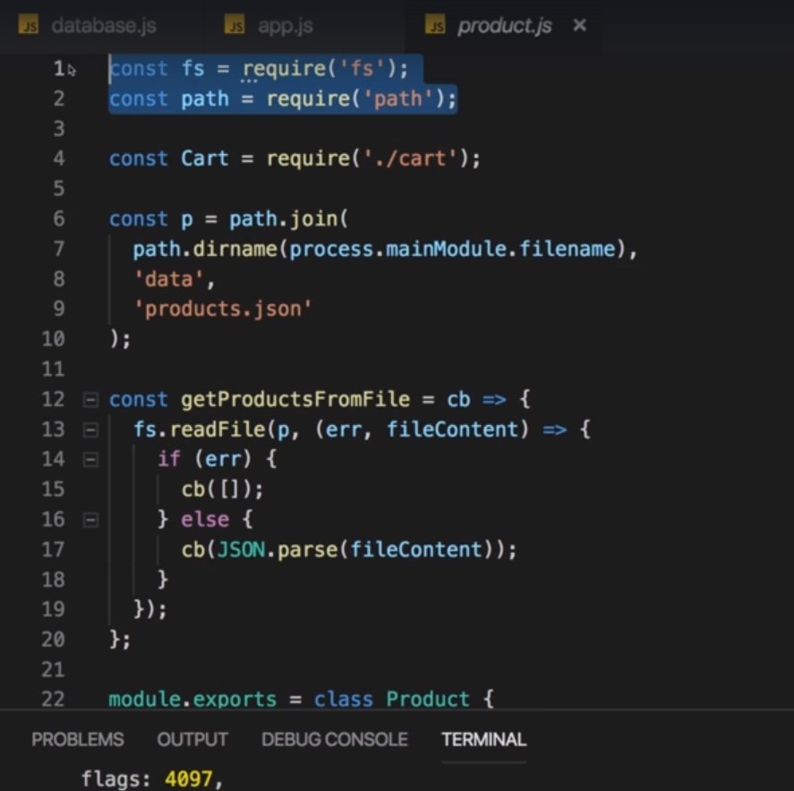
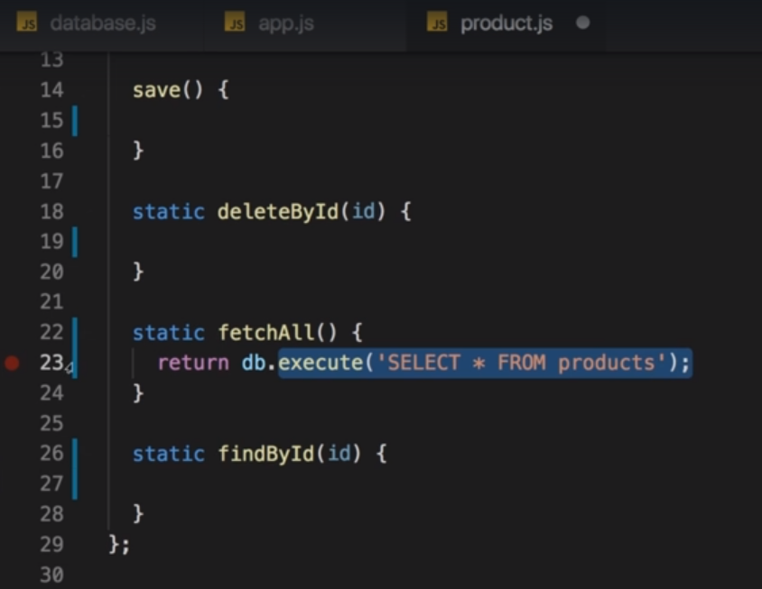
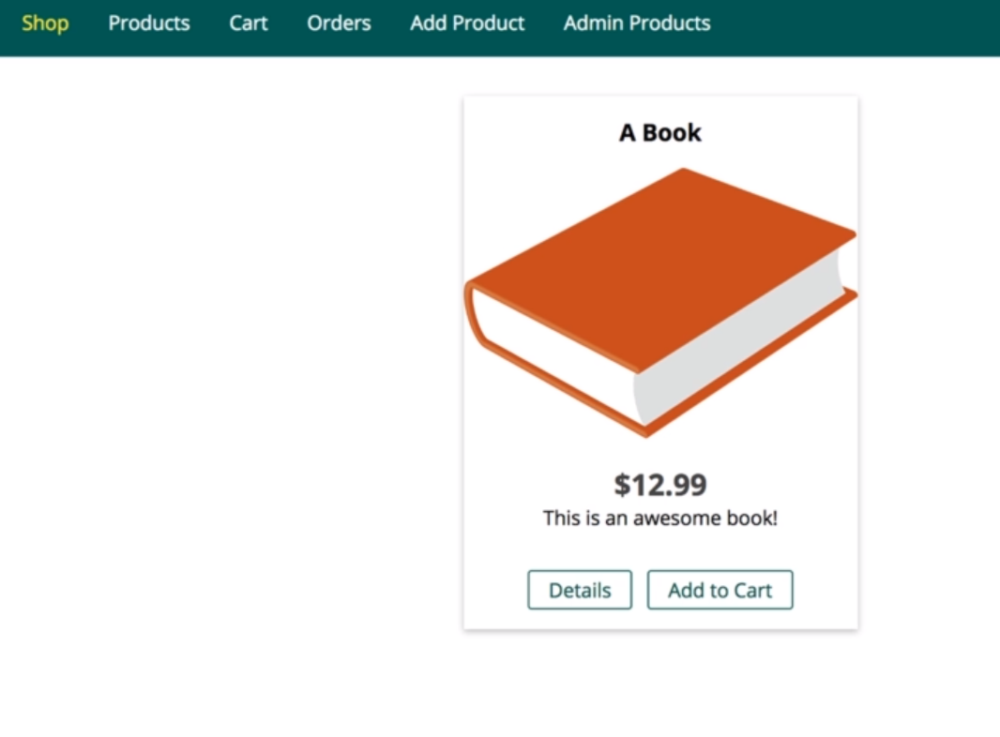
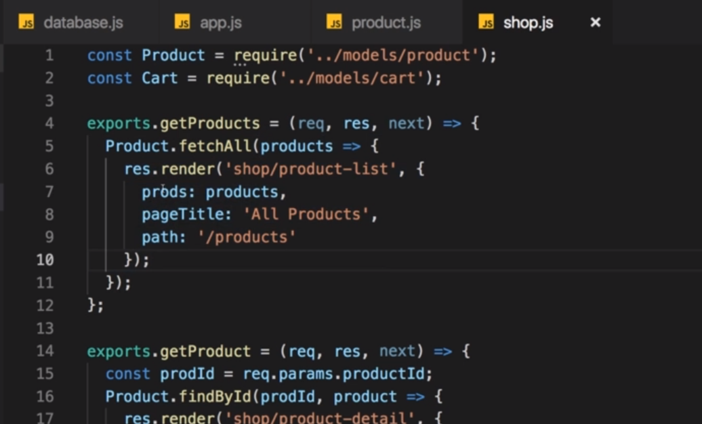

# S10 | Storing Data in Databases
---

# S10 | Module Introduction
---
Topic
 

Whats in the module

# S10 | Choosing a Database
---
SQL vs NoSQL

What is SQL

Core SQL Database Characteristics

SQL Queries

# S10 | NoSQL Introduction
---
NoSQL

- Collection (NoSQL) == Tables (SQL)
- Documents (NOSQL) == Rows (SQL)
- Multiple Documents in a Collection can have different structures.

Whats NoSQL

Whats NoSQL

- We do not have relations like SQL
- Instead we have duplicate data
- Like a document in Order collection can store duplicate User data
- This imitates the relation in SQL 
- This can help avoid joining huge tables like in SQL 
- Thus can be very fast 

NoSQL Characteristics

# S10 | Comparing SQL and NoSQL
--- 
Ways to Scale Databases

SQL vs NoSQL

# S10 | Setting up MySQL
---
MySQL

Download

Download - MySQL Community Server(GPL)

Choose OS

Just start download

- execute the downloaded file

Wizard - MAC

For Windows

Use the Legacy Password Encryption

- because newer version is not yet supported by the node sql package we are using.

Choose password for root user

Should be done

Install MySQL Workbench (GPL)

- Its a visual client we can use to connect to our database 
- To inspect it and play around with it outside our node application
- Which makes debugging and developing easier.

Choose OS

- Then just finish the instalation as instructed

Test you setup by opening MySQL Workbench

- Make sure you MySQL Server is running 
- During installation you should have an option that the server would be running on startup 

Server - stop and start

To Connect to the database

Connect to SQl Server instance

Create Database

- Here its called **Schemas**

This creates a new Database 

- with which you can interact

Database created

## Installing on Linux - Guide
#### 2.1.2 How to Get MySQL
https://dev.mysql.com/doc/refman/8.0/en/getting-mysql.html

#### 2.5.7 Installing MySQL on Linux from the Native Software Repositories
(**THIS IS THE RIGHT CHOICE FOR ME**)
Introduction
https://dev.mysql.com/doc/rVaccine-efman/8.0/en/linux-installation-native.html

###### Youtube
How to Install MySQL Server on Linux
https://www.youtube.com/watch?v=0o0tSaVQfV4

###### Installing mysql server - Commands and steps 
1. `sudo apt-get update` : update the apt repository 
If you want to run with sudo in every command then enter 
`sudo -s` to elevate the priviledge to sudo
2. `apt-get install mysql` then press tab to see options
3. `apt-get install mysql-server` : install mysql-server
4. `mysql -u root -p` : login to mysql server - password: `8352739`
5. `quit` : quit mysql 

###### MySql - Basic Commands
1. start|stop mysql service : `service mysql [start|stop]` 
...

###### Installing mysql-workbench - Commands and steps 
1. `apt-get install mysql` then press tab to see options
2. `apt-get install mysql-workbench` : install workbench 
3. `sudo mysql-workbench`: open workbench software
4. `mysql-workbench $` : free up the command line terminal and workbench will run in the background

Debian, Ubuntu, Kubuntu

#### 2.5.2 Installing MySQL on Linux Using the MySQL APT Repository

#### A Quick Guide to Using the MySQL APT Repository
https://dev.mysql.com/doc/mysql-apt-repo-quick-guide/en/#apt-repo-fresh-install

#### Other links 
###### article
https://vitux.com/how-to-install-and-configure-mysql-in-ubuntu-18-04-lts/

MySQL Community Server 8.0 Installation on Linux Mint 18.3
https://www.youtube.com/watch?v=OadvebqZ-cY

###### quora
https://www.quora.com/How-do-I-install-MySQL-for-Linux-Mint

#### How do I install MySQL for Linux Mint?
- Open the terminal
- Type the following commands
  - sudo apt-get update
  - sudo apt-get install mysql-server
  - mysql _secure_installation
- To check for the proper installation type this command, systemctl status mysql.service

## Check Linux Version
`$ hostnamectl`
[How To Find Out My Linux Distribution Name and Version - Resource Link](https://www.cyberciti.biz/faq/find-linux-distribution-name-version-number/)

# S10 | Connecting our App to the SQL Database
--- 
Install the `mysql2` package

- It allows us to write SQL code and execute SQL code in node
- And interact with a Database

## Connect to Our Database From inside Application

## MySql2 api documentation 
1. [Node MySQL2 Package](https://www.npmjs.com/package/mysql2#first-query)

2. [A pure node.js JavaScript Client implementing the MySQL protocol](https://github.com/mysqljs/mysql)

Create a new file `database.js`

Set up connection pool
`util/database.js`

- why ? - because there are 2 ways to creating connections
- 1. Create a connection each time we query the database - this becomes very inefficient
- 2. Create Connection Pool

Pool
`util/database.js`

#### How does the connection pool work ?
- A pool of connections will allow us to always reach out to it whenever we have a query to run 
- and then we get a new connection from that pool which manages multiple connections so that we can run multiple queries simultaneously ( because each query needs its own connection ) 
- and once the query is done, the connection will be handed back into the pool and it's available again for a new query
- and the pool can then be finished when our application shuts down.

Pool configuration
`util/database.js`

- This will create a pool

Export the pool
`util/database.js`

- We will export the pool in a special way by calling promise
- This will allow us to use promises while working with these connections
- Which handles asynchronous data instead of call backs
- Promises allow us to write code in a more structured way
- We do not have many nested callbacks
- Instead we can use promise chains

Promises
`util/database.js`

- So now we can always import from the database.js file to get access to that pool and to the connections in there

Use the Pool in app.js
`app.js`

- `db` : this will be the pool that allows us to use the connection in it

Use the pool
`app.js`

- Option : 
  - `execute` : to execute a query. Safer than `query` function
  - `query` : execute query
  - `end` : when application shuts down. But we dont need it

db.execute()
`app.js`

Create the table in workbench
`Workbench`

Table editor
`Workbench`

# S10 | Basic SQL & Creating a Table
---
(Continuing from the previous lecture)

Create schema
`Workbench`

SQL statement it will execute
`Workbench`

Created product table
`Workbench`

See the table entries
`Workbench`

Enter some dummy values
`Workbench`

- Click on Apply to save changes

Entry added
`Workbench`

Use `then()` and `catch()` on the returned promise

# S10 | Retrieving Data 
---
Create schema
`app.js`

- Recall that `db` : is the connection pool
- `execute` : returns a promise
- on which then and catch can be chained 

Avoiding callback hell
`app.js`

Log the result when promise returns
`app.js`

- catch block executes in case of error

Output - Data retrieved

Result has 2 nested arrays
`app.js`

Output 

## Lets Code the Above !! 
[YES] - Coded ? 

# S10 | Fetching Products
---
## Recode the Product Model to use Database 
Remove the code for getting dummy data
`app.js`

Currently we are fetching products from the file like this:
`models/product.js`

- But we want to change this and get the products from the **Database**

I dont need **fs and path** in the product model
`models/product.js`

I dont need to construct the patH
`models/product.js`

I dont need my helper function
`models/product.js`

Delete code for saving product, deleting, fetching and finding by Id 
`models/product.js`

 
Lets get rid of the callback argument. We will work with promises.
`models/product.js`

## Model - Product
#### fetchAll() - Redefined to use Database

Get access to the database connection pool
`models/product.js`

Sql to fetch all products
`models/product.js`

- this will return a promise

Return the promise to the caller of `fetchAll()`
`models/product.js`

## Controller
Currently `fetchAll` is called as this with a callback
`controllers/shop.js`

`fetchAll()` now returns promise 
`controllers/shop.js`

- we can now use then and catch

We can use then and catch 
`controllers/shop.js`

Use ES6 destructuring feature inside then to pull off values from the argument received in `then()`
`controllers/shop.js`

- you can name the variables however you want `[rows and fieldData]`
- rows : first element of the nested array.
- fielddata : second element   

Render index page inside then once we have the data 
`controllers/shop.js`

- `prods : rows` since rows are the list of products from the Database

Output
`controllers/shop.js`

- we see the book by retrieving data from the database
  - 

## Lets Code the Above !! 
[YES] - Coded ? 

# S10 | Fetching Products | Time to Practice
---
## Controller
**Products** page does not work since `getProducts` does not work
`controllers/shop.js`

- `fetchAll()` : now has been changed to return promise and not take in callback as parameter. 

Replace with a then block
`controllers/shop.js`

Output
`controllers/shop.js`

# S10 | Inserting Data Into the Database
---
## Controller
How it looks now
`controllers/admin.js`

Use the then and catch methods for the returned promise by `save` method
`controllers/admin.js`

## Model - Product
We have to modify the `save()` method
`models/product.js`

- it should reach out to the database and save data there

Avoid Sql Injection by using placeholders
`models/product.js`

- We use `?` mark as placeholders to avoid sql injection
- mysql will then parse these values to remove any sql for security
- which might be injected by hackers

Give argument for VALUES as an array
`models/product.js`

Return the promise that `execute()` yeilds
`models/product.js`

## Output
Add data

Product added and Redirected
`controllers/admin.js`

Data added to **Database** as well

## Lets Code the Above !! 
[YES] - Coded ? 

# S10 | Fetching a Single Product with the "where" Condition
---
## Model - Product
Redefine findById to use Sql Query
`models/product.js`

- return the proimse yielded by execute
- also use the `?` placeholder for security against injection

## Controller
render the page in the then block
`controllers/shop.js`

- also catch the error

Pass the first element in the product array to avoid error rendering
`controllers/shop.js`

- the product is a nested array with only one element returned ny the sql with WHERE clause
- the view expects a single object and not an array

## Output
Clicking details

Clicking details shows the product

# S10 | Useful Resources & Links
Learn more about MySQL/ SQL in General: https://www.w3schools.com/sql/

Learn more about the Node MySQL Package: https://github.com/sidorares/node-mysql2

## Lets Code the Above !! 
[YES] - Coded ? 