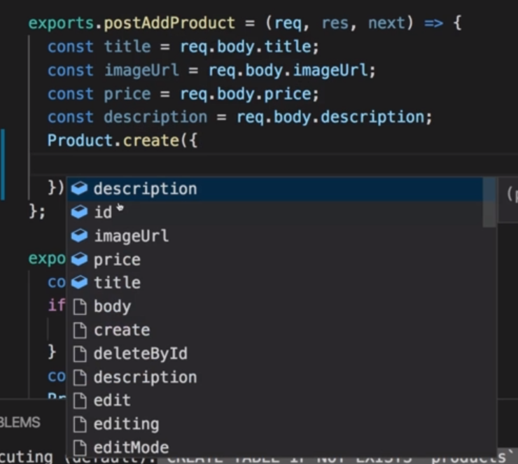
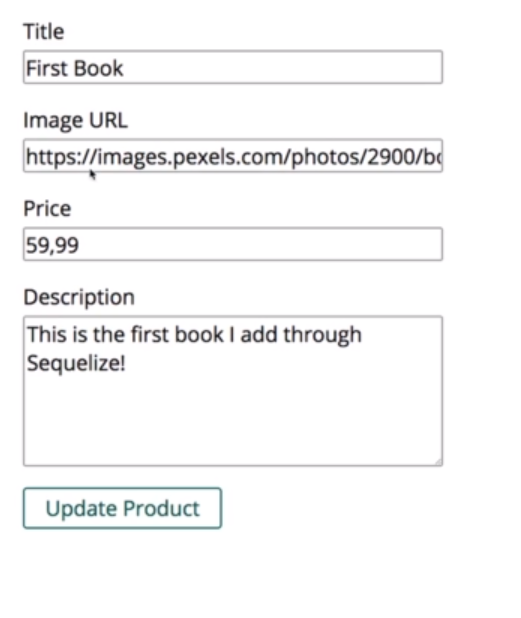

# S11 | Understanding Sequelize
---
Introduction
`file`

We wont be using sql anymore
`file`

- Sql will be used behind the scene
 
# S11 | Understanding Sequelize
---
What is Sequelize ?
`file`

Core Concepts
`file`

# S11 | Connecting to the Database
---
## Installing Sequelize
`file`

- Sqequelize needs the `mysql2` to be installed 
- 

## We will use Sequelize to create models and connect to the database
Drop the existing table using workbench.
`file`
 
- we do this cause we want to use **Sequelize** to manage our tables

## Write some code to connect Sequelize to the database.
Current Code
`database.js`

- Sequelize will do something like this behind the scene
- But we wont write this code anymore. Thats the beauty

Updated code
`database.js`

- `const Sequelize = require('sequelize/index');` - use this import to make code suggestions work. 

Updated code
`database.js`

Updated code
`database.js`

Updated code
`database.js`

- the host by default is the localhost
- This will now connect to the database
- It will set up a **Connection Pool**
- Just as we did manually in the last module.

Export Sequelize which is a Connection Pool 
`database.js`

- But this connection pool is managed by Sequelize 
- Thus providing lot of useful features 
- Connection is now set up.

Lets now work with Models.

# S11 | Defining a Model
---
Model - Product - Current Code 
`models/product.js`

- We can delete everything 
- We will write everything from scratch.

Import 2 things
`models/product.js`

- with capital "S" - `Sequelize` is the main package
- with small "s" - `sequelize` is the connection pool that we export in the database.js file. - Actually it is a fully configured sequelize environment. 
- We need both to define a model that will be managed by Sequelize

Create a new model using sequelize - Product
`models/product.js`

Model names are typically in lowercase
`models/product.js`

Defining the id field of the model
`models/product.js`

Define other fields 
`models/product.js`
 

Export the Product Model
`models/product.js`

Lets see how we can use this model in the next lectures !

## Sequelize - Official Docs 
Check the docs to learn more 
`file`
http://docs.sequelizejs.com/

# S11 | Syncing Js Definitions to the Database
---
## We want to make sure that the models that we define in sequelize have corresponding table whenever the app start. 
If the tables already exist it wont overrite but we can also configure that as we wish.

Current Code
`app.js`

Import sequelize 
`app.js`

`sequelize.sync()` - Syncs the model to database tables
`app.js`

- sequelize.sync is aware of all your models since this the is same object on which you created thoes models  

Write the then and catch blocks for sync
`app.js`

- if sync is successful then only we want to start our server 
- a result is fetched in the then block

npm start and see the log 
`app.js`

- Sql is executed behind the scene which is logged by default
- And returns the result which is the Sequelize object
- We can re-run npm start but it will not overrite the tables since we have the `IF NOT EXISTS` command while creating the tables for the models.

See the Tables that were automatically created in workbench 
`app.js`

- 2 new fields were automatically created for us i.e createdAt, updatedAt.

# S11 | Inserting Data & Creating a Product
---
## Controller - Admin
Current Code
`controllers/admin.js`

`postAddProduct()` - modify this function to use sequelize
`controllers/admin.js`

- Current code uses our custom save function to add a new prodcut to the database.

Now we will use built in functions to add Products
`controllers/admin.js`

- all these functions are coming from sequelize

`Create` vs `Build`
`controllers/admin.js`

- `create` : will create an object and immediately save it to the database
- `build` : will create an javascript object which we have to manually save to the database.  

Creating a product instance through sequelize
`controllers/admin.js`

- Note that we get the suggestion for the fields

Product Fields 
`controllers/admin.js`

- this will immediately save the product in the database

Sequelize works with promises
`controllers/admin.js`

- we can chain then and catch block

## Output
Output - Go to the url `admin/add-product`
`controllers/admin.js`

Add product 
`controllers/admin.js`

Console log
`controllers/admin.js`

Console log
`controllers/admin.js`

Database - Book added
`controllers/admin.js`

# S11 | MUST READ: `findById()` in Sequelize 5
---
One quick note:

With Sequelize v5, **`findById()`** (which we'll use in this course) was replaced by **`findByPk()`**.

You use it in the same way, so you can simply replace all occurrences of findById() with findByPk()

# S11 | Retrieving Data & Finding Products
---
## Controller - Shop
Currently `fetchAll` wont work
`controllers/shop.js`

- Sequelize Model does not have a fetchAll method

`findAll()` - alternate method provided by sequelize model
`controllers/shop.js`

`getIndex()` - using sequelize
`controllers/shop.js`

Output - Shop page
`controllers/shop.js`

`getProducts()` - Redefined
`controllers/shop.js`

- using the same `findAll` method to get the list in the Products page

Output - Products Page
`controllers/shop.js`

# S11 | Getting a Single Product with the "where" Condition
---
## Controller - Shop
`getProduct()` - Current Code
`controllers/shop.js`

Sqquelize also has a findById Method
`controllers/shop.js`

Final code with sequelize findById method
`controllers/shop.js`

- note that it returns a single product unlike before

Output
`controllers/shop.js`

## Css - to restrict image height
Css to restrict image heigth in product details page
`main.css`

## Alternative Way to Filter the Product
We can use the find method to filter single Product
`controllers/shop.js`

Query configuration using sequelize power

Alternative approach
`controllers/shop.js`

- we can have filter config inside findAll
- here we get products array where `id = prodId`
- NOTE an array is returned

Output - same
`controllers/shop.js`

## Lets Code the Above !! 
[x] - Coded ? 

# S11 | Fetching Admin Products
---
## Controller - Admin
getProducts still uses fetchAll 
`controllers/admin.js`

## Lets Code Myself - Make the Admin Page Work with Sequelize 
[YES] - Coded ? 

use the `findAll()` Sequelize mothod
`controllers/admin.js`

Output
`controllers/admin.js`

- But Edit and Delete does not work

# S11 | Updating Products 
---
## Controller - admin
#### Get 
`getEditProduct` - Current Code 
`controllers/admin.js`

`getEditProduct` - Sequelized
`controllers/admin.js`

Output
`controllers/admin.js`

#### Post
`postEditProduct` - Current Code
`controllers/admin.js`

###### Approach-1
`postEditProduct` - Sequelized - using the update function 
`controllers/admin.js`

  - https://sequelize.org/master/class/lib/model.js~Model.html#static-method-update

###### Approach-2

`postEditProduct` - Sequelized - Find the product first
`controllers/admin.js`

- now the product in `then()` needs to be updated

`postEditProduct` - Update the product inside javascript
`controllers/admin.js`

- this will not update the product in the database.

`product.save()` - Save the product in the database
`controllers/admin.js`

- If product exists it will update 
- If it does not exist then it will add a new product

We can chain then with save but this will be ugly nesting again
`controllers/admin.js`

- We can avoid that by returning the promise after executing save
- Handle the promise in the next then block

Handle the promise returned in the then block above
`controllers/admin.js`

- the catch() block will catch the err for both the promises 

Output

See this on reload

- But why do we have to reload the page to see this ? 
- Because we dont redirect inside then.
  - 
    - Thus redirection occurs before our promise (async) is done.
    - So move the redirect into the then block so that redirection occurs after promise returns
      - 
      - But this means we never load a new page whenever there is an error. 
Database

# S11 | Deleting Products
---
## Controllers - Admin
We need to handle deleting products using sequelize
`controllers/admin.js`

postDeleteProduct()
`controllers/admin.js`

###### Approach-1
We can use `destroy()` method to delete the product 
`controllers/admin.js`

Finished code
`controllers/admin.js`

###### Approach-2
We can also use a different approach 
`controllers/admin.js`

- use findById first to find the product 
- then destroy the product

`destroy()` returns a promise
`controllers/admin.js`

- chaining the then() block
- redirect inside then

Output - we can delete products 
`controllers/admin.js`

## Lets Code the Above !! 
[YES] - Coded ? 

# S11 | Creating a User Model
---
User model
`models/user.js`

 
User model - Code
`models/user.js`

 
# S11 | Adding a One-To-Many Relationship
 ---
Associations 
`file`

Import the models before syncing with the database
`app.js`

Relate the models
`app.js`

We can configure association by passing an optional 2nd argument
`app.js`

- here we define how this relationship should be managed
- constraines : true
- ON DELETE CASCADE - so when a user is deleted then all products related to that user will also be deleted.

Optional - we are setting the reverse relation
`app.js`

- but we dont need to do this.

Sequelize will not create tables automatically for our models after setting up as above since we already have one table (the products table) in the database and it will not overrite with the new information. 
But we can force sequelize to drop all tables and create anew.

Force table recreation from models
`app.js`

- we will not do this in production

Output - console
`app.js`

- dropped the existing tables 
- created new tables - users and products

Output - Relations and Contraints also got created
`app.js`

Output - workbench
`app.js`

# S11 | Creating & Managing a Dummy User
---
Remove the fore true option from sync
`app.js`

- we dont want to drop tables all the time.

Create a dummy user
`app.js`

- First check if a user already exist
- Create a dummy user if no user exists 
- `findById()` returns a promise which we handle in the next then block.
- `User.create()` also returns a promise
- Problem is that we are returning two data types from inside the 2nd then block. i.e: Promise or user instance. But we need to return only one form of data.

Return only one data type from the 2nd then
`app.js`

- But this is not required since when you return something from the then block its automatically wrapped inside a promise.

sync - Final Code
`app.js`

- start listening once all is done.
- remember that npm start runs this code 

Output - console
`app.js`

Output - workbench
`app.js`

## Next step
- Register a new middleware because I want to store that user in my request 
- so that I can use that user from anywhere in my app conveniently.

Register a middleware
`app.js`

- remember that only valid request will run this code and is funnelled through this middleware.
- so we are guarenteed to find a user
- since a user would already have been created when The app starts

then()
`app.js`

- I want to store it in a request

Store user in the req object
`app.js`

- `user` retrieved is not only a javascript object with the values stored in the database
- Its a Sequelize object with the values stored in the database.
- And with all the utility methods Sequelize added like destroy. 
- So whenver we call req.user in our app we can also called methods like `req.user.destroy()`

Call next() so that we can continue with the next step if we got our user and stored it. 
Store user in the req object
`app.js`

- next() causes the the req to pass to the next middlewares.
- So the user is setup and rerrieved.
- Lets created products associated with that user

# S11 | Using Magic Association Methods
--- 
## Note
From now on all new products that are created should be associated to the currently logged in user and
for now, this will only be this one dummy user.

User - that we created as dummy 
`app.js`

 
## Controller - Admin
We cannot create products like this anymore
`controllers/admin.js`

- We need to pass associated user information while creating products 

#### Approach-1
We can do this by adding the `userid`
`controllers/admin.js`

- Remember `req.user` holds both database data for that user as well as the helper methods.

Output - dummy values 
`controllers/admin.js`

Output - Workbench
`controllers/admin.js`

- we have the userId stored

But we have a tiny problem which we could improve. We manually set the userId. 
`controllers/admin.js`

- There is a more elegant way than this.

Use a feature from Sequelize
`createProduct()` - this is a method created by sequelize for us
`controllers/admin.js`

- Sequelize addes special methods depending on the association we create.
- This method helps us to create associated object

Read through the docs  
`controllers/admin.js`

Remember that we created as association ? 
`controllers/admin.js`

Pass the product field data 
`controllers/admin.js`

- rest chaining remains same
- this now automatically creates a connected model

Output - Create a product
`controllers/admin.js`

 
The product has been created with the logged in userid using the createProduct() method provided magically by sequelize 
`controllers/admin.js`

- we did not set userid in the 2nd product explicitly

# S11 | Fetching Related Products
--- 
## Controller - Admin 
#### getEditProduct
Current code for getting the edit page of a single product
sequelize 
`controllers/admin.js`

We want to find products for the currently logged in user
`controllers/admin.js`

- `req.user.getProducts()` is again provided by Sequelize - which will filter the products by the user
- then you can chain you then() call 

Output - UI 
`controllers/admin.js`

We see an empty form
`controllers/admin.js`

- this is because 

Output - console
`controllers/admin.js`

- user.id = 1 was added by sequelize because we used getproducts() on the user
- And it returns a list although there is only one matching product

So we have to use 0 as the index to get the single product object
`controllers/admin.js`

 
Output - Now it works 
`controllers/admin.js`

#### postEditProduct
Current Code
`controllers/admin.js`

- if we have reacched this point we can assume we have a product for this user only
- its fine to find and update a product like this   

#### getProducts
Current Code 
`controllers/admin.js`

- But we should find products for this user instead of finding all products  

Get products for this user - `req.user.getProducts()`
`controllers/admin.js`

Output - console - sql  
`controllers/admin.js`

## postDeleteProduct
No Change Needed - since we reach here with userid already filtered
`controllers/admin.js`

# S11 | One-To-Many & Many-To-Many Relations
---

