# S11 | Understanding Sequelize
---
Introduction
`file`
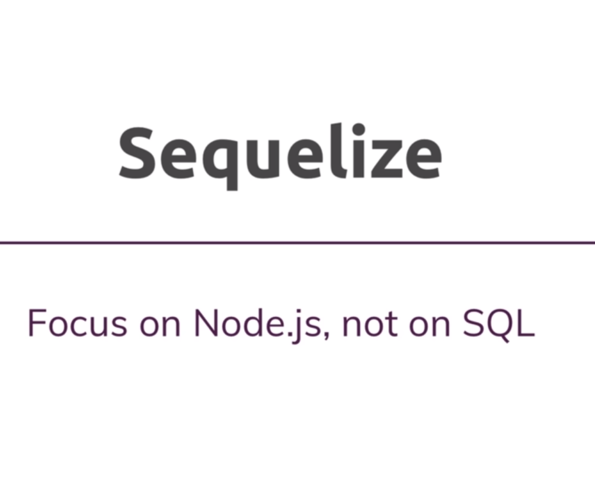

We wont be using sql anymore
`file`
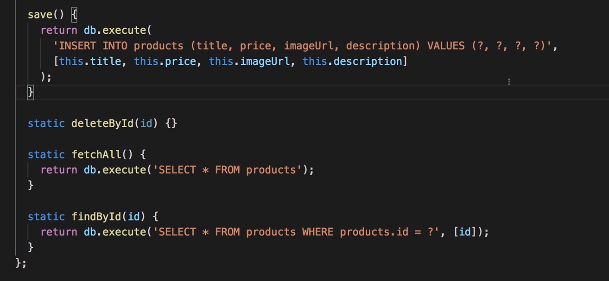
- Sql will be used behind the scene
 
# S11 | Understanding Sequelize
---
What is Sequelize ?
`file`

Core Concepts
`file`
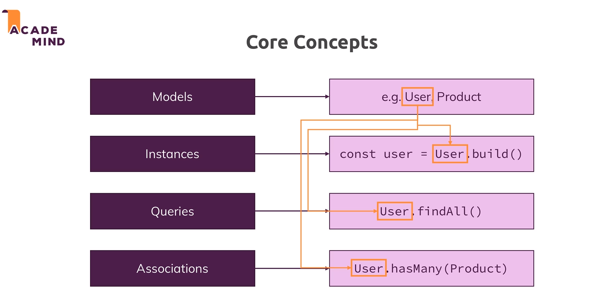

# S11 | Connecting to the Database
---
## Installing Sequelize
`file`
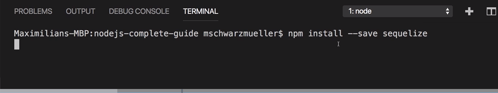
- Sqequelize needs the `mysql2` to be installed 
- 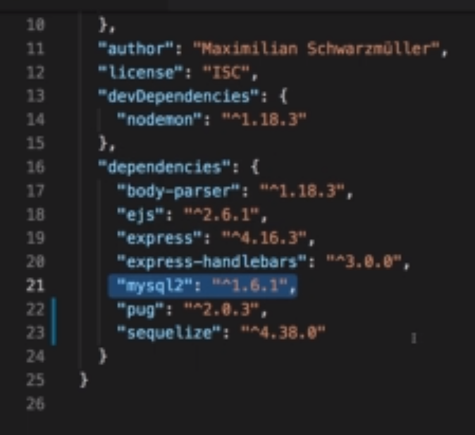

## We will use Sequelize to create models and connect to the database
Drop the existing table using workbench.
`file`
 
- we do this cause we want to use **Sequelize** to manage our tables

## Write some code to connect Sequelize to the database.
Current Code
`database.js`

- Sequelize will do something like this behind the scene
- But we wont write this code anymore. Thats the beauty

Updated code
`database.js`
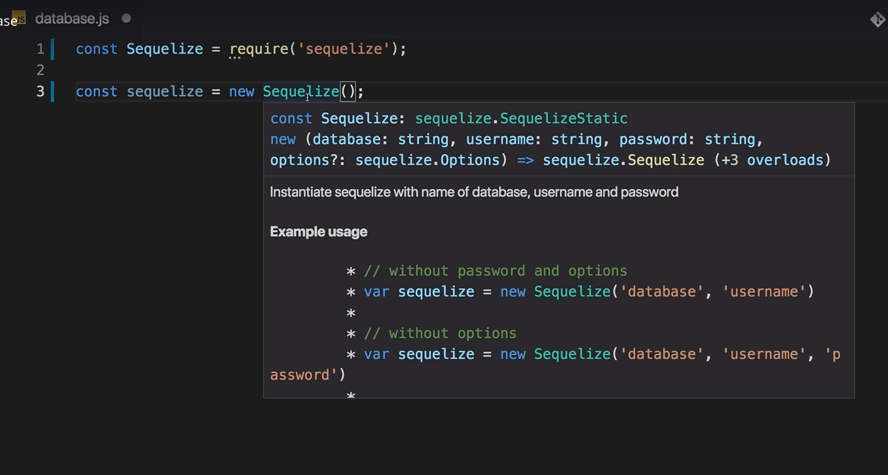
- `const Sequelize = require('sequelize/index');` - use this import to make code suggestions work. 

Updated code
`database.js`

Updated code
`database.js`

Updated code
`database.js`
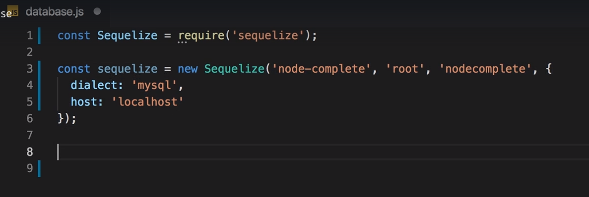
- the host by default is the localhost
- This will now connect to the database
- It will set up a **Connection Pool**
- Just as we did manually in the last module.

Export Sequelize which is a Connection Pool 
`database.js`
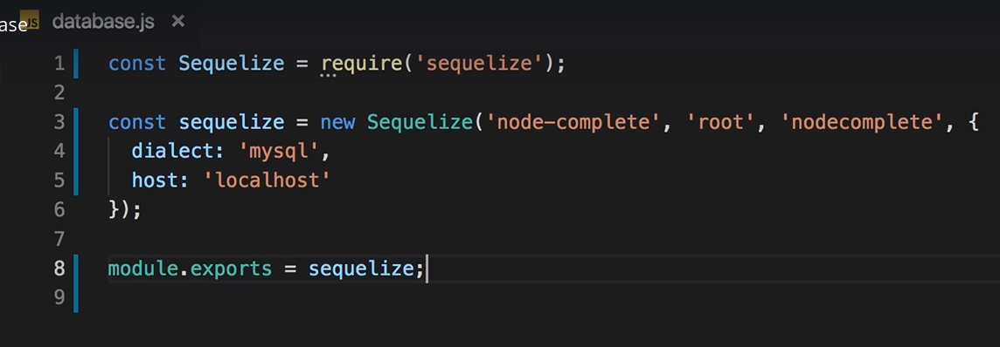
- But this connection pool is managed by Sequelize 
- Thus providing lot of useful features 
- Connection is now set up.

Lets now work with Models.

# S11 | Defining a Model
---
Model - Product - Current Code 
`models/product.js`

- We can delete everything 
- We will write everything from scratch.

Import 2 things
`models/product.js`

- with capital "S" - `Sequelize` is the main package
- with small "s" - `sequelize` is the connection pool that we export in the database.js file. - Actually it is a fully configured sequelize environment. 
- We need both to define a model that will be managed by Sequelize

Create a new model using sequelize - Product
`models/product.js`

Model names are typically in lowercase
`models/product.js`

Defining the id field of the model
`models/product.js`
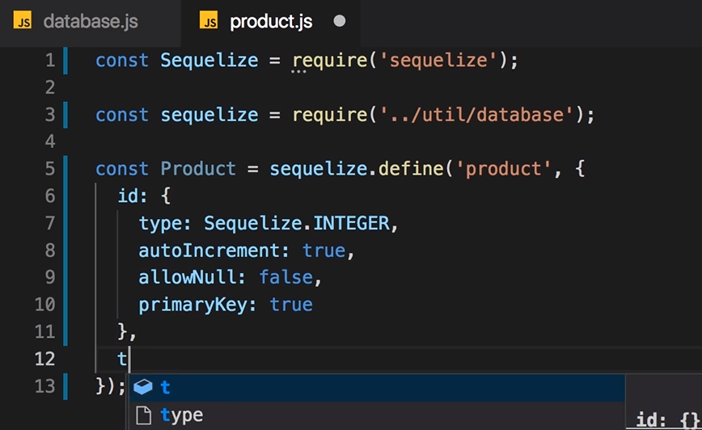

Define other fields 
`models/product.js`
 

Export the Product Model
`models/product.js`

Lets see how we can use this model in the next lectures !

## Sequelize - Official Docs 
Check the docs to learn more 
`file`
http://docs.sequelizejs.com/
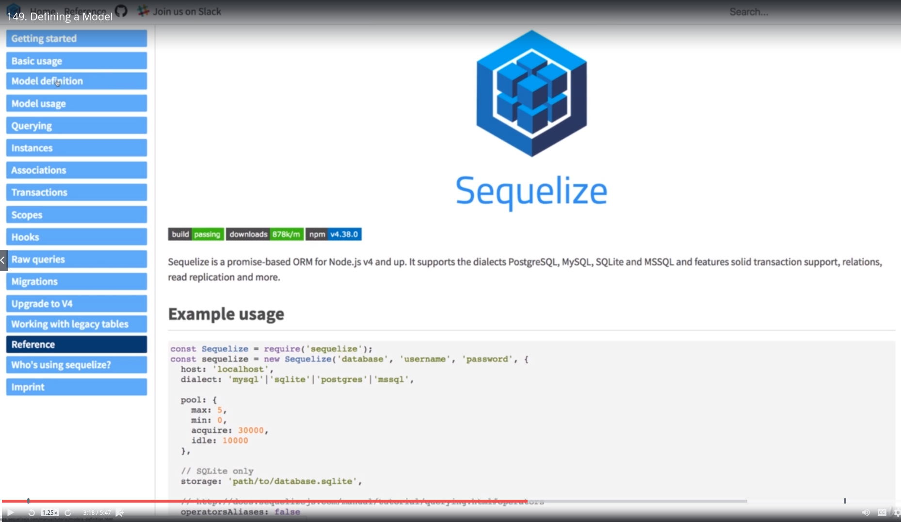

# S11 | Syncing Js Definitions to the Database
---
## We want to make sure that the models that we define in sequelize have corresponding table whenever the app start. 
If the tables already exist it wont overrite but we can also configure that as we wish.

Current Code
`app.js`

Import sequelize 
`app.js`
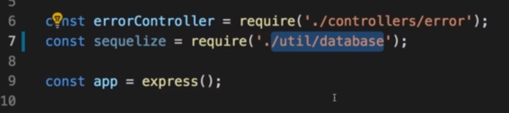

`sequelize.sync()` - Syncs the model to database tables
`app.js`
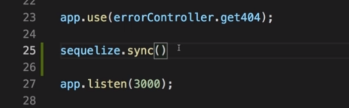
- sequelize.sync is aware of all your models since this the is same object on which you created thoes models  

Write the then and catch blocks for sync
`app.js`
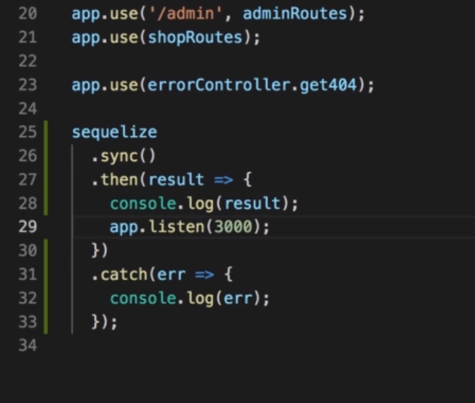
- if sync is successful then only we want to start our server 
- a result is fetched in the then block

npm start and see the log 
`app.js`
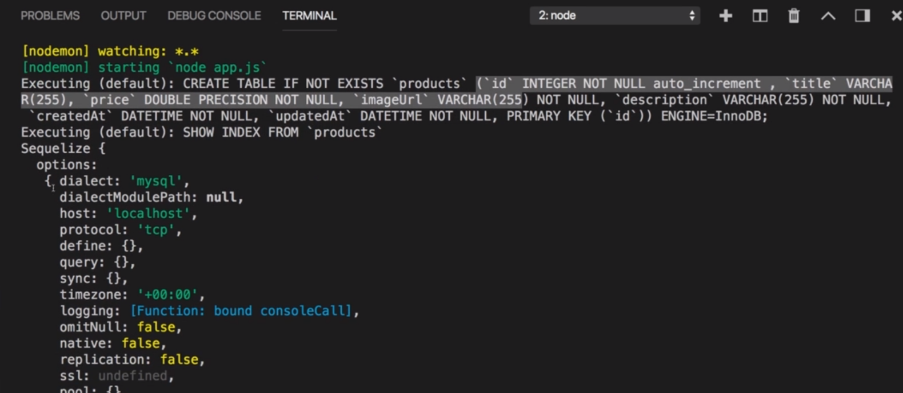
- Sql is executed behind the scene which is logged by default
- And returns the result which is the Sequelize object
- We can re-run npm start but it will not overrite the tables since we have the `IF NOT EXISTS` command while creating the tables for the models.

See the Tables that were automatically created in workbench 
`app.js`
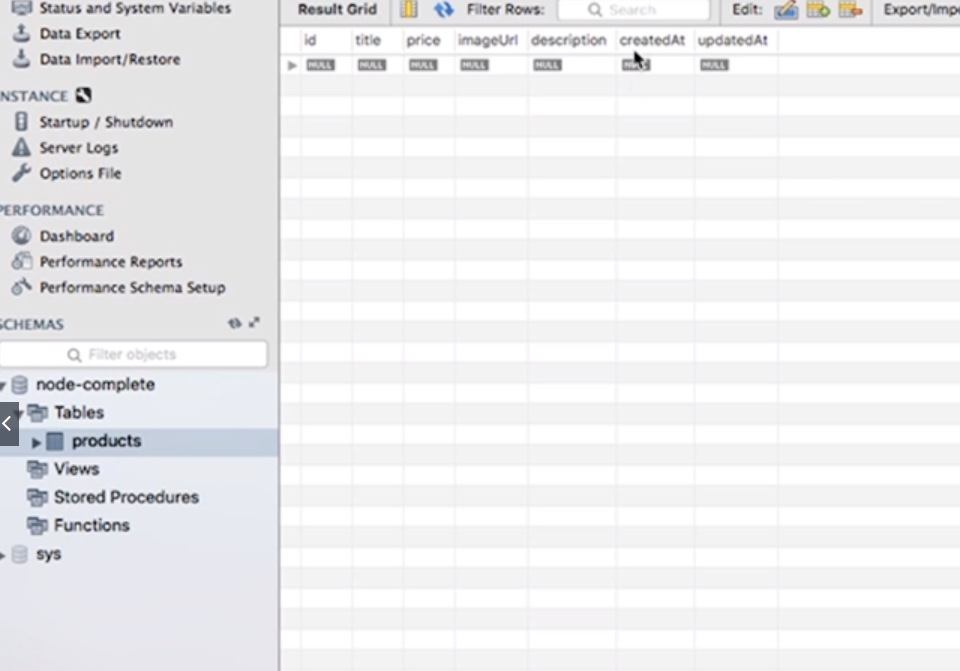
- 2 new fields were automatically created for us i.e createdAt, updatedAt.

# S11 | Inserting Data & Creating a Product
---
## Controller - Admin
Current Code
`controllers/admin.js`

`postAddProduct()` - modify this function to use sequelize
`controllers/admin.js`

- Current code uses our custom save function to add a new prodcut to the database.

Now we will use built in functions to add Products
`controllers/admin.js`
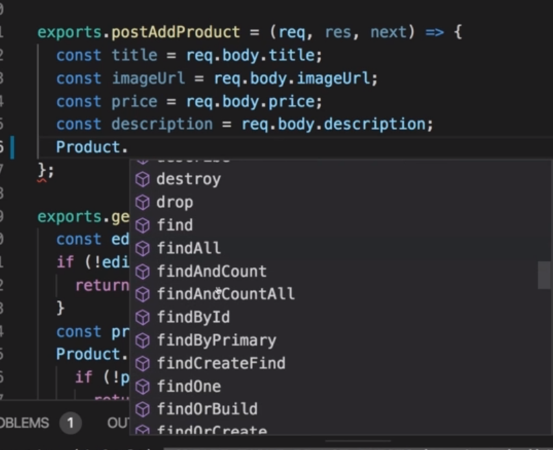
- all these functions are coming from sequelize

`Create` vs `Build`
`controllers/admin.js`

- `create` : will create an object and immediately save it to the database
- `build` : will create an javascript object which we have to manually save to the database.  

Creating a product instance through sequelize
`controllers/admin.js`

- Note that we get the suggestion for the fields

Product Fields 
`controllers/admin.js`
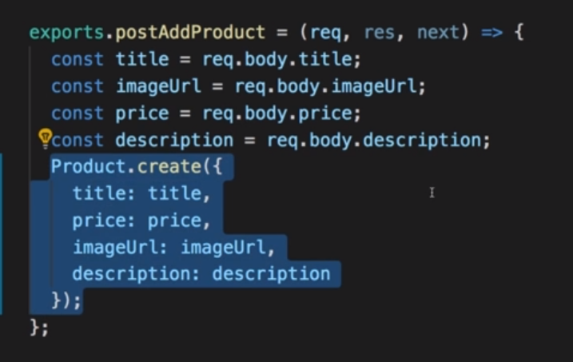
- this will immediately save the product in the database

Sequelize works with promises
`controllers/admin.js`
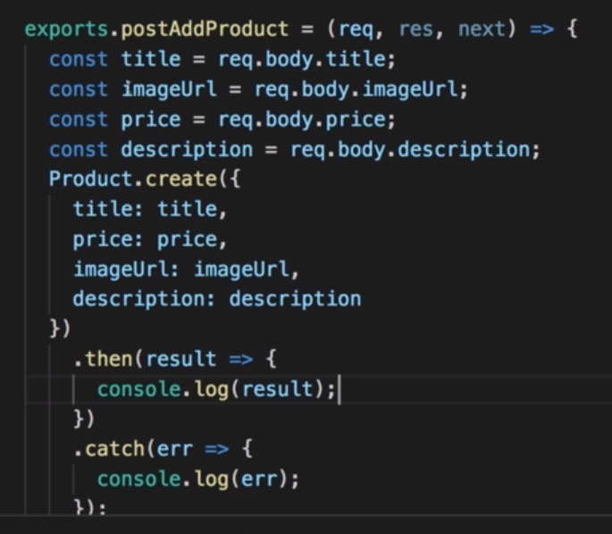
- we can chain then and catch block

## Output
Output - Go to the url `admin/add-product`
`controllers/admin.js`
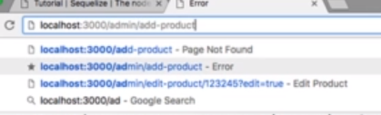

Add product 
`controllers/admin.js`
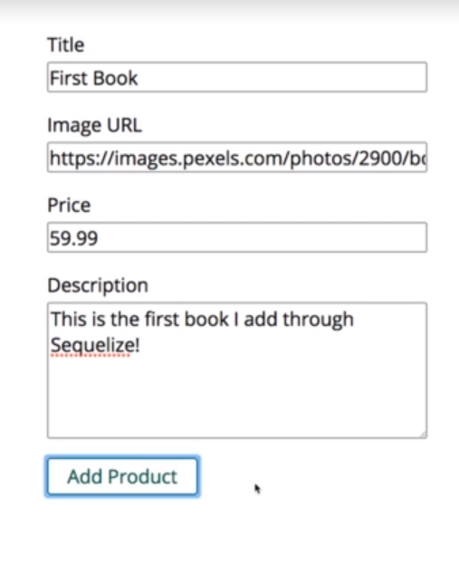

Console log
`controllers/admin.js`
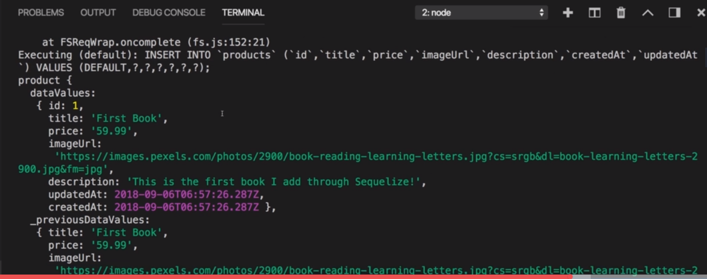

Console log
`controllers/admin.js`
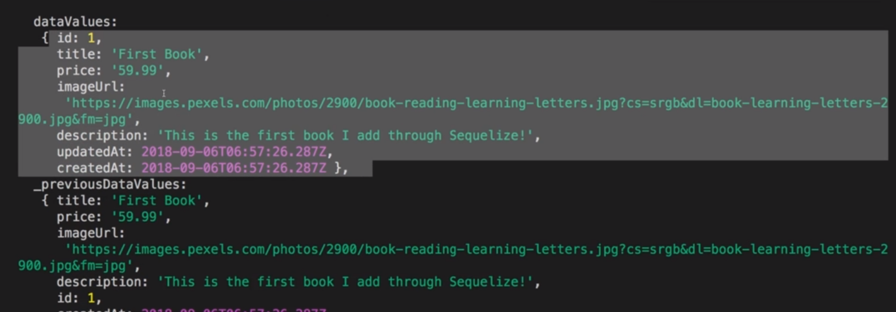

Database - Book added
`controllers/admin.js`
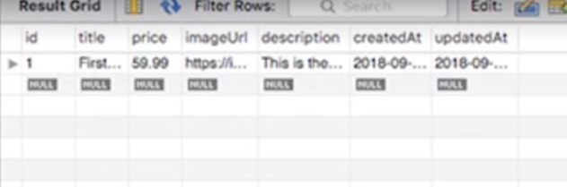

# S11 | MUST READ: `findById()` in Sequelize 5
---
One quick note:

With Sequelize v5, **`findById()`** (which we'll use in this course) was replaced by **`findByPk()`**.

You use it in the same way, so you can simply replace all occurrences of findById() with findByPk()

# S11 | Retrieving Data & Finding Products
---
## Controller - Shop
Currently `fetchAll` wont work
`controllers/shop.js`
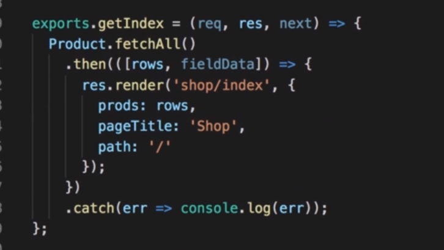
- Sequelize Model does not have a fetchAll method

`findAll()` - alternate method provided by sequelize model
`controllers/shop.js`

`getIndex()` - using sequelize
`controllers/shop.js`
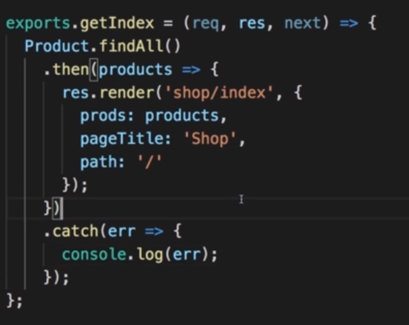

Output - Shop page
`controllers/shop.js`

`getProducts()` - Redefined
`controllers/shop.js`

- using the same `findAll` method to get the list in the Products page

Output - Products Page
`controllers/shop.js`
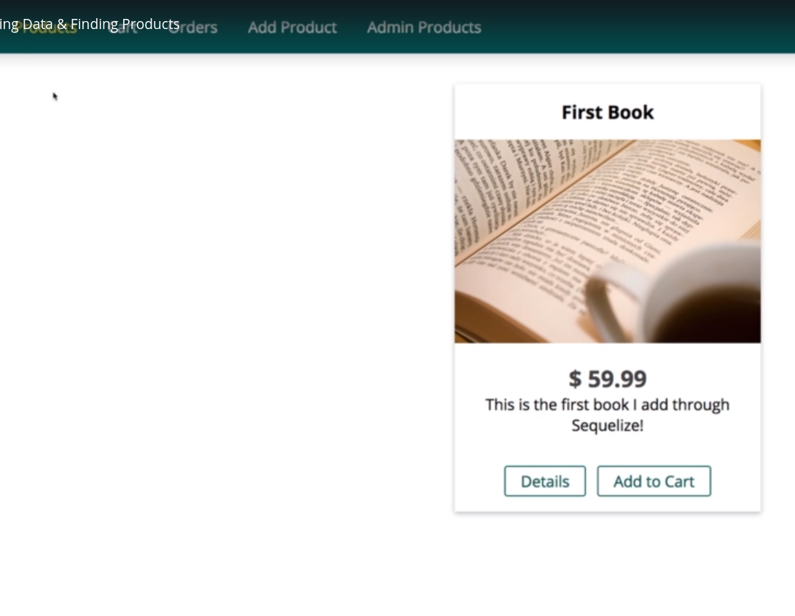

# S11 | Getting a Single Product with the "where" Condition
---
## Controller - Shop
`getProduct()` - Current Code
`controllers/shop.js`
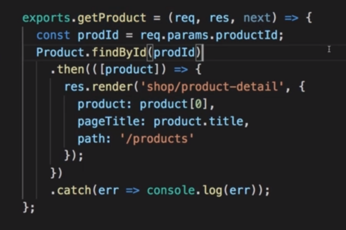

Sqquelize also has a findById Method
`controllers/shop.js`

Final code with sequelize findById method
`controllers/shop.js`
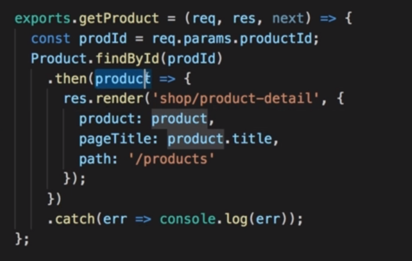
- note that it returns a single product unlike before

Output
`controllers/shop.js`
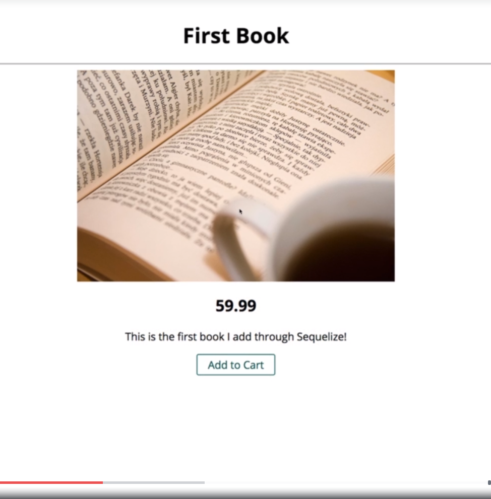

## Css - to restrict image height
Css to restrict image heigth in product details page
`main.css`

## Alternative Way to Filter the Product
We can use the find method to filter single Product
`controllers/shop.js`
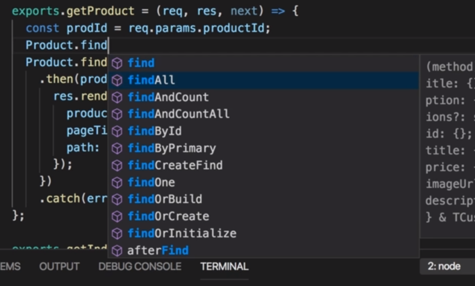

Query configuration using sequelize power

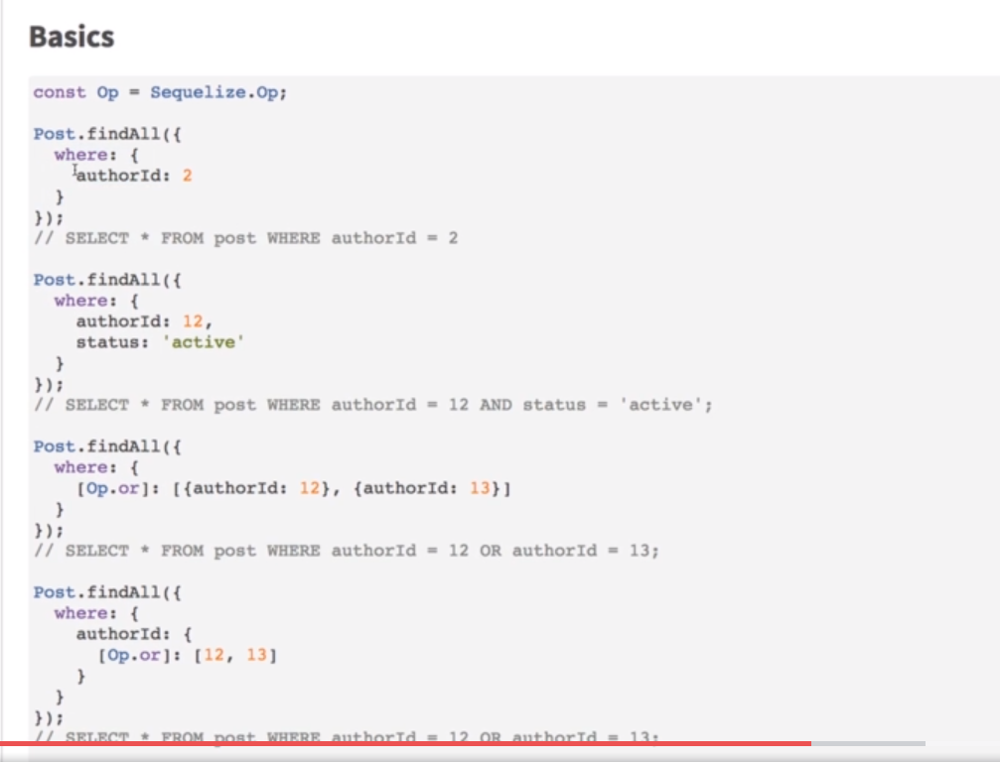

Alternative approach
`controllers/shop.js`

- we can have filter config inside findAll
- here we get products array where `id = prodId`
- NOTE an array is returned

Output - same
`controllers/shop.js`

## Lets Code the Above !! 
[x] - Coded ? 

# S11 | Fetching Admin Products
---
## Controller - Admin
getProducts still uses fetchAll 
`controllers/admin.js`

## Lets Code Myself - Make the Admin Page Work with Sequelize 
[YES] - Coded ? 

use the `findAll()` Sequelize mothod
`controllers/admin.js`
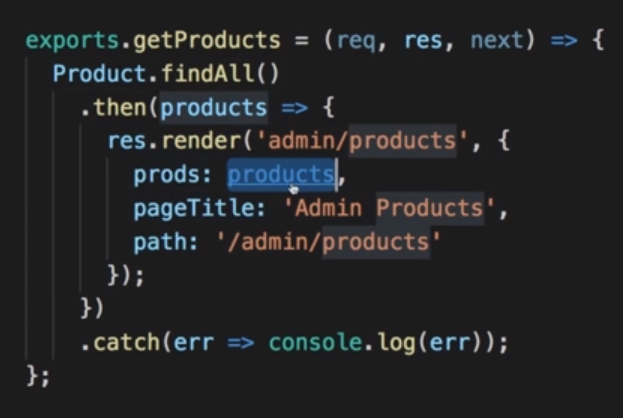

Output
`controllers/admin.js`

- But Edit and Delete does not work

# S11 | Updating Products 
---
## Controller - admin
#### Get 
`getEditProduct` - Current Code 
`controllers/admin.js`
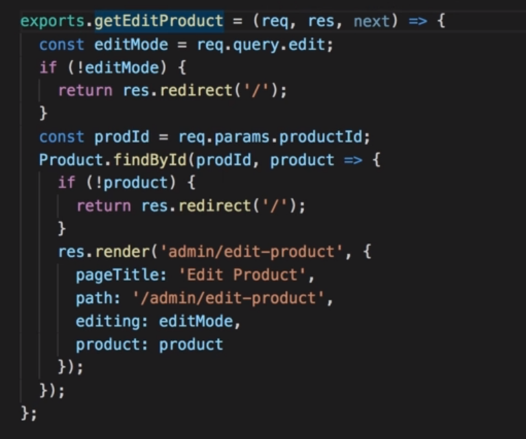

`getEditProduct` - Sequelized
`controllers/admin.js`

Output
`controllers/admin.js`
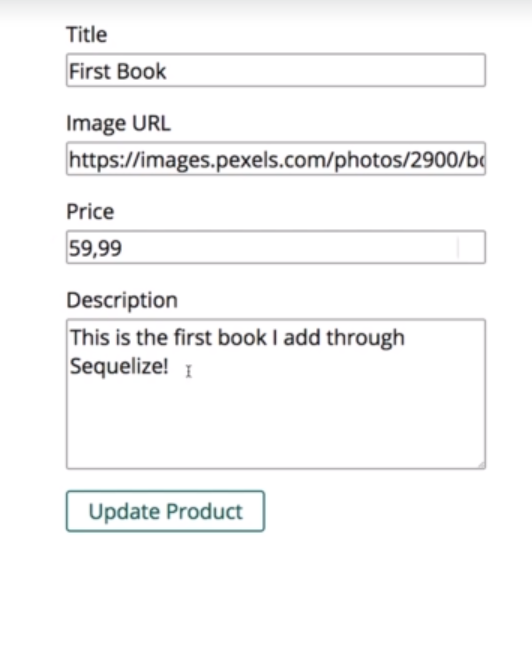

#### Post
`postEditProduct` - Current Code
`controllers/admin.js`
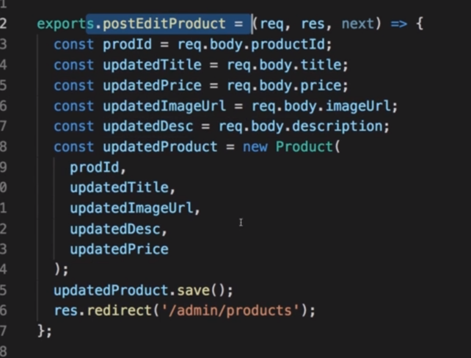

###### Approach-1
`postEditProduct` - Sequelized - using the update function 
`controllers/admin.js`

  - https://sequelize.org/master/class/lib/model.js~Model.html#static-method-update

###### Approach-2

`postEditProduct` - Sequelized - Find the product first
`controllers/admin.js`

- now the product in `then()` needs to be updated

`postEditProduct` - Update the product inside javascript
`controllers/admin.js`

- this will not update the product in the database.

`product.save()` - Save the product in the database
`controllers/admin.js`

- If product exists it will update 
- If it does not exist then it will add a new product

We can chain then with save but this will be ugly nesting again
`controllers/admin.js`
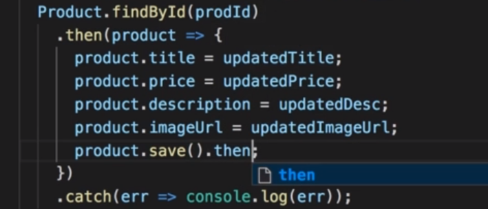
- We can avoid that by returning the promise after executing save
- Handle the promise in the next then block

Handle the promise returned in the then block above
`controllers/admin.js`
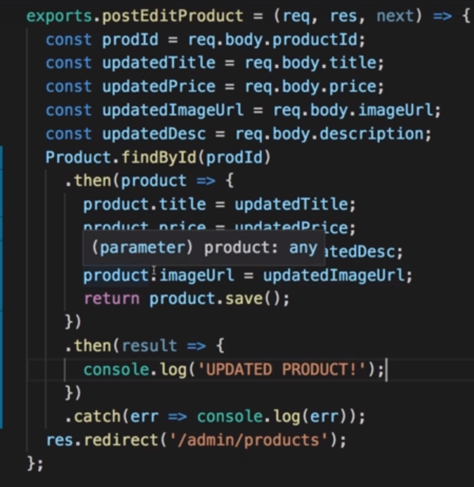
- the catch() block will catch the err for both the promises 

Output

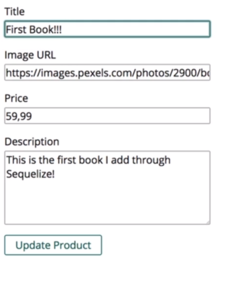

See this on reload

- But why do we have to reload the page to see this ? 
- Because we dont redirect inside then.
  - 
    - Thus redirection occurs before our promise (async) is done.
    - So move the redirect into the then block so that redirection occurs after promise returns
      - 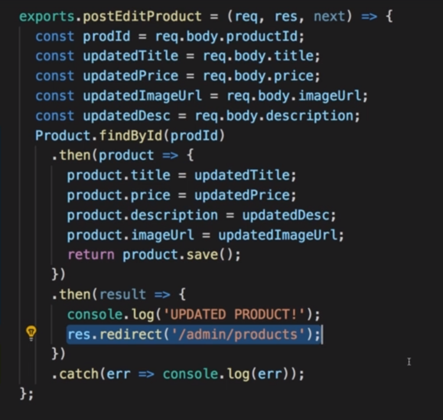
      - But this means we never load a new page whenever there is an error. 
Database

# S11 | Deleting Products
---
## Controllers - Admin
We need to handle deleting products using sequelize
`controllers/admin.js`
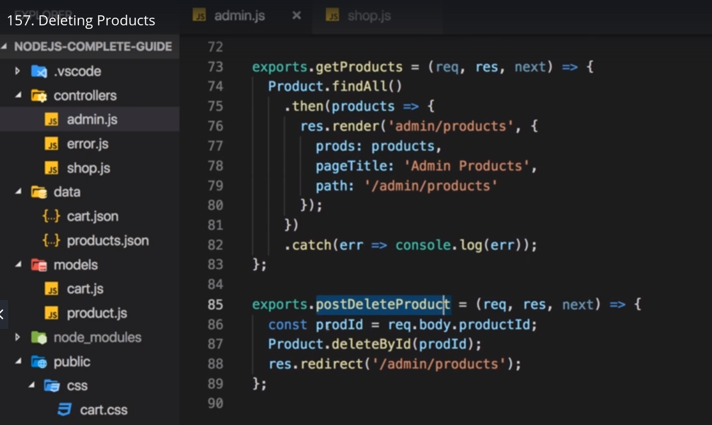

postDeleteProduct()
`controllers/admin.js`
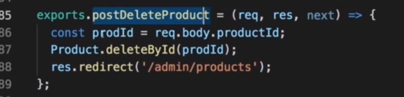

###### Approach-1
We can use `destroy()` method to delete the product 
`controllers/admin.js`
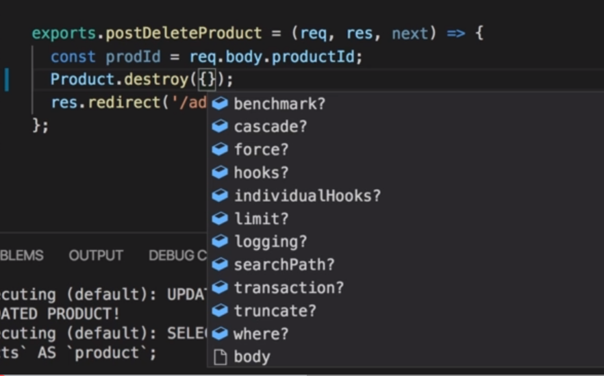

Finished code
`controllers/admin.js`
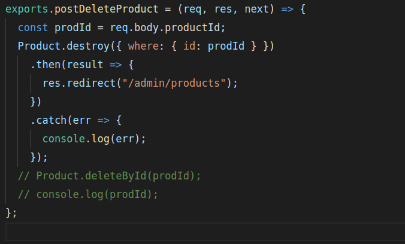

###### Approach-2
We can also use a different approach 
`controllers/admin.js`

- use findById first to find the product 
- then destroy the product

`destroy()` returns a promise
`controllers/admin.js`
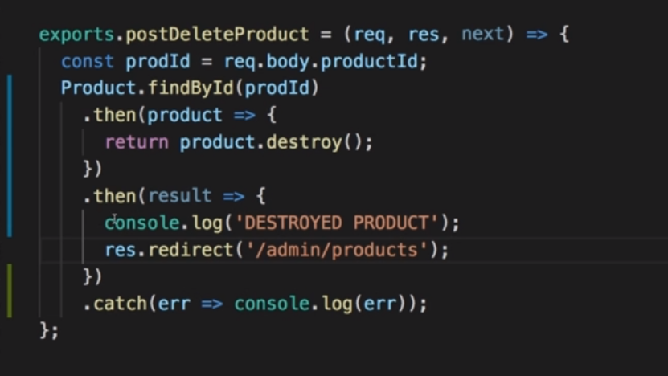
- chaining the then() block
- redirect inside then

Output - we can delete products 
`controllers/admin.js`

## Lets Code the Above !! 
[YES] - Coded ? 

# S11 | Creating a User Model
---
User model
`models/user.js`

 
User model - Code
`models/user.js`

 
# S11 | Adding a One-To-Many Relationship
 ---
## Some Definations 
#### BelongsTo
BelongsTo associations are associations where the foreign key for the one-to-one relation exists on the source model.

#### HasOne
HasOne associations are associations where the foreign key for the one-to-one relation exists on the target model.

#### One-To-Many associations (hasMany)
One-To-Many associations are connecting one source with multiple targets. The targets however are again connected to exactly one specific source.

#### Belongs-To-Many associations
Belongs-To-Many associations are used to connect sources with multiple targets. Furthermore the targets can also have connections to multiple sources.

## Coding Through
Associations 
`file`

Import the models before syncing with the database
`app.js`
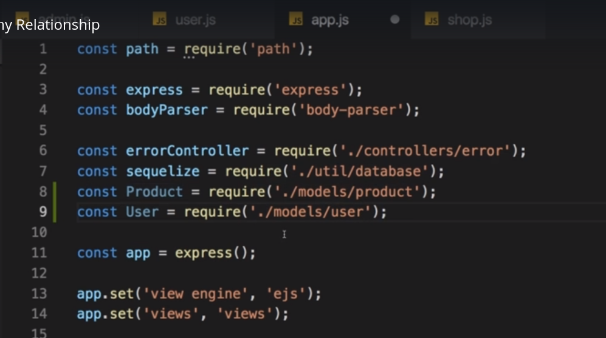

Relate the models
`app.js`

We can configure association by passing an optional 2nd argument
`app.js`

- here we define how this relationship should be managed
- `constraints : true`
- ON DELETE CASCADE - so when a user is deleted then all products related to that user will also be deleted.

Read more on `constraints : true`
- https://sequelize.org/master/manual/associations.html#cyclic-dependencies--amp--disabling-constraints
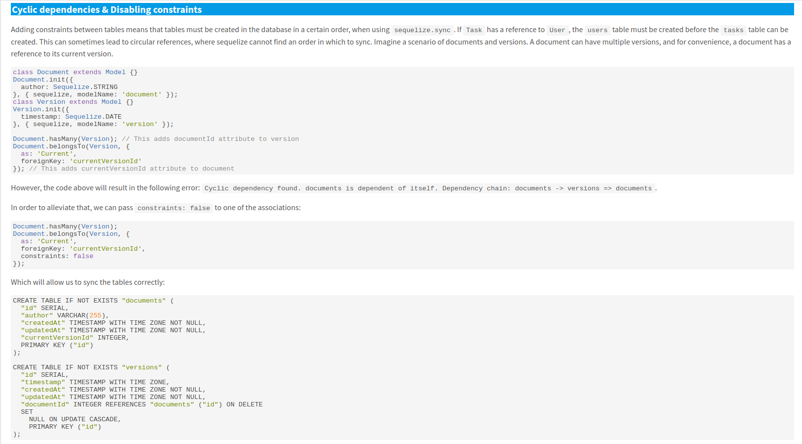

Optional - we are setting the reverse relation
`app.js`

- but we dont need to do this.

Sequelize will not create tables automatically for our models after setting up as above since we already have one table (the products table) in the database and it will not overrite with the new information. 
But we can force sequelize to drop all tables and create anew.

Force table recreation from models
`app.js`
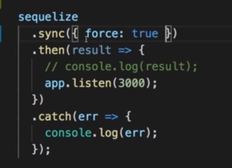
- we will not do this in production

Output - console
`app.js`
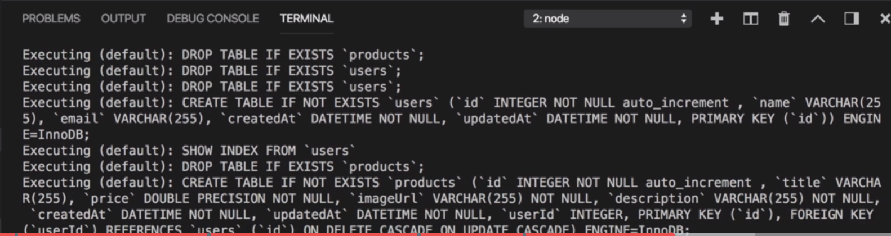
- dropped the existing tables 
- created new tables - users and products

Output - Relations and Contraints also got created
`app.js`
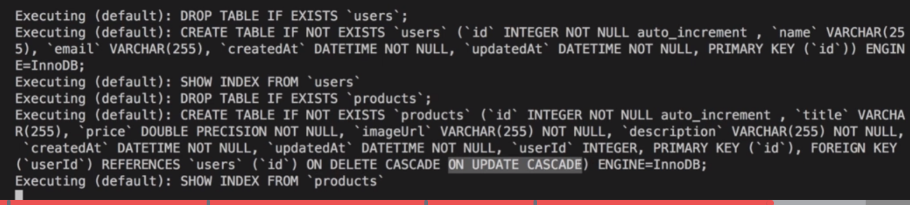

Output - workbench
`app.js`
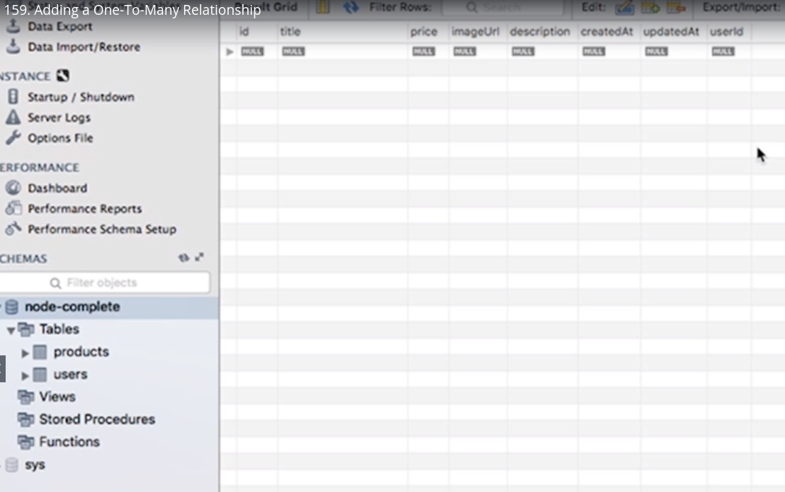

# S11 | Creating & Managing a Dummy User
---
Remove the fore true option from sync
`app.js`

- we dont want to drop tables all the time.

Create a dummy user
`app.js`

- First check if a user already exist
- Create a dummy user if no user exists 
- `findById()` returns a promise which we handle in the next then block.
- `User.create()` also returns a promise
- Problem is that we are returning two data types from inside the 2nd then block. i.e: Promise or user instance. But we need to return only one form of data.

Return only one data type from the 2nd then
`app.js`

- But this is not required since when you return something from the then block its automatically wrapped inside a promise.

sync - Final Code
`app.js`

- start listening once all is done.
- remember that npm start runs this code 

Output - console
`app.js`

Output - workbench
`app.js`

## Next step
- Register a new middleware because I want to store that user in my request 
- so that I can use that user from anywhere in my app conveniently.

Register a middleware
`app.js`

- remember that only valid request will run this code and is funnelled through this middleware.
- so we are guarenteed to find a user
- since a user would already have been created when The app starts

then()
`app.js`

- I want to store it in a request

Store user in the req object
`app.js`

- `user` retrieved is not only a javascript object with the values stored in the database
- Its a Sequelize object with the values stored in the database.
- And with all the utility methods Sequelize added like destroy. 
- So whenver we call req.user in our app we can also called methods like `req.user.destroy()`

Call next() so that we can continue with the next step if we got our user and stored it. 
Store user in the req object
`app.js`

- `next()` causes the the req to pass to the next middlewares.
- So the user is setup and retrieved.
- Lets create products associated with that user

# S11 | Using Magic Association Methods
--- 
## Note
From now on all new products that are created should be associated to the currently logged in user and
for now, this will only be this one dummy user.

User - that we created as dummy 
`app.js`

 
## Controller - Admin
We cannot create products like this anymore
`controllers/admin.js`

- We need to pass associated user information while creating products 

#### Approach-1
We can do this by adding the `userid`
`controllers/admin.js`

- Remember `req.user` holds both database data for that user as well as the helper methods.

Output - dummy values 
`controllers/admin.js`


Output - Workbench
`controllers/admin.js`

- we have the userId stored

But we have a tiny problem which we could improve. We manually set the userId. 
`controllers/admin.js`

- There is a more elegant way than this.

Use a feature from Sequelize
`createProduct()` - this is a method created by sequelize for us
`controllers/admin.js`

- Sequelize addes special methods depending on the association we create.
- This method helps us to create associated object

Read through the docs  
`controllers/admin.js`

Remember that we created as association ? 
`controllers/admin.js`

Pass the product field data 
`controllers/admin.js`

- rest chaining remains same
- this now automatically creates a connected model

Output - Create a product
`controllers/admin.js`

 
The product has been created with the logged in userid using the createProduct() method provided magically by sequelize 
`controllers/admin.js`

- we did not set userid in the 2nd product explicitly

# S11 | Fetching Related Products
--- 
## Controller - Admin 
#### getEditProduct
Current code for getting the edit page of a single product
sequelize 
`controllers/admin.js`

We want to find products for the currently logged in user
`controllers/admin.js`

- `req.user.getProducts()` is again provided by Sequelize - which will filter the products by the user
- then you can chain your then() call 

Output - UI 
`controllers/admin.js`


We see an empty form
`controllers/admin.js`

- this is because 

Output - console
`controllers/admin.js`

- user.id = 1 was added by sequelize because we used getproducts() on the user
- And it returns a **list** although there is only one matching product

So we have to use 0 as the index to get the single product object
`controllers/admin.js`

 
Output - Now it works 
`controllers/admin.js`


#### postEditProduct
Current Code
`controllers/admin.js`

- if we have reacched this point we can assume we have a product for this user only
- its fine to find and update a product like this   

#### getProducts
Current Code 
`controllers/admin.js`

- But we should find products for this user instead of finding all products  

Get products for this user - `req.user.getProducts()`
`controllers/admin.js`


Output - console - sql  
`controllers/admin.js`


## postDeleteProduct
No Change Needed - since we reach here with userid already filtered
`controllers/admin.js`

# S11 | One-To-Many & Many-To-Many Relations
---
## Working on the Cart Model
#### Model - Cart 
Delete existing Cart Code
`models/cart.js`


Define the Cart model from scratch
`models/cart.js`

- import Sequelize 
- define the model using `define()`
- Cart may hold multiple products. Also a product might belong to multiple carts 
- A Cart in turn belongs to a User 

#### Model - CartItem
We need a new model `CartItem`
`models/cart-item.js`

- We dont need to add the id of the cart 
- We will just create an association as before and 
- Sequelize will manage this.
- This model will hold cartId, productId and the quantity.

#### Create Associations
Import Cart and CartItem models in app.js
`app.js`


Define the relations/associations
Define the User-Cart (one-one) relation
`app.js`

- this will add a userId to the cart table

Define the Cart-Product (many - many) relation
`app.js`

- This can only be achieved through an intermediate table that connects them.
- Which will be a combination of productIds and cartIds
- That would be the CartItem model  

Add the intermediate model through which Cart - Product is connected
`app.js`

- The 2nd argument `CartItem` is the connector model  

Set force : true to recreate all tables
`app.js`


**Error**
Incorrect column specifier
`app.js`

- We got some errors in one of our models. The id in CartItem and Cart models should be Interger not String.
   
  - Do the same for Cart model

Now we see all tables
`app.js`


cartItem table
`app.js`

- see that we have both the cart ID and the product ID

# S11 | Creating & Fetching a Cart
--- 
## Controller - Shop
getCart will not work anymore
`controllers/shop.js`

- we need to modify this
- comment out all the code
- we want to get the cart of the logged in user and get the products in it

Let see the console for this
`controllers/shop.js`


 - Its undefined
 - So we cannot access the cart like this

Lets user `getCart()`
`controllers/shop.js`


- now we get null not undefined
- thats because we got no cart yet 
- In the Database carts is totally empty
  

## Create a cart for that User - App.js
Create the cart for the logged in user once the user is retrieved
`app.js`


See the console after this change 
`app.js`


Now we got a cart associated with userid = 1
`app.js`


## Controller - Shop
We see log the Cart which got created in app.js
`controllers/shop.js`


Lets log req.user.cart again ! 
`controllers/shop.js`


- this does not work. we cannot call cart as a property of user

We can get the products that are inside the cart  - `cart.getProducts()`
`controllers/shop.js`

- cart.getProducts was added magically by sequelize
- since we created the association through cartItem before-

Now we can render these products
`controllers/shop.js`


This will not work as expected - since we have no products 
`controllers/shop.js`

- But lets look at the query that executed   
  

# S11 | Adding New Products to the Cart
---
We need to work on the PostCart method - Current code
`controllers/shop.js`
 
- this adds new product to the cart 

get the cart of the user 
`controllers/shop.js`

- Now we have the cart available

Find out if the product we want to add to the cart already exists in the cart
`controllers/shop.js`

- if the product is already there then just increase quantity - Will be done later 
- If the product does not exist then add the Product as new product 

Add the Product as new product 
`controllers/shop.js`

- note the nested then block where we find the product info from the product table using Prodcut.findById

Define a fetchedCart variable at the top 
`controllers/shop.js`

- to make it available in the following then blocks i.e all throughout the function

Add product to the fetchedCart
`controllers/shop.js`

- the addProduct is a magic method given by sequelize

Recall the `CartItem` model
`models/cart-item.js`

- we need to add the quantity while creating a product inside a cart
  
Add the quantity field 
`controllers/shop.js`

- the quantity field in the intermediate table is assigned

Output
`controllers/shop.js`

- The page gets stuck cause we are not redirecting 
- but data got inserted 

Output - workbench
`controllers/shop.js`


Redirect
`controllers/shop.js`


Error - This was expected
`controllers/shop.js`

- This is happening because we try to access the nested productData 

Lets make sure we can see the cart items on the page again

# S11 | Adding Existing Products & Retrieving Cart Items
--- 
## Show the Products in the Cart 
#### View - Cart.ejs
We get and Error - When we try to show the products in the cart

This is happening because we try to access the nested productData 
`view/cart.ejs`


Directly access the products
`view/cart.ejs`
 
- Note that the qty is not a field in the product model

Access the qty property through the `cartitem` object (the intermediate table) which is stored for each `product`.
`view/cart.ejs`


Output - Cart
`view/cart.ejs`


## Handle the case of adding an existing product into the cart

Add an existing Item to the Cart


#### Controller
If block for exisitng product
`controllers/shop.js`

- `through` : to define the quantity property which is in the Intermediate cartItem table 

If block for exisitng product
`controllers/shop.js`

- find the oldQuantity - `cartItem` object inside a `product` object is provided by sequelize to access the intermediate table information i.e `quantity`.
- add the product to the fetched cart with the incremented quantity. This would modify the exisiting cart product.

We want to add a shared then block which handles the action of adding product to the cart instead of two separate then blocks.
`controllers/shop.js`

- the data needs to hold 2 information : 
  - the product that needs to be added
  - and the quantity - cause the quantity is calculated differently depending on the existance of the product in the cart

Make the NewQuantity variable a top level variable 
`controllers/shop.js`

- so that it is available in all the then blocks
- for accurate calculation of the product quantity 
  
Now the 2nd last then block which adds the product should work 
`controllers/shop.js`

- data - changed to product
- see the newQuantity is now dynamic 

Output - Add Cart - An exisiting product
`controllers/shop.js`


Output - Cart
`controllers/shop.js`


Output - 2nd Product
`controllers/shop.js`


Output - Cart
`controllers/shop.js`


## Fix the Total Price shown in the cart
`controller/shop.js`

- using reduce to sum up totalPrice

`views/shop/cart.ejs`


Output


# S11 | Deleting Related Items & Deleting Cart Products
--- 
## Controller - Shop
postCartDeleteProduct - Current Code
`controllers/shop.js`


Get the user cart
`controllers/shop.js`


Find the product in that cart 
`controllers/shop.js`


Delete the product from the intermediate table cart-item that connects the cart with the Product
`controllers/shop.js`

- We dont want to delete the Product from the Product table 

Redirect back to the cart 
`controllers/shop.js`

- where you should not see the product anymore

Output - Delete the product 
postCartDeleteProduct - Current Code
`controllers/shop.js`


Output - Its gone
`controllers/shop.js`


Output - Db
`controllers/shop.js`
 

# S11 | Adding an Order Model
--- 
- We want to add a checkout button in the cart page that will cause all products to vanish from the cart and create an order.
- An order that is related to a couple of products and a user.

Create model - Order
`models/order.js`
 

Order definition
`models/order.js`
 
- this will only have an id 

## Model - OrderItem
- Its an intermediate table similar to the cart-item. This should hold the connection between user and products and quantity of product.

Create model - OrderItem
`models/order-item.js`
 

Model definition
`models/order-item.js`
 
- this will have an id and quantity 
- similar to cart items

## Relation

Recall other relations
`app.js`
 

Import the Order and OrderItem models
`app.js`
 

Connect the models
`app.js`
 
- order belongs to a user
- a user has many orders
- order belongs to many product through the intermediate table order-item

Output-workbench - **Order**
`app.js`
 
- has userID

Output-workbench - **OrderItem**
`app.js`
 
- has orderID and productID

# S11 |  Storing Cartitems as Orderitems
---
## View - Cart
cart view - Current Code
`views/shop/cart.ejs`
 

Add Order Now Button - to check out
`views/shop/cart.ejs`
 

Output - Cart
`views/shop/cart.ejs`
 
- we have more than 1 product in the cart
- clicking order now should create an order with all these products
- and clear the cart

## Route - Shop
Register a new Route
`routes/shop.js`
 

## Controller - Shop
Create an action for creating new order 
`controllers/shop/.js`
 

Take all the cart items and move them into an order

Get Access to the Cart
`controllers/shop/.js`
 

Get the cart products
`controllers/shop/.js`
 
- getting all the cart products
- Log the products for verifying

Output - Click the "Order Now" button and See the products logged
`controllers/shop/.js`
 
- NOTE that the products have cartItem property which represents the intermediate table.

Move the product into a newly created order

Import the Order Model
`controllers/shop/.js`
 

Code postOrder
`controllers/shop/.js`
 
- Well just as a cart is related to user, so is an order,
- So we don't even need that import, we can clear both cart and order 
- Because we'll create a new order as an order that is associated to a user.
- We can now call request user and just as we create a cart for that user in app.js with create cart, 
- We can now call create order for that user.

Code postOrder
`controllers/shop/.js`
 
- Now this gives us an order but we don't just need the order,
- We also need to associate our products to that order,
- So here I'll return request user create order. And with the order created, and here I'll again do this nested,
- You can always restructure it to not use a nested promise here though 
- I will get my created order and now I want to associate my products to that order 
- Can be done easily by calling order add products and passing my products here. 

specify through to set the quantity ? - but how ?
`controllers/shop/.js`
 
- We need to specify through and set the quantity here correctly too
- But now which value would we assign there because we get different quantities for all the products?
- The approach is a little different,

Use map to modify each product in the array before passing the products to the `order.addProducts`
`controllers/shop/.js`
 
- We just pass products to add products but each product needs to have a special key, a special field which is then understood by sequelize. 
- Now to assign that special field I'm talking of, the products we pass in here have to be modified

`order.addProducts`
`controllers/shop/.js`
 
- Now the name here is important to get this right. The name should match as you have defined `orderItem`
 
`product.orderItem`
`controllers/shop/.js`
 
- This now stores a javascript object where I configure the value for this in-between table,
- So here I simply define **`quantity`** which is the value I need to store in between
and I set this equal to product cart item
- This is the related table I have due to my cart, quantity.
- So I get the quantity from the cart and store that for the order item,
- So now in the end I have an array of products with all the old product data
- But also this new information regarding the quantity for my order 
- `addProducts` will pick this up and add the products to the order with that quantity.

`product.orderItem`
`controllers/shop/.js`
 
- Now we can return `order.addProducts()` here and 
- Add a new then block here where I get any result and in here,
- I will then redirect to orders. 

Output - Order
`controllers/shop/.js`
 
- With that set up, let's go back and reload our cart page, 
- Click order now, 

Output - Orders Page
`controllers/shop/.js`
 
- I'm on the orders page where we never display anything - no ejs file
- But we should be able to see some data if we load the orders table in the database.

`controllers/shop/.js`
 
- There is one order 

Order items also has the respective elements that belong to the order with the right quantities.
`controllers/shop/.js`
 

# S11 | Resetting the Cart & Fetching and Outputting Orders
---
## Controller - Shop
We want to reset the cart after creating the orders out of it

Lets declare a variable at the top `fetchedCart`
`controllers/shop.js`
 
- Initially it is empty
- Once we get the cart we store it in the `fetchedCart` variable
- this cart should essentially drop all its cart items

Set the products of the cart to null and return
`controllers/shop.js`
 

Add a new then block and redirect to the orders page
`controllers/shop.js`
 

Output - Click Order Now
`controllers/shop.js`
 

Go back to the cart - We have now products
`controllers/shop.js`
 

Output - cartItems table is empty
`controllers/shop.js`
 
- this is because we set the products of the cart as null and dropped all products releted to the cart

## Show our Orders
Lets retrieve the orders and show them in our orders page

#### Controller - shop
`getOrders()` - Current Code
`controllers/shop.js`
 

`getOrders()` - Get the orders of the user
`controllers/shop.js`
 
- getOrders is a method provided by sequelize
- pass a variable to the template - `orders`

#### View - Orders
Orders View - Current Code
`view/shop/orders.ejs`
 

Orders View 
`view/shop/orders.ejs`
 

Orders View 
`view/shop/orders.ejs`
 

Orders View 
`view/shop/orders.ejs`
 

Orders View - This will not work
`view/shop/orders.ejs`
 
- Because we cannot loop through orderItem

Error - We cannot loop through orderItem
`view/shop/orders.ejs`
 
- Lets understand why we see this error

#### Controller - Shop
Error - Log the orders
`controllers/shop/.js`
 

Error - Logged - Array of orders
`controllers/shop/.js`
 
- but the order does not have an orderItem key

If we want to fetch the related products of an order, we have to pass an obJect to the `user.getOrders()`
`controllers/shop/.js`

- Why `products` ? Because in app.js we associate an order to many products
  `app.js`
  
  `models/product/.js`
  
  - Sequelize pluralises this i.e `product` to `products`

Then we can use a concept called `eager loading` 
Where we instruct sequelize that "**When you get all the orders please also get the related products per order along with it**".
This only works because we do have a relation between Orders and Products as set up in app.js
`app.js`
  

Each order will now have a products array
`controllers/shop/.js`


#### View - Order
Order view - Current Code
`view/shop/orders.ejs`
  

Use the products in each order
`view/shop/orders.ejs`
 
- `order.products` - array loaded by eager loading in the controller
- product.orderItem - an object that is made available in a product model by sequelize. 
- product.orderItem.quantity - the orderItem stores the quantity for that product in that order.

Output
`view/shop/orders.ejs`
 
- we can see the products in our orders

Output - verify in database - **orderItems** table
`view/shop/orders.ejs`
 
- 4 orderitems related with orders 9 and 11

Output - **orders** table
`view/shop/orders.ejs`
 
- we have 3 orders 9, 10, 11. Order 10 has no products. You can delete this order.

## Eager Loading - From Documentation
https://sequelize.org/v4/manual/tutorial/models-usage.html#eager-loading
 
 

# S11 | Wrap Up
---
 
Strongly recommended to read the sequelize docs

# S11 | Useful Resources & Links
---
Useful resource:

Sequelize Official Docs: http://docs.sequelizejs.com/

## Lets Code the Above !! 
[x] - Coded ? 