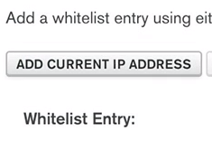
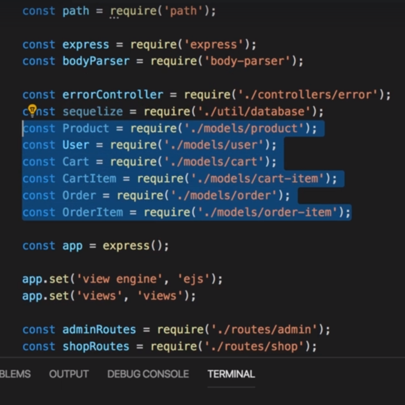
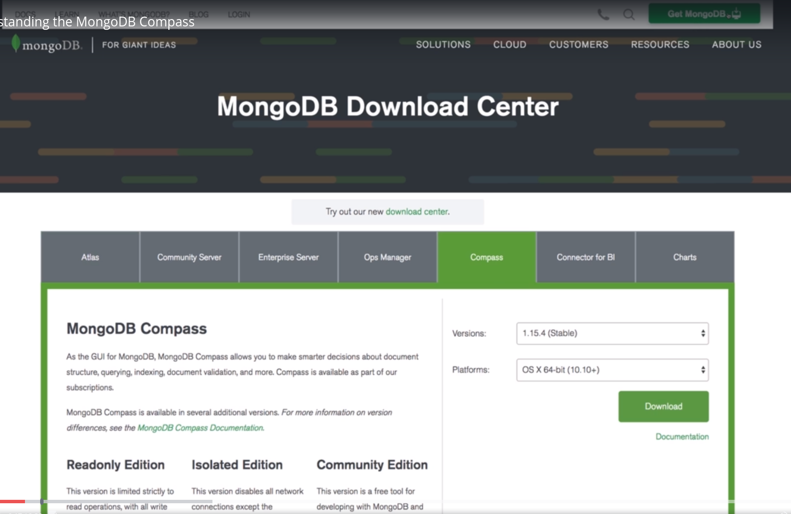
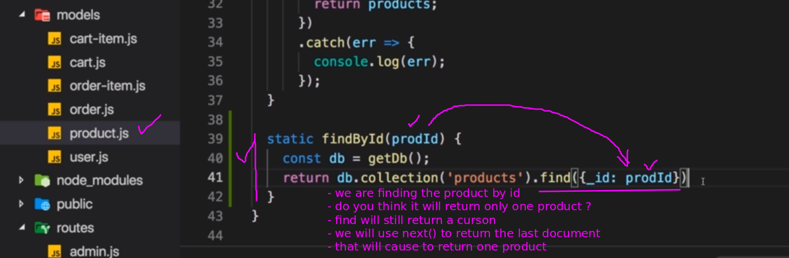
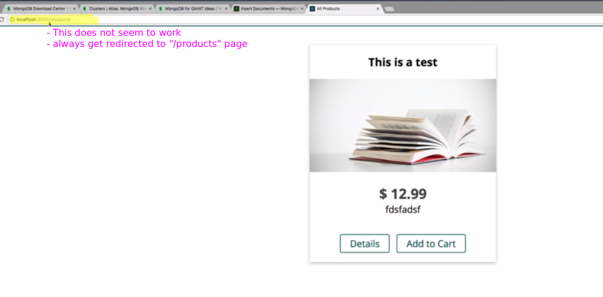
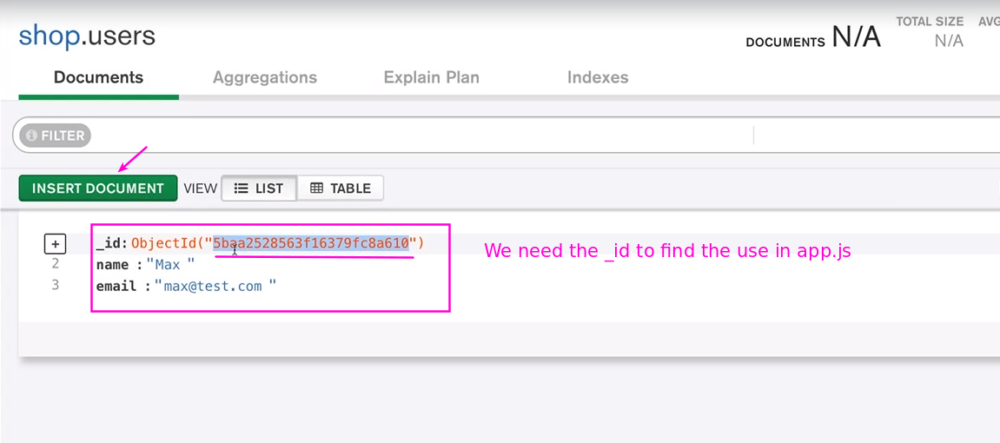
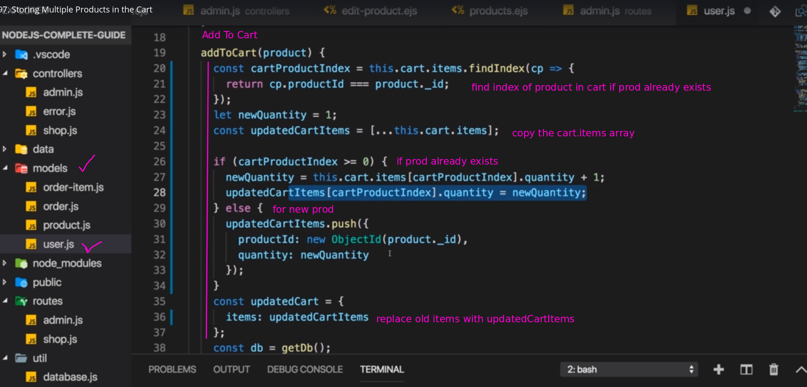
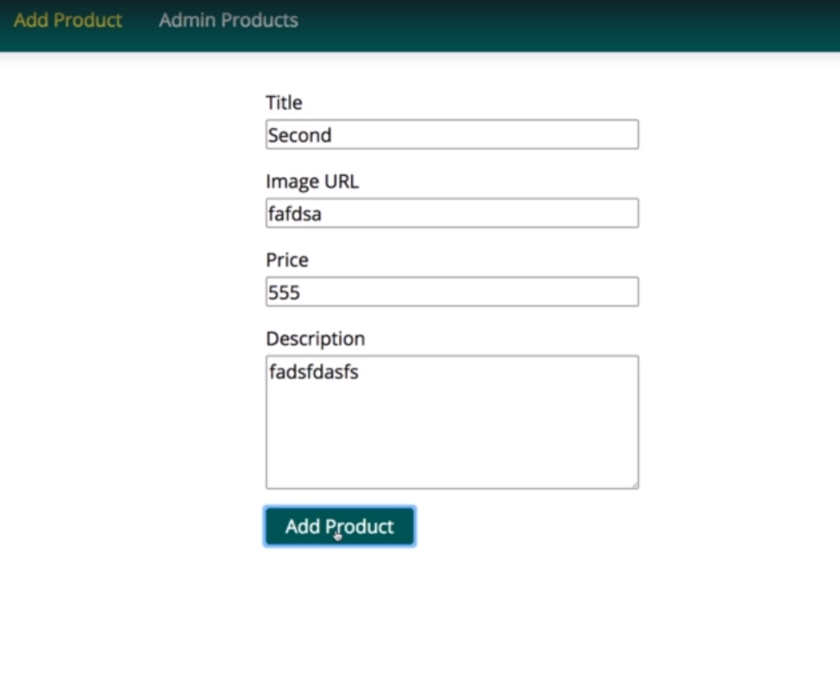

# S12 | Working with NoSQL & Using MongoDB
---

# S12 | Module Introduction
---
Introduction
`file`

# S12 | What is MongoDB?
---

# S12 | Relations in NoSQL
---
Duplicate Data

Relation Options

NoSQL Charactersitics

# S12 | Setting Up MongoDB
---

Adding locally 

- We wont go in this approach 
- We will go for the cloud setup

Cloud Solution 

- Atlas 

Give a name to the cluster

Check the security option

- Give a user read and write access to any database

Create a user/ edit a user

IP Whitelist

Add Current Local IP to white list so that your node app can access the database

Connect

Connect to your application

- we get this url which we will need soon
- but first we need to install the mongodb driver 
- we need the driver for nodejs

Lets install the mongodb driver in our project

# S12 | Installing the MongoDB Driver
---
The `Mongodb Driver` is a package which we can use to connect to Mongodb.
Install MongoDB

- Now we can use it in the app.js file

Lets start from scratch regarding usage of database
`app.js`

- lets get rid of everything we did for mysql 
- get rid of the associations 

Get rid of the model and sequelize imports 

Comment the dummy user created

`database.js` - Current Code

- uses sequelize 
- remove the code used here

Clean up 
`database.js`

- lets setup code that let us connect to mongodb

Import package and client 
`database.js`

Connect
`database.js`

Use this url
`database.js`

Copy the url and paste inside `connect`
`database.js`

Make sure you are using the right user

Also the right password

Now we want to connect to my database.

- The `client` gives us access to the database.

Export the mongoConnect function

Import mongoConnect in App.js
`app.js`

Pass a Callback to mongoConnect which will be called once we are connected to mongoDB
`app.js`

Callback
`app.js`

- Lets see what we get as the client which will be used to do database operations in future.
- we can start listening to the port once we are connected

npm start - error 
`app.js`

Remove all code which refers to sequelize

npm start - no we are Connected ! 

# S12 | Creating the Database Connection
---
`app.js`

`controller/admin.js`

`product.js`

`product.js`

`product.js`

`product.js`

## [x] Lets Code - DONE

# S12 | Finishing the Database Connection
--- 
Current code

Modified
`database.js`

- we will not pass the client to the callback - `line 13`
- mongoDb will create the shop database if that does not exist yet.
- here we store the connection to the database with the `_db` variable

Define another method to get the database connection
`database.js`

- export both functions
- `mongoConnect` - will connect and storing the connection to the database. So this will kepp on running.
- `getDb` - method where I return access to that connected database if it exists.
- mongodb behind the scenes will even manage this very elegantly with something called **connection pooling** 
- where mongodb will make sure it provides sufficient connections for multiple simultaneous interactions with the database,
- so this is really a good pattern we should follow.
 
Method-1

Method-2 

- in mongoDB we will use connection pooling that will let us do multiple interations with the database simultaneously

We need to adjust on thing in app.js
`app.js`

We will not have the client anymore
`app.js`

- This `mongoConnect` methid causes the connection to be made once and then parts of the application uses `getDb` function to get access to the database. (see the `database.js` file for referencee)

`product.js`

getDb
`product.js`

- we can call this getDB function to get access to the database
- and interact with the database 

## [x] Lets Code - DONE

# S12 | Using the Database Connection
---
Getting the connection
`product.js`

- we can get access to the database connection 
- that we set when starting the server like this

Recall what the getDB returns ? 
`database.js`

- it returns the database instance we connected to

Collection
`product.js`

- mention which collection we want to work with
- if it does not exist it will be created on the fly 
- just like a db will be created if it does not exists.

Collection
`product.js`

- connecting to `products` collection
- we can execute a list of mongoDB operations on the collection.

Collection
`product.js`

Collection
`product.js`

Collection
`product.js`

insertOne
`product.js`

- mongodb crud function for nodejs driver

We can try to insert `this` object which refers to the Product in the product class
`product.js`

returns a Promise
So then().catch()
`product.js`

Export the Product class
`product.js`

Current code 
`controllers/admin.js`

- these wont work since they are using sequelize 
- which we are not using now

For now we will strore the product without storing user information.
Comment out the codes that wont work
Disable all routes that wont work anymore in the `routes/admin.js`

import mongo connnect
`app.js`

We should be able to insert a new product already
But first we need `next()` in the `app.js` file

Output

- This wont work as its using sequelize
- We need to use mongo instead

# S12 | Creating Products
---
Lets make add product work again

postAddProduct

return the promise 

Output

- we commented out the redirection to a valid page

Insert was successful

# S12 | Understanding the MongoDB Compass
---
Install Mongo DB Compass

- Gives you a graphical interface

Now one cool thing is if you now quickly close compass again and you restart it after you copied that url, it should tell you that it detected a connection string and if you click yes, it will insert the most important pieces here for you.

# S12 | Fetching All Products
---

- So I want to find all products which I can do by just calling find like this. 

**Cursor** 
- Now the important thing about find is find does not immediately return a promise, 
- instead it returns a so-called cursor. 
- **A cursor** is an object provided by mongodb which allows us to go through our elements, our documents step by step 
- because theoretically in a collection, find could of course return millions of documents 
- and you don't want to transfer them over the wire all at once. 
- So instead `find` gives you a ***handle*** which you can use to tell mongodb ok give me the next document, ok give me the next document and so on.

**toArray**
- There is a toArray method you can execute to tell mongodb to get all documents and turn them into a javascript array 
- but you should only use that if you know that we're talking about let's say a couple of dozens or maybe one hundred documents. Otherwise its better to do pagination which we will do later.

Promise
 

Get access to database

Output

## [x] Lets Code - DONE

# S12 | Fetching a Single Product
---
## Code before
getProduct 

find the matching Product using the Product model

- We need to work on the model

## Getting single product 
`find()` 

`next()`

Controller

Routes

- The reason for that is that is that the ID in mongodb is actually stored a bit differently and we can see this in compass, the ID is actually such an object id thing.Now I did mention that mongodb stores data in bson format and this binary format of json is not just used because it's a bit faster to work with, it is but also because mongodb can store some special types of data in there and object id is such a type.

To fix this 

# S12 | Making the "Edit" & "Delete" Buttons Work Again
---
We need to work on the admin side again
Make the admin products page where we list all products work again.

Edit and Delete 

# S12 | Working on the Product Model to Edit our Product
---
We need to make these two work again in the `controllers/admin.js` file:
getEditProduct and postEditProduct

## See the product in Edit Mode

## Update the Product using the Edit product Page

`$set`

- We have to describe the operation and we do this by using a special property name which is understood by mongodb, kind of a reserved name you could say, $set.
- This again takes an object as a value and here we describe the changes we want to make to the existing document which we found with this filter.

`$set: this`

And here you could actually say this and you would instruct mongodb to simply set these key value fields which you have in your object here to the document it found in the database and therefore since these are only key value pairs which exist in the document in the database, it will update the values of the document in the database with your new values.

You can also explicitly mention the changes

- but since we want to replace all fields
- we can just mention `this` here
- the id wont be overriten. dont worry

Next

# S12 | Finishing the "Update Product" Code
---

Output

- But I also did not get any error
- Whats wrong here ?? 

# S12 | One Note About Updating Products
---

Now if we go to the product model and we have a look at the save method, there I am actually looking for the right object but I'll have a problem with updating it because thereI'll try to set my object ID to a different object id to a string because here I'm just referring to this which will hold the unmodified objectid. So what I should do is I should automatically convert the objectid, the ID here which is a string to an object and the object in the constructor so that I can remove it down there because _id will now always be an object id field, no matter if I'm using it in a filter or if I'm using it for updating.

- Now this works again.
- This is a better approach 

# S12 | Deleting Products
---

What was the problem when we tried to add a product ? 
Lets see next

# S12 | Fixing the "Add Product" Functionality
---

So that _id is the problem and that makes sense because I actually do initialize _id here at the beginning by creating a new mongodb object id. So even if we pass no ID and this therefore is undefined, this will create an object and store it in _id, so _id down there will always be defined and if it's just such an empty or automatically generated object id object, this should be the issue here.  

## [x] Lets Code - DONE

# S12 | Creating New Users
---

# S12 | Storing the User in our Database
---
We can store the user information inside the product in 2 ways: 
1. Embed the whole user object or partially store some user properties which wont change much.
2. Only store the user reference inside the product.

# S12 | Working on Cart Items & Orders
---

# S12 | Adding the "Add to Cart" Functionality 
---

# S12 | Storing Multiple Products in the Cart
---

# S12 | Displaying the Cart Items
---

# S12 | Fixing a Bug
---

# S12 | Deleting Cart Items
---

## [x] Lets Code - DONE