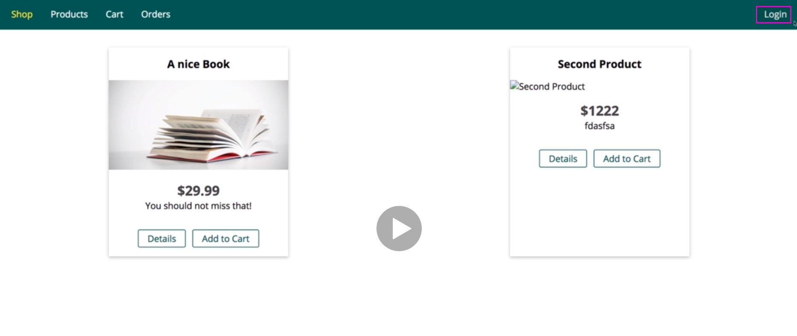
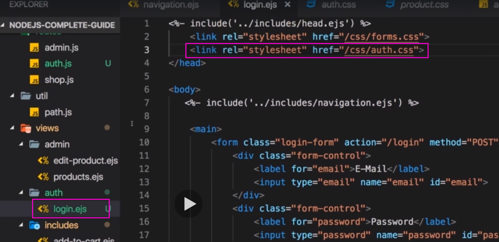
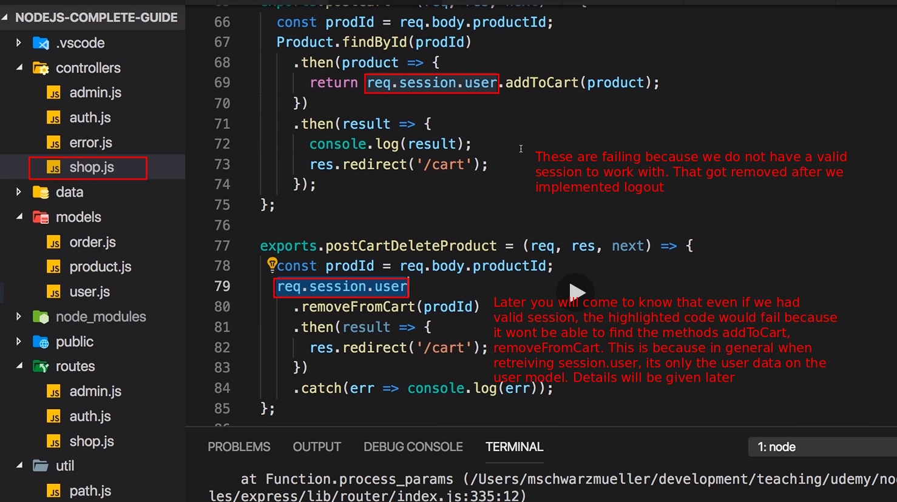

# S14 | Module Introduction
---


# S14 | What is a cookie
---

- Example - In a login page the users sends a request to the server with the login information. 
- The server then sends back the response as a new view/page with a cookie which contains the information that the user is logged in. 
- This will enable the user to send subsequest request without logging in again. 

## Notes 
So what is a cookie? Well here's our setup, we got a user using browser and we got our server where our node application runs on. Now the user interacts with the frontend with the views we render with the ejs templating engine in this course but of course I'm talking about any views you might be rendering in your project with which ever templating engine you are using and from inside that view, let's say we have a form there to add a new product, we submit a request to our node server. Now let's say that request requires us to store some kind of data in the browser, let's say we're not working with the add product page but let's say we have a login page and when the user logs in, we want to store the information that the user is logged in somewhere so that when the user reloads the page and therefore technically a new request is sent, we still have that information around that the user is logged in and for that, we can send back a cookie with the response we send back upon the request. So the user submits the login data and we return a response which can be a new view to which we redirect to user but we also include our cookie and that cookie simply is important to well telling the user or to storing that information that the user is authenticated. We can store that information in the browser, so in the frontend so to say, in the environment the user interacts with and we can send this with subsequent requests to include the cookie there to send the data we stored in the cookie, like for example that information that we are logged in to the server, so cookies are stored on the client side. Now this is really abstract, let's simply try it out in our application.

# S14 | The Current Project Status
---
Download current project folder

- With current code project looks like this
- see that a login nav was added
- Login page is a typical use case for Session and Cookies 


- New Navigation!

## Notes
If you download the attached project snapshot which is my latest snapshot, you will see some differences there, so you should download it and what did I change and of course you can also go ahead and just implement these changes in your project. Well I commented out my links to the add product and admin products pages in my navigation.ejs file and I added a new unordered list after the first one and there I added a new list item which is named login. And then I also worked on the styles a bit and most importantly in the styles, I had changed my main header nav to be of type display flex, header width of 100% and justify content space between but again you find these files attached to this video. Now this leads to a setup where two navigation items are missing but the login button was added and it's on the right here due to that space between thing. Now why did I add this? Because I want to have some dummy login page. We'll have a complete module on authentication where we dive deeper into all that is related to authenticating but here authentication is a great example for data you would want to store for a specific user and that is one of the typical use cases for using cookies and sessions hence I want to use some dummy authentication in this module already. So what can we do with that? Well with that login button, we navigate if we have a look at navigation.ejs, we navigate to /login and that is a route which does not exist yet, we got no routes for logging in or signing up or anything like that. So I want to add this and if you don't want to practice this, again if that's not interesting to you, you can simply skip the next video, you can skip it and download the finished adjustments, the finished code after that next video so that you can continue with that. So in the next video, we'll implement that login screen, it's a great practice for you, you can also try it on your own before diving into my lecture where we do it together. And if you want to continue with cookies, immediately you skip the next lecture, you download the finished code and continue with that.

# S14 | Optional: Creating the Login Form
---





## Notes 
So let's work on that login page and for that I'll first of all add a new routes file which I'll name auth.js and in there, I want to manage my authentication related routes. Now for that, I will first of all set this up in a similar way to my other route files which means I will set up the express router, so let me simply create that here, we don't need the admin control though, so we have that router and I'll then export that router and for now I need one get route in here. A get route for /login then which will load the login page, so /login is what I want to handle here and as always, we have our request response next function here for handling that incoming request. Now in order to reach that route, we of course need to register it in the app.js file and in app.js, first of all let's import that route, so I'll duplicate my shop routes, name them auth routes, the name is up to you of course and it's in the auth file in the routes folder, so that file we just added and with the auth routes added there, I will simply add them below my shop routes. Just like the shop routes, I have no leading filter so every request will go in there and anything which is not found in the shop routes will therefore go into the auth routes and in the auth routes, I will handle /login, this route here. Now in here I simply want to render a page and I want to render a page in the let's say auth folder and just as I do this in the shop controller here, I will also create an auth controller for that. So let's maybe duplicate this get orders action from the shop controller, add it here and let's name it get login and then I don't need to find any orders or anything like that, that of course can be removed, I just want to render something, I want to render auth login here, the path will be /login, your orders well I will simply name this login and I don't pass any other data. So it's a really simple controller action in my auth.js file and with that in the auth.js file in the routes folder, I can simply import that, so here I will import my auth controller by requiring that from the controllers folder in the, whoops, the auth file there and then here for login, I will not use that function but point at my controller with the get login function. Ok so now we get the same setup we used for the other routes and now we have that login controller action which will render the login page with the appropriate title. Now let me head over to navigation.ejs real quick and make sure that this gets highlighted when we are on the page and for that I will copy that class assignments, that css class assignment, add it here and the path should be /login or whatever you assigned in your controller action. With that out of the way, let's add that folder and file in the views folder, so I'll add an auth folder here and in there a login.ejs file because that is just what I try to render my controller right, there I try to render auth login. so we need to have that path and file in our views folder. And for that I will really just use my product excuse me, my admin, my edit product page because there I have a form and I will move that into the login.ejs file, I will include head.ejs, I don't need the product.css but I need the forms.css . I will include the navigation, then this here will receive a new class, we can name this login form and see how we have to adjust the styling for that then. The action here, well that action will always be the same, we don't have different modes here, the action is always login and we send a post request to that login route. And then here let's say we have an email address, we name that field email here and we give it an ID of email, it's also of type email and not of type text and let's not start with a default value, so we don't need that here and we also need a password let's say, so let's add password here, name this password and give it an ID of password and the type here will also be password so that the characters are hidden and with that, we get also rid of this value here. Now we don't need the other form controls so we can get rid of these form controls, slso of the hidden one for now and let's simply add a button at the bottom which is of type submit and which simply says login, so a really simple form. With all of that in place, if we now click onto that login button, we are indeed loading that login page. Now the styling is a bit off because we need to style that login form and for that, I'll real quick add a new css file which I'll name auth.css and in there on the login form, let's have a look at the product form, I think we can just reuse that style here and yes we could have therefore also like refactored it into a global style but I'll just do it like this. And in login.ejs, we now just make do, need to make sure that we do also import that new auth.css file I just added. So if you now reload this, this looks pretty good. So now we got this in place and as I mentioned, I will not implement a full login flow right now, we'll do that in the next module where we dive into authentication and everything that belongs to it. But here I want to show you how we can use a cookie to save the information that this user is logged in and for that, we'll continue in the next lecture and see how we can use cookies. 

# S14 | Adding the Request Driven Login Solution
---


## Notes
So in the last lecture we edit this login form which you can reach by clicking on login here on the top right corner and you can simply download the attached code to have that same starting project, if you download it just make sure that you use your database credentials here when connecting to the database because mine won't work for you obviously because I shut down the server after I'm done recording. So I added this login page and we'll not implement authentication right now, we'll do this in a separate module but this is a great dummy scenario for using a cookie because let's say when we click that submit button here, the login button, we will actually send a login request to the backend because that is what we stored in the login form, here in auth login, we are sending a post request to /login and since we do that, we should handle this and we want to in a real scenario validate the e-mail and password, in this module we'll not do that, we'll just assume that the input data is valid because it's not the topic we'll focus on for now. So let's add a new controller action first of all in the auth.js file and I'll name it post login. Now in post login, I will get my login data, e-mail, password and so on and I don't really care about that data, so I'll just assume the user is logged in and I will then redirect to just slash. However and now that is important, if we do it like this and we add a route for this of course to our auth route file, so here this is post, a post request to /login and we use the post login controller action, if I do this and then click on login here, I am indeed forwarded to the /route. Ok so this could mean we are authenticated. Now let's say we want to store that information that the user is authenticated, how could we store that? Well you could say I go into my controller and in post login where I do log the user in, I store that information in my request object, is logged in because we are already doing a similar thing in app.js right at the start, we fetch our one dummy user and store that in the request so that we can use it for the rest of that request, so in all the routes and controllers where we handle that request. We can do the same here and set this to true, by default right at the start it will not be set, so the value will be undefined which is treated as false and that is the information I need. Now to validate whether that works, let's actually go to our views and there in the navigation.ejs, I commented out two routes for which we could say we need the user to be authenticated, let's comment them in but only render them if the user is authenticated. So how would we go about that? Well we could use ejs for that of course and we can check if, let's say we expect to get some isAuthenticated value here, so if isAuthenticated then we'll do something, we'll render this part here and otherwise this will not be rendered because we don't make it into that if block. So if I do it like this and I reload this page, I get an error that isAuthenticated is not defined because we're not always rendering this to our different views. So what we actually need to do since the authentication is part of every page, for every render call here, we need to pass the information whether the user is authenticated or not and for that I'll access request is authenticated because that is exactly or is logged in, excuse me is logged in because that is the field we're storing that information. So I'll access request is logged in because that is what I will set to true when we do login, so I'll add isAuthenticated and store that value to every render call here. Here and here for get add product, also on the error page here like this and also in shop.ejs of course for all our routes here like this one, basically every time when we call render, in all these cases I will add my isAuthenticated information. So now that I added it to all routes and I saved all files, if I reload I still fail because I obviously also need to render, I need to add it to auth.js, to my render route there, so now if I reload, this works and we are missing these two fields. If I login, we are still missing them though and why is that, do you know why this does not work? Even though I am storing the information that I am logged in, in is logged in when we click that button, I'm storing it in my request and then I use that information in the request on every other route I handle and I pass it into isAuthenticated which is the field which I'm using in my frontend, in my navigation, there I am checking for isAuthenticated and that is what I am passing to that frontend in my render calls here. Well the problem of course is yes I update is logged in here in the request and what happens to the request once I send a response and we do send a response by redirecting? Well the request is dead, it's done. With a response, we basically finished a request, we got a request and we sent a response, we're done. This data does not stick around, this data is lost after the request or after we send the response. So whenever we visit a different page, like here where we do get redirected, so we get redirected here and we reach our get index action here in the end and there, we do render the shop index page but this is a brand new request, the redirection creates a brand new request and this is super important to understand. We're working with totally separate requests and that is important because your application, your page will have hundreds of users and obviously the requests of all these users are not related to each other otherwise they could maybe look into data that they shouldn't see and even the requests of a single user, so requests made from the same IP address are treated as totally independent requests. They are not seen in a bigger context or anything like that and this is a good thing, this is deliberately designed that way and therefore any data we store here can be used as long as we are working on the same request. That is why when we retrieve the user in app.js here and I store it in the request, that is why we still can use that request user in all our action controllers because they can again at a later point of time, this middleware runs on every incoming request before our routes handle it. So the data we store here is used in the same request cycle, in our route handlers in our controllers but if I do change the request at the end of its lifetime, like here, right before I send the response, this data will not be useful to us, it's really important to understand this. So let's now see how we could solve this in a better way.

# S14 | Setting a Cookie
---
## req.get(field)
Returns the specified HTTP request header field (case-insensitive match). The Referrer and Referer fields are interchangeable.
```js
req.get('Content-Type');
// => "text/plain"

req.get('content-type');
// => "text/plain"

req.get('Something');
// => undefined
```

details on how to achive this. 

#### Using global variable solution to show the navigations 


#### Cookie Solution


## Notes
So we found out that using a request for storing this is not ideal because the request is dead after sending a response, which alternatives do we have? Well one alternative would be some kind of global variable. You could use a global variable which you store in an extra file and which you export from that file and which you then change and that variable would actually survive your request cycles but since that variable would be shared across all requests, it would also be shared across all users and that is exactly where cookies can help us. With cookies we can store data in the browser of a single user and store data in that browser which is customized to that user which does not affect all the other users but can be sent with requests to tell us hey I already am authenticated and that is exactly what we will do here. So instead of just redirecting here, what we can do is we can set a cookie and we set such a cookie simply by setting a header. So we set a header on our response and we set a header here by first of all defining the name of the header and the name is set cookie indeed, that is a reserved name which well sets a cookie and then you have the value of that header and the value for set cookie in its simplest form is simply a key value pair where you define any name you want and any value you want. So you could have something like logged in or logged in, makes it easier to read equals true, this would set a cookie and I can show this to you. If you now save this and you go to the login page and you click post here or click login, open your developer tools and in the chrome developer tools, you can go to the application tab and there to cookies and if you expand this, you should see your current address here and if you click on that, you will see some cookies. Now some cookies will be set by third party plugins, chrome extensions and so on but you will also see logged in and the value true, you should see that at least and that is the cookie we just set. Let me zoom out a bit here, there you see the domain to which it belongs, the path, when it will expire and this state is in the past because it's a so-called session cookie, it will basically expire once you close the browser and come back, you see the size and some other information to which I will come back in a second. So this cookie is now set and now this cookie is not only set but the browser by default sends it to the server with every request we make, so if I click on products here for example, we go to the network tab, this is the request which was sent to the products page and there if we have a look at the headers and we scroll down to the request headers, you see that a cookie was sent. The first one comes from an extension but here this is our cookie, so it was sent to our server and now since we have that, every request will have that cookie attached to itself and therefore this data is sent with every request and now we can use that. Let's start simple, let's say in the get login page here. We can have a look at our headers, let me console log request get and then you enter the header name which is cookie because remember in the client side dev tools, you saw that the cookie header was sent with the request and now if you go to the login page or reload that page if you are on it, I reloaded it a couple of times, you see this output. Now we can ignore the first cookie but this is our logged in cookie and now we could extract that value for example by splitting on the semi-colon and then taking the second value in that array, the array index starts at zero so one gives us the second element and now if I reload this, you see I get logged in true here, you could trim that to remove any excess white spaces, we could split this again on the equal sign, this is obviously a very complex way but if I do this again and then I use the second value, then I should get the true or false value. So now if I reload this, I get true here, so obviously this is a very complex way but should be quite readable and then I can extract my is logged in information from the incoming request header, I'm getting the cookie header, I make sure that I get the second cookie that is sent which happens to be our is logged in cookie. If you only have one cookie being sent by the way, then make sure you extract the first value, so whatever or wherever is logged in is located for you, if you only have one cookie, use the first one with zero, if you've got multiple ones, use the third one and so on and then I extract the true value and now I have that is logged in information which I can pass to isAuthenticated. And with that on that page, if I now reload it, hey here are our two options in the menu because now we do enable that again because now we store that information across requests. So now even if I navigate away to another page or I don't extract that cookie yet and I come back to login, there I do extract it and it is always sent with every request, so it is a cross request data storage. Still there is a big disadvantage and do you know which one that is? 

# S14 | Manipulating Cookies
---


## Notes 
So in the last lecture I showed you how you can set a cookie and some a bit too complex way of extracting that cookie. Now if you want to extract cookies by the way, there also are third party packages which can help you with that but our approach has another flaw. Well obviously since I can access my cookies that easily in the developer tools, I can easily change them, I can go here and manipulate the value, for example if I set it to false and I reload, I'm actually still logged in because false is sent as text and text is always treated as true but we can simply add a comparison here and see if that value is equal to true, so to the text true here and now if I reload here, I'm not logged in anymore. If I change it back to true though and I do reload, I am. So the issue here is we can manipulate that from inside the browser and obviously you don't want to allow the users of your website to login by simply manipulating some cookie value. So whilst it is certainly interesting to store some data in the client side, especially things that are related to tracking users, advertisements tracking and so on, whilst this is interesting, sensitive data should not be stored in the browser because users can edit them as you see, we can edit our logged in cookie. So whilst cookies are generally a good thing for storing data across requests, it might not be the best approach in all scenarios and that is exactly something where sessions can help us with. However before we dive into sessions, let me quickly explain you some other fields you can configure about a cookie which will also highlight when a cookie does make sense to be used before we then dive into the scenario where it's not the best tool. 

# S14 | Configuring Cookies
---

## See the doc link here
https://devdocs.io/http/cookies


For example for tracking users, cookies is a popular instrument.
Because as you can for example see with the cookies I have here, the cookies don't only have to relate
to your page. A cookie can also be sent to another page and that is a common instrument in tracking.

You can also configure cookies.
We set a value but actually you can set more things than just the value.


## Notes 
So we can manipulate cookies so storing sensitive data is not ideal but I mentioned that for example for tracking users, it's a popular instrument and why is that? Because as you can for example see with the cookies I have here, the cookies don't only have to relate to your page. A cookie can also be sent to another page and that is a common instrument in tracking where you have that so-called tracking pixel on pages which is simply an image url with no real image but that image can be located on let's say Google's servers and you have a cookie on that page which is also sent along with that and therefore Google can track on which page you are and how you are moving through the web even if you're not on their websites because some data is stored in your client and obviously you could delete it therefore which is why you can block such mechanisms too but it is stored there and it is sent with every request to Google, so they can track you without you being on their servers, so storing that information on their servers would not work but storing it on your computer will work because obviously that can be sent on every page you visit. So that is something where this could be interesting if you want to track your users, that is a very common thing to do and you can also configure cookies. We set a value but actually you can set more things than just the value, here I set my cookie by adding that key value pair. Now obviously we could add multiple cookies, multiple key value pairs, we can also add a semi-colon after the key value pair and for example set expires to some expiration date, this date would have to follow a certain format, the http date format, I'll link it attached to this video here. So you could set a certain date when this cookie will expire because remember if you don't set this, it will expire once you close your browser. Alternatively to expires, you can set max age written like this and this is a number in seconds, how long that cookie should stay around, so we could set this to 10 for example and now if I click that login button here, I got logged in and now you see the expiry date also changed here, the expiry date if I decrease that, the expiry date here basically is today and now it already is expired and if I reload that page, is logged in is therefore gone. So this is something we can do and this is of course interesting if you want to control for example how long you want to track a user or we will actually use that together with authentication later, you could use this to also control how long an authenticated session stays active for a user, you might know that from your online bank where you timeout after a certain duration. You can also add a domain to which the cookies should be sent and here we again are on that tracking thing again. You can add secure just like this without an equal sign, just secure, this means this cookie will only be set if the page is served via https. Now I can't demonstrate this here because our local development server is not using https but we will eventually use https later in the course where I will show you how to set this up, so now you can already see however that I get an error if I try to reload login because I try to extract the value which is not there. So for now let's simply comment this out and set this always to false so that I can just show you how this cookie is now not set, if I reload and I click here, you don't see the cookie here because I added secure and it would only be set if we are serving the page via https and you can also set this to http only. Now if I do that and I go back to login and I click here, it is set but now it has this checkmark here in the http column and that means that now we can't access the cookie value through client side javascript, so in the scripts running in the browser. This can be an important security mechanism because it protects us against cross-site scripting attacks now because now your client side javascript where someone could have injected malicious code can't read your cookie values and that will be important later with authentication where a cookie will not store the sensitive information but an important part of authenticating the user. So this can be an extra security layer because now the cookie will still be attached to every request that is sent to the server but you can't read the cookie value from inside the browser javascript code. Obviously as you can tell, as a user in the developer tools, you can still read it but then again it's your own cookie and you will not store information like hey I'm logged in there because that would be easy to manipulate and you can't protect against that. These are the key values you can set here and this gives you a lot of flexibility. That being said, often you will not directly set your cookies because you rather use some packages like for example for authentication that will manage setting the cookie for you. And that is something which I'll dive into in the next lectures where we dive into sessions, what sessions are, how they can help us with storing sensitive information across requests and how cookies still are important when using sessions.

# S14 | What is a Session
---

## Notes

What is a session? Well we have the same set up as before, user using the frontend our view is interacting with our server where we have our node application code. We send a request and we do login and again let's assume we do send the valid credentials there, we're not validating them in this module because I want to focus on sessions and cookies. So now instead of storing the information that the user is authenticated in the frontend which was a bad place as we learned, we'll store it in the backend with a so-called session and a session is a new construct which we haven't used before. With that I'm not meaning that we store it in the request because we already saw that this will not work and I also don't mean that we store it in some variable in our express app because that would be shared across all users and all requests, we only want to share the information across all requests of the same user and that's really important, the same user so that other users can't see your data, can't assume your role, can't tell the server that they are authenticated, only you are authenticated. Now for that, we need to store it on the server, we'll start by storing it in memory which is then pretty similar to storing in that variable but eventually we'll move to a different session storage, the database. We need one important piece of information. A client needs to tell the server to which session he belongs because the session will in the end just be an entry stored in memory or stored in a database. 

Now we're not matching this by IP address or anything like that because that is a bit hard to maintain and can be faked and all that fun stuff,so we're not doing that instead we'll use a cookie where we will store the ID of the session. Now obviously you can still change that and assume a different ID if you want to but that will not work like this because actually the value we store will not be the ID but the hashed ID, hashed with a certain algorithm where only the server can confirm that it has not been fiddled with so that you didn't play around with it and tried to create a different one. So this will be a secure way because you basically store the ID in an encrypted way where only the server is able to confirm that the stored cookie value relates to a certain ID in the database and therefore we got a safe value stored in the cookie which you can't, you can change it but you will not assume a different session, a session can be matched and that session can then contain the confidential data which you can't change from inside the browser, that is the idea here. So sessions are stored on the server side, cookies client side, sessions server side. Now let me show you how to implement a session.

# S14 | Initializing the Session Middleware
---

## Notes 


To implement a session, we'll need another third party package, we'll need another package which helps us with managing sessions. For that we'll install it with npm install --save and the package is named express-session, it's a package which is actually part of the official expressjs suite but not baked into expressjs itself but now we already got it installed and now we're ready to use it. To use it, we'll go to our app.js file because we want to initialize that session early on, we want to initialize that session when we, well when we start up our server then we want to initialize the session middleware at least and the session will then be used for every incoming request. So in here we create a new constant, so we basically import something here which I'll name session, the name is up to you and I will require express session, that is what I'll require here, so that is the package we just installed. Now with that installed, we can set it up here along with the other middleware let's say.


**Check out this site to read more**
https://github.com/expressjs/session#compatible-session-stores


There we register another middleware with app use and to app use, we pass session and we execute this as a function and to the function, we pass a javascript object where we configure the session setup. For example we need to set a secret, this will be used for signing the hash which secretly stores our ID in the cookie. So here I'll set a secret, you can enter any text here, it should typically be a long string, I'll name it my secret but again in production, this should be a long string value. Then you should add the re-save option and set this to false, this means that the session will not be saved on every request that is done, so on every response that is sent but only if something changed in the session., this will obviously improve performance and so on. Also there is the save uninitialized value which you should set to false because this will also basically ensure that no session gets saved for a request where it doesn't need to be saved because nothing was changed about it and that is it. These are the core things you need to set. You could for example also configure the session cookie, you could give it a max age by setting a date or add the expires key, so you can configure that cookie but you can also go with the default settings. And with that, the session middleware is initialized and we're now ready to use the session. Now let's start using it in the next lecture.

# S14 | Using the Session Middleware
---
## Notes 


So we added the session middleware, let's now start our server again and let's use the session middleware and how do we use it? Well we can use it in our auth controller in login instead of setting that cookie, we can reach out to request and then the session object, this is added by the session middleware, this session object and here we can add any key we want, for example is logged in but you can name this however you want and set this to true. Now if you save that and you go back to your browser, go to the login page maybe, reload and get rid of that logged in cookie, you can simply delete it here. Now click login and what you should see is that a new cookie was added here, this connect SID for a session id cookie, if you expand the value here, you'll see some strange string and that is what I meant, this is this encrypted value so to say. And this is now the cookie, by default it's a session cookie so it will expire when you close the browser. 

It's a session cookie that will identify your user here, your running instance of this website you could say where you are browsing around, this will identify you to the server and to this session and I can prove this to you. If we now go to the get login page here and I console log requests session here like that, let me then go back and click on the login page here again and go back to our server and there you see the session object is logged. Now let me also output is logged in here by accessing that, go back, login again, it's undefined because I added the this code only after submitting this for the first time, so let me save this again and now simply click that login button here again and now you will see if you go back to the login page, you see true here because now indeed in the session is logged in is stored. And we can go to a different page and come back to login and these are all individual requests which technically are totally individual from each other, totally separated and still we see true here because we still store this in the session on the server side by default, just in the memory not in the database yet and the session is identified for this browser because we have that cookie. 

And I can prove that to you by starting another browser and this will technically be treated as a totally different session and environment, could be a totally different machine. So I am on localhost 3000 here and if I click on login here, you see undefined and that undefined is coming from the login request I just sent because this browser, this user, technically this is a totally different user even though I'm the same but it's a different browser, different user, this user does not have this cookie set for him, does not have an active session on the server. And this is how we can store data that persists across requests as you saw, I clicked around and still that was sent, the true value was sent when I came back to log in, so this is saved across requests but not across users, as you can see this is a different user, I go to login, I have undefined down there and that is the power of using a session. 

It still needs a cookie to identify the user but the sensitive information is stored on the server, we can't modify it and that of course will be super important for authentication and what we see here already is the core mechanism behind authenticating users in the web. There are other techniques too, for example when building a rest API, something I'll come back later but this is a core thing on how authentication generally works especially when rendering views as we are doing it with ejs and this is what we will build up on in the authentication section where we then also dive into things like validating credentials, logging users out and fun stuff like that.


# S14 | Using MongoDB to Store Sessions
---
## Notes 


Now I showed you how to use a session, the problem here is this session is stored in memory and memory is not an infinite resource. So for development, this is fine but for a production server, this would be horrible because if you have thousands or one hundred thousands of users, your memory will quickly overflow if you store all that information in memory. You don't want to do that, from a security perspective, it's also not ideal. So we want to store sessions differently and on the express session documentation, so on the docs, on the github page of that package we're using, if you scroll down to the end, you will find a list of session stores you can use and basically all kinds of databases are supported. You could store it in files though that might not give you the best performance and we will use mongodb because we are already using that right and for that, we'll use the connect mongodb session package here, so we'll install this package now and register this as a store with which we can work. 

So back here in our project, let me quit the server with control c and let's first of all install that package with npm install --save connect -mongodb-session and this will download this package which we can use to let our express session package store data in the database. So now it is installed, we can restart our server and now let's go to app.js where we do initialize our session, here we do configure the session and this is also where we need to configure our store. Now to set up that store, first of all I'll import mongodb store, you can name this however you want and I will require connect mongodb session. Now this actually gives you a function which should execute to which you pass your session, so this session object you're importing from express session is passed to a function which is yielded by required connect mongodb session and the result of that function call is stored in mongodb store. Now with that, you can initialize a new store, store it in a constant named store maybe, that name is up to you and you execute mongodb store as a constructor because this function happens to yield a constructor function which we store in mongodb store. 

To that constructor, you pass some options and now which options could that database store require? Well it will require a connection string because it needs to know in which database, on which database server to store your data. Now we have a connection string down there, so I'll copy that entire url and cut it actually and I will store it in a constant up here, I'll name it mongodb URI, all capital case to signal that this is basically a constant value which I'll reuse and then here, I will use my mongodb URI and I will also use it down there. Please note that the session now will also be stored in a shop database, you could use a different database but then you need to use two different urls, I'm fine with using the same database. I will define the collection though and you need to to define the collection where your sessions will be stored and I will name it sessions but the name is up to you, you could name this however you want. Now you could also add more information, like for example when this should expire and then it can be cleaned up automatically by mongodb but I will set it up like this and now I have my store added here and when I saved, I get an error actually. This can be fixed by removing that retry writes here at the end of the URL, if you do that, it should work. 

So now we get the store set up here and now we can use that store as a session store and to use it, we go to the place where we initialize our session down there and we add another option, the store option and we set it equal to our store constant or whatever you named the constant where you store that initialized mongodb store and with that, your session data will be stored in there. So if I now go back to my page and I do click that login button again, I got a new session, a new session cookie and that session will now be stored in mongodb and we can of course validate that by starting mongodb compass to look into our database. There if you look into your shop database, you will find a sessions collection and in the sessions collection, you'll find a session with an ID and in that session, you'll find that information like is logged in and some information about the cookie which belongs to that session, also you find the expiry date that was set by default. 

So this is how sessions are now stored and this is how you should store them for production, use a real session store, don't use the memory store which is less secure and which also is less unlimited or which will reach limits when more users use your app. But with that sessions are a powerful tool for storing data across requests while still scoping them to a single user and not sharing the data across users because now as you saw, different users have different sessions but this is now a great way mostly for managing authentication but you could also store something like the shopping cart in a session. We are storing it in a database which is also a decent solution but you could store it in a session and therefore indirectly in the database I guess, in the session database collection but you could use a session for something like this. So in general, use a session for any data that belongs to a user that you don't want to lose after every response you send and that should not be visible to other users.

# S14 | Sessions & Cookies - A Short Summary
---
## Notes 


So now we had a look at how we can use sessions and what the advantage of a session is and we also of course learned about cookies, what a cookie can be used for and how it plays together nicely with a session to identify a user, a client and then store the sensitive data on the server, so in the session and that difference between the sessions server side and cookies, client side is really important to understand and you also learned how to set a cookie and how to use a session. Now by the way if you're wondering how that session cookie, this cookie here, how this is set, well this is done automatically by express session so by that middleware we're configuring and that's also why you can add cookie related configurations here because this middleware automatically sets a cookie for you and it automatically reads the cookie value for you too, so it does all the cookie parsing and setting for you. Now with that, you actually rarely need to manage cookies on your own because that session cookie and with that I don't mean a cookie which gets lost after you close the browser but that cookie that identifies a server side session, that is the most prominent, the most common use case for cookies besides advertisement, tracking which you typically don't implement on your own but you use third party tools like Google for that. But that session cookie, so that session identifying cookie is an important thing and sessions on the server are often used for authentication but as I mentioned, you could use them for any kind of data you want to store. We happen to store the information whether the user is logged in but you could be storing the carts, the shopping cart of the user here or anything which belongs to a user which should be shared across requests as I highlighted.

## [x] Lets Code - DONE

# S14 | Assignment
---


## What did I do to solve it 


## Assignment Solution 
85-94


# S14 | Deleting a Cookie
---
## Notes
95-106


We're now using sessions everywhere and we have our dummy authentication process in place, it's missing crucial features like log out and so on and that will all come in the authentication module but we have something in place and you might have noticed that of course regarding the log out, I always just deleted the session cookie. That is what I did in the assignment too, I deleted the session cookie to demonstrate what happens if we then try to do something that is relying on data that is stored in the session, it will fail because the session cookie which is required to identify the correct session is not there. Now deleting just the cookie is of course not ideal because right now for example if we have a look at compass and into our sessions collection, I have three sessions here because I always just deleted the cookie. Now there is a cleaner way of doing that and that cleaner way is to use a method provided by the session middleware, now let me show this to you and for that, I'll first of all go to my views and there to the navigation and next to my login button here, I'll actually add another field, another list item into which I'll add a form which should lead to log out and use a post method and in that form, I'll have a button like this which is of type submit where I'll say log out. Now if we save that and we reload our page, we see log out next to login, now to make sure the styling is correct, we need to add that list item class here which we also have on the list item here and after adding this, if we reload this looks better and now I've got my log out button here. Now when I click this, I want to clear any session I might have and for that I of course need to register a new route. So let's head over to our auth routes and let's add a new post route here because we will send a post request which goes to log out and there, I will trigger a post log out action in my controller. Now this action of course does not exist yet so let's head over to the auth controller and maybe duplicate the post login route here, name it post log out and in there, what I want to do is I want to clear my session. We can do this by reaching out to our session object and then we can call destroy there, this is a method provided by the session package we're using. Now this also takes a function which we pass to it which will be called once it's done destroying the session and in there, request session will then not be available anymore because we got rid of that session. We can recreate it for the next request when we do this again, then it will be set again but in here, all the session data will be lost because the session was destroyed. So here I will then actually redirect back to my starting page with res redirect slash, we also get a potential error here which we can try to log to the console. Now with that we have the post log out button registered. Now let's head back to our application and first of all, let's login. Now let me open the developer tools again, I've got no session cookie here, I can click login and redirected session cookie is set and we can now use that session. Now if we go to compass real quick and we refresh, we see we have four objects now which makes sense, we had three before, now we have four and now let me click log out. We are redirected, the session cookie here actually still exists but you see the session was deleted over there and the session cookie still exists but that is no problem because no matching session will be found so that is fine, it's basically not doing anything and it will be renewed once we login again, then this will be overwritten and when we close the browser, it would also be deleted because it's not a permanent cookie, it's a session cookie which means it's a cookie that does not have an expiry date in the future, it does not have a max age, it will simply get deleted when we close the browser and it's worthless in this state here. So now as you see if I click around, I have a problem with my orders here, I'll fix that in a second but you see the cookies there, most importantly the session was cleaned up back there though.


# S14 | Fixing Some Minor Bugs
---
## Notes
107-123




So now that we learned a lot about sessions, let me fix some things here real quick and for example if I go to my cart or to my orders, I have some issues there. And the problem of course is that without a valid session and we don't have a valid session now after destroying it, all these methods in there, all these actions where I do reach out to my user to fetch the current orders, these will all fail and of course this makes sense because we need a session because we need a user for that. So what would work are shop and products and there details, add to cart will not work though. So a first step to improving that besides checking for the existence of a user on the server which we will all add in the authentication module but a first thing we can do is that we adjust our frontend to only display things we can actually interact with based on our current authentication status. So for that, I'll go back to my views and I'll start with the navigation first of all because there we can also say that login and log out should only be displayed, should only be rendered when we are actually not logged in. So here I'm checking if we are authenticated to show add product and admin products, first of all this should move up and also include cart and orders because these only makes sense if we have a user because otherwise as we saw, we'll get an error if we visit these pages and then we can repeat the logic down there and only show this entire unordered list if we are not authenticated, so if this is not true then I want to show these items. So now we can also add this code and if we now save that and we reload this page, we only see shop and products by default, once I login though, we see the rest. Well actually log out should be visible once we are authenticated now that I think about it. So we should revert this, move that in there and only don't show this login list item if we are not authenticated, if we are authenticated so here we can use else, if we are authenticated then I of course want to show the log out screen. We get this correct here, so now here I can now close this. So now if I save that again and I reload my page here, I do see log out, once I click this, I see login and once I do login again, I see the inverse. And now also feel free to pause the video, make sure for add to cart the same is true, this should only be visible when you're logged in but not when we are logged out. Here's your chance to pause the video. Were you successful? It's actually the same logic because isAuthenticated is information we pass to every view anyways, so therefore we can go to the product list.ejs file where we do include Add to Cart, so we should go to add to cart actually and there, this entire view should only be rendered if we can add the item to the cart, so if we do have a session if we are authenticated. And therefore let's go back to the product list, this entire part here should only be rendered if we are authenticated, so if isAuthenticated is true then, we'll include this here otherwise as we won't. So now with this change if we save that, if I reload this page and I'm not logged in, I still see it because I'm on the wrong page. For products this will work but for the index page, this is a separate page, it's index.ejs, there we should also replace our include with that updated logic where we check for the existence of our, well logged in user. So now with this added to index.ejs too, now if I reload the starting page, this is only there after I logged in as you will see. Now we can add this to the cart and we fail again though, now why is that? Let's check this in the next lecture. 

# S14 | Making "Add to Cart" Work Again
---
124-134


## Notes
So I clicked add to cart in the last lecture and we're now failing to do this and if we go back, we actually see an error that request session user add to cart is not a function. So we somehow fail to execute our Add to Cart function, so basically our functions that normally are available on the user object and why is that? The reason for that is that previously, in previous setups, we always store the user in the request and this was a per request action anyways and we fetched that user for every request in the middleware in app.js, right, so we fetch the user from the database and mongoose automatically gave us a full user object not just the data in the database but the full user model with all the methods and we stored that user model in the request, with the session this works a bit different. With the session we are not fetching this for every request instead we store the user in our session upon logging in here. Now what happens to the user there? Well it gets stored to the database. If we refresh there, we can see here is our user object and this is now just the data. Now for every new request, the session middleware does not go ahead and fetch the user with the help of mongoose, it fetches the session data from mongodb, that is correct but for that it uses the mongodb store and the mongodb store does not know about our mongoose models. So when it fetches the data from the session database, when it fetches this data, it only fetches the data, it does not fetch an object with all the methods provided by mongoose. Now what can we do regarding that? Well one thing we can do of course and now we're reverting back a bit, we can re-add that middleware which we had earlier here after we initialized our session. So here I have my general middleware which we used before to store our user in the request and we can take our logic from our post login route where we fetch a user for a given ID, move that back into that middleware, so exactly what we had before, instead of redirecting we'll call next so that the incoming requests can continue with the next middleware but in here, we don't want to store anything in the session because the session is already something which will be managed for us automatically and for the incoming requests, we register the middleware, the middleware will then basically look for a session cookie, if it finds one it will look for a fitting session in the database and load the data from there. So by the time we reach this middleware, we'll have our session data loaded. Now this means that now we just want to use that session data to load our real user, to create our mongoose user model and how do we do that? Well we don't need to reach out to the database again, instead we can again set the user for this request only and now here I want to create a user based on data stored in the session, so data that persists across requests and I will create that user and store it in the request user which will then only live for that request but it's fueled by data from the session and therefore it also survives cross request you could say and I simply need to do that because I need a mongoose model to work with, because the data we store in the session storage in mongodb there, well we retrieve it as just plain data not as a mongoose model with all the cool methods mongoose gives us and that is why we get this error regarding add to cart not being found and so on. So here I will initialize request user and actually I don't want to find a user by id like this, I will find a user by reaching out to request session user id. This make sense I guess because that is the data, the user is what I store in my session and I want to get the ID and then find that user in the database with the help of the user model which is provided by mongoose of course and then here, I get back a mongoose model user which I store in request user and this is exactly what I need now to make sure that I have a mongoose model to work with so that all these cool mongoose methods work again and now we need to adjust admin.js and shop.js again and replace requests session user with request user again because that is where I'm storing my mongoose model user. So let's do that, in shop.js and in all the files where I do use requests session user, I want to mark these all with command or control D and revert it back to request user because now we store our mongoose model in that request only object again, do the same in admin.js. So in, not for logged in because that's just true or false, we don't need to turn this into anything but for all the places where I do use my request session user here, all these places which should only be one here is now request user again. Again this will not mean that it's now only existent for this request, the mongoose model object is but it's fueled by data that's stored in the session and therefore data that persists across requests. And now that we saved all of that, let's go back and let's try adding this to a cart again and now this works as before as long as I'm logged in, if I do log out we now get an error, that error is now stemming from my app use function which is triggered for every request and this will simply fail after logging out because request session user ID is not set there. Well we can fix this in this app use function app.js by checking for the existence of requests session user and if we don't have one, so if I don't have a user stored in my session, then I can just call next and I return next so that the code thereafter, this one will not be executed, this will only run if we do have a session user. So now with that, we can safely reload the starting page, this works. I can login again, I can add this to the cart, I can also add this from the cart from the details page, I can delete this and I can log out and this should all work.


# S14 | Two Tiny Improvements
---
135-139


## Notes
So we learned a lot about how we work with sessions and cookies and how we can use it to store data and what potential issues are if we store mongoose model data in there because we don't store the full mongoose model but only the data but not the magic methods, so we have to recreate that mongoose model, we have to re-fetch the data. Now one thing I just noticed is in the views, if I go to my product detail, there this add to cart of course also should only be rendered if I am authenticated, so I'll grab that link from product list and replace this here to make sure this works correctly because previously, if I clicked on details even though I'm not logged in, I did see my button there, now if I login and I go to the, whoops, details I see it here, I don't see it if I'm logged out. Now one other thing you might notice is if you do login like this, you sometimes might end up in a scenario where after logging in, the view didn't update accordingly. Now I fail to reproduce this at the moment but you might see this, that you login and still some items are missing and you need to reload the page to get there. The reason for this is that in auth.js when I have post login here, I do set my session and when I then redirect, when I send a response, the session middleware goes ahead and creates that session and that means it writes it to mongodb because we use the mongodb sessions store and it sets the cookie. Now the problem we can face here is writing that data to a database like mongodb can take a couple of milliseconds or depending on your speed even a bit more milliseconds. The redirect is fired independent from that though, so you might redirect too early. Now to be sure that your session has been set, you can use request session here and call the save method, you normally don't need to do that but you need to do it in scenarios where you need to be sure that your session was created before you continue because here, you can pass in a function that will be called once you're done saving the session. You'll get an error here if an error exists, most of the time that should not be the case and then in here, you can safely redirect and you can be sure that your session has been created here. So now with that, if I log out and I login again here, now this will only continue once that session has really been created. Normally you don't need to call that but you need to call it if you need that guarantee which typically is the case when you do redirect for example because in such scenarios, the redirect will be fired independent from the session being saved and therefore the redirect might be finished and the new page might be rendered before your session was updated on the server and in the database. That's something to keep in mind and that is why I wanted to show you this method too. 

# S14 | Wrap up
---


## Notes
That's it for this module. You learned a lot about cookies and sessions. Now about cookies, they're great for storing data on the client side, so in the browser and since they're stored there, you should not store sensitive data in cookies because they can be viewed by the user, that might not be the worst part because each user can only view his own cookies but they can also be manipulated and you don't want to let your users control whether they are authenticated or not by simply switching some cookie value. Now you can configure cookies in a broad variety and often you won't do that, at least not directly by setting that header instead you'll use something like the session package which also uses a cookie but more on that in a second but you can configure them, for example to expire. By default they will expire when the browser is closed and such cookies that expire when the browser is closed are called session cookies. Now this term can be confusing, session cookies are not cookies necessarily used to identify a session, a concept to which I'll come back in a second, they're just called session cookie because they only survive as long as you are using that page in the current browser. You can also set an expiry date or an age after which the cookie will get invalid and that is thing called a permanent cookie, it's not permanent in the sense of lives infinitely long but in a sense of it does not necessarily go away when you close the browser, it will still be there when you reopen the browser, it will be invalid deleted once it expired. Now cookies work well together with sessions but they're not limited to using with sessions, keep that tracking cookie in mind as an example. Sessions are another great concept, you use them to store data on a server not on the client and therefore since they're on the server and they can't be viewed or manipulated by your users, they are great for storing sensitive data that should survive across requests because that's important too. You could store data in requests as we did it earlier in this course but then the data is lost for every new request, with sessions the -data survives. Now you store anything in sessions, you could store your shopping cart there but often you use them for authenticating users, for storing user data in there or the authentication status in general. Now a session needs a cookie to be identified and that's not the session cookie which is simply a cookie that dies after you close the browser, you can use a session or a permanent cookie for that actually and on express session, the package we used which sets the cookie automatically by the way there, there if you remember you could configure the cookie when registering the session middleware. So we're not talking about that here instead you just have a cookie that is used to identify a session and that is important because otherwise you have that data on your server, that is great but how do you know to which user it belongs? Well for that you need the cookie. This is how sessions work and how to use cookies and since the session is also stored on the server, you can choose from different storages, you could use a MySQL storage, you could use file storage or as we did it here, you could use mongodb to store your session data. So these are sessions and cookies, crucial concepts which you might not always control and use directly but often indirectly, for example with authentication, something which we will come back to the next module where we will implement a real authentication workflow with sign up, logging in, logging out, storing real user data, creating users and all that fun stuff.


# S14 | Code Adjustments
---

## Notes

# S14 | Useful Resources & Links
---
## Notes
Attached, you find the source code for this section.
When using my source code, make sure to run npm install in the extracted folder!

Useful resource:

More on Sessions: https://www.quora.com/What-is-a-session-in-a-Web-Application

More on Cookies: https://developer.mozilla.org/en-US/docs/Web/HTTP/Cookies

Express-session Official Docs: https://github.com/expressjs/session