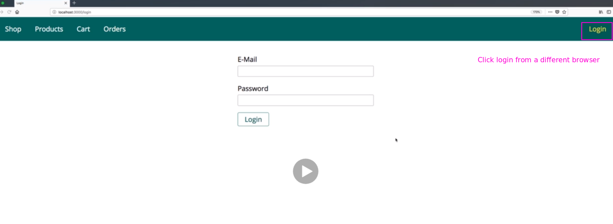

# S14 | Module Introduction
---

# S14 | What is a cookie
---

- Example - In a login page the users sends a request to the server with the login information. 
- The server then sends back the response as a new view/page with a cookie which contains the information that the user is logged in. 
- This will enable the user to send subsequest request without logging in again. 

# S14 | The Current Project Status
---
Download current project folder

- With current code project looks like this
- see that a login nav was added
- Login page is a typical use case for Session and Cookies 

- New Navigation!

# S14 | Optional: Creating the Login Form
---

# S14 | Adding the Request Driven Login Solution
---

# S14 | Setting a Cookie
---

# S14 | Manipulating Cookies
---

# S14 | Configuring Cookies
---
For example for tracking users, cookies is a popular instrument.
Because as you can for example see with the cookies I have here, the cookies don't only have to relate
to your page. A cookie can also be sent to another page and that is a common instrument in tracking.

You can also configure cookies.
We set a value but actually you can set more things than just the value.

# S14 | What is a Session
---

## Notes

What is a session? Well we have the same set up as before, user using the frontend our view is interacting with our server where we have our node application code. We send a request and we do login and again let's assume we do send the valid credentials there, we're not validating them in this module because I want to focus on sessions and cookies. So now instead of storing the information that the user is authenticated in the frontend which was a bad place as we learned, we'll store it in the backend with a so-called session and a session is a new construct which we haven't used before. With that I'm not meaning that we store it in the request because we already saw that this will not work and I also don't mean that we store it in some variable in our express app because that would be shared across all users and all requests, we only want to share the information across all requests of the same user and that's really important, the same user so that other users can't see your data, can't assume your role, can't tell the server that they are authenticated, only you are authenticated. Now for that, we need to store it on the server, we'll start by storing it in memory which is then pretty similar to storing in that variable but eventually we'll move to a different session storage, the database. We need one important piece of information. A client needs to tell the server to which session he belongs because the session will in the end just be an entry stored in memory or stored in a database. 

Now we're not matching this by IP address or anything like that because that is a bit hard to maintain and can be faked and all that fun stuff,so we're not doing that instead we'll use a cookie where we will store the ID of the session. Now obviously you can still change that and assume a different ID if you want to but that will not work like this because actually the value we store will not be the ID but the hashed ID, hashed with a certain algorithm where only the server can confirm that it has not been fiddled with so that you didn't play around with it and tried to create a different one. So this will be a secure way because you basically store the ID in an encrypted way where only the server is able to confirm that the stored cookie value relates to a certain ID in the database and therefore we got a safe value stored in the cookie which you can't, you can change it but you will not assume a different session, a session can be matched and that session can then contain the confidential data which you can't change from inside the browser, that is the idea here. So sessions are stored on the server side, cookies client side, sessions server side. Now let me show you how to implement a session.

# S14 | Initializing the Session Middleware
---

## Notes 

To implement a session, we'll need another third party package, we'll need another package which helps us with managing sessions. For that we'll install it with npm install --save and the package is named express-session, it's a package which is actually part of the official expressjs suite but not baked into expressjs itself but now we already got it installed and now we're ready to use it. To use it, we'll go to our app.js file because we want to initialize that session early on, we want to initialize that session when we, well when we start up our server then we want to initialize the session middleware at least and the session will then be used for every incoming request. So in here we create a new constant, so we basically import something here which I'll name session, the name is up to you and I will require express session, that is what I'll require here, so that is the package we just installed. Now with that installed, we can set it up here along with the other middleware let's say.

There we register another middleware with app use and to app use, we pass session and we execute this as a function and to the function, we pass a javascript object where we configure the session setup. For example we need to set a secret, this will be used for signing the hash which secretly stores our ID in the cookie. So here I'll set a secret, you can enter any text here, it should typically be a long string, I'll name it my secret but again in production, this should be a long string value. Then you should add the re-save option and set this to false, this means that the session will not be saved on every request that is done, so on every response that is sent but only if something changed in the session., this will obviously improve performance and so on. Also there is the save uninitialized value which you should set to false because this will also basically ensure that no session gets saved for a request where it doesn't need to be saved because nothing was changed about it and that is it. These are the core things you need to set. You could for example also configure the session cookie, you could give it a max age by setting a date or add the expires key, so you can configure that cookie but you can also go with the default settings. And with that, the session middleware is initialized and we're now ready to use the session. Now let's start using it in the next lecture.

# S14 | Using the Session Middleware
---
## Notes 

So we added the session middleware, let's now start our server again and let's use the session middleware and how do we use it? Well we can use it in our auth controller in login instead of setting that cookie, we can reach out to request and then the session object, this is added by the session middleware, this session object and here we can add any key we want, for example is logged in but you can name this however you want and set this to true. Now if you save that and you go back to your browser, go to the login page maybe, reload and get rid of that logged in cookie, you can simply delete it here. Now click login and what you should see is that a new cookie was added here, this connect SID for a session id cookie, if you expand the value here, you'll see some strange string and that is what I meant, this is this encrypted value so to say. And this is now the cookie, by default it's a session cookie so it will expire when you close the browser. 

It's a session cookie that will identify your user here, your running instance of this website you could say where you are browsing around, this will identify you to the server and to this session and I can prove this to you. If we now go to the get login page here and I console log requests session here like that, let me then go back and click on the login page here again and go back to our server and there you see the session object is logged. Now let me also output is logged in here by accessing that, go back, login again, it's undefined because I added the this code only after submitting this for the first time, so let me save this again and now simply click that login button here again and now you will see if you go back to the login page, you see true here because now indeed in the session is logged in is stored. And we can go to a different page and come back to login and these are all individual requests which technically are totally individual from each other, totally separated and still we see true here because we still store this in the session on the server side by default, just in the memory not in the database yet and the session is identified for this browser because we have that cookie. 

And I can prove that to you by starting another browser and this will technically be treated as a totally different session and environment, could be a totally different machine. So I am on localhost 3000 here and if I click on login here, you see undefined and that undefined is coming from the login request I just sent because this browser, this user, technically this is a totally different user even though I'm the same but it's a different browser, different user, this user does not have this cookie set for him, does not have an active session on the server. And this is how we can store data that persists across requests as you saw, I clicked around and still that was sent, the true value was sent when I came back to log in, so this is saved across requests but not across users, as you can see this is a different user, I go to login, I have undefined down there and that is the power of using a session. 

It still needs a cookie to identify the user but the sensitive information is stored on the server, we can't modify it and that of course will be super important for authentication and what we see here already is the core mechanism behind authenticating users in the web. There are other techniques too, for example when building a rest API, something I'll come back later but this is a core thing on how authentication generally works especially when rendering views as we are doing it with ejs and this is what we will build up on in the authentication section where we then also dive into things like validating credentials, logging users out and fun stuff like that.

# S14 | Using MongoDB to Store Sessions
---
## Notes 

Now I showed you how to use a session, the problem here is this session is stored in memory and memory is not an infinite resource. So for development, this is fine but for a production server, this would be horrible because if you have thousands or one hundred thousands of users, your memory will quickly overflow if you store all that information in memory. You don't want to do that, from a security perspective, it's also not ideal. So we want to store sessions differently and on the express session documentation, so on the docs, on the github page of that package we're using, if you scroll down to the end, you will find a list of session stores you can use and basically all kinds of databases are supported. You could store it in files though that might not give you the best performance and we will use mongodb because we are already using that right and for that, we'll use the connect mongodb session package here, so we'll install this package now and register this as a store with which we can work. 

So back here in our project, let me quit the server with control c and let's first of all install that package with npm install --save connect -mongodb-session and this will download this package which we can use to let our express session package store data in the database. So now it is installed, we can restart our server and now let's go to app.js where we do initialize our session, here we do configure the session and this is also where we need to configure our store. Now to set up that store, first of all I'll import mongodb store, you can name this however you want and I will require connect mongodb session. Now this actually gives you a function which should execute to which you pass your session, so this session object you're importing from express session is passed to a function which is yielded by required connect mongodb session and the result of that function call is stored in mongodb store. Now with that, you can initialize a new store, store it in a constant named store maybe, that name is up to you and you execute mongodb store as a constructor because this function happens to yield a constructor function which we store in mongodb store. 

To that constructor, you pass some options and now which options could that database store require? Well it will require a connection string because it needs to know in which database, on which database server to store your data. Now we have a connection string down there, so I'll copy that entire url and cut it actually and I will store it in a constant up here, I'll name it mongodb URI, all capital case to signal that this is basically a constant value which I'll reuse and then here, I will use my mongodb URI and I will also use it down there. Please note that the session now will also be stored in a shop database, you could use a different database but then you need to use two different urls, I'm fine with using the same database. I will define the collection though and you need to to define the collection where your sessions will be stored and I will name it sessions but the name is up to you, you could name this however you want. Now you could also add more information, like for example when this should expire and then it can be cleaned up automatically by mongodb but I will set it up like this and now I have my store added here and when I saved, I get an error actually. This can be fixed by removing that retry writes here at the end of the URL, if you do that, it should work. 

So now we get the store set up here and now we can use that store as a session store and to use it, we go to the place where we initialize our session down there and we add another option, the store option and we set it equal to our store constant or whatever you named the constant where you store that initialized mongodb store and with that, your session data will be stored in there. So if I now go back to my page and I do click that login button again, I got a new session, a new session cookie and that session will now be stored in mongodb and we can of course validate that by starting mongodb compass to look into our database. There if you look into your shop database, you will find a sessions collection and in the sessions collection, you'll find a session with an ID and in that session, you'll find that information like is logged in and some information about the cookie which belongs to that session, also you find the expiry date that was set by default. 

So this is how sessions are now stored and this is how you should store them for production, use a real session store, don't use the memory store which is less secure and which also is less unlimited or which will reach limits when more users use your app. But with that sessions are a powerful tool for storing data across requests while still scoping them to a single user and not sharing the data across users because now as you saw, different users have different sessions but this is now a great way mostly for managing authentication but you could also store something like the shopping cart in a session. We are storing it in a database which is also a decent solution but you could store it in a session and therefore indirectly in the database I guess, in the session database collection but you could use a session for something like this. So in general, use a session for any data that belongs to a user that you don't want to lose after every response you send and that should not be visible to other users.

# S14 | Sessions & Cookies - A Short Summary
---
## Notes 

So now we had a look at how we can use sessions and what the advantage of a session is and we also of course learned about cookies, what a cookie can be used for and how it plays together nicely with a session to identify a user, a client and then store the sensitive data on the server, so in the session and that difference between the sessions server side and cookies, client side is really important to understand and you also learned how to set a cookie and how to use a session. Now by the way if you're wondering how that session cookie, this cookie here, how this is set, well this is done automatically by express session so by that middleware we're configuring and that's also why you can add cookie related configurations here because this middleware automatically sets a cookie for you and it automatically reads the cookie value for you too, so it does all the cookie parsing and setting for you. Now with that, you actually rarely need to manage cookies on your own because that session cookie and with that I don't mean a cookie which gets lost after you close the browser but that cookie that identifies a server side session, that is the most prominent, the most common use case for cookies besides advertisement, tracking which you typically don't implement on your own but you use third party tools like Google for that. But that session cookie, so that session identifying cookie is an important thing and sessions on the server are often used for authentication but as I mentioned, you could use them for any kind of data you want to store. We happen to store the information whether the user is logged in but you could be storing the carts, the shopping cart of the user here or anything which belongs to a user which should be shared across requests as I highlighted.