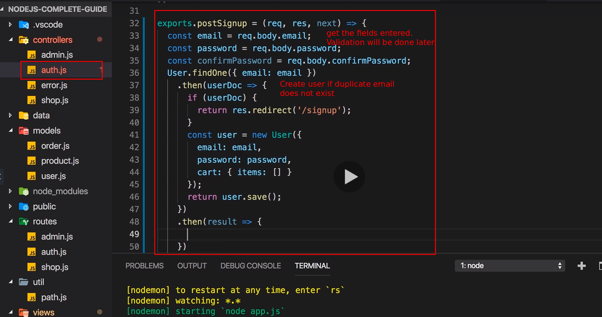
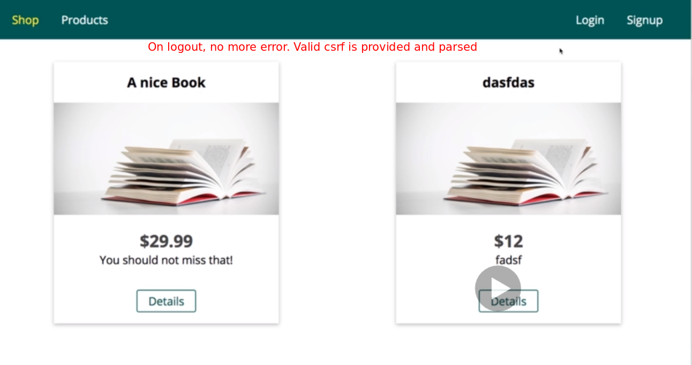
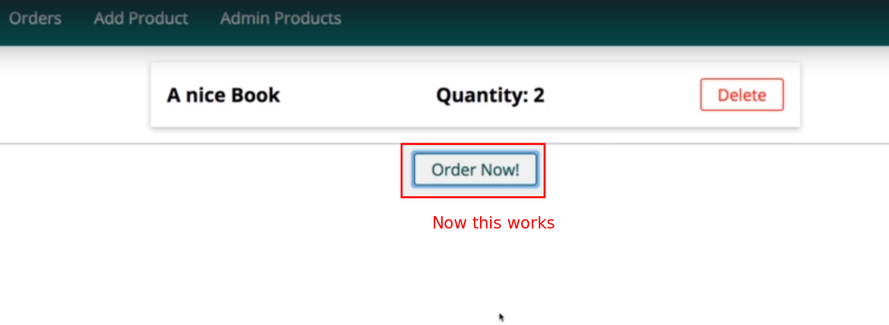
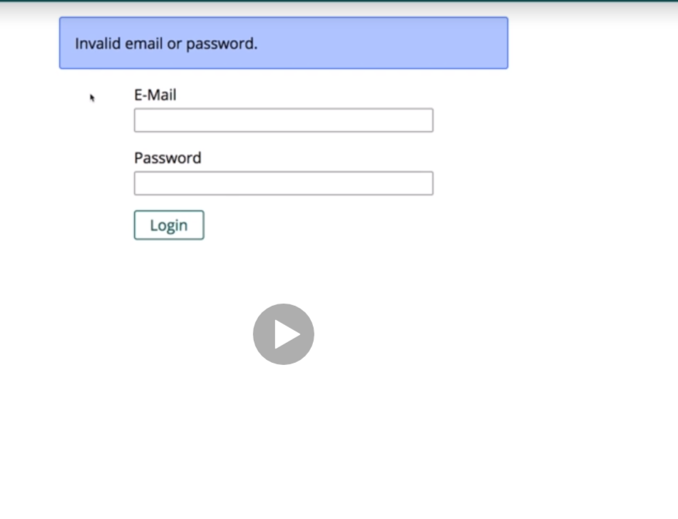

# S15 | Template
---
## Notes

# S15 | What is Authentication
---

## Notes
So what is authentication? Well we obviously got our user using our application, interacting with our views and we get the server and also the database with which our server works, these are all things we worked with in this course already. Now in our application, we might have different routes, different actions a user can do, we might be able to view all products, to create and manage products or to place orders, now obviously we can do more things in our application but these are just some examples. Now the idea behind authentication is that not all these actions are available to every user of our application and now here's one important thing, with user I don't mean logged in user, I mean simply a person visiting our page, visiting localhost 3000 in our case here, later of course the domain under which we deployed it. So I'm not talking about logged in users but really just people using our page and such anonymous users who are not logged in should not be able to do all these things, they certainly should be able to view all products just as you are able to view all products on Amazon.com even if you're not logged in, we want to allow this in our shop too. But there are other things like for example here creating products, managing products and placing orders which should only be available to logged in users and not to every visitor of our page because in order to buy a product, you need to be logged in and in order to create a new product, you also need to be logged in because in our application, we of course connect a product to the logged in user, we match the two things and this is what we need authentication for. We need to be able to differentiate between anonymous users who are not logged in and logged in users and we need to provide a flow, a view and the backend logic that allows people visiting our page to sign up and then to sign in and then we can use sessions as I showed it to you in the last module to store the information whether a user is signed in and well let him interact with the page across requests. This is the idea behind authentication, now how is it implemented? 

# S15 | How is Authentication Implemented?
---

## Notes
How is authentication implemented? Same set up, we get a user, we get our backend, the server side code and the database and now typically, a user will send a login request. Now obviously for that, a user, a visitor of our page needs to have signed up before but after you signed up, you can login with your email and password and on the server, we check whether that email and password combination is valid, whether we have a user with that e-mail and that password in our database. If that is the case, we create a session for this user and you learned how this works in the last module and this session then identifies this user. This is required because otherwise without a session, even if we find out that the credentials are valid, for the very next request the user would be logged out again because remember, requests interact separated from each other, they don't know anything about each other, we need a session to connect them, that is why we create one with the user or the authentication information. We then return a 200 response, so basically a success response and we obviously also store the cookie belonging to that session on the client, we return that with that response so that we really established a session. And thereafter, the user is able to visit our restricted routes because now this cookie is sent with every request, on the server we can connect this cookie to a session and in the session we have the information whether that user is signed in or not and if the user is signed in, we can grant access to certain resources, this is how authentication is implemented in any web application that renders views, we'll learn a different way of adding authentication later when we work with a rest and graphQL APIs but for a traditional web app as we are building it here where we do render ejs or handlebars or whatever templating engine you use, where we render such views, there we will use this session based authentication approach. 

# S15 | Our Updated Project Status
---
## Notes
4-12

So let's dive back into our project and make sure you are logged out and make sure you download the attached snapshot because there I did add a sign up link to our navigation bar and if we click on that, we also load a sign up page where we should edit the caption of the button by the way. So if you download the attached code, what was added and you can also add this to your own project. I did add the sign up.ejs file where I also should change this to sign up, so you can simply add that file to your auth folder. I did manipulate or change the navigation.ejs file, there what I did add is I simply added the sign up navigation menu entry after login, both for the normal menu and also for the mobile menu down there, so basically one list item was added to each menu, this is what I added in this file. And then I worked on my routes, there I added two new routes, posts sign up and get sign up where I use my auth controller get sign up and post sign up actions and in that controller, I worked on these actions. I added posts sign up which is an empty placeholder, nothing in there, so that is not that difficult, get sign up also is is a pretty simple route, there I simply render the auth sign up view. So you can just add this to your existing project or use my attached snapshot and replace my mongodb url with yours and once you got all that, you should be able to have a running application that looks like this with a sign up page that looks like this because now we will use or we will need a way of signing up users. So let's now start implementing the full authentication flow in this module and for that, we'll first of all make sure that we can create new users, then that we can sign users in and sign users out of course, that we can then use the information whether a user is signed in or signed out in all our views and that we can protect our routes on the server side too because right now even if I'm not signed in, what I can do is I can manually visit admin add product and this works. So I can't get there by menu because we hide the menu options but manually visiting this works and this is also something we'll work on in this module. So let's get there step by step and let's start by adding user sign up in the next lecture. 

# S15 | Implementing an Authentication Flow
---
## Notes
13-23

So here I got a very simple sign up form which is a pretty typical sign up form that though, you have to enter an email, you have to enter a password, confirm the password and click sign up. Now in that sign up view, I changed my button label and there I also want to point at the sign up route in the action now, /signup, send a post request to reach that sign up, the post sign up route here which ultimately triggers the post sign up action. Now in this action, we want to store a new user in the database, now which steps does this include? Well obviously we want to extract the information from the incoming request, we want to read the email from the request body email field and make sure you check your view, how these inputs are named because you retrieve the values on request body by these names, so email, password and confirm password in my case, so request body email should work, here I will have request body password to retrieve the password and then I will also retrieve my confirm password here from confirm password, so these are the three values that should reach this route. Now typically what you would do first is we would validate the user input, so for example we would check is this a valid email address and do password and confirm password match and we will do this in this course too but actually I will have a complete module where I dive into how to validate user input because you can of course do a lot of cool things when it comes to that and therefore I dedicate a whole module to that. For now we'll ignore this and that means for now you of course don't have to enter a valid email and you don't have to enter a valid password, you don't have to confirm it either but of course you should do all that to have a realistic testing environment, we'll add validation later. We still need the values here, at least the first two because the next step is that we create a new user or actually there is one step we want to do before we create a new user, do you know which step it could be? Well we want to find out if a user with that e-mail already exists because there should not be any duplicate e-mails in our database. For that we actually can do two things, when using mongodb you could create an index in the mongo database on your email field and give that index the unique property. Now this is something you can do if you know how mongodb works, if you get a little bit more experience with it which you can get with my mongodb course, there I do show this scenario for example but this is only one option of achieving this. An alternative is that you simply try to find a user with that e-mail, so for that we'll use our user model which is of course a mongoose user model and there we can find a user, we can find one user because we already know we don't want to create a user with that e-mail if we find only one user who already has that e-mail and we find that one user by passing a filter with these curly braces and we'll look for the email field in our collection, so in the documents in our collection and see if we find a user where the email field holds a value equal to the email we're extracting here. So right side of the colon is the email we're extracting, left side is the field we're looking for in the database. Now here we get back where we can call then to find out if this worked, we also might get an error which I'll simply log here then and in then, I will get my user object, so my user document you could say, you can name this however you want. Now we know that if user doc exists, so if this is not undefined, then we do have a user and if we do have a user then I certainly don't want to create a new one with the same e-mail. So if this exists, I will actually return a response and I will redirect back to /signup to inform the user that this did not work, right now not much informing is going on as you can tell, we just redirect without showing an error message, this is also something which I'll show you how to better solve this, how to show error messages to the user, for now we'll just redirect back to the sign up page and we'll not create a new user. If we make it past this check, we know that no user with that e-mail exists yet and therefore we can create a new one So what we can do here then is we can create a new user object with new user and we configure our new user and there, we store the email, the e-mail we're retrieving here and we'll store the password, like this for now. One important thing, in the user model there, right now I have a name and an e-mail and no password. So I will change the user model, I don't really want to store a name, you could do that but I'll not do it here but instead I will store a password for the user which will be of type string and which will absolutely be required like this, so my user model changed slightly here. Now with that change in the user model, if we go back to our post signup action, I can create a user like this, we can also add a cart here, the cart by default will be an object where items is equal to an empty array like this and this is now a valid new user which we can save in database by calling save as you learned and then I can return this so that we can chain another then block here which will be called once this save action completed, so this function here will be executed once saving is done. And here we can then redirect to let's say the starting page because here we then know the user did sign up or to be precise, let's redirect to the login page because after signing up, you need to login. So this should now be an authentication flow that does check for the existence of a user and then create a new user. I'll quickly also go to my app.js file and at the very bottom here where I always create a new user if we don't have one yet, I will get rid of that code because now we have a real user creation flow so we don't need that dummy user anymore and I will also head over to compass which I'll start to connect to my mongo database again and in the connected database server if we have a look at the shop database, in users we obviously have one user, the dummy user we used before, now let's delete that user now, we don't need it anymore. And with all these changes and all these files saved, let's reload the sign up page and now let's try creating a new user with a dummy e-mail, dummy password, you don't really need to enter a confirm password because we're not checking this anyways and click sign up. Now this is looking good because I'm on the login page so I was redirected, I also have no server error, if I now reload my users collection in mongodb, in compass, I also see this is a user with the credentials I add. So we did add a new user but we have a huge problem with that user, can you identify it? We'll fix it in the next lecture.

# S15 | Encrypting Passwords
---
## Notes
We did add a basic authentication flow or a signup flow in the last lecture but we have one huge security flaw in our current approach. Do you know which flaw that is? Well we can see it in this line when we store a password. We're storing the password in plain text and we can see that here in compass, this is the password I entered and it's stored in plain text. Now this is not how you should do it because if your database gets compromised which of course we want to avoid but if it happens or if some employee of your company has the rights to look into it, your user passwords are fully exposed. So what we should do is we should encrypt that password, we should hash it in a way that is not reversible, where people cannot construct the password from, so that even if you get access to the database, you might be able to see the e-mail but you're not able to see the password, the real password that belongs to the e-mail. This is something you should implement and this is something we will implement now and for this we'll install another package. So I'll quit my server with Control C and install that package with npm install --save and the name of the package is bcryptjs, written like this. This is a package that helps us with encryption and that will help us with encrypting the password. Now once this was installed, we can restart our server with npm start and now in the auth controller here, we can use bcrypt, so here I will add an import at the top and I'll name it bcrypt, the name is up to you and I'll require bcryptjs, like this, so the package we just installed. With it installed, let's head over to post sign up here and here instead of storing the password like this, I will store a hash password. For this right before I create my user, I'll use the bcrypt package which I installed and which I imported here and I will call the hash method. The hash method as a first value takes the string which you want to hash, so in our case the password, so we'll pass the password here. The second argument then is the salt value, now this is simply specifying how many rounds of hashing will be applied you could say and the higher the value, the longer it will take but the more secure that will be, currently a value of 12 is accepted as highly secure. Now this will generate a hash password but this is an asynchronous task and therefore this actually gives us back a promise. So I will return this so that I can chain another then call, a then block where I will get my hashed password as an argument once it's done, so this function here will be called once the hashing is done and therefore the user creation will go into this then block and there I have the hashed password available and the hashed password is what I'll store here. And with that, we dramatically improve the performance because now if I do sign up again, first of all let's use a different e-mail otherwise it should fail, we can test this in a second too. So I use a different e-mail, if I sign up now and I look into my collection, this is the new user and this is of course not the password I entered, this is the hashed value and the important thing is you can't reconstruct the password I use, you can't decrypt this. This is also the reason why we don't encrypt the e-mail because we won't be able to decrypt this, I will still show you how we can then find out if the user entered a correct password but we can't decrypt it, so if we need to send messages to that e-mail, that would not work if we encrypt the e-mail as well because we could not revert that. So we need to store the e-mail like this but the password is secured, it's not readable. So this is how we should store it and now I will get rid of my other user but not before testing whether that works. So if I try to create a user with that same email again, I'm redirected to sign up. So I don't see an error message because I didn't add anything that would show such a message but it seems to fail here, that is good so for now, we can't create a new user with the same credentials. Let's now get rid of this one with the insecure password and continue with the one with the secure password.
24-30

## bcrypt - npm package
https://www.npmjs.com/package/bcrypt

# S15 | Adding a Tiny Code Improvement
---
## Notes
One quick word about my current set up here by the way, since I return my redirect to signup here and we do this in a then block, this will actually redirect, this is correct but it will still execute the next then block, this is how promises work. So this code execution in this function does finish because I return but the overall code execution does not and therefore we reached the next then block even if we redirect and that is why we get this password is required error when we use an existing email because we reached this then block and the function in there but hashed password will be undefined here because since we return after redirecting, we never execute the hash function so we reach this function without the hashed password and this is why we get this error. So the result is the same but if you want to avoid this, what you can do is you can take that code and actually chain it in here, so I have a nested promise instead of one promise chain with multiple then blocks, we will end after this then block if we redirect, there only is the catch block here for catching errors of which we don't have one and then the server then blocks here are only executed if we make it into the hashing mode. That is a tiny improvement that logically makes more sense here.

# S15 | Adding the Signin Functionality
---
## Notes
Now that we are able to sign up, let's also add some functionality to ensure that we can sign in and for that, we obviously have our login page and when we enter something here, we reach our post login route here. Now in there we still have the old dummy code where we just find our default user which by the way won't exist anymore because we deleted it and then we would create a session. This is obviously not the approach I want to use anymore, instead what I want to do is I want to find a user in here but I want to find the user by the email the user entered, so let's first of all extract that. Let's extract the email from the request body and let's extract the password from the request body, these are two pieces of information I need for signing a user in. And then here I'll not use find by ID but find one to find one user with a specific e-mail and there should be only one user with an email in the database and I'll find the user by looking for the email field in the documents and comparing it to the e-mail value we are extracting here. Now if I find a user here so if I make it into here and I then have a user, then I know that we can check the password next. If I don't have a user here, so if user is undefined, I didn't find a user in the database and then I can simply return here, not execute the other code and simply redirect back to login for now because the login failed because we tried to use an e-mail which does not exist in the database as we didn't find a user for it. If we make it past this if check, we know that the e-mail exists but now we need to validate the password of course. We'll do this with the bcrypt package again because the password is of course stored in a hashed form and I mentioned that we can't reverse this, so how can we now compare the password? Well remember that bcrypt was responsible for creating the hash, bcrypt uses a certain algorithm for that and we can essentially pass the password the user entered into bcrypt and let bcrypt compare it to the hashed value and bcrypt can then find out if the hashed value does make sense, taking into account the algorithm that is used for creating that for the password you entered as plain text. So if that plaintext password, if you would hash it could result in the hash password and if the answer is true, then you know the user entered a valid password. And for this, brypt has the compare function and there we enter the password we want to check, so the password we extract from the incoming request and then the hashed value against we want to compare it and that is found in our user document which we get from the database and there of course in the password field. Now this also returns a promise, so here we can add then and a catch block. Now if we have an error here, so if we fail to compare this, then I also want to redirect back to the login page but if we make it into the then block, then I want to check whether we were successful. Now important, with compare we'll only face an error if something goes wrong, not if the passwords do not match. In both a matching and a non-matching case, we make it into the then block and result will be a boolean that is true if the passwords are equal, so we could also name this do match to make this clearer and it will be false if they are not equal. So here we can check if do match is true, that means the passwords are equal, the user entered a valid password and then we could return to not execute any other code, we could return a redirect to the starting page. If we don't make it into there, then we want to redirect back to the login page because then the user entered an invalid password. Now we also want to set a session as we did it before and that session code should only be set if we have a matching password, so if the user did authenticate. Then we can still set is logged in, we can still store the user in the session because we still need the user object and the user here keep in mind is the user we retrieved from the database and we want to save that session and only redirect in that session after we saved it successfully. Therefore we should also return this to avoid code execution of this line because the callback here will execute asynchronously, so this needs to be returned to not execute this line here, in here we don't need to return then because after this line, this line can't be reached because this line is in a callback in a different function. So with all that in place, we should be able to sign in if we do enter a valid password, let's give this a try. So keep in mind my email is test2 and I used tester as a password and first of all I will try a wrong email, I'm redirected back to login so this didn't seem to succeed. We can also quickly go to the sessions and clear all sessions here so that we can really prove that no session was created. So now let me enter a valid email but an incorrect password and I'm again redirected back and no session was created here but now let me enter the valid email and the valid password and now I'm on the starting page. I see all options which is looking good, we get no error here and if I have a look at my sessions collection, we've got a session here because now I am logged in, this is the user object with which I'm logged in, so this is correct and now we got a working login flow, taking into account our email and so on. 
32-39

# S15 | Working on Route Protection
---
## Notes
Now that we are able to sign up and sign in, we have to work on route protection. We already have a setup where we only show the menu options we should be able to interact with but even when I logout and therefore my session is gone, even when I do that, I can still manually enter admin add product and reach that page and I could even try to create a product here, I would fail then because there would be no user object on the backend where I tried to get the logged in user but this is not the user experience we want to offer, we don't even want to be able to load this page if we're not logged in and for that, we need to protect our routes. Now how do we protect routes? Well to protect routes, we want to check where the user is authenticated before we render back let's say the add product page. So in admin in the admin controller, in get add product which loads that page, before we render that page, I want to check if in the request session is logged in is set and to be precise, I want to check if it's not set because if this is not true, the user is not logged in and if the user is not logged in, then I want to redirect let's say to the login page like this. So then since I return here, this code will not execute and I won't load the added product page. So now let me try to reload this page, keep in mind I'm not logged in and I'm on the login page. So this works, I am redirected here because session logged in is not set. On the other hand if I do login now, so if I do enter my valid credentials here and I try to access add product, this does work because now I make it past this if check. Now this is a code we could add to every route which we want to protect but adding it like this is a bit cumbersome, so let me show you a better way of protecting our routes or a more scalable way in the next lecture.
40-43

# S15 | Using Middleware to Protect Routes
---
## Notes
**As I mentioned in the last lecture, we could protect our routes like this but this is not really a scalable way, we would have to add it to every route which should be protected, to every controller action. So instead I want to create my own middleware which I can add on every route that should be protected.**

And for this, I'll first of all create a brand new folder in my project here. So in the root of the project, I'll add a middleware folder, you could name this however you want, it doesn't have to be named middleware. In there I'll add an isauth.js file and you can also name that file however you want and I will simply export a function here, a typical middleware function where you get request, response and next and then you execute some code. So I want to export such a function here. Now in that function, I'll simply implement the code I showed you in the last lecture, so I check if we are not logged in and if that is the case, then I will return res redirect login like that, otherwise I'll call next because otherwise I want to allow the request to continue to whichever route the request wanted to go to. Now this is the same logic as before but it's wrapped in a middleware, now we can go to the routes folder and there, 

**you can actually add as many handlers for any route you want and the request will be funneled through them from left to right.**

This means that in here, I can now import my isAuth middleware by requiring it from my middleware folder, isAuth like this and isAuth can now simply be added as an argument to get and you can add as many arguments as you want, as many handlers as you want therefore and as I mentioned, they will be parsed from left to right, the request will travel through them from left to right. So the request which reaches get product goes into that isAuth middleware first and in the isAuth middleware, we might be redirecting and we don't call next, hence the request would never continue to that controller action but if we make it past the if check here in the middleware, we do call next, so the next middleware in line will be called and the next middleware in line would be our get add product controller action here. And this means that we can now add this isAuth middleware to all the routes here because these routes actually all require authentication and in the shop.js file, there also are some routes that should be protected, so I'll import isAuth here too by requiring it from the middleware folder, like this and then there too, I want to protect get cart because we need to be authenticated to have a cart, I will protect post cart, I will protect deleting a cart item, posting an order and viewing the orders, so all that is protected with the help of isAuth. So now this means that if you are not logged in, you actually can't access these routes. I am not logged in here, now let me show this to you and let me logout and now I'll try to access admin add product and you see I end up on the login page and the same if I try to access cart, I end up on the login page. I can visit products and the details and so on but I can't visit the rest. 

**So now we have route protection in place and we don't just hide the menu items here 
But we really check the authentication status with the help of the session on the server side and there, 
the user has no way of manipulating it, 
So now we ensure that some routes, some methods are only available to logged in users.**

And indeed if I do login again, I can of course add a new book here for example with that same image we reused a couple of times but it's still new. So let's add this, this works. So all of that can be done, all of that is supported here, you see we can edit a product, we can also delete a product if we want to, this all works but we protect it against unauthenticated access.
44 - 49

# S15 | Understanding CSRF Attacks
---
## Notes
Now that we have our authentication flow and route protection in place, let's talk about security and there, about csrf attacks. Csrf stands for cross-site request forgery, now what is this? This is a special kind of attack pattern or approach where people can abuse your sessions and trick users of your application to execute malicious code. This is how it works, you have a user in your application and now let's assume this is a visitor who indeed is logged in, you have your server side code and your database with which you interact. Now the user interacts with your frontend views, so the pages you render back and you get a session for that user and of course the cookie that belongs to that session, so everything you knows. Now the user can do intended things like for example send money to B, if you are building a banking app or in our application, order some products with his own shipping address if we had such a checkout process. 

**Now in a csrf attack scenario**, your user is tricked onto a fake site and this can be done for example by sending a link in an e-mail, that site can look like your own page but it technically is a different one. Now on that site, there could be a link leading to your page, to your real page executing some request there, of course you could include a form for example which sends a post request to your page, so to your own node server where you added some fields to send money to another person, to C in this case instead of B. To the user, this is pretty invisible because he saw a page that maybe looked like your page or clicked on a link that instantly redirected to your page but with behind the scenes some data being sent there that does something the user would not want to do normally. Now why does it work? Well since you got valid session for that user if you send something to your site, to your servers, your session is used for that user and therefore that behind the scenes data that the user never sees that configures the money transferal or the order in a certain way that is not ok to the user, this part is invisible to the user but the valid session gets used for it because your server is used and therefore this is accepted. 

**This is an attack pattern where the session can be stolen so to say, where you can abuse the fact the users are logged in and you can simply trick them into making requests which they might not even notice** 

and obviously we want to protect against this attack pattern.

**How can we protect now? Well the idea is that we want to ensure that people can only use your session if they are working with your views, so with the views rendered by your application, so that the session is not available on any fake page that might look like your page but that aren't your page. And to ensure this, to add this feature, we will use a so-called csrf token.** 

Now let me show you how this works in the next lecture.
50 - 52

# S15 | Using a CSRF Token
---
## Notes
So csrf protection is an important thing and to support that or to add it to the app, I'll quit my server and I'll install another package with npm install --save, the name of the package is csurf, 

**This is a package for node express which allows us to generate a so-called csrf token. Basically a token, a string value we can embed into our forms, so into our pages for every request that does something on the backend that changes the users state, so anything like ordering something, anything that does something sensitive which we want to protect against.**

**We can include such a token in our views then and on the server, this package will check if the incoming request does have that valid token. Now how does this protect us? Well the fake sites might send a request to your backend and they could theoretically use your session therefore but the requests will be missing the token and they can't guess the token because it's a random hashed value and only one value is valid of course and the package here which runs on the server determines whether a token is valid, so they can't guess it and they also can steal it because a new token is generated for every page you render.**

So with that package installed, let's rerun npm start and let's use that csurf package and how do we use it? To enable csrf protection, we go to our app.js file and in there first of all at the top, let's import this package, I'll name the constant csrf and I'll require the csurf package. Please note the package is named csurf, the tag pattern is csrf, that is why I named the constant like this, you can name it however you want of course. Now we can create a new constant where we initialize this you could say, so down there maybe where we initialized some other things too, I'll initialize my csrf protection by executing csrf as a function. Now you can pass an object here where you can configure some things, for example that you want to store the secret that is used for assigning your token, so for hashing them, that you want to store them in a cookie instead of the session which is the default but I want to use the session, the default and we also don't need to set any of the other values, you can dive into the official docs of that package to learn more but the default settings should work fine. So with that, we get this csrf protection middleware here and we now just have to use that as a middleware. So here after we initialized the session, that's important because csrf, the package will use that session now. After we initialized the session, I'll add csrf protection, so basically the constant which holds my created middleware here. So now with that, csrf protection is generally enabled but we still need to add something to our views to really use it. Right now if I save this and I go back to my app and I reload this page, this works, if I go to orders this works, 

**if I logout, this fails, I get an invalid csrf token here and this is already showing us how we or what we have to do in general. It failed here because that logout action here actually was a post request and for any `NON-GET` requests because you change data via post requests typically, for any such requests, this package will look for the existence of a csrf token in your views, in the request basically in the `request body`. Now to make sure that such a token is there, we first of all need to ensure we have it available in our views, to do that we have to pass data into our view.**

So let's say I'm on the starting page slash nothing, so in the controller actions, that is my get index action, this one. Now here we would have to pass a new piece of information into the render method, you could name it csrf token, that name is up to you and you get it from request and then there, there will be a csrf token method. This method is provided by the csrf middleware which we added by this package. So now this will generate such a token and we'll store it in csrf token which we then can use in our view and there we could use it for example in the navigation where I have my logout button form. In there we would have to add input which is hidden so that no real input is rendered but where the value now is a value we output with the help of ejs and that value here will be our csrf token and the name here is just a field I'm storing that token in when rendering that view, this field, csrf token. With that if I reload this page, let's inspect the logout button here in the developer tools and let's make sure that in the navigation.ejs file, we don't just add it to the mobile logout button but also in the other menu here. So with that changed, let me reload this and now when inspecting the logout button, you will see that there we also have that input with the value of this token and this here is the csrf token which was generated by the package. If I now click on logout, I still get an error here though, the reason for that is that my package csrf does not know that this hidden input contains my token, it's just a hidden input without any name. So what we have to do is we also have to give this a name and here important, the name has to be _csrf because the package which we added will look for this name, so for an input with that name and the same of course should be done here in the mobile login button. Now with that if we reload this view, if I click logout, now it works because now the package is able to extract that csrf token. It also finds out that the token is valid and therefore it allows us to proceed, 

**So now it's not just a session that matters but also the existence of this token.** 

**Now we can add this to all our render functions because we need it in all our routes but that would be a bit cumbersome, so let me show you an easier way of getting data like this or also isAuthenticated into every page we render and not just some.**
53 - 67

# S15 | Adding CSRF Protection
---
## Notes
So we added csrf token protection but it will only work if we are visiting our get index page. Now we want to have such a token and by the way also, our authentication status on every page we render. What we can do to get it onto every page is we can remove it from our render function here and instead tell expressjs and this is now totally unrelated from csrf thing, tell expressjs that we have some data that should be included in every rendered view. We'll do this in the app.js file and there after this middleware where we extract the user but before all our routes, I'll add another middleware, a normal middleware with our normal middleware function with the three arguments and in there, we can use a special feature provided by expressjs, 

**we can access a special field on the response, the locals field. This allows us to set `local` variables that are passed into the views, local simply because well they will only exist in the views which are rendered.** 

So there, we can add our isAuthenticated property which I removed from the render function where I access request session is logged in and I can also add my csrf token variable which I get from request csrf token from this function. 

**So now for every request that is executed, these two fields will be set for the views that are rendered and then we have to call `next()` so that we are able to continue.** 

With this if we go back and we reload this page, seems to work, seems to work and now let's also try signing in where we also have a post request and now this fails and now do you know why? Well because I do pass my token into all views but in the views, I still need to use it. So for that, we have to repeat the code we added to the navigation, we need that hidden input with that name and that value and we have to add it into all our forms and that is something you just have to do. So for example here in the Add to Cart post form, we need that hidden input with the csrf token and also in admin edit product, we need somewhere in that form that hidden token input. The same for our auth routes of course, when logging in we need that hidden input and the same for signing up, this is required. In the products.ejs in the admin folder, there we also have a form for deleting a product, we need the token in there too. And in the shop in the cart, we also have a delete cart item button, we need the hidden input there as well and also down there for the order now button, this also sends a post request and we need our hidden input there, our csrf token. On index.ejs we don't need it, in add to cart I just added it so there we already have it, in the product list page, it's the same, it was added to add to cart and on the product detail page, I also only have add to cart. On the orders page here, we also have no post form. So now we should have this token everywhere where we need it and if you save all that and you now go back to your let's say starting page and you visit the login page and you do login, this now works because we have that token, we also can add items to the cart, we can also order them, well there is an error which we'll fix in a second. So for now let's not order them but let's delete them, this works and generally this works. Now let me fix this bug here which is not related to the csrf token in the next lecture real quick but this hopefully and that is the main takeaway here, 

**shows you how to use csrf protection and this is a crucial thing which you have to add to any production ready application, it's not optional otherwise you'll have a huge security issue on your page. You need to add this to ensure that your sessions don't get stolen.**
68 - 74

# S15 | Fixing the Order Button
---
## Notes
So now that the csrf protection was added, let me quickly fix that error where I was not able to order an item and there, the path username is required is the issue which is thrown, let's quickly check the shop controller and there, the post order and in there, I indeed store the username and I'm not storing the username anymore here. When signing up, users only have the email, so here we could store the e-mail for our user with request user e-mail on the order, like this. So instead of the name, I now store the e-mail of the user in here or you also omit this and just store the user id, whatever you want. Now in our order model, this means that here I also don't expect the name but the email which still is a string and still is required, So this is a tiny change that needs to be done to fix that issue and if I now go back to products and I add this to my cart and I add it to my cart again let's say therefore I have to order this, now this works and the cart is empty. So this was just a little node something that was required, let's logout, this all works. This is this bug fixed. 

76 - 79

# S15 | Providing User Feedback
---
## Notes
We've got all the core features that are related to authentication implemented, now I want to work on the user experience a little bit at least. Right now when we login and we for example try to login with invalid credentials where we don't find the email or the password does not match or we try to create a user for whom the email already exists, then we are just redirected without any error message being shown on the page. Now I will dive deeper into how to validate user input in the validation module of the course but here we're not talking about validation so much but really about giving some feedback to the user in general. Now when rendering views with the render method as we are doing it here, including data that should be rendered on the page was simple, by the way isAuthenticated can be deleted here because we always include this as a local and that is the case for all our routes as a side note, so you can remove that isAuthenticated thing from all render methods but this is not really what I wanted to do here, it's a little side thing we can do though. The main thing is that it's easy to pass data to our views inside of the render method as you can see, it was never a problem to get our data into the views there. 

**However it is a huge problem if we want to pass some data into the rendered view when we are redirecting as we are doing it here because upon a redirect, technically a new request is started, a new request to /login in this case and on that new request, we don't know that we got here because the user entered an invalid e-mail or anything like that, when we triggered this new request this is treated in the same way as a request that was triggered by clicking on the login button in our menu. So we have no way of finding out if we want to display an error message or not and hence in the render method of get login where we show that login page, we don't know if we want to include some error message.**

**Now to solve that problem and store some data before we redirect which we then use in the brand new request that is triggered by the redirect, how could we do that? Well you learned if you want to store data across requests, you need a session. So we can use a session for that but of course I don't want to store the error message in the session permanently, I want to add something to the error message, kind of flash it onto the session and once the error message was then used, so once we pulled it out of the session and did something with it, I want to remove it from the session so that for subsequent requests, this error message is not part of the session anymore and for this, we can use another package which makes this really easy.** 

We install that with npm install --save and then the package is called connect -flash, if you hit enter, this gets downloaded and added to your project, you can restart the server thereafter and now connect flash is really simple to use. First of all we initialize in our app.js folder, file, in there we install it or we import it just as we import other packages, you can store it in a constant which you name however you want, I'll name it flash and I will require connect flash here. Now flash then needs to be registered you could say, initialized, I'll do this here at the bottom, you need to do it after you initialized the session, so certainly after this middleware, there I will call use and I will simply call flash as a function here. Now we can use that flash middleware anywhere in our application on the request object. So now let's save that and let's head over to auth.js and let's say here when we're logging in and we don't find a user with that e-mail which is the problem here, we want to flash an error message into our session and we do this now with request and there will be a flash method now added by this package. This flash message now simply takes a key under which this message will be stored, we could name this error and then the message and in this case this would be invalid e-mail or password. Now you could also say just invalid e-mail, some people advocate not being as clear as people can otherwise guess which part of the credentials was wrong, I'd argue they can test this anyways by trying to sign up with that e-mail but whatever you want, you can output or flash such an error message. Now with that it's in session and it's in there until we use it. Now we want to use it here when we do render the login page, here I want to include an error message variable let's say and that error message variable will simply pull that by using request flash again and here we now just access the key for which we want to get the message. So in my case that key is what I specified here, error, so now I can pull that message out with error. So whatever I stored in error will now be retrieved and stored in error message and thereafter, this information is removed from the session. So now error message will be set and will hold a value only if we have an error flashed into our session and therefore we can now move over to our view, to the login view and display the error message here. Let's say above all of that I add a div and for now let's make this really simple and just output our error message, so here error message is the variable in which I'm storing it. Obviously I want to check if that exists before I render this, so I will wrap this with some ejs if statement where I check if error message, this will not be treated as true if it's simply not defined so if we simply are not able to retrieve anything and then let's try to output it like this, let's see if that works. If I go back to my application and I reload that login page, that seems to work and now let me enter an invalid email and indeed I see invalid e-mail or password. If I do enter a valid email but an invalid password, I don't see that because there I don't flash anything onto my session yet. So this is working, now let's quickly reformat that, I'll do that in next lecture, you can skip it and download the finished formatted code if you want to and thereafter, let's add this in other useful places too. 
81 - 90

# S15 | Optional: Styling Error Messages
---
## Notes
I'm outputting that error message, I just want to style it a little bit now and for that I'll give it a css class and I'll simply name that user message and then maybe user message --error using some BEM styling here, that's a css styling convention or a convention of naming your classes. Doesn't matter too much, you can name this whatever you want in the end, I added these two classes, one to have a general message look and then one for errors because maybe we also want to be able to output success messages later. So with that, let me quickly add this to some css files and you can skip this lecture if you want, in the next lecture you find the finished code attached which you can use. In the main css, I'll quickly add this, let's say at the bottom of this file, it's up to you right before the media query maybe, I have my user message, so this css class I just added here and let's say such a user message should use a margin auto to be centered, get a width of 90% by default, I'll also set up some styling in case I'm on a bigger screen, there user message will have a width of let's say 30rem and then here I'll give it a border of one pixel solid and let's use maybe some bluish color here, maybe not that blue, well basically which ever blue color you want, maybe this one and a background color, I'll also use a blue here, also a different blue, so some light bluish color here so the general info message should have maybe some neutral color, so some blue like this and let's see how that looks like. With it added, let me try entering an invalid email again, looks like that, well not too pretty, that should be much lighter. I also want to have some padding in here, maybe 1rem and let's give it some rounded corners as well and now with that, if we enter an invalid email that looks much better. Ok so now this is my general info message, let's also maybe also center the text if we want to and now let's give this an error version basically with --error, that's the other class I added to this specific box in my login screen and there I will change the border color to be red and the background should be a light red, so let's start with red and then turn this into a light red and now if we try this again, now it looks like this. Ok so this could be the error message we're outputting here, you could also turn the text red if you want, so you could also say text color should be red here maybe and reduce the padding maybe to .5, that could look a bit better, so an invalid email or password, that looks good. Now I always have that stickaround now, reason for that is if I go back, error message seems to be set to something even if we're not having a message in there and that is something I'll check in the next lecture.
91 - 98

# S15 | Finishing the Flash Messages
---
## Notes
So I added a message box in the last lecture, you can download the finished version of the entire project attached, I simply added css classes to my div which surrounds the message and then I worked on these classes in the main css file, I added user message and user message error and also added some user message entry to my desktop sys classes. So you can add this manually from the attached code, now one thing you'll notice is that even if you load the login page regularly, you'll see an empty box here. So even if no message is flashed, it looks like error message is not set to undefined and therefore let's quickly go to auth and let's simply console log request flash error to see what's in there that's causing this to not be undefined basically. So if I reload this page, I see it's an empty array and if I do enter something here, you see it's an array of messages. So in the end what do we want to do is we want to extract our message here is equal to request flash error. Now if message length is now greater than zero, then I know I have a message in there, so now I'll actually turn this into a variable by using let here and then I can set message equal to message the first element because I want to retrieve that otherwise I'll set message equal to null and now down there, we can use the message and pass that as an error message. If we now save that, don't have the box here, if I do enter something invalid, we do see the error message though but if I go to the login page regularly without an error, I don't see it. So this is now how we can use these flash messages and output them in a nice error box. Now here's also a challenge for you, find some other places in the login and sign up screen where it would make sense to flash other messages onto the screen. We'll do it together in the next lecture. 
99 - 103

# S15 | Adding Additional Flash Messages
---
## Notes
So were you successful? We added our flash message here when we used an email which we did not find, now obviously if we have a password that does not match, here where we also redirect to login, I also want to flash my invalid email or password message onto the session. So this is another great place because if we now save this, on the login screen I might have a valid email but an invalid password and I get this error message, with valid credentials, it of course works fine though. Now we can also do something when signing up because when signing up, I'm checking whether an email address already exists, well before redirecting here I can also output something there, email exists already, please pick a different one, something like that. If we now save that and I enter the e-mail address which indeed does already exist, well then I'm redirected without having any effect and that makes sense because we flashed a message but I'm not outputting it, so we need to go to the login page and copy that code for outputting an error message and then go to sign up and there above the form, let's also output the error message here but of course for this to work, we also need to extract it when loading the sign up page. So that code which I'm using in get login to render my error message, I need that in get sign up too and then there I also need to pass this error message variable to the view which holds that message I'm extracting otherwise we can't display it even though we flash it into the session. So now with that, let's try this again, let's reuse a password, an email that already exists and now I get this error, if I do create a valid user with a valid email, this works however. So now if we quickly check our users collection, we see that was added. So these are some messages I can flash onto the screen, you could add more, for example after logging out you could also output some confirmation for that but this should do it for now. It was a nice practice and improves the user experience a little bit. 
104 - 108

# S15 | Wrap Up
---
## Notes
So that's it for this module. I'll actually dive into some other authentication related things in the next modules, for example we'll add password resetting but these are the basic things you need to know about authentication. You learned what authentication means, that it means that not every visitor of your page can view and do everything, that authentication has to happen on the server side to ensure that users don't trick you into thinking they are authenticated and that you therefore use sessions to store the authentication status and that you can protect routes by checking that session controlled login status right before the request reaches your controller action or the code in general that is executed in a route. Now authentication obviously also is strongly tied to security and providing a good user experience and therefore passwords should absolutely be stored in a hashed form. If you store them in plain text, if your database gets compromised, the attackers have full access to your user accounts. Additionally csrf attacks, cross-site request forgery attacks are a real issue because your session can be stolen there so to say and therefore you should implement csrf protection as shown in this module in any production ready app you're planning to ship. Now for a better user experience, you can look into flashing data or messages as we did it in this module into your session store, flashing means that this data will be removed from the session automatically by the package we used once we used the data and we can use that data to persist data across redirects because redirects technically trigger two different requests or we have the old request we redirect and then a new request starts and if we want to share data across request as you learned, we need to use a session. So these are the general authentication related things you need and with this knowledge, you already get very very far. Now in the next module, we'll have a look at how we can send mails from inside our node application because we'll need that feature to then enhance our application a little bit regarding the authentication so that we can also add a password resetting mechanism. We'll do this in the module thereafter but in the next module, let's first of all have a look at how we send mails. 

# S15 | Useful Resources & Links
---
## Notes
Attached, you find the source code for this section.
When using my source code, make sure to run npm install in the extracted folder!

## Useful resources:
Bcrypt Official Docs: https://github.com/dcodeIO/bcrypt.js
More on CSRF Attacks: https://www.acunetix.com/websitesecurity/csrf-attacks/