# S15 | How Does Sending Emails Work?
---
## Notes
So how does sending mails work? Well we obviously get our node server with our code and we get our user and we want to send an email to that user. Now it's super important to understand and a common misconception that node and expressjs, these are language or frameworks runtimes that we use for writing our server side logic but with nodejs, you can't trivially create a mailing server. Handling mails is totally different to handling incoming requests and responses, it's a totally different technology, something totally different happens behind the scenes. Therefore in reality, you will very likely never implement your own mail server because that is a very complex task, creating a mail server that is capable of handling thousands or one hundred thousands of e-mails at the same time, sending them and so on, security, all that stuff is highly complex, so in reality you typically use third party mail servers for that and that is exactly what we will do in this module too but I will show you how to interact with such a service to send that e-mail through that service. And by the way all major web applications you might be interacting with including Udemy don't have their own mail servers, they are using third party providers like AWS or whatever it is for sending e-mails, so that is exactly what we will do in this module too.
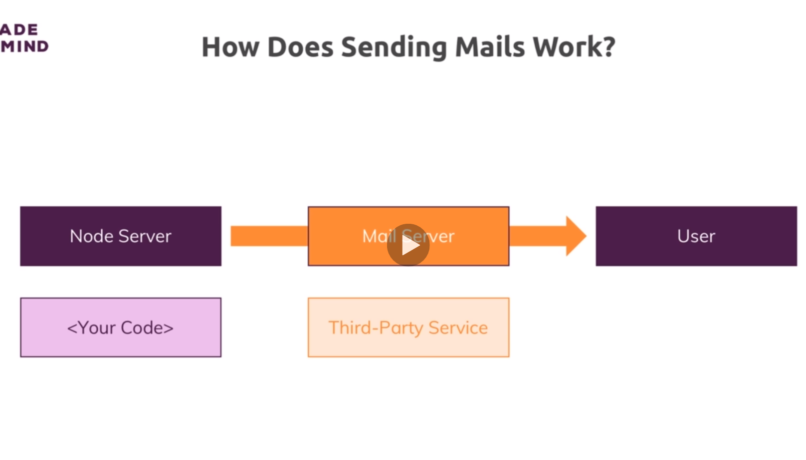 

# S15 | Using SendGrid
---
## Notes
So in this course, I will use sendgrid you'll find it on sendgrid.com and I'll use it because they have a free entry tier which stays free as long as you send less than 100 e-mails a day. 

**Now there are many alternatives, MailChimp, AWS, SCS and you can google for nodemailing and your favorite mailing service to find tutorials on how to implement it**

now I will use this one because we can use it for free. So let's click try for free and then we simply have to create an account there. Now once you did sign up, you can quit that page here and go back to your node project and there we'll now install a package. I'll install a package with npm install --save which is called node mailer and to interact with sendgrid, I'll also install another package in the same go, nodemailer-sendgrid-transport, that is a package that will help us with integrating sendgrid and conveniently use that together with nodemailer. Nodemailer is a package that as the name suggests, makes sending emails from inside nodejs a breeze. With that all added, we can move on to the next lecture and now start using nodemailer to send messages. So let me start that server again and let's continue in the next lecture.
2 - 5
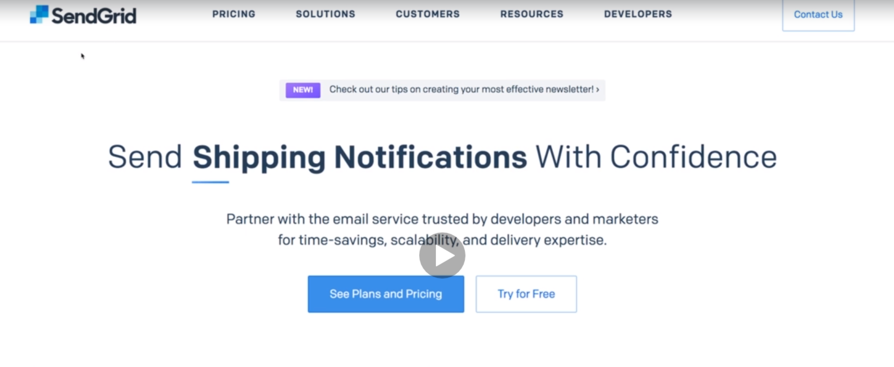

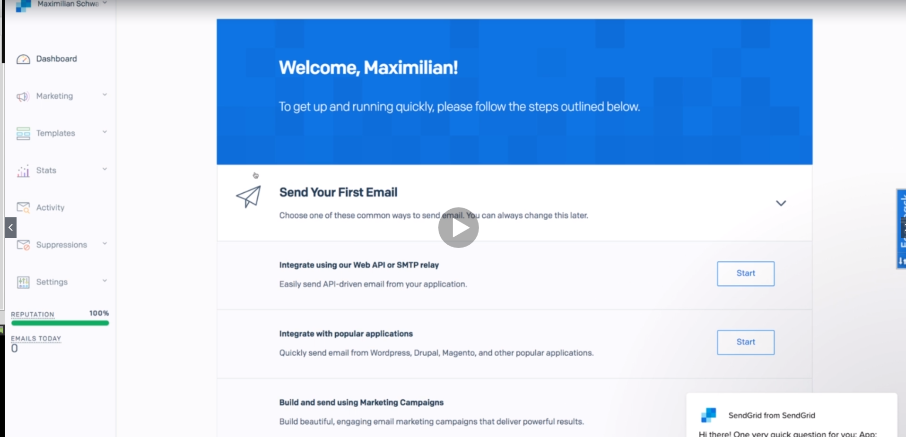
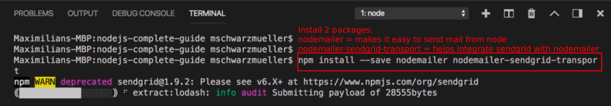

# S15 | Using Nodemailer to Send an Email
---
## Notes

I added nodemailer and now I want to use nodemailer to send an email. For that in my auth.js file which is the only file where I will interact with it, I will import nodemailer and store it in a constant at the top, so require nodemailer like this and I will also import sendgridTransport, you can name these constants the way you want as always and this will inport nodemailer sendgridTransport. With that imported, I can initialise a couple of things here. For nodemailer, we need to initialize a so-called transporter, so that is essentially some setup telling nodemailer how your e-mails will be delivered because as I mentioned, nodejs won't do this on its own, you need some third party service for that. So here I will use nodemailer and then call the create transport method. In create transport, we can now pass sendgridTransport and execute this as a function because this function will then return a configuration that nodemailer can use to use sendgrid. Now to that sendgridTransport function, we pass an object where we pass an auth object and this in turn holds an object where we have to pass in an API user and an API key field. Now both are values you get from inside your sendgrid account, so if you head back to your sendgrid account, you can click on settings here and then API keys and there, create a new API key. You want to give that a name and I'll name it node shop, the name is totally up to you and I'll take full access and create this. Now take that key and you actually only need that key, tou could have used your username and password but I'll just use the API key. So just that key which you copied here, of course use your own key not mine and with that, you configured the transporter. Now with the transporter configured, you can now use it to send an e-mail and I want to send an e-mail after signing up let's say, so in post sign up once I'm done, so here when I also redirect back to the login page, here I want to send my message and I use the transporter for that and then there is a send mail method we can execute. To that method, you pass a javascript object where you configure the email you want to send, for example the two fields, so to whom this should go, well this should go to our e-mail address of course from, so which e-mail address will be displayed and here I will have shop@nodecomplete.com let's say, then a subject, sign up succeeded and then html content, so the content of your message. Now you could have a complex html message, I'll just add a h1 tag here, you successfully signed up, like that. So this is the message I want to send, now send mail then gives me a promise so I can use then and catch or of course I simply return that and then I redirect in the next then block, so once the email has been sent. However that is up to you, you could also redirect immediately and not wait for this to be sent because you're not really relying on that being sent and so this will send and at the same time you redirect, so whatever you want. What you should do though is if that is your plan, you might want to switch positions here and still return that so that you can still catch any errors that are stemming from this so that here we could still log any errors we might be getting or do something else with these errors of course. With this set up added, let's give it a try. Let's head over and sign up and now you should use a real e-mail address of course otherwise it can't arrive, click sign up here, I am redirected and now check your e-mail account and in that e-mail account, you should have an e-mail from shop@nodecomplete.com with that message. If you don't get it, verify you entered a correct e-mail and also feel free to verify your sendgrid e-mail, you should have gotten an e-mail from sendgrid when signing up verifying your e-mail address there. But with that, this should work and you should be able to send e-mails like this. Now dive into the official sendgrid docs and also in the nodemailer docs if you want to learn way more about what you can do there, also as I mentioned, google for nodemailer and your favorite e-mailing service if you want to use a different one but this is the general theme of how this works. 
6 - 16
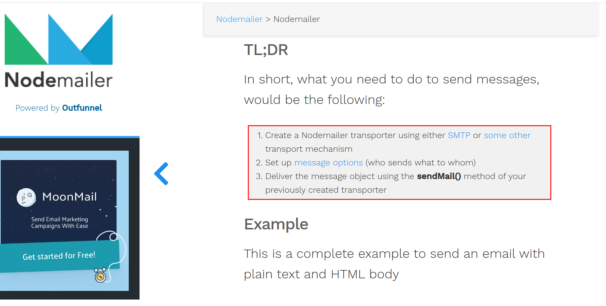
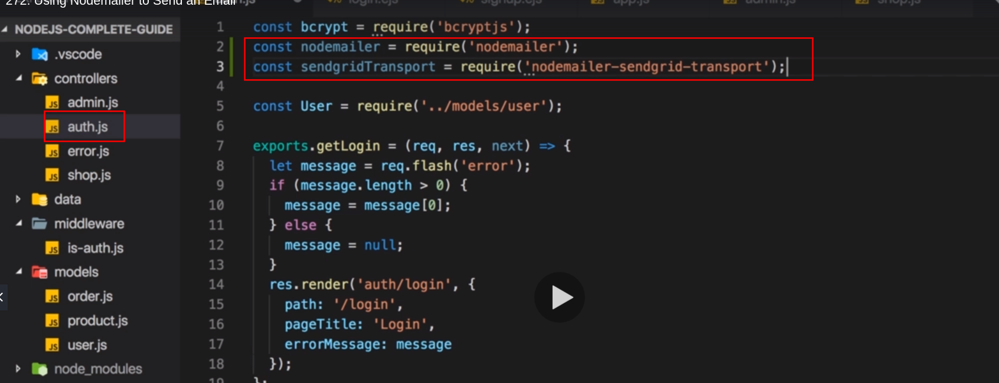
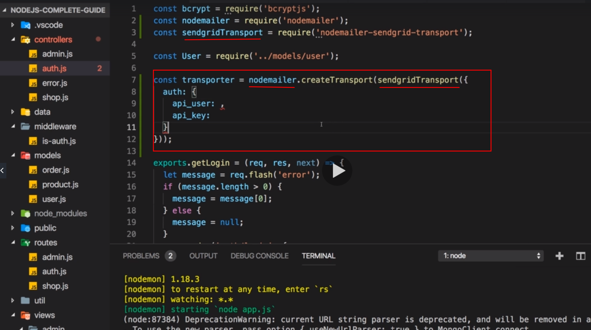
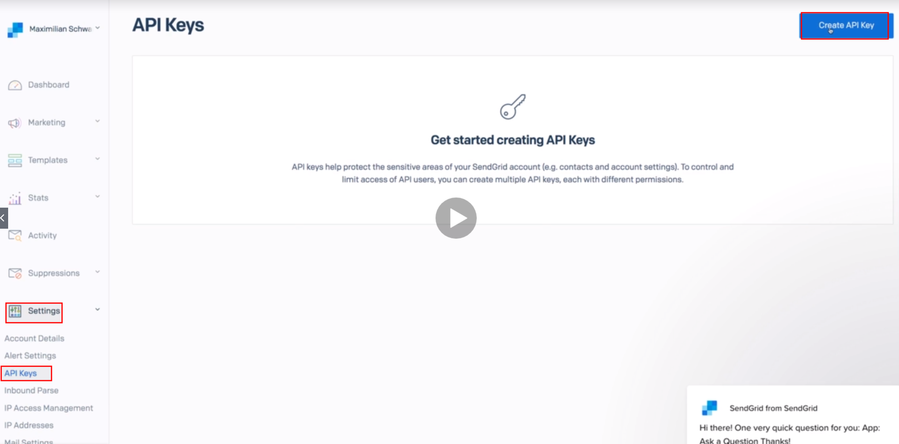
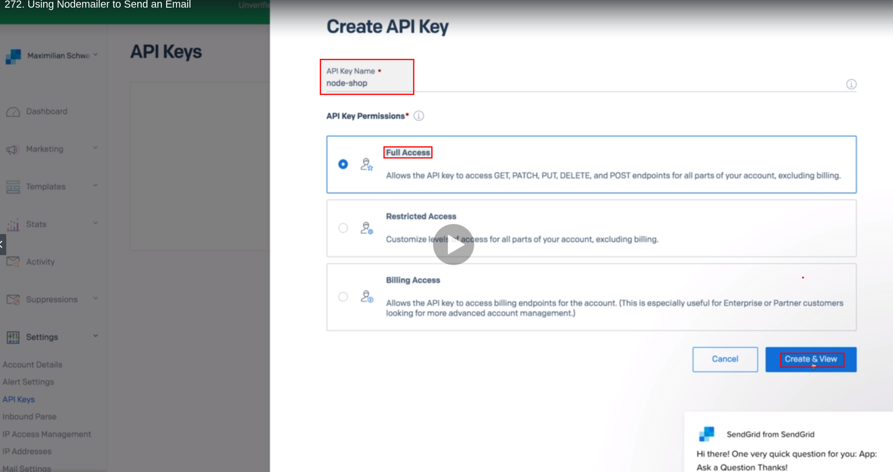
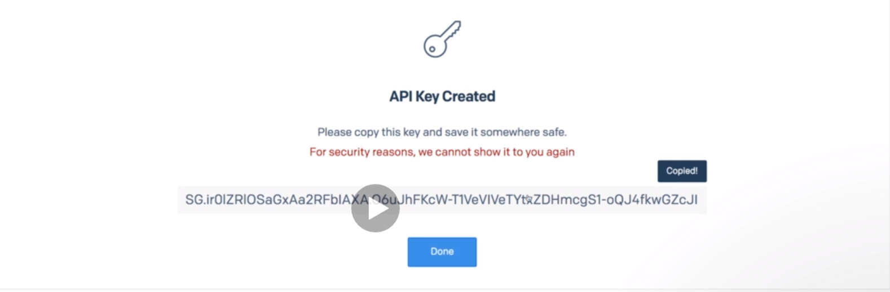
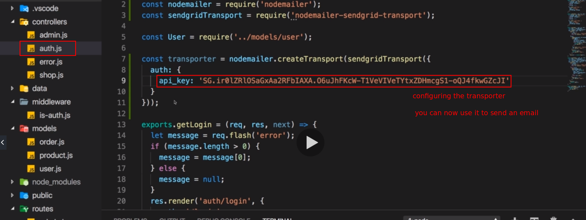
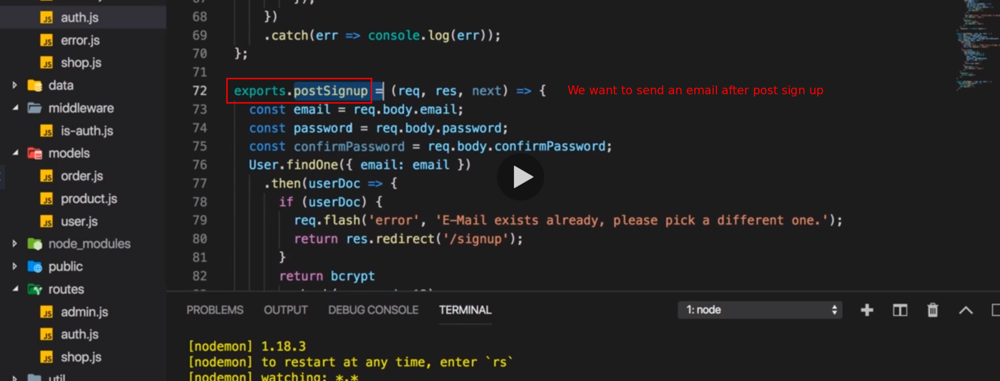
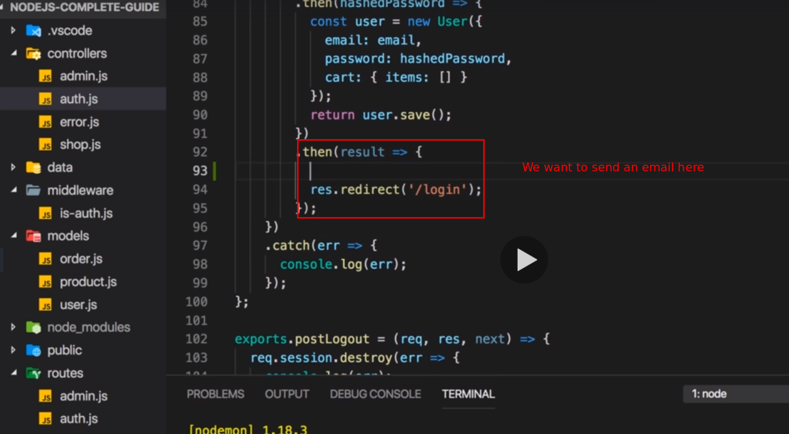
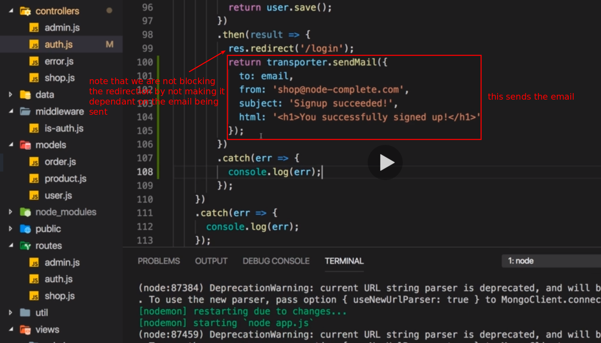
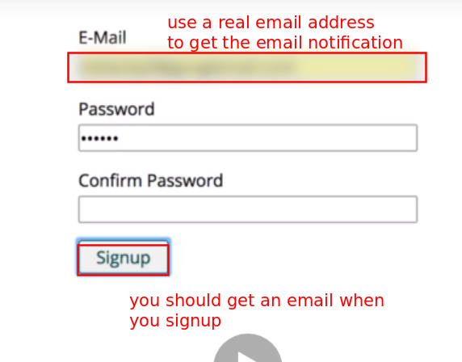

## Links 
## Nodemailer
https://nodemailer.com/about/

## SMTP-service-crash-course
https://sendgrid.com/blog/smtp-service-crash-course/

# S15 | Potential Limitation for Large Scale Apps
---
## Notes
So in this module I showed you how to send mails with nodemailer and in this case, the sendgrid third party service. Now one thing I also want to highlight is the way we send that an e-mail here works for our app and it's good that we don't block the redirect but that we redirect and send the mail at the same time because if you have an application with a lot of requests and you would wait for the email to be sent before you redirect, you might slow down your application because you're sending a lot of e-mails. Now depending on the size of your app and now we're talking about really huge apps, you could also look into totally different approaches where you have some server side scripts running every x hours or every x minutes that send e-mails to newly signed up users. Now this will only matter from a certain scale of app on and there you have different problems anyways but I just want to highlight that you should strongly consider not using this in a blocking way because if you wait for this to be finished, this can be slow and you have to evaluate if it's worth waiting for this or if your user can continue even without that mail being delivered. Now with that, you learn how to send mails, not that difficult as you can tell. Now let's use that knowledge in the next module and enhance our authentication process or our authentication features we offer. 

# S15 | Useful Resources & Links
--- 
Attached, you find the source code for this section.
When using my source code, make sure to run npm install in the extracted folder!

## Useful resources:
Nodemailer Official Docs: https://nodemailer.com/about/
SendGrid Official Docs: https://sendgrid.com/docs/