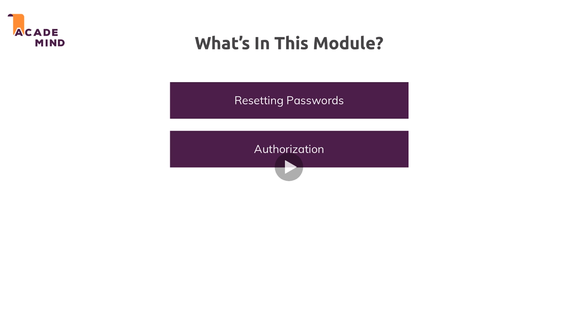
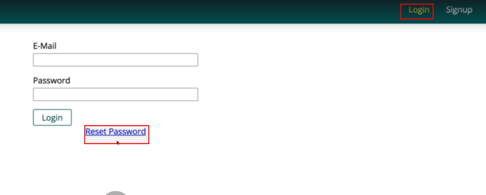
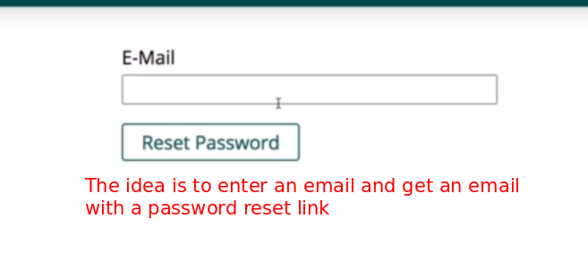
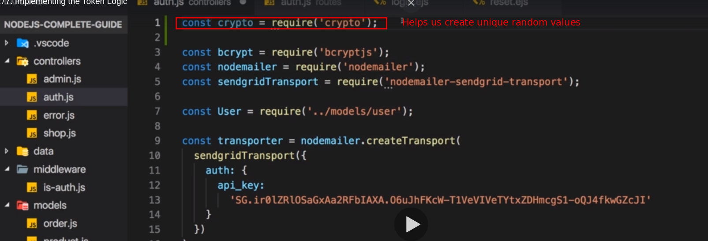
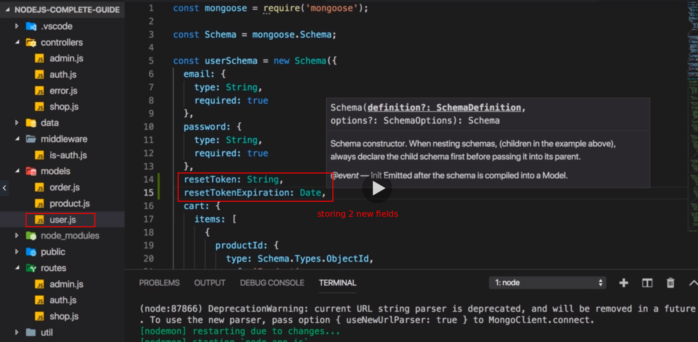
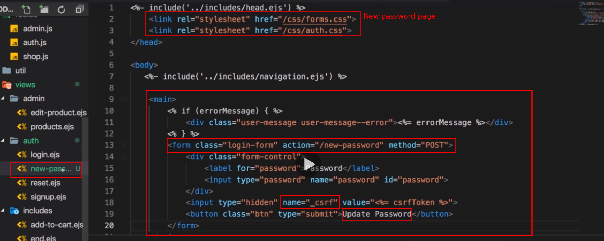

# S17 | Advanced Authentication
---
## Notes
 

# S17 | Resetting The Password
---
## Notes
2-7

# S17 | Implementing the Token Logic
---
## Notes
So we want to be able to enter an email address here and then receive an email with a link that allows us to reset the password. 

**Now for that, we need to first of all create a unique token that also has some expiry date which we will store in our database so that the link which we then click includes that token and we can verify that the user did get that link from us.**

Because if we just, well let the user now change that password, we got no security mechanism in place, so we need that token to put it into the email we're about to send to only let users change the password through the email that contains that token, that's an additional security mechanism. So let's work on that token creation then and for that first of all, I'll export a new action in my auth controller and that will be post reset, so that will basically the action that should get triggered once we clicked that reset password button here and in there, I need to generate that token. Now nodejs has a built-in crypto library which I can use for that, so I'll name that crypto and require crypto like that. This is a library that helps us with creating secure unique random values and other things but we'll need that unique secure random value here. So here in post, we settled and use that crypto library which I stored in a constant here and I will call random bytes to generate some random bytes, I want 32 random bytes and this will call a callback function here, so this is the second argument, a function will be called once it's done and there I either get an error or a buffer, a buffer of these bytes. Now I have an error here then I want to return redirect back to let's say reset and we could flash an error message here if we wanted to, I'll also log the error so that we can debug it but if we make it past this check, we do have a valid buffer and then we can generate a token from that buffer, simply by using buffer toString and there we just need to pass hex because that buffer will store hexadecimal values and this is information toString needs to convert hexadecimal values to normal ASCII characters. So then we'll have a token. Now that token should get stored in the database and it should get stored on the user object because it belongs to that user, so let's first of all go to our user model and there, I'll add two new fields, I'll add a reset token and I'll just assign a type of string here. Now important, this is not required because not always this token will be there, only if we requested a reset and we'll have a reset token expiration or however you want to name it and that will be of type date and now I want to store that token on the user which we plan to reset. So first of all I need to find that user in the database and I'll use the mongoose user model for that, to find one user where the email matches the email we're trying to reset and that email which we're trying to reset can be extracted from the request body email field because on our reset view here, we do have that email field. By the way important, the action here should be /reset to reach the right route but with that, this is prepared and now in our controller, I'm finding a user who has this email. Now let's add then and catch, handle any potential error we might get by logging it for now and then in then, we should get a user or undefined if that user does not exist. So in here I want to check if we don't have a user. If we don't have a user, then I will flash a message as you learned it in the authentication module onto the error key, no account with that e-mail found or whatever message you want to show and then here I'll return a redirect to /reset. If we make it past this if check, then we are looking for an e-mail address that is stored in the database and now for that user which I retrieved for that e-mail address, I want to set the reset token equal to the token which I generated and I will set the reset token expiration equal to date now which gives me the current date and the time plus one hour and this now has to be expressed in milliseconds, so you should use 3,600,000milliseconds, this will be one hour. So now I'm assigning these two fields and we can call user save to then update our user in the database. Let's return this so that we can now chain another then call here, another then block which will execute this function when user save succeeds. So at this point of time, we know that the updated user was stored in the database and now we want to send that token reset email. Now I showed you how to send e-mails in the last lecture, in the last module I mean, so make sure you through that because I will now use that transporter again which I created there, the node mailer transporter which we use for sending email and I will send an e-mail to the e-mail of the user which we found, so to user e-mail, excuse me, to request body e-mail we can say, so to the e-mail we're requesting the reset for, the subject could be password reset and now in the html code, I'll use a next gen feature, back ticks which allows me to write multiline strings which makes it a bit easier to read. I'll add a paragraph where I say you requested a password reset, so users should be worried if they get that if they did not click this link to set a new password and you could include more information like the fact that this is only valid for one hour. Now this link here, this will be anchor tag leading at some url and that url will be in our case your localhost 3000 and then let's say reset and then the token which we have. Now since I'm using this back tick syntax, I can dynamically embed values with a special syntax where I use ${} and now I can inject variables and their values into this string and the values of the variables will be placed in that string. So here, I can now output that token which we generated here, so now I am placing that in the url because that token is then what we'll later look for in the database to confirm that this link was sent by us because only we know the token. So this will send an email and at the same time, I will redirect back to the starting page let's say because the next instructions are received in the email of course. Now let's try this out in the next lecture.
8-13

# S17 | Creating the Token
---
## Notes
So let's give this a try this reset back and it's for did we first of all need to make sure that our newly added control or actions can be reached. So we added get reset route. Now we also need to add post reset route so that this reset password button actually works. So let's add this route and execute post reset that action we worked on. And with that on the reset password page let's first of all try out an incorrect or Al e-mail one which does not exist in the database and we get this message which is great. Now I use a real email which you used for signing up and clicked reset password. Or you should be redirected back. And if you check your emails there you should have a password reset email with a link. If you click that link you should end up on a page not found error but you will see that were on reset and then some token and that token can also be seen in your user collection here. This is the password reset token which restored. 

**So now we just need to add some logic to add does route extract that token valid date wherever we have a user for the token and then offer a form that allows the user to set a new password. Let's work on that next.**
14-17

>

# S17 | Creating the Reset Password Form
---
## Steps
1. Create the password reset form - DONE
2. Render the form when requested with valid token value - DONE
3. Add new route and controller action to reset the password - DONE
   1. Hash the password before storing - DONE
4. Test - DONE

## Notes
So we got a token. Let's now add a form which allows the user to enter a new password and for that I will go into my views folder again the all folder there. New password Ejaz or however you want to name this and they all use my log NHS page copy all that content into here. And then let's just maybe grab our password field here remove the email for sure. You can't and you email re-enabled a button to update password. You need to see as our token the action here should be maybe new password whatever you want. A POST request to you password reset password does not make any sense here. So let's remove that link. And now we got a prepared password page. Now we want to load debt. So we need a controller action exports get new password maybe or we again have the free arguments. We all know and love and in there let's render you. So I'll just copy that rest surrender method. And I want to render my off new dash passwords new path is new. New passwords and your the title can be new password. I also will add my code for extracting a potential error message if I should work with one. So now I have my get new password action. Obviously I don't just want to render that view here though. I also want to check whether I find a user for data token which I receive here because this will be the page we load for this page where we do have a token. Indeed you are. So let's retrieve that token. First of all by request from request Perens token. Let's say we'll need to add a route later that and Cote's the token in a token field in our parameters and then all of find one user where it just token fits now since our tokens are generated in a random non guessable way you can also enter random tokens and start editing passwords of average users. And even if you could you would not know the fitting email addresses. So here I'll find a token with the reset token field which we add at your reset token. So looking for reset token being equal to the token I have your end we want to make sure that it's still valid from a date perspective so that the documents find does not just fulfil this criteria but another one to add more criteria with Colma that the reset token expiration is still well higher than the current date. For data I can use a special operator wrapped in curly braces. Dollar sign. G.T. stands for a greater than and I can simply compare if it's greater than now for the current date and time only if the token matches and the token expiration is still greater than now so the token expiration is in the future. Only then I have to use or I want to find. So here I'll add then and catch log any errors. I might be getting and then the then block I get the user for whom we want to reset the password. So it's here inside of that. Then block that I want to render my new password. The you and I want to pass my user ID to that view so that I can include it in the post request where we will update the password. So here I will include user ID too. String maybe to convert it from an object ID to a real string. So now we render a new password and on the new password page I will duplicate my hidden C is our token field because I also have a user ID field now which is also hidden right output. Dead user id I'm passing into the view so does input is new with that hidden user ID and it will output that user ID will need dead for the post request. We want to save our new password. OK so with that let's go to our routes to offer routes here and let's add a new Getaround here to get new password route where I will use the get new password controller action. Now it's not just new password right away or it will not be password at all it will be reset. But then there will be a token. So you are Ls reset and then a dynamic parameter. The token parameter and it has to be named token here because in that get new password off controller. I am looking for token in my parents so token here which I'm looking for in request parens means I have to name a token here as well. And with that let's go back and reload this page. And now I'm on that update password page which is looking good. Now next lecture let's add the logic to update that password. 
18-23

# S17 | Adding Logic to Update the Password
---
## Notes
We added a page that allows us to enter a new password the new password due here and there we will send a POST request to slash new password. Now we need to add that route and controller action as a next step so that the existing user password can be replaced with the new one. So back to the off controller let's add a new controller action. Post new password action and you guessed it which arguments we have in that function here. And then in here what do we need to do. Well we need to extract the new password from request bawdy password and data is request bawdy password because the new password. View I'm storing the password in a field named password and we'll need to extract that user ID or two so that user ID is also something user ID is equal to request bawdy user ID. We need that as well. I also still want to have that token because otherwise people could start entering random tokens here and still reach that page and then maybe change users on the back and by entering random user IDs and that hidden input field as well. So once you have that token and therefore you password also add a neighborhood input field password token an output password token here. So that is a Number field and I need to pass that token into my view. So that is something for get new password for this action here I need to pass password token as a variable into the view and it will hold the token I'm extracting from the U R L here and that is the token we originally generated. So this is now all the past and this is not also something I can extract here the password token request bawdy password token extract that from that password token field here. OK so now we got these free pieces of information in here. Now I want to reset my user so I will again find one user in my database and I'll find the user. Where do we set the token is equal to the password token where the reset token expiration is again greater than dates now. So the same logic as I did up here and where d id is equal to my user ID I'll then again add then and catch log any errors we might be facing here and then I'll have my user that fulfills all these criteria. And then here I want to assign a new password to the user. Now obviously for that I'll again hash it because that doesn't change. It still should be hashed. So I'll again use the script hash pass in the new password and my number off salting rounds twelth and I will return this year and then add a another then block the hashed password where I can stored it on the extracted user. However the user is an argument in this function but I need it here to be able to access it in this function as well. I will create a new variable up there user or reset user end a will store user in reset user so in that variable because Dad variable is defined in disfunctions scope. So I can use it in this and in this function. And now I can use reset user in here too. And I can use it to call resets user and set the password equal to the new Hash password. And for the Reset user I will also set reset token equal to now. And I will also set reset target expiration to null here or not to now set it to undefined. So these fields here are not required anymore they don't need to store any values anymore. Once I'm done I can call save here and return that in here. I'll then have my result of that safe operation. And once you did save I can now redirect the user back to the log in page with that new password. You could also send the number email confirming that reset if you wanted to. And now if you saved as let's reload that password resetting page here and let's add a new enter and you password click Update password and I get a page not found which makes sense obviously because I have when you post route but I need to register it as a route. I have my action or I should say I need to register it as a route. So in the off G-S file here we need to add a new post request to new password and execute off controller post-New password there. That is important. Safe that. Then simply go back to the page where you have that token in the U r l. Enter your password. Let's also quickly reload our users collection before we have safe and kind of memorize de-value here. It ends with x y w y and click Update password. I'm on the logon page. And now if I reload my users collection that password here should change and it doesn't also get a reset token and on it's gone. I also have no error here. So it looks like password resetting was successful. We successfully assigned a new password. Now if we try going to reset with some random token then this will not work and we're not doing proper error handling there. I'll have a whole module in that because we essentially failed to find a user for that token. So this all works. We can start changing values of random tokens of random users. So this will not require. 
24-33

# S17 | Why we Need Authorization
---
## Notes
So we worked a lot on resetting passwords. Let's now work on Authorization. 

**And with that I mean that not every authenticated user is allowed to do everything.**

A good example would be this one. I'm not locked in. Now let me log in with this user here test a test that COM here I might be able to add a product and I can delete products but right now I can delete all products no matter if I created them or if someone else created them. And the same is true for editing them offer a sation means that I restrict permissions of a logged in user. So every user might be able to add anything to the cart including products created by the user but you might not be able to delete an edit products which were not created by you. So for now I can do that. But that's exactly what I want to work on next. So that we can do this. Now how can we implement that. Well when I create a new product let me quickly do that remember I'm locked in with test at test dot com. This was created by test at test dot com when I created this product here. We have it here and we can see it in the product collection obviously it's linked to the user with an ID that ends with E 5. And if we have a look at all our users let me delete this one here. Then we see this is the one with E5. It is to test the test the com user. Now if I log in with my test to account so test to hear then if I go to Aben products I can also edit and delete it. And that is exactly what I want to prevent. Let's do that in the next lecture. 
34-38

# S17 | Adding Authorization
---
## TryMelf - Steps
1. [TODO] - Show products that were created by the logged in user
2. [TODO] - Restrict product modification by other than the actual product creator
3. [TODO] - Restrict product deletion by other than the actual product creator

## Notes
So how can we add authorization? I want to ensure that I can't delete or edit this book with or this product with the wrong account. Now we do have important information stored on the product, we know which user did create it, so in the end we just want to check if the currently logged in user is the user who created that before allowing any edits to that item. And that means that on the admin controller where we render our admin list here, get products here, I only want to render products that were created by the logged in user because there is no sense in showing products on this page that were not created by the user because we're in the admin section, you are not able to do anything with it if you weren't a creator. So authorization simply means we restrict the permissions and we can do that by restricting the data we return for example, so here when I find product, I dont find all but I'll add a filter and I'll filter for products where the user ID is equal to the user id of the currently logged in user, so user ID is equal to request user id, whoops, ID and keep in mind request user exists because we do extract that user in app.js in a separate middleware here, there I do store the user in request user, so I know that only products which were created by that user should be retrieved. With that changed if I reload this page, I find no products for test2 but if I do login with my other account with test@test.com and I go to admin products, I do find that book, so that is the first important step forward. The problem is I could theoretically still issue requests behind the scenes where I do try to delete a product which was not created by me, so more protection is needed. Let's add that next.
39-42

# S17 | Adding Protection to Post Actions
---
## Notes
We're restricting the amount of products we can see and that is one great step forward but it still doesn't mean we can't send requests somehow by creating our own pages where we still try to delete another product. So we should also add protections in our post actions, like in post edit and post delete product, there we want to check that the product I try to delete is really created by the user who is currently logged in. So in post edit product, there I might want to add a check once I found the product that should be edited where I see if I'm allowed to edit that product. So here in the then block where I have that product fetched from the database, there I will quickly check if product user ID is not equal to request user ID because if it's not equal, then this means the wrong user is trying to edit this. So here I then want to return and simply redirect back to the starting page let's say because we try to do something fishy here, we don't want to continue, so all the other code will now not run. We would still go into that then block though as you learned because the next then block is still executed even if I do redirect here, so to circumvent this, I'll add then right after save here so a nested then block so to say and now we have protection in place that ensures that we can start editing products that don't belong to us. To quickly check this, I'll temporarily remove my filter so that I can see all the products again and I will log in with the wrong account, so with test2 and now what we should see is that when I edit this and add a couple of exclamation marks and I click update, I'm redirected but the edit wasn't saved because I essentially ended up in my extra check here and I was redirected back but without saving the changes because this code was never executed. Now let's try the same for deleting before I re-add my filter here. For deleting I also want to check if I'm really allowed to delete that product and we can easily implement this by changing our deletion method here and use delete one and there I want to delete the product where the ID is equal to the prod ID but also where the user ID is equal to the request user ID. So both has to be true now, the Product ID alone is not enough, the user id also has to match and therefore even if we have a valid user id, it will not delete this product if the user ID does not match. So if I save this and I go to admin products with the wrong account still and I click delete, you see the product doesn't go anywhere, still there. Now let me add that filter in get products again so that we can't even see it and now we have the best possible set up because now we can really only see it in that account where we are able to interact with it. So if I do login with that valid account, there I do see it and there I now also should be able to edit it, though if I try that, it fails. So let's explore what's wrong here in the next lecture.
43-45

# S17 | Why Editing Fails
---
## Notes
Editing fails here and do you have an idea why it fails? It fails because of my check here, I compare the product user ID to the request user ID. Now we have a type problem again, I should convert both to a string because I'm also checking for type equality. So with this change, both converted to a string and not this strange object id thing, with this in place, now if I login or if I'm logged in with the right account, now I can update this and I can also delete this. So this now all works with the right account, so with the account who created it but it will not work if I login with the wrong account because if I login there, so this is now the account which did not create it, I can view it on the normal pages, I can add it to my cart if I want to but under admin products, I do not see it and even if I would see it, I could not interact with it.
46

# S17 | Wrap up
---
47
