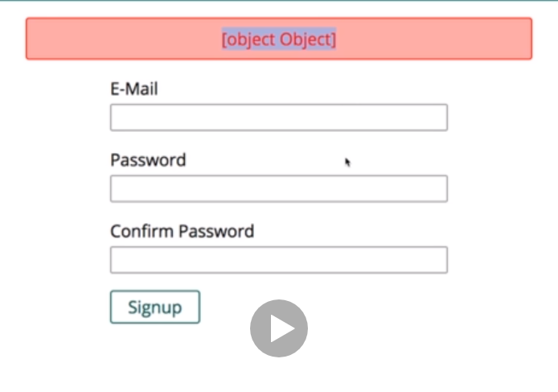

# S18 | Introduction
---
## Notes
 

# S18 | Why Validate
---
## Notes
So why would we want to add some data or input validation to our application? Well if we have a user interacting with our website, then we typically have a lot of forms on any web application we build. In our example project for example, we have a form for signing up, we got one for signing in and we got one for adding products and the bigger your application is, the more data you will need from your users at some point of time. So we have that form with which our user, our visitor of the website interacts with. Now in the end when this form is submitted with a post request as we controlled it in our form, then a request is sent to our backend and by the way you could also configure it to send a get request but the key thing here is a request with the form data is sent and we're already doing this in this course because this is a crucial task in any web application. Now on our backend so our nodejs code, we then typically interact with a database or maybe we write the data into a normal file but in the end we take that data which we receive and we want to store it. Now this is exactly the part which can be dangerous or problematic though. Right now in the app we got no kind of data validation, so if a user in our current application would try to login with something that is not a valid email address, we would allow that, we're not preventing the user from entering something incorrect. The same is true for adding a product, we don't care about what the user enters and this is what I want to change in this module. We'll add some validation as an extra step right at the start of our nodejs code so right at the start when we handled a request on the server, definitely before we store it in a database. And this validation can then either succeed and allow the data to be written to the database or to a file or allow it to be handled by the rest of our node code or we reject the input and then basically return some information to the user prompting the user to correct the error. So this is what we will work on in this module and I will show you how to validate and how to provide a good user experience.
2

# S18 | How to Validate Input?
---
## Notes
Now how do you validate user input? Well obviously we got our user entering some data into a form, we got our server where we want to handle that and now we got a couple of places where we can add validation. For example we can validate on the client side with the help of javascript, so before any request is sent, we can write some javascript that for example watches the inputs for key events, so for the user typing and then checks the input whilst the user is working on the form and then you can display an error because you can use javascript to change the dom at runtime, you can display an error right in the browser before anything is sent to the server. Now this can greatly enhance your user experience and it is something which I discuss in my dedicated javascript and javascript framework courses like my react course, my angular course and it's totally optional, that is important. It can definitely improve the user experience and therefore you might want to consider using it but it is optional because since we use client side javascript, so javascript code that runs in the browser, the user can see that code, the user could change that code and the user can of course disable javascript. So this is not a protection that secures you against incorrect data being sent to your server, this is not a secure solution, it's only there to improve the user experience because of course there you can validate and you can show a nice error message and keep the old input so that the user doesn't have to re-enter that email address where the @ sign was forgotten but it's only for a user experience thing, it's not really secure. So your next option is to validate on the server side. Now this is what we'll focus on in this module and in this course because this is of course what we do with nodejs. We have to do that because this code can't be seen or changed by the user, the user can't disable us using that code because it happens on the server, not in the browser and this is the crucial part where we have to add validation, where we really have to filter out invalid values, so this is a must have, it's absolutely required and it is what we'll focus on. And this then ensures that we only work with valid data in our node app and ultimately if we do plan on storing it, that we do store correct data. Now also important, for some database engines and for most database engines actually, like for example mongodb, there is also a built in validation which you can turn on, I do cover that for the example in my mongodb course if you want to learn more about that. It's also optional because this can be a last resort but if you have good server side validation in place as you should have, then this might not be required because there is not really a scenario where invalid data could reach your database because you filter it out in that server side validation already ready. No matter which approach you have if you validate on the server side and or in the database, though or is not really an option you should validate on the server side at all means but no matter what you choose, in the end this can of course fail and then you should always return an error message, a helpful error message if possible and never reload the page but always keep the data the user already inserted because that of course is a horrible user experience which we all know that you enter something incorrect and you get back hey this password is not known or this e-mail address is unknown and you have to enter it all again. So this is another part on which I'll focus in this module, that we provide a good user experience. And with that we know how to do validation at least in theory, time to turn that into practice.
3

# S18 | Setup & Basic Validation
---
## Notes
So I'm back in our project and there for example we got the first cases where we could add validation, the login and the sign up pages. There we want to validate, for example on the sign up page that the email address is a valid email address with an @ sign and a domain ending, that the password for example is at least six characters long, whatever your requirement is and that the confirm password matches the other password, that would be helpful too and later when we create a product where we for example enter a url, we might want to validate that this is a valid url. So these are all things that we can add with the help of proper validation and that is exactly what we'll dive into now. Now to add validation, we'll use a third party package, the package we'll be using is called express validator and you can simply google for express validator to find these official docs which are always worth checking out, in there you find quick command on how to install it and then you find a link to the full official docs which is this separate webpage where you learn all about using it and this is really a good idea to dive in because I will introduce you to this package, if you want to learn all the ins and outs about it, definitely check out this documentation. So let's first of all install it with this command here, so just using npm as we did it for other packages too. So back in our project code which is the code I've finished with in the last course module, we can simply enter this here to install express validator into this project and once this is done, we are ready to use it. So let me restart my development server with npm start and now let's find out how we can use express validator and let's start with our authentication routes for that. So here we obviously have our auth controller with the different controller actions and we got our routes folder with the auth.js file. Now typically you want to validate on your post or your non-get routes because you want to validate whenever the user sends data and that is not the case for our get routes for example but for posting the login data or posting the sign up data, I want to validate that data and I will start with the sign up, with post sign up, with this route. Let's say we want to add some validation to that route and we want to ensure that our e-mail here is an email, the password is at least let's say five characters long and that the confirm password matches our password, these would be some nice checks which I want to add here. Now to add that with that package installed, in my auth.js file in the routes folder, I can import something from that package, let's name that exp validator or however you want to name it and require express validator here. However the import here looks a bit different, we import a sub-package because express validator is basically made up of a couple of sub-packages you could say and there we need the check package which is the package you use for well all the validation logic you could want to add. We can also use a next gen javascript syntax because exp validator which we import will be a javascript object and we can use a feature called destructuring where we use curly braces on the left side of the equal sign and then you add some property names which you want to pull out of the object that this would give you. So here and you can find it in the official docs, we'll get a check function actually, so in the object which we import and which we would have stored in exp validator otherwise, there will be a check property that holds a function and we can import validation result, though we don't need it here we'll need it later. There also are other functions you can import and again the official docs are a great way to dive in deeper. What this does is in the end it just gives us a check function which we import from this package here and now adding validation to a route is really simple. For this post route, if we want to add validation, we add an extra middleware, remember you have that path and then you can add as many middlewares request handlers as you want and I'll add a new one here and I'll add a new one by adding my check function and calling it here and check this function will in the end return a middleware. So here I then just enter the field name or an array of fields which I want to check, now how does this work? Well I can simply add check and then the field name. Now we can have a look at our sign up view to find out that for example there, we'll have an email field, so it's this name I'm looking for. We have an e-mail field in there, so email will be the name of that field in the requests we're receiving, so in our auth route here, I can check email. Now this tell this middleware, the express validator that I'm interested in confirming that e-mail value or that I'm interested in validating that value, we then call a method and this will in the end then return a middleware that is understood by expressjs . So we call a method on this object which is returned by this check function that now allows us to do all kinds of checks, for example isEmail. Now there are a bunch of built-in methods and I will show you where to find them in a second and what this will now do is it will use this package to check the email field on the incoming request and it looks for that field in the body, in the query parameters, in the headers and in the cookies and it finds that field and then checks if that is a valid email address and that is the first step. Now with that, we have this middleware in place, now we can go to our controller here under controllers of course and import another part of that package. So here I will also import with this destructuring syntax because this package just exposes a bunch of stuff and I only want to get some specific things and I import from express validator check here as well and there we now need to import the validation result, validation result will be a function that allows us to gather all the errors prior validation middleware like this one might have thrown or might have stored. So now we just have to go to the post sign up route because that is where I did add my middleware and in here, I can now simply extract my errors and store them in a constant, errors by calling validation result on the request and in that request, this express validator middleware which we added here will have added errors that can now be retrieved. With this middleware here in the auth.js file on the routes folder, we are collecting errors so to say or this middleware will store some errors it found in an errors object so to say and this validation result function will go through that errors object managed by that middleware on the request and will then collect them all in this errors constant and we can then use that constant to check if we do have errors. Now how does that work? Well we can simply check if errors and then there is a method we can call, there is the isEmpty method and isEmpty will return true or false depending on whether we got errors or not and if this is not empty, that's why I add an exclamation mark to check the inverse, if this is not empty, then we could return a response where we set the status code to 422 which is a common status code for indicating that validation failed, so it's an error status code, it will still send a response just with this different status code and then we can call render here and render the page again. And I don't redirect here because I want to redirect upon success, if we fail I will render the same page again, so here I will render the same as I do in get sign up, here we can copy that render message, that render call here I should say. We do that same rendering here without res, just render, I render that same page, auth sign up and I can also add my my errors there, the error message is then not message like this but I can output errors and then there is an array function which I can call to return an array of errors I might have and we can also output this here, with console log to get a feeling for what's in there, errors array like this, let's see what we got in there. Now if we save all that, with that in place with the middleware and the error collection mechanism, let me enter something here, test which is not a valid email and let me hit sign up. Now I get a message here which is the default browser validation because I set this to type e-mail in my sign up view here, I have type e-mail and this adds this default browser validation. Now one thing you can do is you can add no validate to the overall form, validate to disable this check. Now by default you want to add it because it is a nice client side validation that can improve the user experience but here to see how it works without it and to allow me to make deliberate mistakes, I will disable it for now with no validate added to the form, not the input but to the form and then if I reload that page and I do enter something invalid again, I can submit. Now don't be confused by the error message, this is to be expected because we don't get a message, we get an array of errors but if we check our server side console, we see that this console log where I log an array of the errors that was collected gives me that array and we get the square brackets, it's an array. An array of objects and in that object, we find out which parameter was the problematic one, what value was entered and which message was generated by the validation middleware and this is a message we can use to output an error message if we want to. 
4-19

# S18 | Using Validation Error Messages
---
## Notes
So we added a very basic validation and we get back a message which we want your output. So this already shows us how we can work with that validation middleware, we see it rendered that page again and now we just need to make sure we don't output object object here but a real error message. We can do that in our sign up view of course, here we got our error message thing and the error message which I am outputting here is simply an object because it's that array and not a single field in there. Now we just need to adjust something and in the controller instead of returning an array, let's say we always want to return the first error message. Now obviously you could change this to change the overall logic and you need to change it in other controller actions then too to output all messages but for now let's say we simply take the first one which we are guaranteed to have because we'll have at least one error and then there, the message. And now if I save that and I do send just test again, now I get invalid value, so this is how we could output that message. We cannot just output the message, we can also customize it and we have to do that in the place where we added our middleware, so in the routes file. After isEmail, you can add do you with message function and this will always refer to the validation logic that was right before it because you could add multiple checks here, you could also add isAlphanumeric to check that it only contains numbers and characters, number and characters, so you could add multiple ones but with message, we'll always refer to the validation method right in front of it and there you could add please enter a valid email, something like that. And if you add this with message here, you will see that if I enter just some text here, I get please enter a valid email. So this is a way of working with the messages and also of customizing it and I also mentioned that you can add more validators. So let's have a look at this in the next lecture.
20-24

# S18 | Built-In & Custom Validators
---
## Notes
We added the isEmail validator. Now there are way more built-in validators available from which you can choose and you'll find them when you visit the express validator page because there if you check the official docs to which this link points, you'll see that in the end it's a wrapper around the validator js validator, so that's another package that was implicitly installed with express validator. And here on the docs of validator js which is a different package which was installed, you'll find all the built-in validators and what they do and how you might configure them if possible and you see this is the one we're using, isEmail, this is what I'm using here, we could configure it to change different e-mail formats we want accept or not accept, we can check for emptiness, we can check whether something is a full domain or a full url, we got all kinds of things. We can check if a value is in a certain array of possible allowed values, if we have a certain length will be important for the password and so much more. So you see there are a bunch of things we can check and definitely go through this list to learn more about the built-in validators. You can also add your own validator though and to demonstrate this real quick, let's say we're not just using isEmail, I also want to make sure it's a specific e-mail I want to have. For that I can add custom here and now a validator is in the end a function like this, a function that receives the value of the field we're checking, so the value in the email field and optionally, an object from which we can extract things like the location to which this was sent, the path or the request object in case we need to extract more from the request. Now in this function, you want to throw an error when validation fails, so here we could simply check if value equals and now let's say it should be test@test.com because we don't want to allow that, that's just some dummy logic here. So if that is the case, then I'll throw an error by calling throw new error with a message of this email address is forbidden, something like that. Of course this is very arbitrary that I'm checking for exactly that e-mail address but this is how you can generally write your own validators, in case the many built-in ones don't suffice your requirements. So now if I save this, we should see that if I reload that page and I enter test@test.com, I get this email address is forbidden, if I enter test2@test.com then I get invalid value though. The reason for this invalid value here simply is that if we do succeed, we should return true, so we throw an error if we fail, we could return false to go with the default error message or we throw an error to have our own error message or we return true if it succeeded and now you will see that if I enter test2, this worked. Now this will actually be stored a bit strange in the database now because I entered a new user with invalid password, with an empty password but we didn't add any password validation yet. The key takeaway is that you saw how you can add your own validator, returning true if it's fine, returning false or throw an error if it's not and how you can use the many built-in ones and of course that you can chain them after each other to add multiple validators to one and the same field.
25-30
# S18 | More Validators
---
## Notes
Now that we learned how to add validators, it's time to add more validators for our sign up, for example I want to make sure that the password is also at least six characters long. Now for that we add another middleware, another check function call and what you can also do is you can wrap these into an array. That is optional, that is not required but of course it keeps your checks kind of grouped together and maybe makes it clearer to read that this block is all about validation. Now instead of check, you can also use a different function besides check which as I mentioned checks the body, the parameters, the query parameters and so on, you can also add just body, just param, just query, just cookie or just header to check just a certain set of features of the incoming request, so I could use body instead of check to make sure well you can look for a specific field but it has to be included in the request body. So for this email, we would extract that e-mail from the cookies, the headers, anywhere, doesn't matter because we'll be in the body but it would look for it anywhere. Now for the password I want to show you an alternative and typically you would use the same approach for both of course and I could say well please check the password value in the body of the request, so if there happens to be a password value in the headers, I don't care about that. So now I'm checking for password in the body and now again you can add your validators. You could say isLength, that is a built-in validator which you have to configure with some options in the form of a javascript object where you can set a min key to let's say 5 and you could also set a max length if you wanted to. So now we have the min length and we can also enter a different validator like isAlphanumeric to only allow numbers and normal characters, so we could add that too and if you don't add with message here by the way, then this means it will use the default invalid value message. Now maybe you want to use a default message for all validators but you don't want to repeat with message after every validator where you then enter like please enter a password with only numbers and text and at least 5 characters. This could be the error message but of course if we now repeat with message after every validator, this is a bit stupid right, it's a bit redundant, so for such a case where you have wanted the same error message for all your validators but it should not be the default invalid value error message, you can just grab that error message, remove with message here and simply add it as a second argument to the body or to the check function and now this will be used as a default error message for all your validators. So now this would be a check we could add, checking for the password being at least 5 characters long and only alphanumeric, in production you want to use more secure requirements, a longer password and you of course want to allow special characters but here just for demonstration purposes, this is fine. And now if I save that I can enter a valid email address but this password is too short, it's only one character, right. So if I hit sign up, I get well good job I mean that's the forbidden email but if I now enter this, I get please enter a password with only numbers and text and at least 5 characters. If I do enter some new account email and then here a password that is long enough and that is only text and characters, well I happen to use the email already but other than that it succeeded. If I enter something totally else, this simply worked and if I enter a valid email address, so this one doesn't exist yet but I enter a password that is long enough but has a special character, I fail because I only allow alphanumeric characters. So this is another example for adding validation and how to add multiple checks for one and the same request, now in the next lecture, let's see how we can compare our passwords for equality. 
31 - 34

# S18 | Checking For Field Equality
---
## Notes
With our basic validation in place, let's now find out how we can check for equality in our passwords and for that, I of course want to check my confirm password field, so in my sign up view, I'm talking about this field with the name confirm password. So let's go back to auth.js to that route and let's add a new check for something in the body of the request, so basically for the confirm password field here. Now in there, I want to check if that is equal to my password and how can I achieve this? Well I could do it by adding a custom validator here, that custom validator which receives a value and where I then extract the request with this destructuring syntax and if they're in there, I check if the value of confirm password is equal to the value of request body password and this is why you might need access to the request object because here I need to extract the password, so this field value from the request body in my custom validator. And now I can check if they are equal or to be precise, if they are not equal and if they are not equal, well then I want to throw a new error where I say passwords have to match, like this and otherwise I return true. And this is how we could check for equality of two fields, I'm checking whether my confirm password is equal to my other password. With that if I now save this and I do enter a valid email address, this one is already taken but I'm not validating for this with this package so this should be fine. I do enter a valid password and I do enter let's say another theoretically valid password, though we're not checking for length or anything like that on confirm password so anything would do it there. But the important thing is this is a password that differs from this one, you can make this really clear by adding more characters. If I now hit sign up, I get passwords have to match, so this is now working. If on the other hand, I take an e-mail address but again that's not validated by this package but then I try valid equal passwords, then I only get my e-mail thing but the validation with that validation package succeeded. Now it's also worth noting that I did not add the other password validation like isLength and isAlphanumeric to the confirm password even though that applies to the confirm password too of course but why did I not add it? Because we're already checking it on this main password and then we're checking for equality, so we implicitly have this check here on confirm password too. I don't care if confirm password is long enough because it has to equal that password and that password is checked for its length, so I got this in place here and therefore I am protected against any errors on this site. So this is now how we could check for password or any field equality that you might need in your application. 
35 - 36

# S18 | Adding Async Validation
---
## Notes
Our sign up validation is looking pretty good but there is one thing which we are validating in a bit of a strange way right now and that is the fact whether the e-mail address is taken or not. Right now I'm doing that in my auth controller and there by the way we will not need confirm password anymore, we're checking this ahead of time but in auth.js I do check for e-mail existence here. Now logically it would make sense to check that as part of our validation right and the good thing is we can do that. Let's grab this code where we find one user here, let's grab that code and let's head over to the auth.js file in the routes folder. In there let's first of all import our user model by requiring it from the models folder and there from the user file so we need that and then here on my e-mail field, I got this custom validator. I'll comment this code out because I want to keep it for you as a reference but now we'll add a more well a check that makes more sense. I will add my code here where I find one user with that e-mail address, now that e-mail address on the right side here is the value of course which you are validating because we're doing this on the e-mail field, so value will be the entered email, I'm searching for that e-mail and then here if I have a user document, well then I will not do it with this flash message and so on anymore instead I'll just take that error message and inside of this if block which is inside of my then block here, I will return a new promise reject call. A promise is a built-in javascript object and with reject, I basically throw an error inside of the promise and I reject with this error message I used before. What this means is that now after this then block, I could another catch block to catch this but I will not do that here instead let's close our function curly braces and the normal brackets from the custom function and now what I'll do is I will return user find one. Now what will this do? The express validator package will check for a custom validator to return true or false, to return a thrown error or to return a promise. If it's a promise as it is the case with this because here we ultimately return a promise because every then block implicitly returns a new promise, so if we return a promise then express validator will wait for this promise to be fulfilled and if it fulfills with in our case nothing, so basically no error, then it treats this validation as successful. If it resolves with some rejection in the end though which will happen if we make it into this if block, then express validator will detect this rejection and will store this as an error, this message will then be stored as an error message. And this is how we can add our own asynchronous validation, asynchronous because we have to reach out to the database which of course is not an instant task but express validator will kind of wait for us here. So now we have our own async validation in place and now we should still check for email existence but we don't do this in controller anymore because there, I will in the end get rid of that entire user find one thing here, instead I will instantly start with b crypt and I'll also remove one pair of brackets at the bottom and this semi-colon and this catch block. And now what I do have here is I instantly start with hash in my password and so on creating that user because I can rely on the user to not exist already inside of my controller because I do check for its existence ahead of time in my auth.js route with the help of that validation middleware. So now let's go back and let's add an email address and a valid password of a user that already exists and indeed I get e-mail exists already, so that is great. If I however do add an email address that does not exist yet and I do enter valid passwords, I get my sign up page here or my login page because the user was created successfully. So this now works and this is how you can add async validation. 
37 - 41

# S18 | Assignment
---
## Notes
42

# S18 | Keeping User Input
---
## Notes
Now that we learned a bit about how we can validate user input before handling it, let's also work on the user experience side of things because right now when signing up for example, let's say you enter an e-mail address and you enter a password but the passwords don't match or the e-mail is already taken, then we give you that error message which is great but of course all the input is lost and that is a horrible user experience. So typically we want to keep the input, we want to keep the data the user entered and that is exactly what I want to work on next, keeping that data around. Now how can we do that? Well for that, let's go to these controller actions where we do handle sign up and sign in and let's maybe start with signing users in. There we do return this page when we enter incorrect data and we send that status code, this error message. By the way we should of course also do that for logging in now that I see that I forgot that, status 422 should be added here too but in the end what matters here is that we render that view and we include the error message but of course to keep the data the user entered, we should send this data back as well. So what we can do here is we can send maybe old input key here, whatever you want and that could be an object and this object could hold the email and the password. So I have two key value pairs here where I essentially store the email and the password which I retrieved from the incoming request and I send that back to the page we render when we render it due to this error so that I can render it on the page and output it there because what this allows me to do is I can now go to my sign up page and by the way, I should also output confirm password which you can retrieve from request body, confirm password here in the sign up route, so this is another field that we enter so we should return it. And now when we have the invalid input, we get these values back in our view and so now if I go to my signup.ejs file, we can basically output that data there. So for example for the e-mail input, we can add the value attribute which html supports and we can output our data there, so we can use this ejs syntax to pre-populate this with some data and the data here would be old input.email. If we do that and we save everything and I reload the sign up page, I get an error though and the reason is that when I visit this for the first time through my get sign up action, I don't render the old input, so here when I render the sign up page I don't have old input, so what I should do instead is there we can also pass our data out with email being equal to an empty string, the same for password and for confirm password, so that I enter empty values for these fields when we load it for the first time and I enter the old input for the case that we have that validation error. And with that if I now reload sign up, this works and if I now do enter something here which is incorrect for some reason, then you see that it kept the old e-mail because we return that with the response and we then output it in our view and of course we should do the same for password and confirm password. So for password I output old input.password and for confirm password, it is old input.confirm password, so I'm outputting that through ejs syntax. And therefore now when I enter something invalid again, now we still get that error message but we kept our old data which is a much better user experience of course.
43 - 49

# S18 | Adding Conditional CSS Classes
---
## Notes
We're now able to keep the old user data and as you see, it was relatively easy using that value we attribute and ensuring that we simply return the input the user entered. Now obviously you can also do even more on your frontend side, for example you could give these invalid inputs a red border, that is also something you often see and for that you just have to keep in mind that you have to use that information which you're getting to pass it to your view and then render something different based on that information. So in our case here for example in the sign up route, we do have our errors array here right, here where I output my errors array and that errors array contains all the problematic fields. Now we then return an error message based on that array but of course we could pass another key here, validation errors or whatever name you want and that could be just errors array. So the full array is now returned as well in my render function, so now I'm returning not just the first message which I picked to show but also the full array of errors. Now as always this means that I should go to my other scenario, get sign up and also render that, so validation errors here would be an empty array because I got no errors and now we know it's either an empty array if we load that page without errors or we have an array of inputs that do have well problems. So how can we now benefit from that array of errors? Well we can go back to our frontend and there, we could change the styling of that input based on the existence of an error for that input, now how can we do that? Well let me structure this over multiple lines to make it a bit easier to read and then here on this input, we could assign a conditional css class that sets an invalid styling. So we could add class here and now we use ejs syntax to output something there and what I want to output here is that I check my validation errors which is that array of errors which I just talked about and there I try to find which is a built-in javascript method we can call on arrays, I try to find an error where error param is equal to email and keep in mind these are the error objects in that array, they do have a param field which holds the name of the problematic input. So here I'm trying to find an error for the email input because I'm on the email input here in my html code. Now this will either return undefined or null if I don't find it or it will give me that entry I'm looking for. So I can check if that is not false-ish, so if it is not undefined or anything like that, then I want to add invalid as a class here otherwise I will not add anything, so just an empty string because that should be text that is added as a css class. Now with that I should get that invalid class on my input when I do have an error for the email control. Now to see something, I'll go to my a public folder real quick to css and there to the forms.css and in there, let me now add the invalid class which is the class I just defined in my template and let's give it a border color of red. Now due to the way css works, I should also be more precise here and say if a form control input has the class invalid, so this css selector. Let me save that and let me hit sign in again and now we see this red border because if we inspect this element, we see that indeed the invalid css class was added. And now that is a pattern which we of course can repeat in our view, we can go or we can take that logic here for adding a class and we can add that to any input obviously, not just to the email. So here I'll do it for my password and I'll simply check for the password control here and of course you could find other ways of implementing this, this is just one example but it is an example where we would now also mark the password red if it is invalid and the same for confirm password of course. There we can also simply restructure that for readability reasons, for nothing else than that and then simply add this css class here based on the confirm password field. And now with that changed if I hit sign up here, you see these are all red. The password is not because it's actually valid, if I would enter a too short one, they're all red and now this is another way of enhancing the user experience. Now feel free to play around with that and find your own solutions, see what else you can do, I just want to give you the ideas on how you can utilize that information the server side validation package gives you and of course, you also see how you can pass that information to your frontend. 
50 - 56

# S18 | Adding Validation to Login
---
## Notes
So we've worked in the user experience, now let's also work on the user experience of logging in because right now if I login, well I don't get any highlights here and if I do login like this and my password has to be valid, then my old data is lost. Now of course this is a great challenge for you so feel free to pause the video and try this on your own, you have to basically do what we did before though there is a little extra twist which I'll also show you of course. So here's your chance to pause the video, we'll do it together thereafter. Were you successful? Now let's try this together and we start in the auth controller but now in post login of course because that is, whoops, up there where we do gather validation results for the login screen. Now if I render this response with this error code which you don't have to set as you saw but which is a good practice to set to be very clear about what went wrong, if you do all that, then of course you can also pass some old input on this route here. So old input here would contain the e-mail which we extract up here, there and of course the password which we extract and pass that in a keys named email and password back to the view, you can also set your validation errors if you want and set that to errors array, like this basically as we did it for the sign up route. There's just one difference, we also have some errors that stem from us entering an invalid e-mail or password, so basically when we try to log a user in for which we don't have an entry in the database or where the password does not match. Now in such cases since I don't use my validation logic here and since I redirect, to make sure that we treat this in a uniform way, we should also return our rendering here because in the end we have an invalid input here as well, the error message then just is this error message and hence we don't need to flash it anymore so we can get rid of that flashing. The old input is definitely something we want to keep here as well and validation errors, well there we have to add some objects with param and that in this case it could be param email and param password if you want to make sure you don't show what exactly led to the error but of course you could also just leave that out and kind of only give out that message, keep the old values but don't mark anything as red, simply do not give away what exactly failed if you wanted to do that. So here I'll just return an error message and the old input and now I will copy that again and down there where I also redirect with my error message, well I basically do it in the same way as up here and yes you could refactor this in some way. But now with that, if we save that we just have to work a little bit on the login screen and on the login screen, we of course want to pre-populate these fields with their old values again and we do this as you saw with the help of ejs by using old input email here and then the same for the password, here old email password. So these two fields, setting the value attribute on these two inputs, that is what we need to do here to return this old or use this old data and in the controller we just have to make sure that we set this old data. We also need to make sure that for the first time we load this with get login, we also set the old input, in this case here to an object where the email is an empty string and the password is an empty string and I'll set validation errors here to an empty array, so that we don't get an error regarding this not being found when it's first rendered. And now if I reload this page or if I go to login page again, this works and now if I try to login like this, I get an error but the old data is kept and now if I enter a valid password but one which is invalid, then you see we also keep the old values. Now we can also add the red borders if we want to by reusing that code from signup.ejs, there I use that code for setting a css class and I do the same on the login.ejs page. So there let me split all these fields up and then add the class here, look for email in this case since I'm on the e-mail input here and of course let's do the same for the password down there. Let's split that, add the class and here password is actually correct already. So now with that, one last check. If I do enter just invalid credentials in the sense of no user is found for this, then nothing is marked as red but if I enter something invalid like this where the password is too short, well then I do give it that red border and this is the setup I'm using here. Obviously you can adjust this to your requirements.
57 - 63

# S18 | Sanitizing Data
---
## Notes
Now we learned a lot about validation and providing a good user experience, now sometimes you also want to sanitize user input. Now what does sanitising mean? For one on this validator page, so the package which is used behind the scenes, you don't just find all these validators, you also find available sanitizers here and there you also see what they do. For example what you can do is you can ensure that there is no excess whitespace in a string passed by the user on the left or on the right, you can normalize an e-mail which means it's converted to lowercase and things like that. So there are a couple of things you can do to make sure the data you get is not just valid but also is stored in a uniform way, so without extra whitespace or anything like that. So sanitising input is also something that makes sense to be done. Cross-site scripting attacks sanitation which is a security feature is by the way something I'll cover in the security module of this course, so we'll focus on the visual sanitization for now not on security relevant sanitising. So this is what you can also do, now how does sanitising input work though? Well you do it in one step with validating, so in the routes folder in the auth.js file in our example, let's say the email here, I want to make sure that it's stored in a normalized way, so lowercase not starting with an uppercase character, no excess whitespace. Well I can do this by chaining another method after my validation logic and there I can call normalize e-mail which is one of these built-in sanitizers which I showed you. For the password we could trim it, so here we could trim the password to remove excess whitespace. Of course we can do the same for the sign up here, besides our check here I also want to normalize the email once I'm done with it, with sensitise, with validating and for the password I want to trim excess whitespace. So again this is something which I can do here to sanitize user input and to see the result of that, let me actually connect to my database real quick with the help of compass, my visual user interface here and there in the users, I get a bunch of users because I created some users throughout this module. Let me delete a couple of entries here really quick just to clean this up, well actually delete them all and now let me create a new user, keep in mind I added sanitization. Now if I enter test@test.com like this with an extra blank after this and I enter my password here with an extra whitespace at the end, so our blank at the end, then I do already get an error because for signing up, I do actually trm my password here but I don't trim the confirming password, so I should trim this as well otherwise the whitespace is removed here and indeed it is, this is one character shorter. Now if I sign up, both passwords were changed and keep in mind the email started with a capital character and also had an extra whitespace, if I now reload my users, we see the email is stored with a lowercase t at the beginning and without that extra whitespace at the beginning and this is now simply the case because I sanitized the input. So sanitising data is also something which makes sense to ensure that your data is stored in a uniform format and well that your email addresses look equal and so on.
64 - 67

# S18 | Validating Product Addition
---
## Notes
Now that we learned a lot about validation and sanitizing input, let's practice this one last time for adding a product and for editing it as well and there, feel free to again pause the video and try out some things on your own. Add your own first validation steps, after the pause we'll do it together of course and you're free to add any validation that you want to add that looks good to you for the different fields we have here and thereafter, I'll show you my suggestion on how we could validate this, so here's your chance to pause the video. Successful? Well let's try it out. We get four inputs here, title, image url, price and description. Now what would make sense to be validated here and again there is no single true solution here, you can have different requirements for the app you're building. Now I want to have a title which should be alphanumeric, so only normal alphabetic characters and numbers, it should at least be let's say three characters long. The image url should be a valid url, the price should be a floating point number, so a number with decimal places and the description here should also be not alphanumeric, there should be special characters like the exclamation mark should be allowed but it should be at least let's say five characters long. And with that information, let's add validation to the admin.js file which is where we have these post routes for, whoops, for adding and for editing. For that first of all, let's import the body or the check function, whichever you prefer by requiring express validate or /check and then let's add it here to add product. There I'll add an array to group all these middlewares together and then I'll validate my different inputs step by step. Let's first of all have a look at the views real fast, so there at the edit product view and there we see we got a field named title, one named image url, one named price and one named description, so these are the four fields I want to validate, title, image url, price and description. So back in the admin controller, excuse me in the admin route not in the controller, in the route, I'll start with the title. Now there, you're free to add whatever you want, I will add isAlphanumeric as a validator and isLength should have a minimum length of 3 let's say. We can also add some sanitization and trim excess whitespace at the beginning or the end of the title. Now this is the title I want to validate, I'll now copy this and continue with the image url, however there I will check isUrl, that is the only thing I want to validate there, that this is a valid url and that is another built-in validator that checks whether this fulfills the characteristics of a url, then I'll add my validator for the price here. Now for the price, I want to have, I could check isNumeric to allow either integer values or floating point numbers But there also is isFloat to ensure that this has to have some decimal places. Now I'll add my last validation here and that will be on the description and there, I just want to trim that and have a length of at least let's say 8 or 5 characters, whatever you want, you could also add a max value of course, let's say we have a max of 200 or 400 characters, something like that. Now I added validation to adding a product, I'll already copy that and add it to edit product here, to the post route edit product as well, so there I edit the exact same fields because we'll be editing the exact same fields there so I want to have the same validation in place. Now with that in place, let's go to the admin controller and make sure we collect these validation errors and return them. For that we'll first of all import something from the express validator by requiring express validator /check and there, I want to import the validation result function. And in post add product, here before we create that new product, I will actually collect all my errors by passing the request to validation result and I'll then check if not errors is empty which means we do have errors and in that case, if we make it into this if block, I will actually render my edit page, so here on get edit page, I will call this render function here in the end but I'll do that in this if block I just edit. I'll also set this status code of 422 which is a good practice for indicating to the browser that some data that was passed was incorrect. I'll have add product as a title and now if we have a quick look here at edit product, we see that there we already set the value if editing is set to true and then we output product title, product image url. Now we can tweak this a little bit, I'll still set editing to false because we still are not editing and I don't want to change anything else on the page but what I will do is I'll set my product here equal to an object where I do set the title and so on to these fields, to these inputs which I did fetch. So I'll set the title, the image url and also the price and the description to these fetched inputs so that we can use that old data in the way we are already using it but I'll now add another field here, hasError maybe and I'll set this to true here. Now that simply means that I should ensure that hasError is also set in other places where I render this page, like here where I set it to false for get add product and for get edit product down there, I will also set it to false, so it's only true right now if I'm in the if block of my post add product route here. Now in my view I can now take advantage of this new has error field and I can say I want to output the existing product title if I'm editing or if hasError is true, so that is my alternative condition here to ensure that the old data in this case then is output like this. Now of course it would also be nice to display some error message, so we can grab that from the login page and check for the existence of error message here above my form and output it if we have one, this just means that again back to my routes and not to my routes, to my controller in the admin.js file, we should have an error message which simply is null by default. And here in my if block where I do have validation errors, I will set the error message to errors array, the first error which we are guaranteed to have and there the msg property property as we did it before and of course I'll also set error message here when we get the edit page, there I set it to null. And now with that, if I hit add product here, I get invalid value because I set no custom errors but it did to re-render this and if I enter first book here, then this is also kept if I click add product, it still gives me that default message of invalid value because I never set my own one, you could of course do that with the techniques I showed. We also have no red borders because we didn't add that logic yet but it is reloading the page, it's not submitting the request and it's keeping all the data which we did input right, so this is not thrown away and that is of course worth a lot. We can of course also edit products and for this, let me quickly add a valid product, this also allows us to test whether this works. And it looks like it failed but actually if we go back, we see we get a double headers sent error which is stemming from my admin controller, I should return this otherwise after sending this error response, we continue with the rest of our code which I don't want to. So now if I hit add product here, this still fails though. The interesting thing is if I go back to my products collection, first book was added before though, well that was added because I did not return in case of an error as I'm doing now, so now the returning works but still I get this invalid value and if we want to find out for what I get it, I can log errors array here so that we can have a look into this errors object. If I add this again, now it fails of course, we see it's the title. The title failed somehow, the title somehow is valid in a way that tells us that it does not fulfill our criteria and the title for adding a product should be alphanumeric, have this length and be trimmed. Now the thing is my alphanumeric check, the whitespace here is neither alphabetic character nor a number, so maybe we should just check if it is a valid string because that will allow whitespace as well and now if I hit add product, now this succeeded and it did add it therefore. So now I've got two first books here, let me delete this real quick. Now if I try adding this again though, maybe a second book, it does work and now it also shows that image correctly, so seems to have been a bug. So this is now working, now we added validation for adding this and how is it for editing? If I add an exclamation mark here, this is accepted, we see the exclamation mark up there and if I now enter something incorrect like the price is missing, well then this seems to break it doesn't continue and indeed I do have an error down there which makes a lot of sense because what didn't we do yet? Well we didn't add our error collecting and error returning to the edit route, we only worked on add thus far, post add product. So in the next video we'll take care that for editing a product, we also get validation errors instead of a broken app when we do submit invalid values. 
68 - 84

# S18 | Validating Product Editing
---
## Notes
So let's now make sure that when we edit a product, we don't break our app as we're currently doing it if we enter something wrong but that we instead simply validate the input. Well we are validating it already because I do have all my validators added on the edit product route in the routes folder but in the controller action that belongs to that, we should also repeat the code from adding a product, so all that code where I fetch the errors and then check for the existence of errors, we should grab that and add it to post edit product as well and there before we start doing anything, so before we find a product, before we do that, I will actually use my validation errors if we got any and then re-render the page with the title of edit product, editing set to true because we are still in editing mode but has error also set to true and the product data populated like this, with the values the user entered. And with that if we save that, that's all we have to do because we're reusing the same view we use before, so we already got everything we need for outputting the errors and now if I do leave out that price field, I get title is not defined. Yeah here when I try to set the data which I return, here in this post edit product actions, it's all named updated title, updated price, so we should be using that. So let's use updated title here, updated price, updated image url and down there, it's updated desc, so this was a little mistake on my side, these values which I extracted were named differently. Now after renaming that if I try to submit this again, now I simply get invalid value, again you could override that default message in the way I showed it earlier in this module. We also see that our image url was lost, yeah but simply because I assign this incorrectly, I assign the price to the image url and the other way around. We should of course do it this way and now if I update this, now all the data is kept and I still get this error. So now we get this validation in place too, now one thing we can do of course we can again set that red border by repeating that same way we did in the login or in the sign up pages. We get our class here, we conditionally add a css class and we do the same in edit product, so there for this input I do add my class when there is an error for the title input, the same of course for the image url and all the other inputs, so that does not change. Here for the image url, I do get this css class here if we do have an error on the image url. Let's do the same for the price of course real quick, split up what we get thus far and then let's here check the price to see whether we add this invalid css class. And for the text area, it's exactly the same, we just need to do one little change to our css code because here I'm checking for description and so the invalid class might be added to that text area. Thus far in my css code, in the forms css file, I only add or change the text color if invalid was added to the input, now we should simply group another selector or add another selector to that group here and simply check whether invalid is added either to an input or to a text area and in both cases give it a red colored border. And with that in place, we now just have to make sure that we pass these validation errors which we are checking in edit product now, that we passed that with our responses. So in the admin controller starting with get add product, there validation errors should be an empty array because we got no validation errors in this place, for post add product however, here we should have validation errors which is equal to errors array, so these errors which we did fetch. For get edit product, there again I will pass validation errors as an empty array because we have no errors here when we just get the page but for post edit product when we do return our error page basically, then I want to set validation errors back to errors array like this. And now we do pass that data so if I now hit update here, you see this is red, only interesting pieces, the title is red as well. Well that makes sense because here I still have something in my validation set up in the routes folder, here alphanumeric, we did remove that if you remember because it should be isString otherwise the whitespace, the blank is not allowed. So if I change that and I hit update now, I actually fail and I do fail because the cast to object id failed for that value. Now what's wrong here? Well keep in mind for editing, we need that hidden input where I do have my product ID right and I do load that product ID when I first render this page but if I re-rendered it due to a validation error, so due to this render function in my if check here, well then I only set title, image url, price and description. I also need to set _id though, otherwise it will render the page but if I try to submit it that ID will be missing and I need that ID because I extract it here. So what I should do is I should simply pass _id here and set this equal to prod ID which I am extracting when this is submitted the first time. So now I'm passing _id and this means that if I now go to admin products, edit this and let's say I change the price, this works but now let's also do something that breaks validation, so now this was reloaded due to our failing validation. And now if I edit this, it will still work because now we also did store and re-render that product ID and that is how we can add validation and provide a relatively good user experience.
85 - 95

# S18 | Wrap up
---
