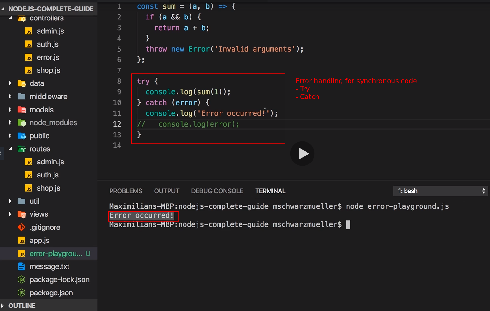
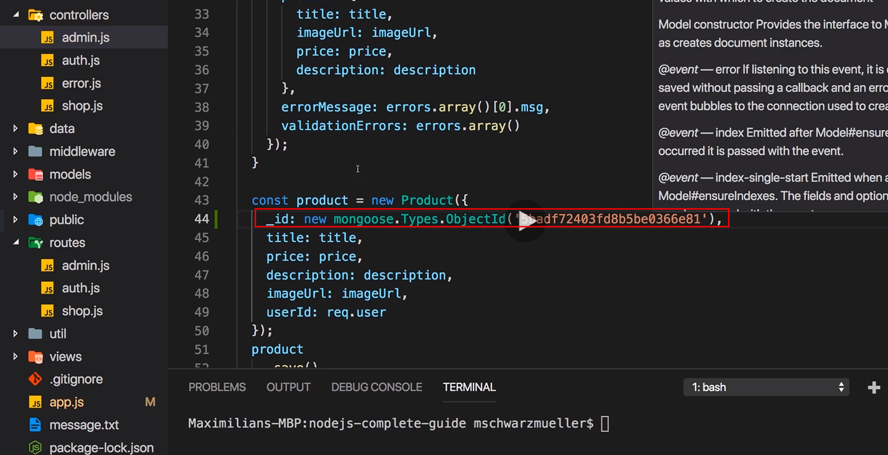
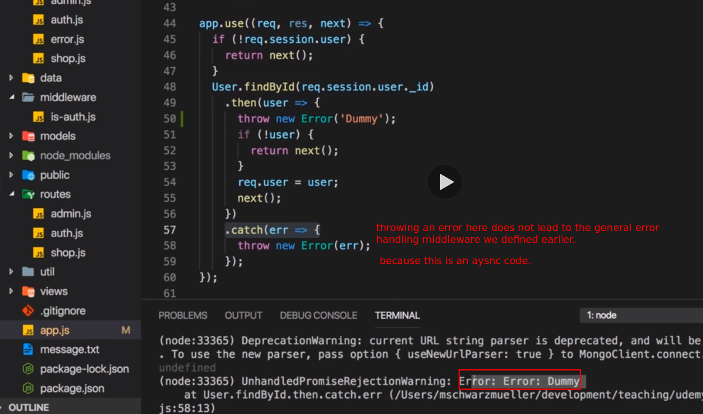

# S19 | Introduction

---

## Notes

# S19 | Types of Errors & Error Handling

---

## Notes

So how bad are errors? Now errors are not necessarily the end of your app, you can recover from the errors, you can inform the user that something went wrong and that he should try again for example, you just need to handle errors correctly that is the key takeaway and there are different types of errors. We can have technical or network related errors where you have very little influence on at least if you're not the system administrator, we have so-called expected errors and this is not an official term, that is something I came up with and I'll explain what this is in a second and we also have bugs or logical errors in your code. Now for technical errors, our mongodb server might be down and therefore any interaction with the database will fail. In such a case, there's not that much we can do, the best thing might be to show some error page to the user to let the user know that something is wrong on our end, that we are sorry and that we're working on fixing the issue. We also might want to behind the scenes send an e-mail to the administrator or anything like that. We also have these expected errors as I like to call them. There are certain operations, let's say we are interacting with a file or with a database that can fail, not very often and of course it's not really expected for this to fail but that can happen. Maybe because there are too many simultaneous requests to a certain file, anything like that. Here informing the user and giving the user the ability to retry might be a good solution. For example the validation errors which we also implement in earlier module, these would also be expected errors, users will input valid and invalid data and for invalid data, we want to inform the user and give the user the chance of retrying and of course we also have errors in our code where we interact with a user object in a place where it just can't exist or at least not in all circumstances. We should fix such errors during development, we should test our code and we should fix such issues of course, these are not errors we should handle at runtime, we should not show a message to the user because these errors are not the users or the network's fault, they are our fault. So how can we work with the different types of errors then? We have to differentiate. There are errors where an error is thrown, an error is a technical object in a node application. So there is a built in error object which we can throw that's also a javascript language features, basically all programming languages have such a feature. We also can have scenarios where we can't continue with our code but there is no technical error. An example would be that we try to log a user in but the email address does not exist, this is not really a technical error, there is no error being thrown but we know we can't continue and so we want to check for this scenario as well and handle it appropriately. Now for the errors thrown part, we have certain tools we can use to test code and catch potential errors so that we can handle them gracefully and for synchronous code, that would be try catch blocks. For asynchronous code with promises, we have then and catch which you already saw quite a lot throughout this course. In the end in both scenarios, we then have the choice if we want to directly handle the error or if we use a mechanism built into express, a special error handling middleware which we haven't used thus far which you can use to catch errors and then return a response to the user and I'll show how this works in this module of course. For this scenario that no error is thrown, well we just have to check values with if checks for example and then we can decide whether we want to throw an error, to kind of enter the left world here and then kick off that error handling process or if we want to directly handle the error which is not a technical error but where we simply add some code that can continue with the missing input data for example. In all cases, we've got different ways of communicating with our users. We can return an error page, so a dedicated page that informs the user hey we have a problem and that of course should be kind of the last resort because there the user loses all his input, can't continue. We also can return the page which user was on and just give some error information, that is what we did for validating for example, there we returned the page the user was on, kept the input values and just added an error message. Or we could redirect, for example if we try to access a page which we are not authenticated to visit, then we can redirect the user. So these are the different tools we have, the different ways of working with errors we have and now let's dive into our code and see what we're already using and what we can use.

# S19 | Analyzing the Error Handling in the Current Project

---

## Notes

So in our application, we get a bunch of error handling in place already, let's start in the app.js. There I do already handle the case or I do have a catch block at least where I try to fetch my user at the beginning of the request and fetch the user from a session and then store that user object, still we can improve that and we will improve that in a second. In my controllers, I also have some error handling, let's say in the auth.js file. There I do check in login whether this email address does exist and if not, I do already return the same page with an error code actually where I do pass that information that the input was invalid. We do the same with the validation logic we added earlier by the way, here in the routes where we use the express validator package to add built-in validation functions, so built into that package. There behind the scenes, this package also throws and handles errors and allows us to simply collect all these errors which are now not these technical error objects but which are simply, which is data managed by that package, we collect these errors here and then we handle them manually. That would be the right side of this slide here because there, we handle errors manually or we added an if check where we check if data we got is enough to continue or not. We get no technical error being thrown here, these technical errors by the way can always be seen if you have an error message down there in the terminal, we have no such error but we still have invalid code and therefore we check this manually and proceed on our own. In our custom validators however, if we have a look at that, there I do throw a technical error for example when passwords do not match. Now this error would normally bubble up and would be handled by express but this express validator package happens to also handle it. And now it's this error handling which I want to dive into first before we then start implementing proper solutions for the different kinds of errors we could have.
5 - 8

# S19 | Errors - Some Theory

---

## Notes

So let's dive into throwing and handling errors and here I do have an error in my custom validator. Now this will be handled behind the scenes by the express validator package, so let's add some code that is not handled behind the scenes. And for that, I'll first of all take a step backward, I even quit my development server and I'll temporarily add a new file here, errorplayground.js . I will remove that, it's not related to the app but there we can execute javascript code and we can execute it with the node runtime of course and in here, let's create a new constant, sum where I take two values, A and B, whoops, so sum will be a constant that holds an anonymous arrow function, A and B and I return A plus B and then now there I call sum with 1 and 2 and I console log the result let's say. Now if I do this, we can execute this file with node error playground.js like this and we get three in the console down there. Now that's of course nice but now let's add an error. Let's say I only pass one argument instead of two, now if I execute this again, I get not a number but not an error, not a technical error object. Now let's say here I check if A and B, so both has to be true-ish, then I will return A plus B otherwise I'll throw, that is a built-in keyword, a new error and that's a built-in object node ships with where I say invalid arguments, something like this. Now let's execute this file again and now we see such an error message which we saw before in the course as well. Here we have our own error message and then we got a callstack which allows us to find out at which function and which line number this error was thrown and what was called before that error. We saw that before because that is an unhandled error. We throw an error and that is a built-in functionality,
9 - 15

# S19 | Throwing Errors in Code

---

## Notes

Let's start in app.js and there, I have some code where I do get my user out of the session and then I find the user by ID in a database and then I store the found user in my request object so that for the entire request, I can access that user object, it's a mongoose user object and I also catch any potential errors that might be happening. Again because it's really important, this catch block will not fire if I don't find the user with this ID, it will only fire if there are any technical issues you could say, if the database is down or if the user of this app does not have sufficient permissions to execute this action. Now we kind of have our own error handling in place and again we're not working with technical error objects here but here I am checking whether we do have a session user and I do have a solution for the case that this is not the case because if I would not add this check, then I could try to find a user without the session object existing and that would then crash our app. So it makes sense to write clever code that avoids such scenarios and tries to only execute code that will succeed. It might of course still fail and for some reason, we might still not find that user even if we have it stored in a session, maybe because the user was deleted in a database in-between. So it would make sense to also check for the existence of user or for the opposite, so if user does not exist and if it does not exist, here we could also return next without storing the request user. So just that we are super safe that we don't store some undefined object in the user object but that we continue without the user instead if we can't find the user. Here in the catch block, logging it is not really useful though. It will make more sense to throw a new error here where we simply wrap the error object we get here. Throwing this error has a significant advantage which I will show you in a second but with that, this looks good. We added an extra check and if we do have some technical issue, we throw a real error and as it turns out, expressjs gives us a way of taking care of such errors, that is why I'm doing it like this. Alternatively, we could of course also simply call next here to continue without request user being set or anything like that but I want to throw an error because we had a technical issue connecting to our database and that is something that might be a bigger problem than just a non-existing user.
16

# S19 | Returning Error Pages

---

## Notes

I added this throw new error in app.js and to show you what it does, let me go to another place, to admin.js, to the controller and change some code there. In there we of course have plenty of code to for example add a product and we do validate the user input which is also a form of error prevention or error handling, we do validate that input in admin.js in the routes folder, there we added all our validation logic. Now in admin.js, I'm extracting my logic. Now let me force an error by quickly looking into my database with compass, the graphical user interface we used before for interacting with the database and in there, in the shop database, let's go to products and let me pick up product ID here. Now when creating a new product, I will also add \_id and I will temporarily import something from the mongoose package because I want to create a new object id here and I can use mongoose types object id here, pass my object id and add the new keyword and now I will basically create a new product with an ID that already exists and therefore this should fail. Now let me start my application and let's quickly log in with a user here and add a product and here you can enter anything. Let's click add product here and now it will fail, you've got this infinitely spinning refresh icon and if you have a look at your code or at the terminal where you ran npm start, you will see that our server crashed because mongodb threw an error with a duplicate key problem which makes sense because we added a product with an existing ID and therefore everything crashed. Now of course this is a constructed scenario but just because I want to ensure that something goes wrong at this point because now I want to show you how you could handle such a problem. Now we are logging that error and I can confirm that this catch block is called by adding console log an error occured. So now if I save this, obviously our node server restarts, let's add a product again or let's try this again, it will fail again of course but if I click add product now and I go back to my code, we see an error occurred here, so this proves that this catch block gets fired but that's great because this means that we now have a chance of handling that error. Now what we could do here of course is we could return some 500 error page, we could also redirect the user to any other page or we could render the add product page again, we could even keep the old input and that might make sense if we expect this to be a temporary issue. So of course we could take our code from validating, copy all that and output it here or use it here in the catch block, set a status code of 500 which is a code indicating that a server side issue occurred and then we want to return added product with add product page title, add product in the path, by the way it should be fixed up there too, minor thing but make sure that the navigation item is selected. Editing set to false, has error can be set to true, the error message we can put our own error message here, something like database operation failed, please try again. Validation errors can be an empty array, we don't want to put a red border around anything and we want to keep the user input. If we save this and everything restarts, let's try this another time. So let's add a new product here like this and if I click add product, indeed now we have a better error handling because now I am returning that same page, I give the user some error message and the user can try again but of course this here will keep on failing because we have a fundamental problem in the code. But if that was a temporary network issue, this might be a fine way of handling this. Sometimes you got bigger problems though and you don't want to use this solution, you don't want to return the same page again, instead you really want to show an error page to show the user something bigger is wrong, we're working on it but for now you'll probably not be able to continue. And for such scenarios, I'll add a new view next to my 404.ejs file, I'll add a 500.ejs file. We actually already have a view for error handling, the 400 page, 404 page, now I'll add another page that will render error messages for bigger technical issues, not for not found routes. I'll copy the code from 404, include it in 500 and there I will say some error occurred and there may be some paragraph, we're working on fixing this, sorry for the inconvenience, something like that. You could add anything you want here. Now we have that 500.ejs route and that might be something you also want to do, in cases where you are not sure if you will be able to handle this otherwise. Now to return this 500 page, I'll go to my error.js controller and I'll duplicate my get 400 route and add the get 500 action here, with status code 500 we render the 500.ejs file with a page title of error or whatever you want, path can be /500 and isAuthenticated, yeah we use our session information for that. Now we have get 500, we just need to add a route for that now. So let's go to the app.js because in there, I use get 404 for every page, for every middleware that does not get handled ahead of time. Now there is one extra route I will add with app get/500, here I want to use error controller get 500. So now I define a route like this, /500, I now just have to make sure that we do redirect to that route when a 500 error occurs and we want to show that page and therefore in the admin.js in the controller, in the catch block, I will indeed redirect to /500. And now if we save that and I try submitting this again, I end up on my 500 error page and this can be a decent way of handling this for bigger problems.
17 - 31

# S19 | Using the Express.js Error Handling Middleware

---

## Notes

So we are redirecting to the 500 error page in this catch block and we can do this in any catch block where we want to ensure that we do handle errors. Now the problem is we'll quickly duplicate our code a lot because we've got a lot of catch blocks where we interact with the database and in every catch block here, we should redirect to the 500 page, at least in a lot of them, we would want to do that probably because for all these database failures or permission problems, it seems to be a bigger problem so returning this page might be a good solution. But replicating that code all over the place is rarely what we want to do, what we can do instead is instead of redirecting here, we can throw a new error, this built-in error object with the built-in throw function or keyword. We do that inside of the catch block, in this case here, of the post add product action. So here I throw a new error and I can throw a new error with a bit more details by first of all creating an error object with new error, I can pass my error message like creating a product failed or something like that or simply keep that error object which also has a message which you get returned by the catch block here. So I'm creating my own object which is built up on that now and then we can also add a new field here, http status code and set this to 500 for example and now here's something cool,

**We can return next and pass the error as an argument to next. We didn't do that before right, before when we called next like in app.js here, we simply called it without arguments to let the next middleware take over.**

**Well when we call next with an error passed as an argument, then we actually let express know that an error occurred and it will skip all other middlewares and move right away to an error handling middleware and that's the middleware I'll define now.**

So next error is the trick here with an error object being passed instead of throwing it and now we can go to app.js and there at the bottom, let's add a new middleware with app use and normally this could never be reached because we have our catch all middleware down there but there's a special type of middleware which we haven't seen before. All middlewares we added thus far, for example this get 404 action in the error controller, all these middlewares use three arguments, request response and next. Express also knows a middleware with four arguments, a so-called error handling middleware and there, the first argument will be the error and then followed by the other three arguments. Now express is clever enough to detect that this is a special kind of middleware and it will move right away to these error handling middlewares when you call next with an error passed to it, so it will then skip all the other middlewares and move to that and therefore here I could now render my 500 page or simply redirect to /500, I could do that. And now if I save that and I go back to my application and I try adding that product which will still fail because I didn't fix that issue, I load my error handling page but now with this central error handling middleware. Now that we added this error handling code, we can of course also repeat this in other places and you could refactor it into one function of course which you then just call in all these places, for example to also send an error here where we fail to edit or load the data for editing a product. We can force this to fail by manually throwing a new dummy error in here, again this is of course now kind of a set up scenario, you would never write this but this allows you to force this to fail, it would be kind of hard to force the database to fail right now because most of the time thankfully it works. But now I have this dummy error and hence if I now edit a product, I also see my 500 page because I throw this dummy error which I'll of course remove now because it does not make any sense to add this but then we made it into catch and there we created this error object and we called next with it and that again will then trigger this special error handling middleware. Now in case you're wondering what the status code is doing here, well in this scenario, I'm always redirecting to the 500 route here but of course we could have a different scenario where we don't redirect here but we want to render a page instead or we want return some json data, something we'll do later in the course and then I would want to set my error http status code code here as a response code. So this is not the solution we're using here but this is what you could do and I just want to show that you can pass extra information with the error object so that you can use it in this central error handler here. Now please note, the this error handler will not execute for 404 errors. There we still handle this manually because technically, the 404 error is simply just a valid url which we catch with our catch all handler there where we then just happen to render the 404 page, it's not a technical error object that gets created at any point here.
32 - 42

# S19 | Updating the App

---

## Notes

We had a closer look at error handling, now let me remove that code here where I create a duplicate ID so that it works again. I hope you got an idea of how error handling can work and how we can use that central error handling function or our own logic which we have in place all the time where we check for the existence of a product and redirect otherwise and so on. So we get a bunch of code already in our application where we do handle a certain situations which we want to avoid of course and you can always be more creative and handle them in a better way. For example here and get added product, if I don't find a product, I redirect to the starting page. Now you can of course enhance this and you could redirect back to the admin products page and flash a message onto that page which you then output in the ejs template to give the user more information on what went wrong, I'm not doing this here to not spend a lot of time on working on the UI only but these are all things you can do. What I want you to takeaway here is that you have measures or that you have tools for handling errors and one of the most important tool is to at least handle all these catch blocks here correctly and therefore I will do that and replace it with my catch block where I throw that error or where I forward this error here because this allows me to at least centrally handle them with a 500 page, if I do nothing else, this is better than nothing. So I'll use that on all my catch blocks here, also in auth.js, there not for this one here but for this one, I'll also add this catch block, the same for this one, basically for all the catch blocks where I just log something to the console, there I want to forward to the 500 page. Here as well and you can call that anywhere of course, not just inside the next block whenever you create an error object and you next it and you avoid any code being executed after this by returning next with the error, whenever you do that, you end up in your express error handling function. And just because it's really important, this is just one way of handling this, you also have all the other if checks and so on which we added, so this is just my last resort here that I always do at least that if everything else fails. And now we should have an application which is a little bit more hardened or at least shows some message to the user when something fails instead of just doing well nothing basically as we did before because you want to avoid situations where the app just crashes and you don't even tell the user, it's better to have some code in place that at least returns an error page. And now with all these changes here, you should be able to still click around and use that application as you did before, you can also delete for example, so that all works. But now we got proper error handling in place for scenarios where something does go wrong.
43

# S19 | Using the Error Handling Middleware Correctly

---

## Notes

Now that we learned about this express error handling middleware which we can use, which we added, what exactly does throw new error in this catch block, in this middleware in the app.js file do for us? I mentioned that this will become important. Now like this, it'll unfortunately not do anything. Let me start up our server real quick again and let me ensure that we do get an error by simply throwing a new error, a dummy error here, again to simply simulate that something goes wrong. I throw it here, if I throw it in a then block, the next catch block will catch it and handle it, now let's see what this does. Now to see the effect, I have to log in to ensure that we do get a user session and we can already see this crashes here, it loads infinitely because I have an error here, my dummy error. So this is now not doing anything, the app is still crashing. So one important takeaway is throwing an error here does not lead to our general error handling middleware being called and that is important. This is true because we're inside some async code, we're inside a promise here, we're inside a then or a catch block. If you throw errors there, you will not reach that express error handling middleware. The interesting thing is if you would throw an error outside of async code, so in a place where the code executes synchronously, so basically outside of a promise, then catch block or outside of a callback, so here if I throw my sync dummy like this, if we do that, so this is now throwing in a normal function, not nested inside a promise or a callback or anything like that. If I now reload this, you'll see that it tried to load the 500 page but it still failed. The reason for this is really simple, we have our middleware in place here where I retrieve my user and there I throw the error but this executes for every incoming request. Now when we redirect here, we do send a new request so we kind of enter an infinite loop here, we execute this again, it throws an error, we go to the error handling middleware, we trigger a new request. A solution here can be to simply not redirect to 500 but immediately execute our rendering code, so this code in our get 500 controller action and we could absolutely do that. We could render our error here instead of redirecting, we could render our page here and if we do that, you will see that now if I reload, I just get a problem regarding my csrf token because that can't be generated based on the incoming request because the request basically has issues here in our middleware before we set up the csrf token. So the solution for that would be to switch the order to make sure we set this token before we actually do something with the user which we tried to fetch, so now this works and now we get an error handling in place. The interesting thing is not just that we had to switch the order though and that we should avoid infinite loops but the interesting thing here also is that here I'm just throwing an error and we still reach this global error handling middleware. The reason for that is that in synchronous places, so outside of callbacks and promises, you throw an error and express will detect this and execute your next error handling middleware. Inside of async code, so inside of then, catch or callbacks, this does not work however. Inside of that, you have to use next with an error included. So this is then detected by express again and this is what we used in the other files and inside of async code snippets, you need to use next wrapping that error, outside you can just throw that error. And so if I now uncomment this, you will see that if I try to reload my page, I get this error no matter what I do because I still have this dummy error being thrown in my promise, hence the catch block executes, hence this line executes. So now I will get rid of that but I will leave this catch block as it is and you have to understand that for one, you should avoid infinite loops triggered through your error handling middleware as we had it initially here and second, that you can throw the error in synchronous code places like this one but inside of promise, then or catch blocks or inside of callbacks, you have to use next around the error.
44 - 56

# S19 | Status Codes

---

## Notes

Now there's one thing which I also want to cover in this module and that are the http status codes, which codes do we have and why do we use them? Let me first of all start with what the codes are therefore. The codes are simply extra information we pass to the browser which helps the browser understand if an operation succeeded or not. If you're writing an application with a lot of client side javascript or a mobile app and you will fetch only data instead of complete html pages, something we'll do in the rest module later, status codes also allow you to understand if an error happened, which kind of error because you typically map certain kinds of errors to certain kinds of status codes. For example you have 200 status codes, most importantly 200 and 201, these are always success status codes, they indicate that the operation simply succeeded. You have 300 status codes which simply indicates that a redirection happened. You have 400 status codes which show you that something happened because an error was done by the client, for example incorrect data was entered into a form, well then we return this 422 error code if you remember correctly and we have 500 status codes which indicate that a server side error occurred. Now here are some examples, you can find a full, a link with a full list in the lecture after this one. For success cases we have 200 and 201, the difference is that we use 201 typically when we created a resource on the server, so in the database, it's not a must but it's a pattern you can use and you see often. 300 like 301 simply is a code that is used in combination with redirection to inform us whether for example this resource moved permanently or just temporary thing, whatever. The 400 codes, there we have 401 if we are not authenticated, 403 which you could translate with not authorized so you might be authenticated but you were still not allowed to do that specific operation, 404 for a page that's not found, 422 which we often use for invalid input and a couple of other error codes and for 500, the most common one is 500 which indicates hey there was a server side error but you got also other codes for timeout and so on, again in the next lecture you find a full list. Now let's quickly scan through our code. If we have a look at our code, let's start with the admin controller, we rarely set a status code. The default then always is 200 which is fine for this case but for creating a new product, it would be better if we not just render 422 when validation fails which is correct but that when we succeeded, we also return 201. The thing just as if we succeeded, we redirect which will use a 300 code but later when we dive into creating restful APIs which is a different kind of node app where we don't return html but just data, there you will see the 201 code coming back, here it doesn't really make sense. Now forget added product again, we're fine with 200 and we're fine with 200 here. If we did fetch data and we do load the page and if we try to save or update a product, then we get our validation error with 422 and if we succeed or in all cases here, we redirect which again will use 300 automatically. So all these codes here are pretty fine, pretty decent, one of the most important things, we're in good practice at least is that we do use 422 for validating. Now we also have isAuth.js where I do redirect when we are trying to do something where I'm not logged in. Now again since I'm redirecting, I'm sending a 300 status code but of course we could add status 401 here to kind of also make clear what the problem is but it will be overwritten with a 300 code due to redirect, so it does not make a lot of sense and that is fine here. Later again when we have a restful API where we don't redirect because we don't route around on the server, then we'll use that 400 code. And for that reason that we now most of the time redirect or directly render a page, we don't set that many status codes here, we'll see them later again as I mentioned and we see some codes at least, also in error.js where I set 404 and 500. And these status codes not mean that our app crashes, that's important to understand, instead if I do enter some invalid route here, I do get page not found and if we open the chrome developer tools with the network tab and I reload, we see that here, this 404 code can be seen, it's also marked as read because chrome is intelligent and detects that anything which is not a 200 or 300 code is an error but error does not mean that it crashes. This still renders a valid page in the end, we just pass that extra information of hey here's the page but you see that page because something went wrong and chrome knows this too, for example tell us in the developer tools and later when we create that restful API I referring to, we'll also benefit from that because there we do have a more direct interaction with our requests because we don't render new pages all the time and then we can get useful information out of these status codes. So that is http status codes and how they are related with errors, your key takeaway is a status code does not mean that the request failed or that the app crashed. We had some problem and now we're returning information with the problem to the client and that is also a way of gracefully handling errors.
57 - 60

## Available Status Codes

#### Which status codes are available?

**MDN has a nice list:**
https://developer.mozilla.org/en-US/docs/Web/HTTP/Status

**Or, as a short overview:**
1×× Informational
100 Continue
101 Switching Protocols
102 Processing
2×× Success
200 OK
201 Created
202 Accepted
203 Non-authoritative Information
204 No Content
205 Reset Content
206 Partial Content
207 Multi-Status
208 Already Reported
226 IM Used
3×× Redirection
300 Multiple Choices
301 Moved Permanently
302 Found
303 See Other
304 Not Modified
305 Use Proxy
307 Temporary Redirect
308 Permanent Redirect
4×× Client Error
400 Bad Request
401 Unauthorized
402 Payment Required
403 Forbidden
404 Not Found
405 Method Not Allowed
406 Not Acceptable
407 Proxy Authentication Required
408 Request Timeout
409 Conflict
410 Gone
411 Length Required
412 Precondition Failed
413 Payload Too Large
414 Request-URI Too Long
415 Unsupported Media Type
416 Requested Range Not Satisfiable
417 Expectation Failed
418 I'm a teapot
421 Misdirected Request
422 Unprocessable Entity
423 Locked
424 Failed Dependency
426 Upgrade Required
428 Precondition Required
429 Too Many Requests
431 Request Header Fields Too Large
444 Connection Closed Without Response
451 Unavailable For Legal Reasons
499 Client Closed Request
5×× Server Error
500 Internal Server Error
501 Not Implemented
502 Bad Gateway
503 Service Unavailable
504 Gateway Timeout
505 HTTP Version Not Supported
506 Variant Also Negotiates
507 Insufficient Storage
508 Loop Detected
510 Not Extended
511 Network Authentication Required
599 Network Connect Timeout Error
Source: https://httpstatuses.com/

# S19 | Wrap up

---

## Notes

61

# S19 | Useful resources:

#### Error Handling in Express.js - Official Docs:

https://expressjs.com/en/guide/error-handling.html

https://expressjs.com/en/guide/error-handling.html

https://stackoverflow.com/questions/62882503/express-error-handling-middleware-best-practice

https://medium.com/@SigniorGratiano/express-error-handling-674bfdd86139
