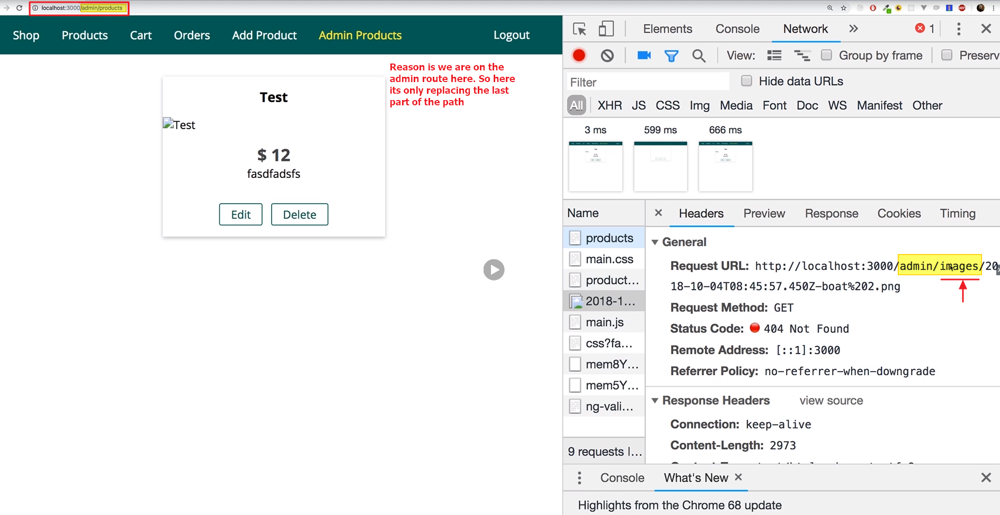
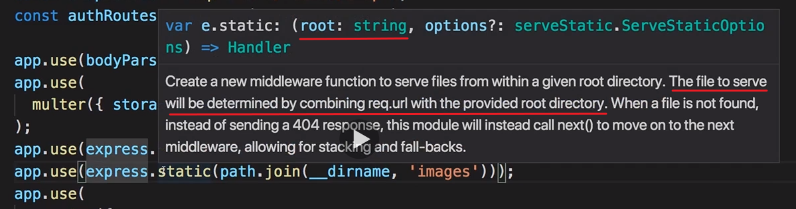
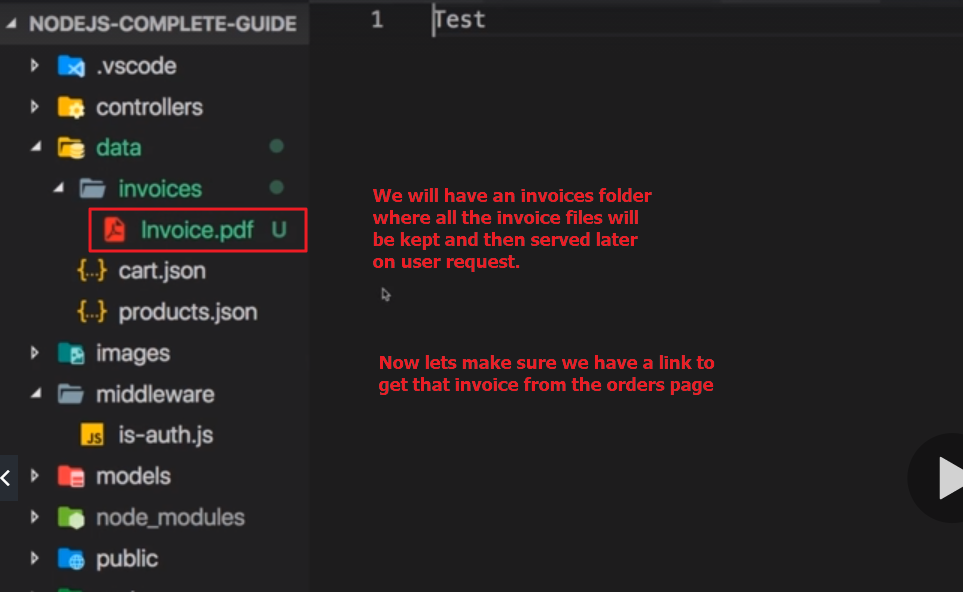
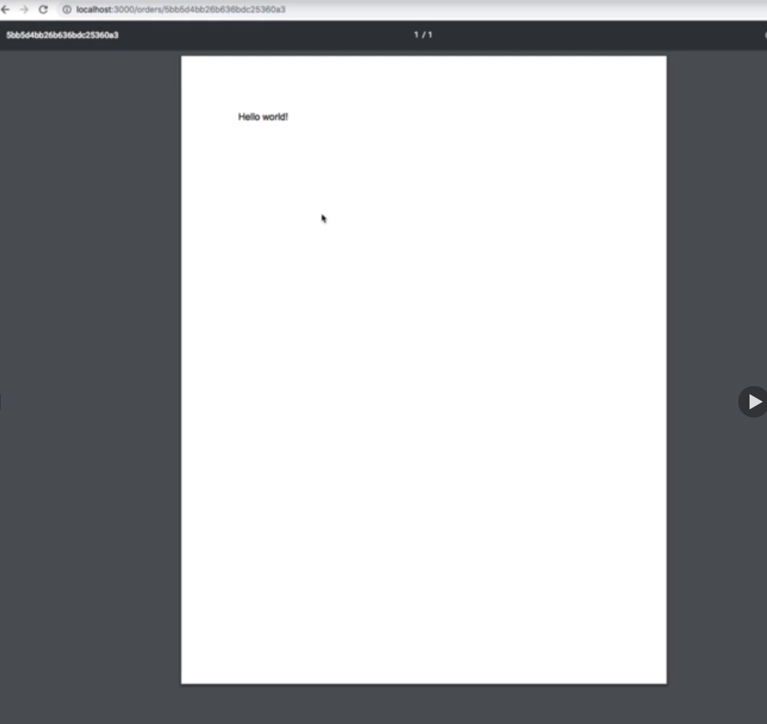

# S20 | Introduction

---
https://www.npmjs.com/package/express-fileupload
https://stackabuse.com/handling-file-uploads-in-node-js-with-expres-and-multer/
https://www.npmjs.com/package/multer

## Notes

# S20 | Adding a file picker to the front-end

---

## Notes

3-6

# S20 | Handing multipart form data

---

## Notes

So now that we added our file picker, let's work on the backend and for that I'll go to my admin controller which is where I do handle the creation of products, also the editing of products which we'll work on later but for now, let's focus on adding a product and here we are extracting data from the incoming requests. Now I renamed my file picker here to image, so the input name is now just image and this means that here when I try to retrieve it from the body, I should also target the image like this or we can keep this name because it will fail anyways. If I now submit this like that and I click add product, I get invalid value here and the image url does fail because I do have in my routes, in the admin routes, I do have some validation in place where I say the image url should be a url and clearly it is not. So let's remove that validator here for the post add product route and let's try this again and now we simply get an error, so the error handling is working and the error we're getting is simply stemming from the fact that we're not able to extract our image correctly. I can show this to you, if I console log image url here in post add product, in this controller action and I try to submit this, then you don't see anything here. It fails to log anything there because we failed to extract an image from the request body and why is that?

Because keep in mind you learned this a little bit earlier in this course, for extracting the content of our incoming requests, we set up a middleware in app.js, we're using a special middleware,

this **body parser middleware and this middleware uses or exposes a couple of different parsers and we're using the url encoded parser, now url encoded data is basically text data. So if a form is submitted without a file, so just with text fields no matter if that text field then stores a number, a url or plaintext but it's all encoded in text when it is submitted. This format is then called url encoded**

and actually we can see that. If we open the developer tools and go to the network tab in there, if I do click submit here, this failing request, this add product request, if we have a look at our request headers, we can see that the content type is application and then xwww form url encoded and this basically means **it tries to put all the data as text into its form body**. We can see that down there, just form data, title, price and so on and just image, this is invalid, this is basically an empty text because it can't extract our file as text because a file is binary data. Now because of that, because of that failing extraction, we need to work with this differently, we need to parse our data differently and the body parser that we're using here does not give us any parser, it does not include any parser that could handle file data as well. We need a new package for that, so let me quit that server and let's install a new package with npm install --save and the name of that package is multer. Multer is another third party package that parses incoming requests but this package parses incoming requests for files, so it is able to handle file requests as well or requests with mixed data, with text and file data. We'll still keep body parser because we still have like for example, our sign up form where we only submit url encoded data but now we'll have to use a different encoding and that starts with our form. So back in the view, the edit product view, there I'll change my form here a little bit, besides the class and action, here I'll also add a new field and that's the enctype field which I'll set to multipart form data. Application xwww form url encoded as the default but now we'll switch to multipart form data which is simply the content type telling the server that this submission, that this request will not contain plaintext but will contain mixed data, text and binary data and multer, the package we just installed will be looking for incoming requests with this type of data and will then be able to parse both the text and our file. So this is what we get there or what we will need and now with all that prepared, let's use multer in the next lecture.
7 - 19

# S20 | Handling File Uploads with Multer

---

## Notes

So let's use multer now on our backend. We can restart the server already because we installed that package and now let's go to our admin controller and let's work on post add product here, we want to use multer to extract incoming files. Now multer is actually not a package which we will use in here, instead just like the body parser we use here, multer is some middleware which we execute on every incoming request and it then simply has a look at that request, sees if it's multipart form data and tries to extract files if that is the case. So it is some extra middleware we add and therefore we can import it here in our app.js file. We can import multer by requiring it from the package like this, multer and thereafter we can use it, so maybe after the body parser, we can use multer. Multer has to be executed as a function and then we have to call another method on that and that simply defines if you expect to get multiple files or only one file and we will only expect one file, so we use the single method and then we define the input name which will hold the file and in our case, that is image and this is not a random value, I'm using image here because in my view, this input which holds the file, so this file picker here is named image as well. So with that, we initialize multer and let's now see if that works. Now to see that, we need to know how multer will actually store the incoming file and for that, let me go back to post add product and instead of extracting request body image, let me access request file here and let's see what this gives us, I will also console log image url now. Now let's save all that and see what that gives us. If I now try to add a product again, I'll choose that same file from before, enter any values up here, click add product and I still get an error. Now if we go back, we see something interesting though, indeed here this part is what I log here. So here what we see is that multer seems to have done something, it seems to have stored something in that file property on our request object and that is what we print here essentially and it stored the name of the field where it extracted that, it detected the file name, it detected the mime type so which type of file that is and that buffer here is essentially how node handles the binary data. You'll learn about streams and buffers earlier, in the end this is the result of the streamed data, the file basically was sent to our server as a stream or was handled as a stream to handle it efficiently if it was bigger and then this is the collected data in a buffer which as we learned is like a bus stop, it gives you a way of working with the stream data, here in this case it's the combined stream and data and we could indeed work with that buffer to turn it into a file. Now you can actually configure multer a bit differently if we go back to app.js, when we set up multer, we can pass an object to the multer function and there we can set some options and one option is the dest option. Now here we could specify /images or just images, like this. What this will do is that when I again add a product here and don't worry that it still fails because we're trying to store the file in the database right now and we'll do all kinds of stuff with it for which our code is not prepared but the upload works but with this option set, you also see that the output down there changed a little bit. We don't have the buffer because now multer is able to do something with the buffer, instead of just buffering it all in memory, it can then turn that buffer back into binary data you could say and it stores it in this path here. So indeed if you have a look at your folder, you should not have an images folder with some file in there. Now that file has some random hash name, does not have a file extension and is not recognized as an image but indeed if I change that and I add .png at the end, this is the image I uploaded. So this does work. All we now need to do is we need to tweak the way this file is named and that is something we'll do in the next lecture.
20 - 28

# S20 | Configuring Multer to Adjust Filename & Filepath

---

## Notes

We added multer and as you can see, multer is able to accept our incoming data, extract the files and store them for us and then store information about the file upload in this request file object here which we output which in the end contains this data. Now all we have to do is we have to ensure that our data gets stored correctly and for that we specify the destination folder but we can do more, we can set the storage key here which gives us way more configuration options than just the dest option. Now for that, to configure a storage here, I will actually set up a new configuration object, maybe up there, file storage, the name is up to you. It's a constant and the value will be something I get from the multer package, there it's the disk storage function. Disk storage is in the end a storage engine which you can use with multer and there you can pass a javascript object to configure that. It takes two keys, it takes the destination and it takes the file name. These are two functions which multer will then call for an incoming file and these functions then control how that file is handled regarding the place where you store it and regarding the naming. So destination therefore is a function, we can make it an arrow function which will be called by multer which receives the request object, the file object and a callback which you have to call once you're done setting up the destination, so this is all to interact with multer. So in there, you can for example call the callback with null as the first argument, that would be an error message you throw to inform multer that something is wrong with the incoming file and it should not store it but if that is null, you tell multer that it's OK to store it and then the second argument is the place where you do want to store it, like that images folder. Now file name also is a function, so it's also an arrow function where we also received the request object, some data about the file and a callback which we have to call to let multer know how to name it and there, we can also call this with null to still inform multer, ok we're fine store it please and then the second argument is the file name which we want to use and here we could name it image.png but of course that would be a bit boring, instead we can extract file and then there is an original name object which holds the original file name, there also is a file name object which holds this random hash and in the end what we can do here is we can of course combine this. We can for example say I want to ensure that if we have two images with the same name, they don't overwrite each other. So I will use that file name which is auto-generated by multer and then I'll concatenate it maybe with a dash in-between with the original name. With that I also ensure that I end with that extension and now I set my own filename here by calling that callback. Now we just need to inform multer that we want to use this storage engine and we do this by setting this as a value for the storage key in the multer options. Now with that if I go back and I added my product again, so the same input, both png elected, you will see that in those images folder you have undefined boat.png. Now it's simply undefined here instead of that random hash because since we did set our own filename with this function here, multer does not generate that hash but all we can do for example is we can use the current date, so new data to ISO string gives us a snapshot of the current date and that should also ensure uniqueness. If you need more, you can use some third party package that does give you a really unique hash. But with this we're now storing files with the right extension and a unique name and this gives us more power because now we can control the path and the filename. And of course, we can also use that for even more because maybe we want to validate that we only support certain mime types, let's say png and jpg but not gifs or pdfs. Let's do that in the next lecture.
29 - 33

# S20 | Filtering Files by Mimetype

---

## Notes

34 - 36

# S20 | Storing File Data in the Database

---

## Notes

So I'll just quickly clean up all my products here because there I'll store it in an incorrect way due to, well how I worked with the files in the past so let me remove all these products and now let me go back and here in my application in post add products, in my admin controller, there I now want to handle that file correctly. So first of all image here will be an object of this format with information about the file and where it was stored, so where the physical file can be found and now I want to save that. First of all, I will check if image is set because if it's undefined, then that means that multer declined the incoming file. So if this is not set, if it is undefined, well then I want to return a response with status 422 because I then have an invalid input, so I want to return that response, add product, editing false has error is true where I pass in my old data, not the file however, only title, price and description and the error message is attached file is not an image, let's say and validation errors can be an empty array, I won't mark anything as read. With this change in place, we can already validate this. If I now try to upload an image, I succeed, so I don't get my same form again. If I choose a PDF though, then I get attached file is not an image. So this is working and let's now also work on the case that we do have an image and that we want to store it. Now the file already gets stored on our file system and this is how you should store it, you should not store data like this in the database,

**files should not be stored in a database, they are too big, it's too inefficient to store them in a database and query them from there. Store files on a file system as we are doing it here but of course you need to store something in a database, you need to store the path to the file**,

right and that is something you can construct here with the information given to you in the file object and you can then simply pass that data to the database. So if we made it after our entire validation here, I know that I have a valid file and valid input data and then I'll create my image url again and in that image url, I will use my image data which is that file object we get from multer and there we have information like the file path and it's this path that is interesting to me of course because this is the path that a file on my operating system, it is the path I therefore want to use later on when fetching that image. So this path is what I'll store here in the image url and therefore I can store image url in the database again. So if we now save all of that and I do select a valid image here and I hit add product, this now works again, displaying it does not work we'll work on this in a second but saving does work and if I have a look into my database for the products, you see this is the part that was stored. Now this is looking good but of course here if we inspect this, we see the image is not really rendered because it can't find this, it fails to fetch images and then well this name and in the network tab we indeed find a 404 error when the browser sends the request for this image. So now that we are able to store data, let's also learn how we can serve data, well almost before we serve it, let's work on editing this because this is another path which won't work correctly right now. Right now when we load the added page, what we do is we load the page and we send back the data we need for displaying it of course. So that means we render the added product page with product data that includes our image url which is of course fine but ultimately, here we don't see the url and we don't want to change the url when editing the product, instead here we have a new file picker. Now you can of course configure this to work in any way you want but here

**I want to have a behavior where if we choose no file here, we simply keep the old one and we only overwrite it with a new file if I do choose a new one here.**

So to do that, I'll go to post edit product which is where we do handle the incoming data and of course here we again can retrieve request file and store that in image constant, just as I'm doing it here when we add the product, there I'm also retrieving this file extracted by multer. Multer will do the same for post edit product, so I can extract it there too, store it in an image and now this image is the thing I need to check. If it is undefined, then I know no file was saved and in this case this means I want to keep the old file, by the way the same will be true if I upload a PDF, I will simply keep the old image in that case. So we don't need to throw an error or return an error message, though you could of course do that if you want, if you always want to force a new image but here what I'll do is instead I'll first of all edit my validation page which I return and I'll not return the image url here, we don't need that just as in post add product, there we also don't need to return that because there is no image url we render in our edit page any more but if we make it past our validation here, when we store the product or when we update the product I should say, this image url does not exist anymore. Instead here I want to see if I really need to set that, so I'll check if image is there, if it's not undefined, in which case I'll set product image url to image path. So the same logic as I do have it in post add product, there I also set image url to image path but in post edit product, I do it conditionally and if the image is undefined, so if no new image was passed, I simply don't set it on the object which I then update and since I update it and if I don't set this, I will simply well not update this field and I can prove this to you. If I update this product here now, I get an invalid value because I forgot to adjust my validation middleware in the routes folder, for editing the product I'm still checking for image url to be a url but this field does not exist anymore so we should remove that from the edit product route validation logic and now if I submit this again, it just works. If I now choose a different image though and before I select this, let me quickly show you, if I update my database here, you'll see that image url did not change. If I select both too now which is the same image but a different file name and technically, a different file therefore, I update this and now if we go to that database and we refresh, we see it set both too. So now we got that editing option in place too and now we do handle the file uploads in the way we need to handle them. But of course handling file uploads is only one thing, we also want to be able to see that image, so to download it kind of and that is what I focus on in the next lectures.
37 - 46 - 55

# S20 | Serving Images Statically

---

## Notes

So how can we ensure that all our beautiful images are also served to the client, that they are downloaded? We got multiple options for serving files and I will walk you through all of them. Now option number one which you would typically use for a scenario like this where you have files that are publicly available to everyone, like our product images is that we simply serve our images folder in a static way. What does this mean? This means you go to app.js and there we already are statically serving a folder, we are serving the public folder with the express static middleware. Now we can serve more than one folder statically and remember, statically serving a folder simply means that requests to files in that folder will be handled automatically and the files will be returned, so all the heavy lifting is done behind the scenes by express then. I can duplicate this middleware and now also serve the images folder, just like this and with this little change if I save that and the server therefore restarts, if we reload this page, we still fail. Well if we inspect that failing request, we see that it tried to get the image from admin/images, the reason for that is that I'm on the admin route here, admin products to be precise, so it's only replacing the last part of my path with that image url and the solution for that is pretty straightforward. In our view products.ejs where I do show my image, we simply need to add a slash at the beginning which will turn this into an absolute path, so it will not append it to the current path but rather create a new path with only our domain and then the path which gets rendered here and I do this in products and of course also on my shop pages, so on index.ejs, so basically everywhere where I do render an image, I add a slash at the beginning. The alternative would be to store that path in a database with a slash at the beginning of course, might have been easier but I want to show you both ways so here I'll add it in my views, also here in the product list.ejs file, like this and also in the product detail file of course, there we also have an image. If we change all of that and I now reload this page, I still fail and now the reason for that is something different. The reason for that is that the path now is correct but my images here in the images folder are served incorrectly. In app.js where I set up this static middleware, keep in mind what I taught you earlier in this course, we basically point to a folder there like public and images and we then tell express serve the files from inside that folder as if they were on the root folder. So we would see that image if we go there and we see the path under which I try to find that, if we open that in a new tab, we can't find it of course but we will see it if I remove images there and the reason for that is that express assumes that the files in the images folder are served as if they were in the root folder, so slash nothing. Of course we want to keep them in the images folder and keep the path like this and for this, we can simply adjust our middleware here and say if we have a request that goes to /images, that starts with /images, then serve these files statically and now /images is the folder we assume for this static serving and now with that if we save that and we reload, we see our image here. So now we got that working and now we got a static way of serving our files and that is a great way of serving them. Now I want to do something different though, I want to add this to the cart, order it so that I have an order and I want to download an invoice for that order and that will now work differently because invoices will not be public files that everyone should be able to access, I want to be able to access my invoice but no one else should be. So let's focus on this in the next lectures.
56 - 72

# S20 | Downloading Files with Authentication

---

## Notes

So serving images statically is fine but we don't want to serve only images or only public files, I want to serve an invoice and that invoice should only be available to me. Now for that, let's start with a dummy invoice and I'll create a new folder for that, I'll name it invoices. You could of course put all images and invoices and so on into a parent folder, like data to not have them all as root level folders, that might be something you want to do. I'll move the invoices in there, images is kind of like a special case but my private data should be maybe somewhere else, so I'll put it into the data folder which was redundant until now, now it's not anymore and I prepared a simple pdf which I'll move in there. Now this is a really simple pdf, you can write it on your own, it's just holding some text looking like this. So here is my invoice, that is the pdf file I'm serving now, later we'll also generate this dynamically, now we won't, now I just want to show you how to serve that. Now obviously, we could make our invoices folder here statically accessible but that's not what I want to do. Now first of all let me work on the orders view to make sure we have a link to get that invoice. So for each order, this list item here which we have, let's maybe add a dash in the list item and in there, let's add an anchor tag which says invoice and then it should be pointing at the invoice. So now if I reload this page we have invoice here as a link, now I want to be able to click this and download the invoice, how can we do that? Well since I want to handle this privately, I need to set up my own route for working with invoices because that will then allow me to check for things like is the user authenticated and so on. So let me go to the routes folder and in there under shop because this is a customer feature, not admin related, under shop here I'll add a new route, orders and then maybe invoice ID or order ID maybe because the invoice let's say will have a name of that order ID ultimately, we could name this file differently, we can name it invoice and then let me quickly look up my order ID to make this all work correctly. Got a bunch of orders in there but this is my latest order which I just placed, so let's grab that text ID here and add that to the invoice name here, maybe after a dash we have the order ID, something like this. So this is my invoice and I'm getting the order ID in this route, I should be protected, authenticated to see tha, so I'll protect this route and then I'll use my shop controller and there, I get invoice controller action which I have yet to add. So that's why it crashed here because I don't have that action yet. In the shop controller at the bottom maybe, let's export get invoice here and that will be our default middleware function with request response and next and in here, I now want to return that file. First of all, I need the invoice ID for that, the order ID, excuse me, order ID will be a request and then it's encoded in the url, so it's params and then order ID, that is what I specified here in my routes file, order ID that's the name and therefore I have to retrieve it by that name in my controller, so order ID here. Now I have that order ID, the file name or the invoice name we'll be looking therefore will be invoice- and then my order ID and then .pdf right, that is the format in which all our invoices are stored let's say. So now we need to retrieve that file and we can retrieve files with nodes file system. We use that before in the course already, so let's start using it again, let's import it, file system by requiring file system, this is a core node module if you remember, you don't need to install a package it's already included in node and the file system allows you to do things like read files which sounds like a thing that makes sense here. So let's use the file system and read a file, we know it will be found in the data folder, now the path here should be constructed with the path core module so that it works on all operating systems. So let's also import path by requiring path, another core node module, the path module and let's construct that path to the invoice, so here I'll have my invoice path and I'll create it with path join and I'll be looking for the data folder, that's the first element, then the invoices folder and then the invoice name, the file name. So this is the path which I want to read, so I'll pass that invoice path to read file, read file then gives me a callback, so a function which it will execute once it's done reading that file, so here I will either get an error or the data. Now data will be in the form of a buffer. Now of course we should check if we have an error and if that is the case, well then we simply next it so that the default error handling function can take over otherwise if we don't have an error, here I'll return by the way so that the other code won't execute. So if we don't have an error, then data should be my my file right, so then I can call res send which is a function provided by the express middleware, my data. Now theoretically that should be the file, now let's see if that works and to make it work, we have to use this route in our anchor tag. So in orders.ejs, in this anchor tag we'll be looking for /orders/ and now we need to output something dynamic with ejs and that is the order ID because that's what we're looking for in the route, so the order ID is simply order_id which we use up there already. So let's output that here, let's save that and reload that page and now let's click this invoice here and I do get my download option here. Let me save that and try to open that file and indeed, it should open as a pdf or you should be able to open it as a pdf but of course it was not the most convenient way of downloading this. We had a strange filename right, this strange cryptic name, we don't have the pdf extension and all of that. So we can certainly improve that, let's do that in the next lecture.
73 - 86

# S20 | Setting File Type Headers

---

## Notes

We have our code for downloading a file and this file is now only available if we are logged in. Now we can improve the way we return this however, we can pass some extra information to the browser so that it uses a different file name and also with the right extension. For this we'll set some headers, so we can use set header for that and first of all we can set the content type to application/pdf because that is what it is here, whoops, like this. Let's see what this does, if I save it like that and I now click this button, now I open it in the browser. So this already changes the behavior, it already gives the browser some information which allows the browser to handle this in a better way and for pdfs, most browsers simply open them inline, so in the browser. So that's great but we can pass more information. We can also set another header and that is the contents-thisposition, this allows us to define how this content should be served to the client. We can set this to inline to still tell the browser to open it inline for example, so if I change it like this, nothing changes but we can also for example add a file name here. So we can add semi-colon and then file name and set this equal to in double quotation marks the file name you want to serve, so in my case it would be the invoice name right. So we can also set file name equal to double quotation marks plus invoice name plus closing double quotation mark contained between single quotation marks. If I now save this and I click this button, now we don't see a difference with the file name when opening it inline because it's open in the browser anyways but we can change inline to attachment for example. Now with that adjusted, if we click on invoice, the download menu opens again and now here we have the proper file name with the proper extension and this is how you can control how the browser should handle the incoming data. Should it automatically open it, should it instead let you download it? So I'll switch this back to inline but keep this file name here and now I have a set up where only authenticated users can request this invoice. We can still improve that.
87 - 90

# S20 | Restricting File Access

---

## Notes

Now how can we improve this serving of the data? Well first of all, right now this is only available to authenticated users because on my route here, I have the isAuth middleware but every user could view that, I don't have to be the user who placed that order. However for that order, I of course know which user belongs to it, I have the user id here. So we can add an extra check in our middleware, in our controller action here to see if for this order, the user is eligible of downloading it. Now how do we do that? Well we use the order mongoose model, find that order by that ID in the database and then check if the order user ID is equal to the ID of the currently logged in user. So here I can check order and then find by ID and I pass in my order ID, I have then and catch here. Now as you know, in here we can simply next an error to use the default error handling function and here we'll have our order element though that could be undefined if no order for this ID is found, so if no order is found, then I will also return next with new error maybe, no order found, whatever you want, you can handle this differently. If we do have an order however, I want to check if the order is from that user who's logged in. So then I can check if order user and then keep in mind, in the user object we have user ID field, so if that user ID toString, if that is equal to request user_id, so if the currently logged in user toString, if that is equal I am allowed to access this, if it's not, so if I'm checking the opposite, if it's not equal then I will return a new error unauthorized, something like this. And only if I make it past these two if checks, only in this case I want to read that file and output it. So if I now save this and I access this, it works, if I change the three here to a two, I get my error because now it's an invalid url and if I copy that original url which was correct and I do log out and I try to access this whilst I'm logged out, I have to log in and if I log in with a different user or let me quickly create that user and I then log in and I now try to access this order, I also get an error, I have to be the correct user. Now of course you could show a different error message but that is always something you can tweak, I only want to show you how you can protect this and that you have this option of controlling that access. So here, this all works just fine.
91 - 96

# S20 | Streaming Data vs Preloading Data

---

## Notes

**So we added authorization to our download option here. Now that's not all we can improve, we can also improve the way we are serving that file because right now, I'm simply reading that file and once I read it, I return it. Now for small files this is probably fine but you should be aware of one important fact, if you read a file like this, node will first of all access that file, read the entire content into memory and then return it with the response.**

**This means that for bigger files, this will take very long before a response is sent and your memory on the server might actually overflow at some point for many incoming requests because it has to read all the data into memory which of course is limited.**

**So reading file data into memory to serve it as a response is not really a good practice, for tiny files it might be ok but for bigger files, it certainly is not, instead you should be streaming your response data and that is what I will do now.**

So I'll comment out this code where I read my file and instead here, I will now start streaming it. For that I'll create a new constant, I'll name it file and I will use the file system and create a read stream because I want to read some data in. Now I want to read in data at a specific path and the path hasn't changed, it's the invoice path, so now I have to read read stream and

**node will be able to use that to read in the file step by step in different chunks**.

I will then take my response code here where I set the headers, I still do that on the response object and then here,

**I will use that file read stream and call the pipe method to forward the data that is read in with that stream to my response because the response object is a writable stream actually and you can use readable streams to pipe their output into a writable stream,**

not every object is a writable stream but the response happens to be one. So we can pipe our readable stream, the file stream into the response and that means that the response will be streamed to the browser and will contain the data and the data will basically be downloaded by the browser step by step and for large files, this is a huge advantage because node never has to pre-load all the data into memory but just streams it to the client on the fly and the most it has to store is one chunk of data. Again we're back to the streams and the buffers,

**the chunks are what we work with, the buffers basically gives us access to these chunks and here we don't wait for all the chunks to come together and concatenate them into one object, instead we forward them to the browser which then is also able to concatenate the incoming data pieces into the final file.**

So with this setup here, let's try this again, click on orders, click on the invoice and again we see the invoice as before but now this is actually streamed data created with that create read stream thing which is the recommended way of getting your file data especially for bigger files.
97 - 99

# S20 | Using PDFKit for .pdf Generation

---

## Notes

Now that we learned how to save files and how to return them in different ways statically as one big file or as a streamed response, let me show you a little bonus so to say where we can create a pdf on the fly on the server, instead of serving that hardcoded pdf here, let me create it on the fly instead. So I will delete my invoice here and instead when we get the invoice for an order, I don't want to serve a file that already exists but I want to generate that file based on the real order data. For that I first of all will still check if we have that order and if the user is allowed to access it but of course this will now change, well actually the name will be the same and I will store it in the same way but I now can't read the file, I need to create it and how can we create a pdf? Well there are third party packages which we can use which make it a lot easier and pdfkit is a very prominent or popular package for creating pdfs on a nodejs server. I strongly recommend checking out their documentation to learn more about all its many options because it's super powerful, it can do a lot of stuff, so definitely worth having a look at this and we will use it to create a very simple pdf in this course here. Now for documentation, it's important to know that this documentation uses coffee script which is like a superset to javascript, it's not supported by node, it's just a tooling for writing your code, it's compiled back to a normal javascript and therefore this documentation can be a bit hard to read. In the end you could say something like this new pdf document, here we would have curly braces after it, require would be using curly braces so some stuff here looks a bit different but I will show you how to use it in this module, in this lecture actually. Let's start by installing it, so I will simply run npm install --save pdfkit, that's the name of the package, you'll also find these instructions on the official page, npm install pdfkit and then we can start using it once it's installed. So let me start that server again and up there in my shop.js controller file, I'll import pdfkit by requiring pdfkit, so this package we just installed. Actually pdfkit exposes a pdf document constructor, so let's maybe name it like this, so pdf document, the name is up to you but this is closer to what this package really exposes. Now I want to create a new pdf document when we get an invoice at this point here. So let's create a new pdf doc, whatever you want to name it by calling new pdf document and that's what I meant, you need to add normal parentheses as we always did for all constructors. So now we have a new pdf document. This actually also turns out to be a readable stream, therefore what we can do here is we can use the pdf document and we can do two things. First of all we pipe this output into a writable file stream, so create write stream is a function we can call on the file system package and to that we pass a path where we want to write it to, the invoice path in my case and this ensures that the pdf we generate here also gets stored on the server and not just serve to the client. So we create that and of course I also want to return it to the client, so I also pipe the output into my response, just as before, the response is a writable read stream, pdf doc is a readable one so we can do that. Now we have this set up and now whatever we add to the document will be forwarded into this file which gets generated on the fly and into our response. Now let's start simple and let's now use pdf doc and let's call the text method which exists there, this allows us to add a single line of text into the pdf document. So here let's add hello world maybe and then you have to call pdf doc to tell node when you're done writing to that stream because you have to be done at some point, right. So here you simply call end and when you call end, these writable streams for creating the file and for sending the response will be closed so to say or will know that you are done writing and therefore the file will be saved and the response will be sent. And now with that saved, just make sure you also change your setup down there at the bottom. I will keep the headers but I will not pipe any file because we now, well pipe the file up there when we create it and I just need to make sure that I set my response headers accordingly. Now with that if you save that and you click on that invoice link, you should get a pdf with hello world in there and this pdf also can be found here. Now it might look a bit strange here but you can open it with a normal pdf reader and it should look like a pdf. So this is how you can create a pdf on the fly, now in the next lecture let's actually populate it with some order data.
100 - 110

# S20 | Generating .pdf Files with Order Data

---

## Notes

So let's create a more useful pdf now. Now you can configure a lot and the official docs of pdf kit are the place to go to learn more about that but let me show you how you can generate some nicely looking pdf in little time. For example, let's set a font size here of 26 and then add some text and this text will now have this font size and this will have text of invoice. If I now save this and I reload this page, we get invoice written like this, we can also pass an object as a second argument here and configure this, for example you can set underline to true here on the text and now if I reload this, we have the underlined text. So of course you can style way more, you can even add images and all that stuff. Now I'm happy with that title, I'll simply add some dashes as the next line here and then thereafter, I want to have my different items. So now I have to loop through all the items that are part of the order, in this order I only have one product but I might have more products and actually we can of course do that. If I go to products, I can add this product to the cart twice and I can quickly create a new product, prod2 and boring as I am I'll use the same image for 29 bucks, product 2, let's quickly create that product and then after we created it, I can add that to my cart as well and then I could order this and now I've got a brand new order. Now by the way, I should place that invoice link next to the order not next to the product now that I have a look at it but it doesn't matter, we can change this later. For now this will always lead to the same invoice so it does not matter too much, now I have multiple products in there and I should loop through them when creating the output. So I can add a for loop or simply access, keep in mind we already have access to the order here since we fetched it from the database, I can access order products and products is an array because we store this products in a database, it will be an array of objects where each object has a quantity and then a product key with more detailed information. So I can loop through my products for example with the forEach method which is a built-in method provided by javascript, I'll then get information about my product and I can now output some text where I print the prod, product is then the detail object and in that product, we have the title for example, so I can output the title here, then let's say we add a blank and a dash and a blank and then I have prod quantity right because we have the quantity key directly on the product itself and then I add let's say a times character and then we want to output the price, so I'll have let's say a dollar sign and then last but not least, I'll have the product price, so this field here. Now of course you could also use the next gen javascript syntax with back ticks to make this a bit easier to read, I think it's maybe easier to understand how we are concatenating this from hardcoded values and dynamic values and now we should be outputting a line of data for each product in that order. Now let's also add a sum at the bottom and we can calculate that on the fly here, let's total price start at zero and if we are looping through all the products anyways, we can use that to also update our total price because total price will then be the old total price plus the product quantity times the prod product price. So basically what we print here is text, we'll then also add it to our total price here, by the way this can be written in a shortcut with this operator, now this will always add the result of this calculation to the old total price and then here outside of the loop once we are done calculating the total price, I'll access my pdf doc, output some text here and that text will be total price dollar sign and then simply total price, like this. With all that let's save that and let's click on invoice for the second order and here I get my invoice which looks like this. Now of course we can also revert the font size here by setting font size to let's say 14, so that we don't use that super big font for all our text, so now by adding this line inside our loop, I am sure that this looks like that and then maybe just some stylistic thing, though it will not become super pretty. I can add maybe some more dashes here to separate the list from the total price and set the font size of that total price a bit bigger, to maybe 20. Save that, reload and here it is. Now obviously, this is not the most beautiful invoice we ever saw and you can learn way more about how you may style that in your official docs of pdf kit. The important thing is the data in there is correct, so the data does look correct, the total price is correct and this is how you can generate data on the fly and how you can then return it in a response and also save it in a file because that is important too. We do both at the same step and I believe its very interesting to see which power nodejs has and what you can do with it especially when also playing around with the features of writable and readable streams, like here where we are creating a pdf on the fly and we were streaming it both into a file and back to the client.
111 - 117

# S20 | Deleting Files

---

## Notes

Now in this module we covered a lot and we work with files a lot. Now one thing you might notice is that whenever we for example change an image or when we delete a product, the file belonging to that product, the image belonging to the product sticks around. Now obviously you can always delete files with the file system package, there you also got options for deleting files. You could delete files whenever you added a product when you override the image, so here if you are inside that if block and we set a new image url, then we could also kick off a function that goes ahead and deletes the old image by fetching that from the product first because we're fetching the product here, so we can get access to the old image path by fetching that path and then using the file system to delete that old image and we can of course also delete an image when we delete the product. So let's add this functionality as a last step now and for that, I will go to my util folder and add a file, js file where I will add some helper functionality. There I'll import the file system, so the file system is imported here and I'll have a constant which holds a function which I'll name delete file. This function should accept the file path and that's it let's say. In here I can use the file system package and there, you'll have the unlink method, it deletes the name and the file that is connected to the name, so it deletes a file at this path. So here I pass file path and then this has the callback we know with an error if it fails and in here, we can simply check if we got an error and then I want to throw it again and then it should bubble up in our default express error handler should be able to take over otherwise I'll not do anything here. So it's like a method I can always call to pass in a file path and delete that file. And now we can use that in our admin controller, so let me import my file helper here by requiring it from the util folder and there the file, file and now I can use that file helper for example in the place where we added a product. If we are in this if block and we know we'll replace the image url, then before I do so, I will use file helper and I call my function there, for that I need to export it though. So in here I want to export delete file, this will hold my delete file constant, so this function and now in the admin.js controller, here I can call file helper delete file and I pass in product image url, so that path to that file and now this should fire. I'm not waiting for this to complete, I continue with my other operations, I'm doing this in a fire and forget manner, so I'm firing this function and I don't care about the result. If I wanted to, I would have to pass my callback here, so a function which then continues with the rest in this function here but I simply fire it like this and I will do the same when we delete a product. So in there when we do delete it, here I also want to delete the respective image and for that, I first of all need to fetch my product of course, so I will have find by ID in here, find it by prod ID and then here I have then and catch. In catch I can next any error I get and in the then block, I will have access to my product, so here I can then execute my file helper. I should of course also check if product is not set in which case I'll also return next with a new error product not found and otherwise I delete that and I should only trigger delete one here after I found this otherwise we have a race condition where deleting could finish before finding is finished and that would be bad. So we'll grab that delete one code, move that in here and return it to return the promise returned by delete one and then I can actually replace that catch block with my old then and catch block and this will catch errors in any of the then blocks and it will also make sure that I first find the product and once I found it, I delete the image and I simultaneously start deleting the product itself. Let's save all of that and let's see if that works. If I go back to admin products here and I delete product one, this is cleared and here I also have one image less, if I delete the second product, it's only three images, so this works. The other images are still sticking around because previously when I started deleting products and so on, I did not have that logic in place but now this works. Fetching my invoice or generating it on the fly works and thanks to the fact that we store a snapshot of that in the database, it even works after the product was deleted which is of course the way we want it to work and with that, we have a really nice setup here.
118 - 125

# S20 | Fixing Invoice Links

---

## Notes

126 - 127

# Useful resources:

Multer Official Docs: https://github.com/expressjs/multer

Streaming Files: https://medium.freecodecamp.org/node-js-streams-everything-you-need-to-know-c9141306be93

Generating PDFs with PDFKit: http://pdfkit.org/docs/getting_started.html
