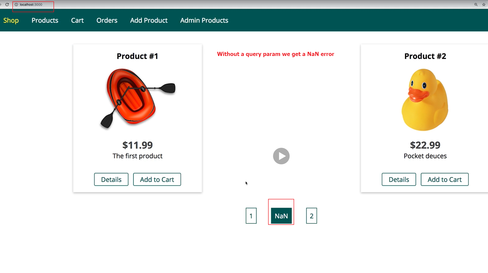

# S21 | Introduction
---

## Notes

I'm really happy with the shape our course application is taking and we're diving into many exciting features we can build with node and express as you see. Now that we're able to work with files and even generate them on the fly on the server, let's dive back into some work with our database or interactions with our database. There right now we always fetch all products when we display the product page. In this module, we'll dive into a technique called pagination which allows us to split our data across multiple pages, something you typically want to do when you work with a lot of data. So let me show you how this can be implemented with our application in this module.

# S21 |  Adding Pagination Links
--- 
## Notes
Here's our shop and I created three products behind the scenes, so you can of course create any three products on one or more user accounts, doesn't matter, in the end you will have three products. Now obviously we can absolutely display these three products like this, nothing wrong with that. But let's say we have hundreds of products, we would not want to display all these products on one page, instead we'd like to split them across multiple pages and then somewhere on the page, often at the bottom, we'd have some controls to go to page one, page two, the next or the previous page and that is exactly what I want to implement here, pagination. Now you can certainly find some third party packages that can help you with that and these would be fine to use but I will show you how to implement that from scratch on your own because that is obviously how you learn the most. So back in our project, how can we implement pagination? Well typically, you handle this as I said by adding some controls which always leads to the same path. so always /products or slash nothing but then you add a query parameter, remember **query parameters** are these parameters you add after a questionmark which allow you to specify optional data and there you could specify something like page equals one to load the first page or page equals two to load the second page and you would change these query parameters with these controls you add. 

Let me show you what I mean. I will go into my views folder and let's work on that slash, so on that root route, so that index.ejs file here and there at the bottom beneath my products but inside of that first if block, so where I know that I have some products, in there I'll add a new section. I'll give it a class of pagination because this will be the section where I manage the pagination and my idea is to have a link here which says 1 for Page 1 and 2 for Page 2 and here I would go to slash and have page equal to one let's say and here, page equal to two. So here I would set a query parameter to value one or respectively, to value two. If I save this and reload, we can see that on the left here, now let's change the styling real quick. So for that, I'll go into my public folder, css and there the main css file and I'll scroll all the way to the bottom right before that media query, I'll add pagination so that class I added to the section and I'll set text align to center and I'll also style my links. This is of course totally optional but I will style my anchor tags in there to have no text decoration, so to not be underlined. I'll give them a color of let's say my green which I'm using in this project, I will also add some padding of let's say .5rem and give them a border of one pixel solid and that same green color and also some margin of 1rem left and right, something like this. If I now save that, I have these buttons here. Now one more thing, on the whole pagination section, I'll add a margin top of 2rem and I also want to make sure my buttons have some hover style, so pagination a hover and pagination a active sets these styles when I hover over them or when I click on them and there, I will set a background of this green color and change the text color to white. Now this is all optional, I just want to have some stylings here for my buttons. So now we have these buttons and if I click one of them, you can see the url changes, it's the same path, just slash nothing but I have an optional parameter in there. Now with that set up here, let's now see how we can work with that parameter on the backend to control the data we are fetching.
1-5

# S21 | Retrieving a Chunk of Data
---

## Notes 
I'm setting these query parameters and I can use that data on the backend to control which data I want to fetch, obviously I do that in my controllers and there in the shop controller. Here. we're working on the index page so I'm looking for the get index controller action. In here I need to retrieve the information on which page we are, so which data for which page needs to be displayed, so I'll store this information in a new constant named page and in that constant, well I will store request and then we can get query parameters on the query object provided by expressjs and there I can access page, page because I named that query parameter page here. So now with that, I'm getting that page number and I'll store it in this constant. Now with that, we just need to define how many items should be displayed per page and that's something I will store as a global constant in this file, I could also store it in a different file, export it there and import it here but I will name this items per page and this will be let's say 2, it should be some number lower than the number of items you have here so that you can see a difference. So I have two items per page here and with that in get index, I know that I if I'm on page one want to fetch the first two items, if I'm on page two, I want to fetch items three and four, on page three I would fetch four and five and so on. Therefore we now need to control the amount of data we're retrieving from the database, find right now gives us all the items but we can actually control this. In mongodb and therefore also mongoose, there is a skip function. We can add this on a cursor and find does return a cursor to skip the first X amount of results and here, that would be page -1, so the previous page number in brackets times items per page. So if I am on page 2, I would skip the first page -1, so the first one times items per page items. So on page 2, if I have 2 items per page, I would skip the first one times two, the first two items. I don't just want to skip some items, I also want to limit the amount of items I retrieve though, so that I don't just skip the items of previous pages but for the current page, I also only fetch as many items as I want to display there and this can be done with the limit method. The limit method as the name suggests limits the amount of data we fetch to the, well number we specify here and here I can pass items per page because that is my item limit per page. With that if we save this code, we can reload this first page with the query parameter set to page 1 and we only see the first two items. If I now click on two down there, I only see the third item because I'm on page 2, I skip the first two items and I fetch the next two items and I only happened to have one other item. On page 3 if I would enter this, we would not find any products because I have no items for this page but Page 1 and 2 were just fine. So this is the general idea behind pagination. Now obviously the idea would be that we update our pagination buttons here based on, well the page we are on and the maximum number of pages that are available or something like that. So let's see what we can do there. 
6-9

# S21 | Skip & Limit with SQL

---

## Notes
When using MongoDB, you can use **skip()** and **limit()** as shown in the last lecture.

But how would that work in SQL?

Here's how you would implement pagination in SQL code: https://stackoverflow.com/questions/3799193/mysql-data-best-way-to-implement-paging

To quickly sum it up: The `LIMIT` command allows you to restrict the amount of data points you fetch, it's your **limit()** equivalent. Combined with the `OFFSET` command (which replaces **skip())**, you can control how many items you want to fetch and how many you want to skip.

When using Sequelize, the official docs describe how to add pagination: https://sequelize.org/master/manual/model-querying-basics.html

# S21 | Preparing Pagination Data on the Server

---

## Notes
We are able to skip and limit the amount of items we fetch and we can control that with query parameters but my buttons are hardcoded right now and that is not ideal of course, instead I rather maybe want to highlight the page I'm currently on and then show the next page number or the previous page number. For this I need to fetch more information. I will find my products and call count here, then I can also add then and catch. The important thing is I don't need catch because I'll concatenate my other promise chain later, the important thing here is this will now not to retrieve all the products but simply just a number, so number of products is what I get back in this then block function here and in that function, I then want to kick off my request where I really do fetch all the data. So we'll return product find in here with skip and limit chained after it, that's important and then I'll add this then block to continue. So I'll first of all find the count, then I have this number of products here and then I kick off my normal find method where I then really fetch the items and I skip and limit them. Here I'll add a variable, total items and I'll set total items equal to num products in here. So now I will have the total number of products stored in that variable here and when I render the index page, then I want to return that information as well, so not just the products but also total products and that will be total items, so that will be a number in the end and I also want to pass the information whether there is a next page, so maybe has next page which only will be the case if the total number of items is greater than the page we are on times the items per page. So we have a next page if items per page times page is smaller than total items because if we have 10 total items and we are on page 4, then we have 2 times 4, 8 items which we are seeing or which we saw and we have 10 left so there will be a next page. Simultaneously I can add has previous page here where I can simply return the information whether the current page is greater than 1. If that is true then there is this a previous page because there will be page one, if that is false because we are on page one already, well then there is no previous page because we can't go lower than one. I can also return some extra information like the next page and that will be page plus one of course, if we are on page 1 the next page would be page 2 and previous page would be page -1 obviously. We can also add last page to have a way of displaying the highest page number and that is math seal total items divided by items per page. So if we have let's say 11 total items and we have items per page of two, then the result would be 5.5 and then math.seal would return us 6 which would be the correct value because we would need 6 pages to display all 11 items if we show 2 items per page. So now I'm passing all that information to my products page, to my index page here to be precise and there, I now want to use it.
10 - 12

# S21 | Adding Dynamic Pagination Buttons

---

## Notes
So let's now use all that information we get back from our backend when rendering our index.ejs page, we have all these utility information pieces, these utility variables like total products has next page and so on which hopefully should be helpful. So let's go back to index.ejs . and there instead of hardcoding this, we can now generate this dynamically. Now I always want to have page one here, that is something I absolutely need. Let's say the page next to it should be the current page, so actually instead of total products, I should return current page here which is simply the page number so that I always know what's the currently active page. So I'm returning current page as well and here, I can now output equals current page because I'm now getting that data in my view and here I therefore will load the current page number if I should click on that link again. And this current page will receive a css class of active because that will always be the active class and I'll quickly go to my main css file to give that the same style as when I hover over it. So here I'll have my pagination a class with an active class added to it with a single dot, a active will receive the same style as when I hover over it. Now I only want to render this one by the way if the current page is not one because otherwise I will already render it here, so we can add some ejs logic here to check if current page is equal to one or to be precise, if that is not the case. If that is not the case, then I will render this otherwise I will not render this. So I can now close that and now this will only get rendered if the current page is not equal to one, like this. This will always get rendered, the current page and I also want to render the next page let's say, so I will repeat this one more time here and this will be the next page. Remember the next page is some information which I return as well, next page here. So I will render the next page, only however if there is a next page and that is another piece of information I do return, has next page. So let me go back and here again if has next page, so if that is true, then I will render this, otherwise I won't, so here I just close that if statement. I also want to render the highest page, so I'll add another anchor tag here and that will use this last page information, by the way the active class here of course not be added here and also not be added here. So here I will render the last page and it will lead to last page, here it will lead to next page by the way so we have to adjust this link obviously, here it's the last page and this last page should also not always be rendered, it should only be rendered if last page is not equal to the current page, so if we are not already on the current page because then this link would already render the link to this last page and the next page should also not be equal to the last page because if it is, then this link will already be rendered and this is then the last and next page simultaneously but if both is not true, then I will render this. Now let's have a look at this and let's reload this and here I got an error, little logical error. Count used to be the function you should use, now it's count documents so change count to count documents here but this error is not coming from that but in the index.ejs here I got a dollar sign instead of a percentage sign which I should use. With that fixed, this looks a bit better but I got 11 here and then a two again so there seemed to be some issues. For one it's rendering the one here even though the current page is not equal to one, the problem here is really just the data format, we're comparing strings and numbers here so I should remove one equal sign and now this works. And now regarding the 11, next page somehow is calculated to be 11. The reason for that is that page here is a string, not a number and therefore page plus one gets concatenated to 11, so to 11, this can be fixed by adding a plus here in front of request query page and now this looks better. Now I can switch between these two and this is looking all right now with that error, this format, this data type error fixed, now what happens if I load that page without the page query parameter and then I have this not a number issue here. And to fix this, I can add two pipe symbols here in that one and this means if this is undefined or if this does not hold a true-ish value, then we'll use this value instead. With that if I save that and I reload this page, I'll start on page 1 and now I can jump around. Now let's also try this, when changing the items per page to one so that we should have one extra page. Now if I reload this with Page 1 being loaded, I can go to page 3 and 1, 2, 3. Now I don't see a two when I'm on page three because we have no logic for it in our template right now, I could of course add that logic to also show the previous page. For that I can replicate this and if I have a previous page, then I can show my previous page and link to it here. Now of course I want to avoid that I have two ones if I'm on page 2 because that would render this link and I would render this link, so I don't want to render this first page if I am on it already or if it's equal to the previous page. So I only want to render this first page if it's not equal to the current page and if the previous page is not equal to 1. Now by the way since I fixed that data type, we can also work with double equal signs here again. So now if I reload this page, it's in the wrong place, the previous page here should be before this current page so let's fix that. Reload again, now this is looking better, now I can go to page two, page one and that all seems to work. Now let's add another product, product4 with another deck again to see how it works with four products on the shop page and now I see the first page, the next page and the last page. If I go to the last page, I see the previous page and the first page, if I go to three, well then I have the previous and the next page which is the last page and the first page. So now this pagination is working and you can always of course tweak this to your requirements or your different needs but now this is looking good to me here.
13 - 21

# S21 | Re-Using the Pagination Logic & Controls

---

## Notes
Now with the pagination added to this first page, let's add it to the products page here as well. And to do that, we can of course grab this entire section either from the index.ejs file, cut it and create a new include for it which we can name pagination.ejs and in there, I'll insert this pagination content and in index.ejs where I had this previously, I can copy that include code from add to cart and add it here and include not add to cart but pagination of course and I just need to forward the data into pagination, so current page, previous page, next page, has next page, has previous page, all that data should be forwarded. So I want to forward current page, which value is current page, so the key value pairs here need to be equal. Next page which is next page, previous page which value is, whoops. previous page, last page where the value is last page, has next page where you guessed it, the value is has next page and and has previous page where the value is has previous page. Now with that include added, let's quickly test this by going back to the index page, that all seems to work and now we can grab that include code and add it also on the product list page. There we load this div, I can add my include to add the pagination section too. So now if we save that, we also need to adjust our controller because there in get index, I have all the logic for paginating, I need that same logic in get products. And again, you could refactor this because now we're sharing a lot of code but I will copy that entire code here where I get my products, get the count, skip and limit and so on, so I will copy all of that and replace my logic and get products up there with it, just render something different, the product list view here, name this products maybe and the rest should be equal. And now if we save all that and I go to products, I should update the path here too, to products so that the right item gets marked in the navigation. So now if I reload this page, products is highlighted and now here I also have a working pagination in place. Now there is a tiny error I need to fix because right now if we're on the products page here and we paginate around, I actually load my index page again because in the pagination.ejs file here, I always have this absolute path, slash and then the query parameter. Well I should only have the query parameter so that this gets appended to whatever the current url and path is and this will make sure that if I am on /products, I stay there and if I'm on slash nothing, I stay there. So if I reload slash nothing, you see the pagination query parameter still gets appended but if I'm on products, it gets appended there and I stay on /products which of course is the behavior I want here and with that, this is fixed.
22 - 27

# S21 | Wrap-up

---

## Notes
So now we added pagination to our application and of course you can now tweak this adjusted to your needs, change the items per page you want to display for example, if you switch that to two and you reload, you won't find items on page 4 but you will find items on page 1 and now you got all that logic in place that should allow you to display the data you want to display and to not fetch all the data in one go. And it's important for you to understand that since find uses a cursor, it does only retrieve the items you need. Count documents does not retrieve all, it only counts them which is faster than retrieving them and skip and limit also manage or are managed by mongodb in a way that you only transfer the items over the wire which you really need, so this is not doing some server side filtering of the data, it really filters it on the database server already. So this is how you can add pagination to your node express application.