# S22 | Module Introduction

---

## Notes
Thus far in this course, we always had a look at a particular kind of request and response. The request was always a request sent from our browser when we submitted a form or entered a url or clicked a link and the response always was either a redirect or a new html page. Now that can take you very far but sometimes you get some work, some requests that will only happen behind the scenes, that means you don't want to get back a new html page, you only want to exchange some data with the server for example and I will show you what I mean and how this works in this module. So we'll have a look at what asynchronous javascript requests are, why we would use them and how we will use them.


# S22 | What are Async Requests

---

## Notes
So what are asynchronous requests? Well we have our client and our server, so the browser and our node application and that's the setup we had for this entire course, this is the set up you have with any web or even mobile project that you build these days. You have your backend, you have your frontend. Now typically, you send a request from your client to the server and you get back a response and as I mentioned, thus far in this course, the response always was a html page or a redirect to another route that then returned a html page. Now there is nothing wrong with that but there are tasks where you don't want to reload the page just to for example delete an item and actually in modern web applications, the portion that happens behind the scenes grows since we can do a lot with javascript in the browser where we never need to fetch a new html page but where we constantly change the existing page as this is faster than loading a new one but that's something I'll cover in the restful API modules. Now the idea behind asynchronous requests is that you do send the request but that request typically contains just some data in a special format named json and that data is sent to the server, to a certain url or a route accepted by that server, so that logic doesn't change. The server can do whatever it wants to do with that and then we return a response and that response is also returned behind the scenes, so it's not a new html page that needs to be rendered, it's instead again just some data in that json format typically. And that is how client server can communicate through javascript, so through client side javascript and the server side logic without reloading or rebuilding the page, without exchanging a new html page. And that allows you to do some work behind the scenes without interrupting the user flow, without reloading the page. Now let's have a look at how that would work in this module. 
1-2 

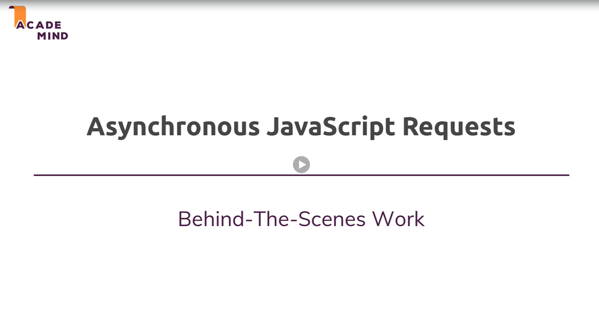


 # S22 | Adding Client Side JS Code

---

## Notes
In our course project on the admin products page where we can delete products, I want to implement this delete function differently. Right now when I would click delete, I would simply well delete that, send that request to the server and get back a new version of that page essentially where this product is then missing and we can see that of course on our server side. If we have a look at our admin controller and we have a look at the post delete product action, this action here, then we see that we, well we also extract some incoming data of course and then we work with the data to delete the image belonging to that product and then the product itself and by the end, we redirect back to admin products which is a route which will return a new html page. Now don't get me wrong, there is nothing wrong with this set up and you can absolutely use it but maybe it would be a great user experience if we would never have to leave that page, if we wouldn't reload that page but if we click delete, we send that information that we want to get rid of that item to the server behind the scenes, the server can then still do its thing and once we're done, the server will respond just with some json data, so some success message or anything like that and once we get that message in our browser, we can delete this dom element, so we can delete this article here. We could do all that with client side javascript, so with javascript running in the browser and some help by our server side here and that is a so-called asynchronous javascript request or this will use so-called asynchronous javascript requests. Now the logic on the server won't change too much but the way we expose our route changes a little bit and we'll have to add some logic on our client side, so let's do that now. And for that, I'll first of all go to my public.js folder and I'll create a new file there, the admin.js file, now you can name it however you want. Important, this is javascript code that will now not run on the server but that will run in the client, so in the browser. I will import this javascript file into my products page here. So there let's say below the bottom here, below our footer, I will import a script with script source and you have to close the script tag like this and then I will import js admin.js. So I will import that javascript file from the js folder which is in a public folder which is served statically. Now this script will execute on this products.ejs file and if we load it at the end of this file, we make sure that the entire dom has been rendered and parsed by the time we execute our javascript code. So now we can go back to admin.js and add some logic in there, now which logic do I want to add? Well I want to react to a click on this delete button here and therefore first of all, this button should not be of type submit anymore, i should be of type button instead. Actually I will remove this entire form because this form was required for sending a request through the browser, sending a request with this xwww url form encoded data. Now I'll not do it like this anymore, I will get rid of that instead and instead, I will now gather that data here manually. So I will listen to a click to that button and then I will gather the product ID and the csrf token manually through the help of my client side javascript. Now with the form removed, I'll go back to admin.js and here, I now want to get access to all these delete buttons, listen to a click on them and then do something when they get clicked. Now for that, I'll define a function, admin.js delete product, here I'm using next gen code but this is code that will run in the browser, all modern browsers support the syntax but of course if browser side javascript is new for you, you should take a dedicated course on that, this course will not focus on that but here I'll have a function where for now, I will simply execute clicked. Now this delete product function is a function I can use from inside my ejs and therefore html file, on that button I can add onClick and simply say delete product, so this function here, delete product like this, execute that function when we click on that button. If we now save that and we reload this page here and I open the browser developer tools, if I click on delete, you should see clicked here. Now it's not deleteing the product anymore because we deleted that form, right. So now I'm reacting to a click and now the next thing will be that we have to find out which ID and csrf token we have. For that back in the admin.js file, when we click I want to get access to the field next to the button, I want to get access to the csrf token and as I mentioned, to the product ID. Now how do I get access to the surrounding elements? Well in products.ejs, we can pass this to delete product. This is a special keyword and in the context here, it will refer to the element on which we clicked, so to the button. Now since I get this, in admin.ejs, I can access to the button since I now receive this as an argument and I can prove to you that this is the button by simply logging it. If we reload the page and I click delete, we see the button being logged here and here it would be that button. So now we have access to the button and with that we can easily get access to the surrounding inputs. I can simply access the parent node of my button which will simply be, well the element around my button, so in this case this div here and I can find my inputs in there, the input with the name product ID and the input with the name csrf, _csrf. I can do so by using the query selector on the parent node and here, I'll use the attribute selector to find name equal product ID. Now let me log this to the console to see if it works. If I now reload my page and I go to the console log, now I get that input ID being logged, that hidden input ID. Now from that input, I can of course also extract the value which is then just the product ID itself and not the entire dom element. So with .value added, now I just get the ID and for the other product, I get well the other ID. So now I have a way of getting that, let's store that, prod ID in a constant and then let me also store the csrf token and here I will simply repeat that code, access the element with a name of _csrf and extract the value. And now with these two pieces of information, we can now send our asynchronous requests to the server, for that of course, we need a fitting route and so on. So let's work on that next.
3-14
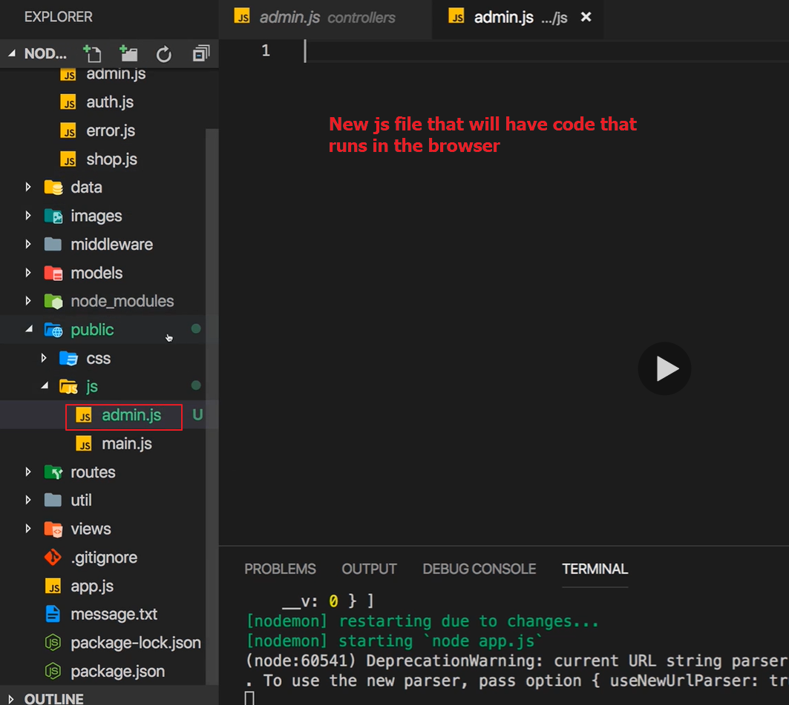
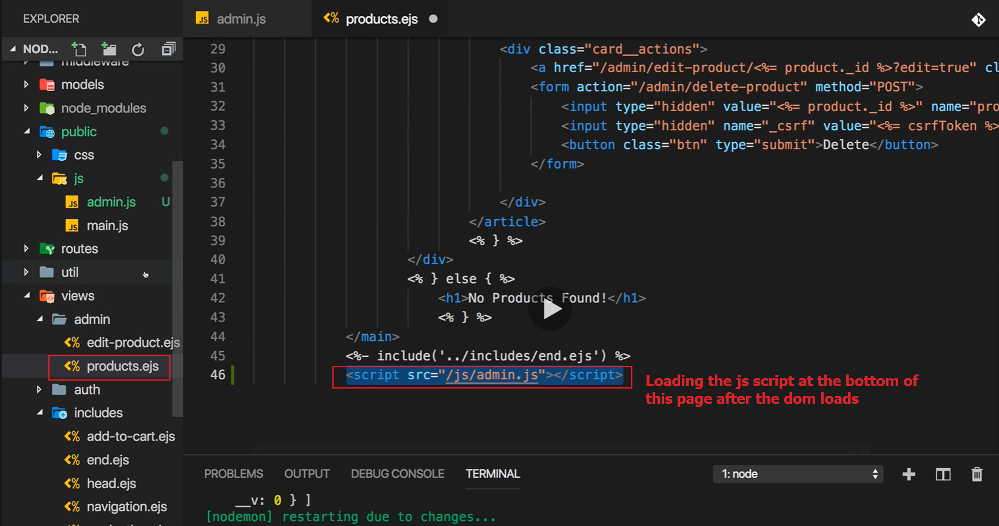
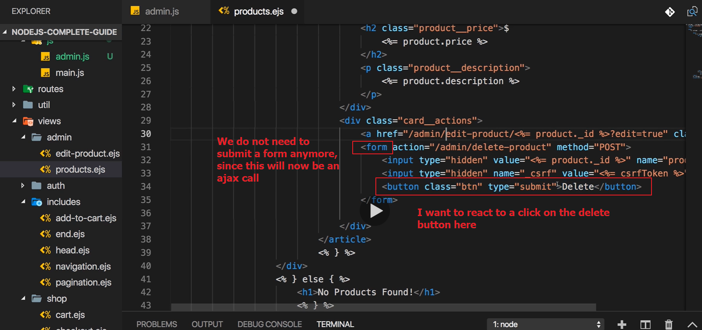
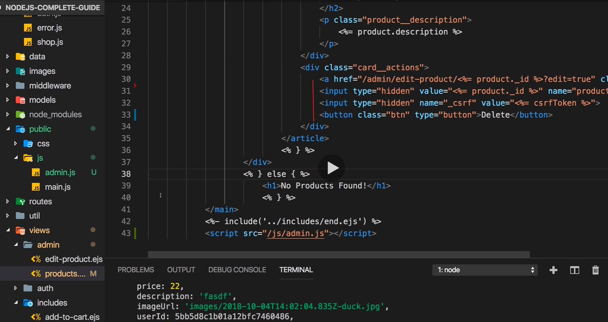
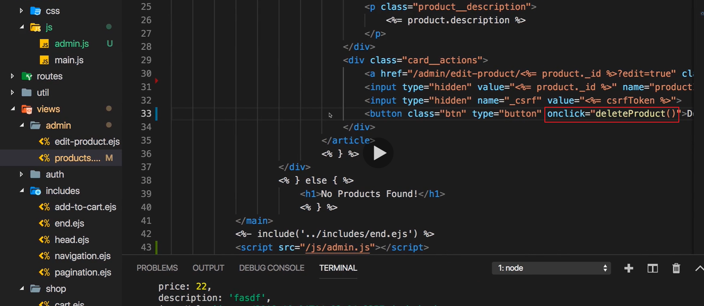
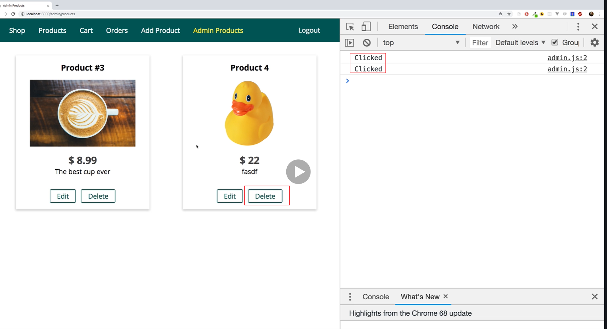
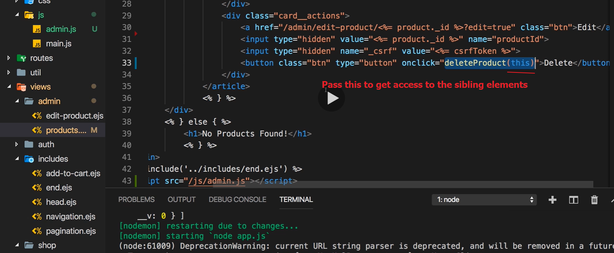
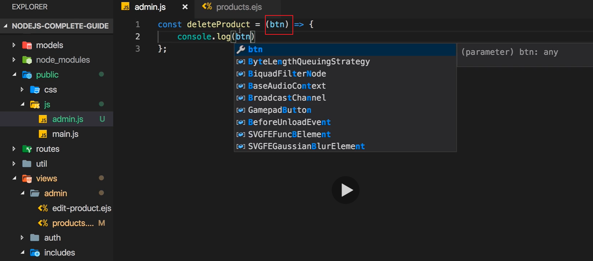
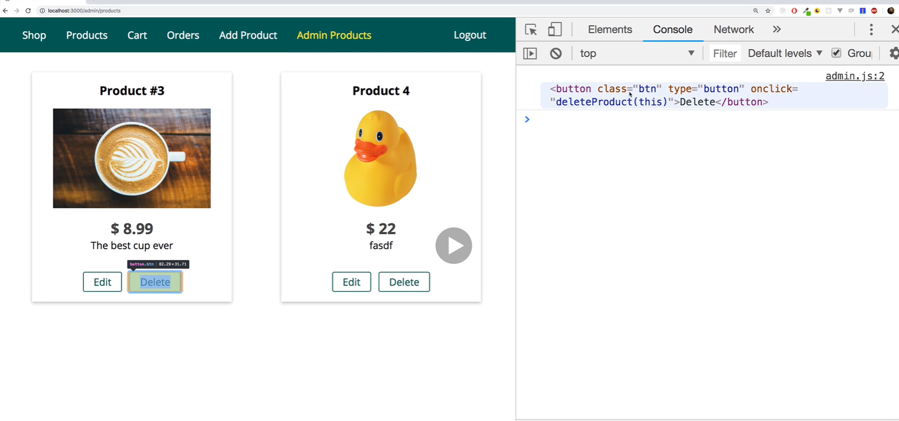
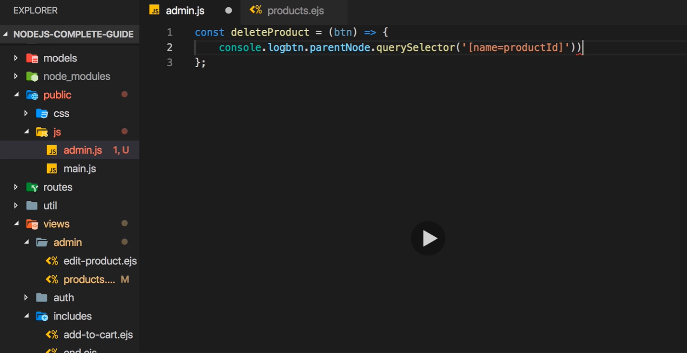
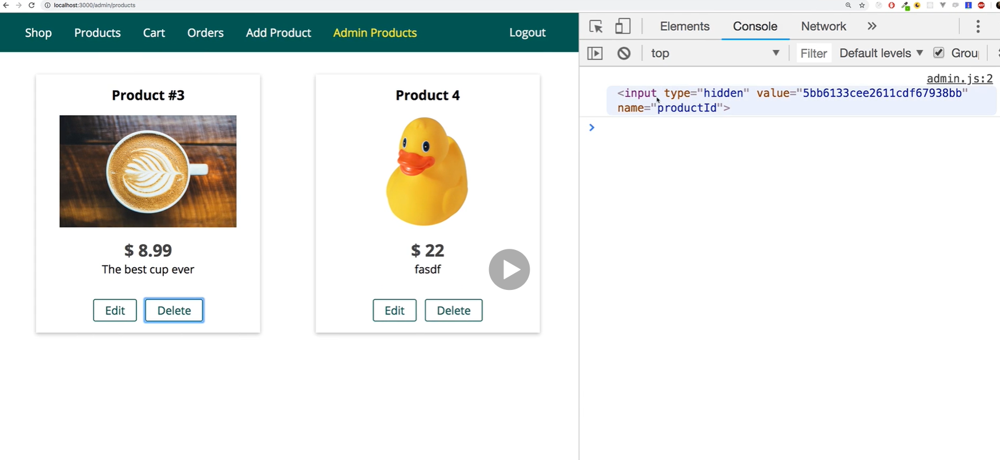
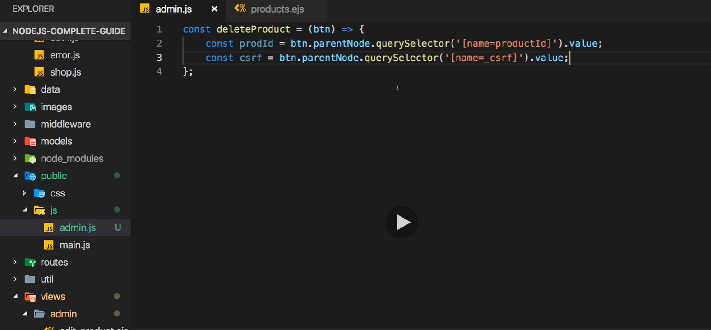


# S22 | The JSON Data Format

---

## Notes

What is JSON?

JSON stands for JavaScript Object Notation and a typically JSON data structure looks like this:
```json
{
    "name": "Your Name",
    "age": 29,
    "courses": [
        "angular-the-complete-guide",
        "react-the-complete-guide"
    ],
    "profile": {
        "joined": "2017-05-21",
        "courses": 2
    },
    "averageRating": 4.8,
    "active": true
}
```
It looks a lot like a normal JavaScript object, but one important difference is that all key names are enclosed by double quotation marks (").

Besides that, you can store text (string), numeric (integers and floats) and boolean data as well as nested objects and arrays.

You can dive deeper on this page: https://www.json.org/

# S22 | Sending & Handling Background Requests

---

## Notes
We have some basic code in place to extract values about the product which we want to delete, now to continue, we need a route on the backend to which we can send our javascript request. For that let's go to the routes folder and there to admin.js. Obviously we already have a delete route here, a delete product route and we can build up on that route, there is nothing wrong with that but now since we'll send the request directly through javascript, we can actually use a different http verb. Thus far we always use get and post because the browser natively supports these for the requests sent by the browser, by form submission and by clicking links, it only knows get and post. When we send requests through javascript, so through browser side javascript, we have access to other http verbs too and you'll learn more about the different http verbs in the rest API section. One of them is delete and this is a http verb, so http method which makes a lot of sense for deleting. Now it's only a semantic thing, we could use post, you can in general use any http verb to do anything because you define with your server side logic what will happen but it makes sense to try to be clear about your intention and there is a delete verb, we can now use it so why wouldn't we use it. So now this is a delete route to delete product, now I can also change this a bit and may be name this product- and then the product ID as a dynamic parameter because delete requests can have dynamic url parameters. So now we can extract that information from our url and I'll leave the controller action as it is but I will now name it delete product like this because we are not sending a post request anymore so I guess this name makes more sense, isAuth is a middleware I will keep in place though. So now with that, let's go to the admin controller and here, I'll rename that function, that handler here to delete product because I renamed it in the routes file too and now the product ID first of all is not extracted from the request body anymore because delete request as it turns out also are not allowed to have a request body but instead, we now have that url parameter product ID, so I can extract my ID from there. So I simply change body for params and that's it, so that gives me my product ID. And then this logic here will still work, I only need to change the response I'll return. I will not redirect anymore because I'll not load a new page. Remember that the request triggering this action will be sent behind the scenes for the existing page, so I want to keep that existing page and therefore my response will be a response where I send json data. Json data is a special format and with expressjs, I can use a json helper method to conveniently return json data and json is simply a data format that looks like a javascript object, so with curly braces and then key value pairs, the only important thing about json is the keys have to be wrapped between double quotation marks. This is json data and this is what we can return here and now we can also set a status here of 200 maybe because for json data, this would be the default too but there since we don't redirect it and so on, where we get a status code set automatically, it would make sense to be very clear about the status code we have. And therefore here, I'll also not to use my default error handler where I would load the 500 page, instead here, I'll also return a response with status 500 now, that is what I mean about setting that status on your own and there, I'll also return some json data, the question is of course which data. You simply pass a javascript object here which will then be transformed to json automatically for you. So here you can pass your normal javascript object, you don't need double quotation marks around your keys there and here we could have a message where I just say success, of course not that interesting but we could do that. And here I could have a message where I say deleting product failed. So now I have that in place and now we have two important changes, this is how we extract the params or the product ID and now we return json responses because we don't want to render a new page, we just want to return some data. Obviously we now have to continue in admin.js and make sure that we send the request and then work with the response data. Whoops, not this file though, I mean the one in the public.js folder, here. We worked on the server side and we added a new route or we changed the route to use the delete http verb and to look like this and now we need to send the request there from inside our client side admin.js file, so in the public folder. Here we can use the fetch method which is a method supported by the browser for sending http requests and it's not just for fetching data as the name might suggest, it's also for sending data. Here if you can pass a url, so we want to send a request to /product and then this of course needs to be replaced with the Product ID and this will send that to the same server if you don't specify a different host with http and then something, so if you have nothing like that, it will send it to the current host. Here I will add my prod ID of course and then the second argument is an object where you can configure this fetch request. Now here you can set a bunch of things, you could add a request body but not for a delete request as I just explained in the last lecture but for a post request which you can also send with that, you would set it and first of all let's define that this is a delete request. So I'll set method to delete here, doesn't have to be uppercase but it's a good convention. Now with method set, what else can we set? 

Well we can set headers and in the headers, we could encode our csrf token because we still need to attach this to our request and right now we are not doing that. 

**We cannot send it in the request body because delete requests don't have a body but the good thing is the csurf package which we are using on a server does not just look into `**request bodies**`, it also looks into the `**query parameters**` and therefore we could add it there and it also looks into the `**headers**`. So there we can add a csrf token header, it will look for this key, you'll find all the keys for which it will look in the official doc.** 

So you can add csrf token and then csrf as a value to attach this to your outgoing request as well. Now this will send the request and it will return a promise that allows to listen to the response and here I will console log any error I might be getting and here, I'll be console logging any result I might be getting, let's see what we have there. 

**Now one important note by the way, I'm not sending any json data with my request here because it is a delete request without a post body. If it were and that is something we will see in the rest API section, then I would have to parse json data in my backend because there right now and that's just an important note, in app.js, there right now we only have two parsers, one for url encoded data which we don't have when we send json data and one for multipart data which we also don't have there. We would have to add a new body parser that is able to handle json data and extract that from incoming requests.**

 I don't add it here because we don't need it here but we will add it later when we need it. So with that all in place, with our client side code adjusted, let's save all of that and let's simply click the delete button after reloading the page and see what we get. Let's click delete and I first of all get a 404 error that this route is not found, product with some ID and this makes sense because my route, product product ID is in the admin routes folder, of course we only get there if our request path starts with /admin, that is what we configure in the app.js file. So in my client side admin.js file in the public folder, I should of course point at /admin /product/product ID, so that's a little mistake on my side. Let's now reload after changing this and now this is looking good, I get a response with a status code of 200, with request body which is a readable stream, I'll show you how to get to that request body in a second and if I reload the page, the product is indeed gone. Now that's a step forward but of course I don't just want to reload the page, it should be gone immediately, that would be the main idea of doing this behind the scenes. So how can we make this work?
15 - 22
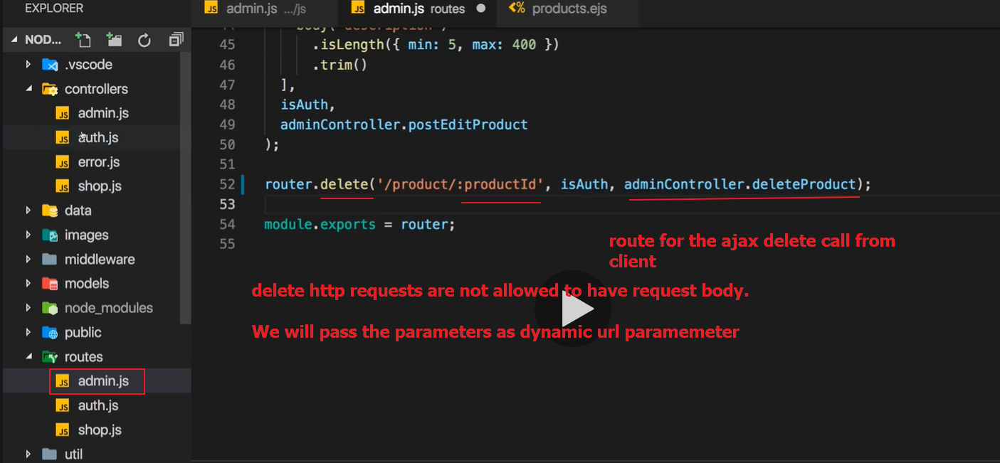
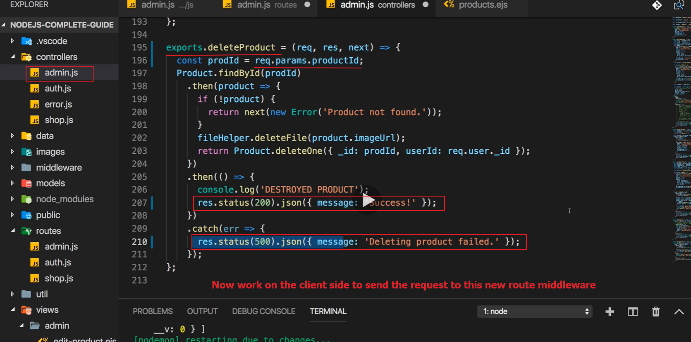
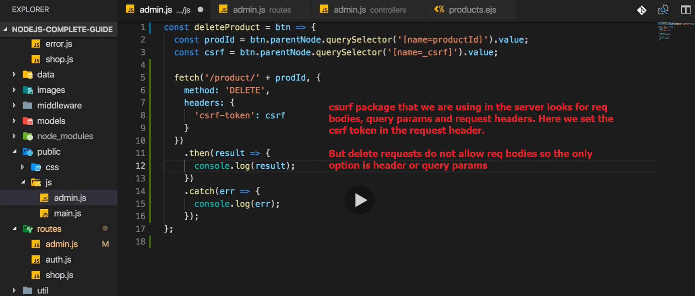
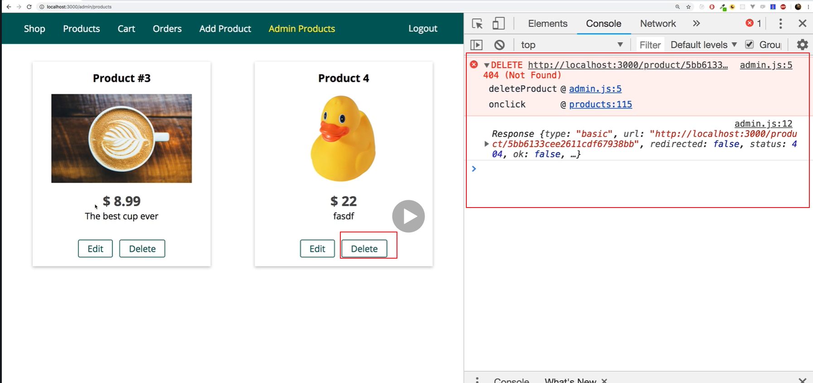
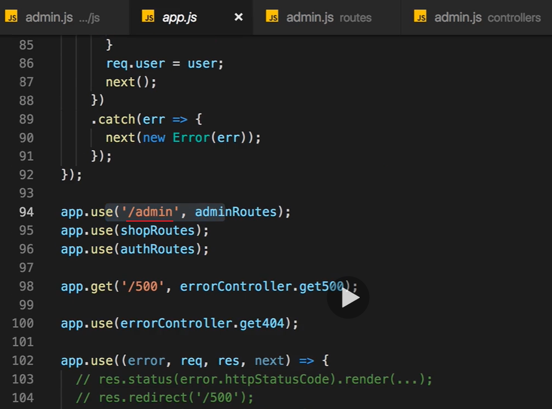
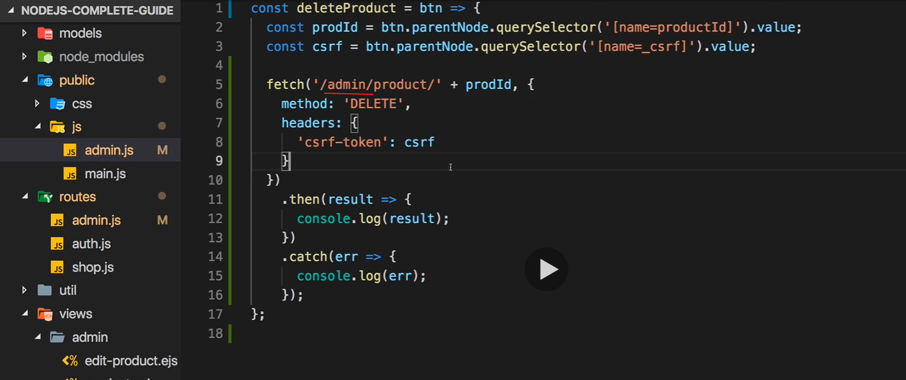

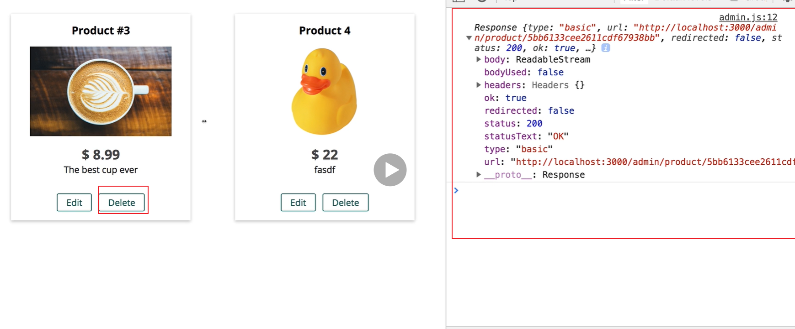
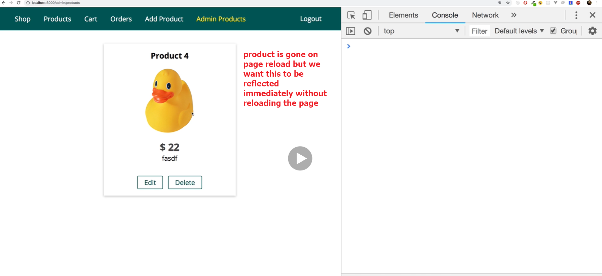


# S22 | Manipulating the DOM

---

## Notes
So we get a result and that's great, now first of all that result had some cryptic body which was a readable stream. Now what we can do here in the then block is we can return result json which is a function that will throw a new promise or return a new promise, so I can add another then block and here I will have the data, so the response body. I don't necessarily need that but I want to show you how you could get that data that's getting returned by the server. More importantly, I know that either here or here, does not matter, I have a response so the item was deleted on the server and now I want to delete it here in the dom as well. Now how can we do that? Well we got access to the button on which we clicked right and the button is in the end inside of the whole dom element we want to delete, so it is this article which I want to delete. So therefore what I have to do is I have to find this article based on this button and that's relatively straightforward to do. My product element and you can name this constant however you want is basically my button and then there is a closest method provided by javascript and you pass a selector to closest which gives you the closest element with that selector and the closest ancestor element to be precise and there, I will simply use article because I only have one article in my ancestor history here for this button, so if I select my closest article, that should be the element I want to delete. So inside here let's say, I can call product element remove and that is a function that will not be supported in Internet Explorer, there you would have to access the parent node and then remove a child and that child would be the product element. So that is a code that works in every browser, remove would work in all modern browsers. Now with that in place, we can reload this page here and now if I click on delete, it will eventually be gone and here, we see our success message. And now just to validate that it really only deletes one element and not all elements, let me log in with my other user who also has two products I can delete, these two products and now let's go to admin product, delete the boat let's say and now only the duck is left. So this is great and indeed if I go to products, this data really is gone, I can't load it here. So this is how you can use asynchronous requests. Now of course there is more you can do on the client side but this is not a client side javascript course. The important thing here is that you can send data to your backend with the help, with these asynchronous requests and how you can include data and how you can handle that on the backend.
23 - 25
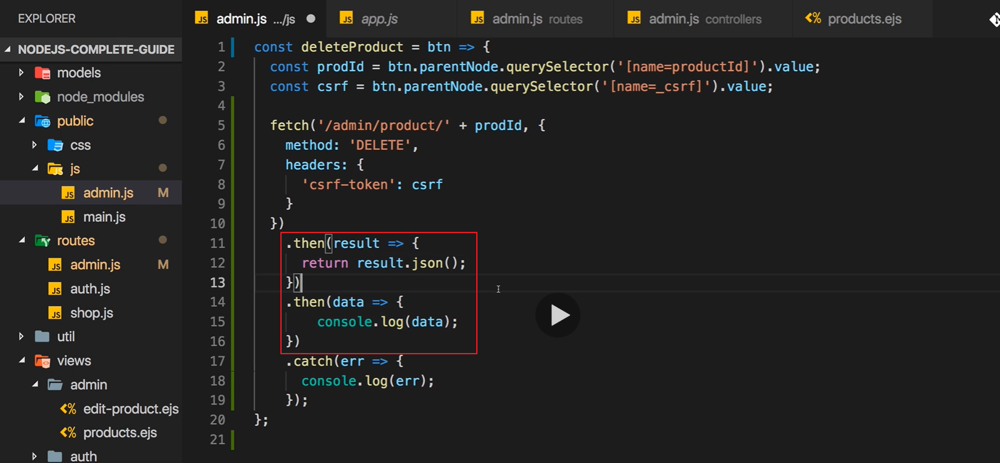
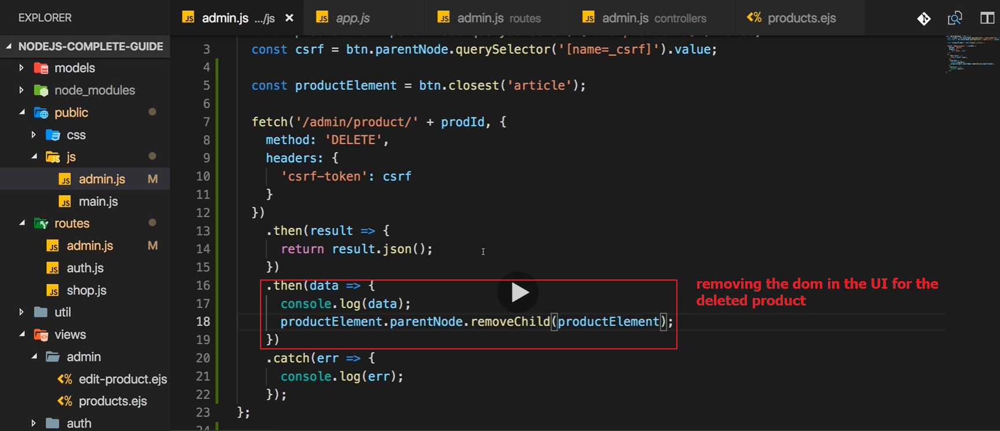
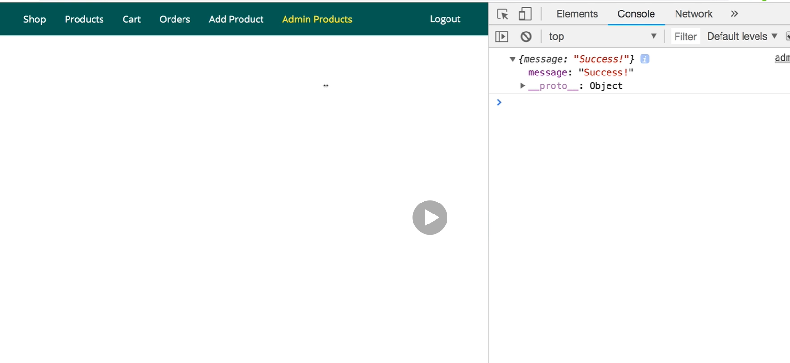

# S22 | Useful Resources & Links

---

## Notes
Attached, you find the source code for this section.

When using my source code, make sure to run npm install in the extracted folder!

#### Useful resources:

More on the fetch API: https://developers.google.com/web/updates/2015/03/introduction-to-fetch

More on AJAX Requests: https://developer.mozilla.org/en-US/docs/Web/Guide/AJAX/Getting_Started
