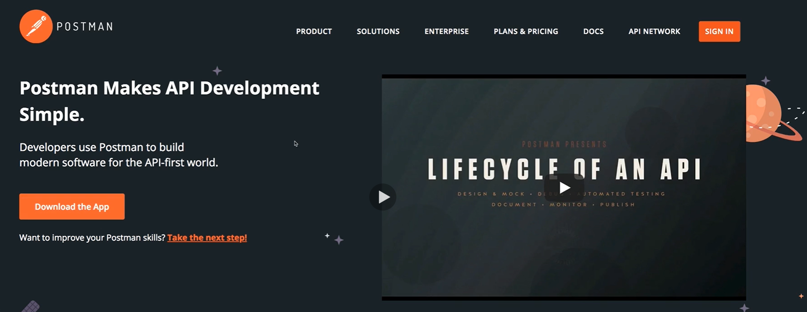

# S24 | Module Introduction

---

## Notes
You already learned a lot about nodejss and how to build amazing applications with it and the express framework that builds up on nodejs. You learned a lot about reaching out to databases, handling requests, sending responses, rendering templates, working with files, a lot of crucial things that you will need for any node application you're going to build. Now I want to move away from one important thing that we always did thus far and that's the rendering of templates with ejs. It's a common thing to do that in a lot of node applications but there also is a very popular alternative kind of or a very common other kind of node application that you will work with or that you will build as a web developer and that are rest APIs. Now in this module, you will learn what exactly rest APIs are, why you would use or build them instead of the classic node express application that we built thus far where we rendered views. You will learn what the core rest concepts and principles are and we'll build our first rest API in this module too. So let's dive in and let's understand what rest APIs are and why we would well use them.
1-2

# S24 | What are REST APIs and why do we use Them?

---

## Notes
Rest APIs are there to solve one problem you could say. Not every frontend user interface works with html pages or not every user interface might want your server to generate, well the html code which effectively is the user interface. Think about mobile apps, for example the Twitter app, these apps typically don't work with server side rendered html code, they don't need a templating language on the server to render the html code because you build these apps with Java for Android or with swift objective C for iOS and you use a rich suite of pre-built UI widgets, you use UI libraries provided by Apple, by Google and so on, you use these libraries to build your user interfaces in the respective IDEs of these programming languages like Android Studio for Android development. You build these user interfaces totally decoupled from your server, you don't want html code because you can't really render it there. Obviously you have mobile browsers too, you have a browser on your mobile phone and that will render html pages but all the apps you install through the App Store most often don't use html to draw the interface but instead they build the interface with the tools given to them by the, well by Apple, by Google and then you only need to data to fill these user interfaces with life. Another example would be single page web apps. You might not have heard of these but the Udemy course player is actually a great example for that. Here's an example, this is a course by me but of course this is the case for any course. Watch this refresh icon at the top left corner as I now click around to course content, Q&A and so on. Now all these parts here do re-render without the page reloading or the page being refreshed and the reason for that is that this entire page is actually rendered through browser side javascript, you can of course execute javascript in the browser as you know and this javascript code can manipulate the dom, the dom is simply the rendered html code. So what Udemy does here and what is very popular, not just on Udemy but on many modern web applications is that you only fetch one initial html page that does not really contain a lot of real html content but that does load all these javascript script files and then these javascript scripts reach out to some backend API, to a restful API and only fetch the data they need to work with to then re-render the user interface. So if I click on Q&A, some javascript code would reach out to a Udemy server and get me the Q&A items I want to display. If I click on course content, another script reaches out to the backend
3 - 4 

# S24 | Accessing Data with REST APIs

---

## Notes
So now that we know what a rest API generally is or which problem it solves, let me give you a big picture of how it works. We have a client in the server and the client is a mobile app or our single page application, on the server we build our API. So here we build an API for these apps we might be building and one advantage by the way is that we can use one and the same API for multiple clients. So we might be building a web app and a mobile app, not that uncommon these days, most companies have mobile apps and web apps but we can use one and the same API because both apps, mobile and web app use the same data of course, they might present it differently and that is what I was talking about, about the user interface being handled by the frontend, by the client. They might present it differently but they work with the same data, so that is our API we might be building or we have any kind of app including our traditional web app which just needs a service API or we might be building our own service API, maybe to also sell our service. Maybe we're building a stock API where any application which we might not even know is able to query data from and we just sell access to that API and that is our business model. So in all these cases, we obviously exchange something and this something we exchange is data as I mentioned before, only the data not the user interface. And that of course leads us to one important question, in which format do we exchange that data? We learned about html thus far but there are different kinds of data we could attach to a request and a response. We can send plain text for example, we could send xml or we could send json and there are other formats too but these are some well-known formats. Html of course look something like this so we can send html code and this is what we did thus far in the course. When we rendered an ejs view, what we essentially did is we sent html code to the browser because the view was rendered on the server and the result of that rendering process simply was a html page, simply was html code, so this is how we could send data. Html code contains both the data and the structure of course, the html elements, the css styles we might be adding, that all adds structure and design and what is between the html elements is our data. So therefore this also contains our user interface, it defines how our user interface should look like. Now the problem is of course that if we just want the data, we got all the overhead html content, it's unnecessarily difficult to parse because even though the html elements are of course kind of defined and regulated, how we use them and how we well structure our document is not really enforced onto us, so its unnecessarily difficult to parse if we just need the data. We can of course send plain text, the thing here is this is only data of course, there is no structure, there is no design element added and therefore, we make no UI and that is user interface of course, we make no UI assumptions. Still if you want to transfer data like this, it's unnecessarily difficult to parse because text is easy to understand for humans but for computers, it isn't, there is no clear pattern in the text and therefore this is not really a great way of exchanging data. Xml looks a lot like html and actually html is a special kind of xml you could say, the difference is xml allows you to use any tags and this of course allows you to transfer data and it's also not making any UI assumptions because it's not parsable by the browser, the xml elements are totally made up by you. The good thing is it's easier to read by machines than plain text, you can also of course define clear structures there but you will need a special xml parser because traversing through an xml node tree is kind of challenging, not impossible to solve but you need a special parser and all these elements of course add some overhead to the data you transfer, so there's a lot of extra text that is only required to read your data that is not really your core data though. The last data format and you might already guess it, that will be our winner is json. Looks like this and we already use that in the course when I had a look at asynchronous requests couple of modules ago. And now this also is just the data, it makes no UI assumptions and it's also machine readable. The good thing is it's a bit more concise than xml and it can easily be converted to javascript and that is of course a huge plus when working with nodejs on the server but also with well javascript in the browser which happens to be our only programming language we can use there. So therefore this is our winner data format, json is our winner data format if we just want to transfer data and it's the most common format in any API you are communicating with these days. All the other formats are not as great for transmitting data as json is, therefore this is what we will use but it's important for you to understand why we use it and I hope this became clear. 
5 - 6

# S24 | Understanding Routing & HTTP Method

---

## Notes
Now that we learned what the core idea is and how we transfer data and that data is king in a rest API, let's have a look at the routing, so how do we communicate between client and server? So we get client and server and on the server, we got our server side logic, we reach out to databases and so on. Now we send a request from the client to the server and how do we do that? Well in a traditional web app as we built it thus far in the course, we did it of course by simply adding a link on our html page for example or we had a form with a button and we defined the form action and the method. Well it's not that far off for rest APIs. We still send the request to a combination of http method, also called http verb and a path on the server. So what we defined thus far still will be used kind of, we still define such paths, on the server, on the server side routing where we wait for incoming requests and we also define certain http methods we want to handle for these paths so that not all requests can reach all paths. These requests would be sent from the client through, when working in the browser, through asynchronous javascript, so with the fetch API for example or with Ajax and on mobile apps and so on, we also get special clients. The core thing here is we in the end still send normal requests, these are totally normal requests that just don't expect any html response and we send a combination of http method and path and this is how we communicate with our server. Now in the rest world or in the API world, we like to call these things here API andpoints, so when you hear me talk about an API endpoint, I'm talking about the combination of a http method like post and get and the respective path. These are the endpoints we defined on our rest API and we defined a logic that should execute on the server when a request reaches such an endpoint. Now talking about http methods, there are more methods than just get and post. I did mention this before in the course but when working with the browser only and not with javascript in the browser but just with forms and links, then we only have get and post available. These are the two methods the browser natively knows or the browser html elements know so to say. When using asynchronous requests through javascript or when building mobile apps and so on and using their respective http clients, you have access to more http methods and we actually already saw that in the asynchronous requests module of this course. Besides get which is responsible for getting a resource from the server and post which is responsible for posting a resource to the server which means create it on the server or append it to an existing let's say array of resources, besides these two methods which we re-used a lot throughout the course, we have access to put which we would use if we want to put a resource onto the server, which means we want to create it or overwrite an existing resource, posts will never overwrite or should never overwrite. We also have access to patch which is used for updating parts of an existing resource, so not overwrite it entirely necessarily but update parts of it. We have access to delete which allows us to delete a resource on the server and also there is a special options http method which we will use too in this module indirectly though, it is sent automatically by the browser and I will come back to it. This basically is a request which the browser will send automatically to find out if the next request it tries to do, for example delete something, if that is actually allowed and I will come back to that. So these are the http methods we will work with and the methods we typically work with when building a rest API especially the first five ones, the orange ones are important. Now let me also highlight that in theory, you can do whatever you want when a request with a certain method reaches a certain path. So for the rest world, we should use a post request to create or append a resource. No one is stopping you from deleting something on a server because ultimately, you only define a method path pair on your server side and then you run any code you want and what happens in that code is not restricted by the method that was used to execute that code. You can restrict it yourself and you want to implement the rest API that follows these ideas here but you don't have to and that's just important to highlight. It's common and it's a good practice, it's a best practice to use these methods in this way because then anyone who's using your API clearly knows what to expect to happen on the server for a given method but in theory no one is stopping you from doing something else. So these are the http methods.
7 - 8

# S24 | REST APIs - The Core Principles

---

## Notes
We're almost done with the theory part, now there are some core principles that are indeed defined in theory and that are important for you to keep in mind where at least there are two core principles I want you to keep in mind when building rest APIs. The first one is the uniform interface principle, this simply defines that your API will have or should have clearly defined API endpoints, you remember endpoints were the combination of http methods and paths with clearly defined request and response data structures. Put in other words, your API should be predictable and if possible and if open to the public, it should also be well documented. So people should know which data does your API expect, which data does it give back, which endpoints do I have and the thing that happens when a request reaches to an endpoint should of course not change over time, it should be predictable, it should be clearly defined. 

**The second important principle I want you to keep in mind is the stateless interactions principle and this will be super important when we later talk about authentication. When building a rest API, the server and the client are totally separated, they don't share a common history. So no connection history is stored and no sessions will be used therefore because every incoming request is treated as if no prior requests were sent. The server has a look at every request on its own, it does not store a session for the client, it does not care about the client at all actually, that is also a cool thing about resting APIs. You can build a rest API, open it up to the public like the Google Maps API is for example and you don't care about the individual client, you just say hey here are the endpoints I have, here's the data you get back for each endpoint, here's the data I expect from you for my endpoints and then I don't care about you, I don't store a session with you. We have a strong decoupling of the client and the server even if they were to run on the same server** 

because we're building our own API for our own frontend. We still would decouple both so that they work independently and just exchange data. This means that every time we set up a new endpoint, we have to make sure that it works independent from prior requests and a **typical problem here is authentication** where once we logged in, future requests should be treated as logged in and I will show you how to solve this in this course too of course. Now other principles which are less important or which you don't need to learn by heart is the cachable principle which means on your rest API, you could send back some headers that tell the client how long the response is valid so that the client may cache the response. Client server separation is mentioned again, here it's more thinking about the data storage, client and server are decoupled as I said and the client should not worry about persistent data storage therefore, the server will be responsible for this. We may have a layered system which simply means as a client when we send a request to an API, we can't rely on that server we sent it to you immediately handling the request, the server might instead forward the request or distribute it to another server, Uultimately we only care about the data we get back which should of course follow the structure that was defined by the API. Code on demand is a last optional principle and this basically just means the rest API could also for some endpoints transfer executable code to the client. Now to be honest, in reality you don't see that too often, we're mostly talking about well normal data we're using but still, these are the rest principles, the top two ones are the important ones which will have great implications especially on authentication.
9

# S24 | Creating our REST API Project & Implementing the Route Setup

---

## Notes
Now with all of the theory out of the way, let's build our first simple rest API and for that, I'm in a brand new folder, I only did one thing in there, I ran npm init and confirmed all the default settings, since I'm using version control I also added a gitignore file so that I can ignore an upcoming node module's folder and that is it. Now to build a rest API, how do we start? Well as I mentioned, all the things you learned are still important. We build a node express server just as we did before and also by the way, of course you don't need to use express, you could build just a node server API but you have to do a lot of request parsing and so on on your own as you learned it before in this course and you can use other frameworks too. There even are specialized rest API frameworks but we will use express which is a great all-rounder and therefore I will install as a production dependency with --save express, we need expressjs to build an API conveniently. So this is the first dependency we'll install into this brand new project here. Now with that installed, I'll also install another package and that will be a development dependency with --save dev nodemon because I still don't want to restart my server manually after every change, so let's quickly install that package now. With nodemon installed, let's go to the package.json file, let's add a start script in the scripts section and let's execute nodemon app.js here to start app.js with nodemon. App.js does not exist yet so let's add it and in there we'll set up our nodejs server. So what do we do in here? Well first of all, I will import express by requiring express like this, then I want to create my express app by executing express as a function and these are of course the exact same steps we executed before in this course and last but not least, we can listen to incoming requests, let's say on port 8080 this time, not 3000, I'll need to add later for something else, let's use 8080 for now. This is a very simple server that we could now start and that will not do anything of course, it has no routes to find but this is our simplest possible node express server. Now to add some routes and to do something with them, I will also install the body parser as a production dependency with --save so that I can parse well incoming request bodies and now let's start adding some routes. We could add them in here with app use to handle any method or app get, app post, app put and so on to handle specific http methods for specific paths but I will use the express router again and I will also create a new routes folder which you wouldn't have to do but this structure still make sense, separating routes and controllers, you just won't have views anymore, the views folder will not be recreated because we'll not render any views anymore, we'll just exchange data. So in the routes folder here, let's say we're building a simple block or a simple messaging social network block like application and we have some feed routes, so like the news feed or something like that where we simply are able to create new messages, show existing messages and so on. So I'll create a feed.js file in the routes folder and in there, we set up our express router by again importing express into this file too because we need something from that package in that file and then I create the router by calling express router as a function and I will export the router at the bottom. In-between we can now define some routes and I want to start very simple with a get route to let's say posts where I serve my posts later on, not right now but later on. So here I have my posts and of course I now need my logic that should execute when a request reaches this. Therefore I'll create a new folder, controllers and in there I'll add my feed.js file as well, so feed.js in controllers now. In there let me export a new function, get posts which of course and that also does not change gets a request, the response object and the next function it could call to let the next middleware take over and in there, I want to send a response and this will be the first part that gets interesting. Before we write that code, in my routes feed.js file, I will import my feed controller by requiring it from the controllers folder and there from the feed file and I will assign my feed controller get posts function here as the function that should be executed for this route. Now to be able to reach that route, we need to register the route in app.js which is our starting file. So in there, I will import my feed routes by requiring them from routes feed like this and then all we have to do here is we have to use these routes, used to forward any http method, we'll filter them out in the routes file then like with this get function here. So we forward any incoming request to feed route let's say or let's say we only forward requests that start with /feed, again this is logic you already learned about. So now any incoming request that starts with /feed will make it into feed routes, so into this file and there we handle one request right now, /posts. So in total, /feed/posts would be handled right now as long as it is a get request, this kind of request would get handled by this controller. And now let's talk about the response and how we could send a request to that route. 
10 - 15

# S24 | Sending Requests & Responses and Working with Postman

---

## Notes
So I defined my basic set up for a new node express rest API. We have a route in its controller and now of course we need to return some data there, so instead of the controller, in get posts we want to return some data because you learned rest APIs are all about data. We will not call res render in here because we will not render a view, you will not see me call res render anymore again because rest APIs simply don't render views because they don't return html and a rendered view is html. Instead we'll do something we already saw in the async request module of this course, we will return a json response. Json is a method provided by expressjs that allows us to conveniently return a response with json data, with the right headers being set and so on. We can pass a normal javascript object to json and it will be converted to the json format and sent back as a response to the client who sent the request and there, we can send anything you want, like post which could be an array of posts where we have a title, first post and some content, this is the first post and of course I'm just making up things here, this is of course just some dummy data. So we call res json and this will send a json response. 

Now when sending json responses, **we also want to send the status code explicitly**, 200 would be the default but we'll also work with different status codes throughout this module and we want to be clear about the status code our response has so that in the client we have an easy way of handling it because you always have to remember that the client now has to render the user interface based on your response and therefore especially error codes are super important to pass back to the client so that the client can just have a look at the status code and find out should I render my normal user interface because the requests suceeded or did I get an error and I want to render an appropriate error interface.

 Previously in the course we sent the whole interface so the client didn't have to worry about that, now the client has to and therefore setting the right status code is important. Now with that, we have some logic in place to return some dummy data, with npm start we can now start up our server here and now we have it running and now we can visit a browser and for now we can simply enter localhost 8080/feed/posts, so this path we defined and you should get some json data here. If you open your developer tools and you go to the network tab in there and you reload that page, you also see that request here and if you inspect it, you of course see the response body but if you have a look at the headers, you see that in the response headers we see that application json was set automatically by our server because we used that json method and we indeed get back the content we defined here, we can see it here too. So this is a quick and easy way of testing this. Now obviously our users would never visit it like this, they could if we don't require authentication at least but this is of course not how we intend our API to be used, instead we'll build a user interface that will then use this behind the scenes and render a beautiful UI automatically with that data. So directly accessing the data like this is of course not the plan. Now before I come back to the user interface part though, let me show you how we can easily and conveniently test our rest API even without entering this into the browser and for that let me do something which you couldn't enter into the browser, let's define a post route. So besides being able to get posts, we typically would also have some routes that allow us to add new posts. Now if we quickly think about our different http methods, then for posting new posts, post would be a great http method. We could also use put, that would not necessarily be wrong, put would also be a valid method to be used for creating a resource but especially when we're talking about posts and not something like user data which only exists once but posts, there might be multiple posts and therefore adding or appending sounds good to me and hence I want to use the post method instead of put. If we were to manage the user data here, then maybe put might be better because there we indeed create or overwrite the resource. So post it is and hence I will name this post post which sounds a bit strange, it's just my naming convention, I have the http method first and then basically the object that's gets created. You could name this totally different, you could name this create post if you want to, let's maybe name it like this because it's clearer then I have my normal function, that of course does not change and here, we would of course reach out to the database. We'll do so soon, for now I'll just note that we have to create that in the database and I will just return the response assuming that we did create a post. So I'll send back a json response and there we might be having a message like posts created successfully and we send back some post data and now that is at least data I want to parse from the incoming request. So I expect to get a title let's say and I still parse that on the request body, so essentially what we always did throughout this course and I might be extracting a content too, also from request body, just what we did throughout the course. And here I return the created post with an ID that was generated automatically let's say as mongodb does it for us, here I'm just doing it with some dummy code and the title which I received and the content and this could just be the confirmation that it was stored in the database successfully which of course it wasn't thus far but which we'll add. Now first of all, I also want to set a special status code here with the status method, I want to set it to 201. The default would be 200 and this would not be horribly wrong but 201 is the better status code to use if you want to tell the client success a resource was created. Just 200 is just success, 201 also indicates that we created a resource and of course we did here at least in theory so manually setting this makes a lot of sense. With that we're sending this success code, now what is missing? Well a way of parsing that data. I did install body parser in an earlier lecture but we also need to set it up and now here's one important thing. You need to remember that we are working with incoming json data, we expect our clients to communicate with our API, with requests that contain json data just as we return json data. Json data is the data format we want to use both for requests and for responses and therefore I will use my body parser of course, that's why I installed it, so let's require it here in our app.js file but when I initialize it, I initialize it differently than what we used it for in the majority of the course because there I initialized it by calling url encoded and configuring that. Now this is great for data formats or for requests that hold data in the format of xwww form url encoded, you might remember we saw that in earlier lectures too. Now this is the default data that data has if submitted through a form post request. We don't need that here however, we don't need form data, we have no form data instead we want to use body parser with the json method which is able to parse json data from incoming requests. So this is good for application json as is the official name that you will find in the header and this is how the data will be appended to the request that reaches our server. So we need this middleware to parse incoming json data so that we are able to extract it on the body because that will be added by our body parser, this body field on the incoming request. With that we can extract all that data but how can we now test this? We can't create a form in which we submit because then we would be back to xwww form url encoded data and it would not be a realistic test because you just don't use forms like this when working with rest APIs, instead you can use a very handy special tool and that is postman. Now we will build or work with a real frontend very soon, no worries, so we'll not be stuck to some helping tool for the rest of this course but it's still a very useful API development tool which you should be aware of. It's free to use and you can simply google for it to get it from getpostman.com, there you can just download postman and walk through the installer. Again you don't need to pay, you don't need to sign up, it might ask you for that but you don't need to. Once you did load it, you'll end up on a starting page like this you can just close that window and you'll then end up in a user interface like this one. Now you can read the official postman docs to learn about all the things you can do but in the end what you can do is you can enter a url here, then choose your different http methods and you see more than I showed you but you won't need most of them, they're not required for typical crud operations. So you can choose your method here and then send a request, you can also add your own headers and you will see the response in the area below this. So here I can send a request to localhost 8080 which is where my node server runs on and then feed/host, this should be the route I want to reach this controller on. Now for that I first of all need to create the route. So in my feed routes file, I'll add a post route for /posts where I use the feed controller create post action, so this will be reached through a post request to feed/posts. Let's configure such a request here, feed/posts, this is exactly where I'm sending it to and now I just need to switch to the post method. Now with that switched, I also need to be able to send some data and you see that the body tab now got enabled, with get it was disabled because get requests can't hold a body, post requests can. Here you can now choose your format and we don't need any of these, instead I'll choose raw and then there in the dropdown, json, application json. So now here we can write some json data and json has a format where you have two surrounding curly braces and then you have key value pairs where if you're writing it manually, the keys have to be wrapped in double quotation marks. So here we can see what we expect to get, we expect to get a title and we expect to get a content, so we want to pass these two fields to our server. So here we can pass the title and this can be my first post or actually my second post because we use the first one as a dummy post in our get route and then here, we have the content, this is the content of my first post or of my second post of course. So this is now my request, we can now click send and we get back a response which looks good because it's the response I defined in my controller action with this message and the post that was created and this is now the data we would typically use in our receiving client. You also see the headers that were sent on the response, these were set automatically by express especially application json matters of course and this is now how we can test all our endpoints because we can just enter them here and then switch the http methods, pass any extra headers or bodies we might need and therefore we get everything we need to test our API. Still we will also work with a real frontend so that we have something beautiful to look at and to see that in a real app but this is a tool you will use a lot when working with rest APIs. 
16 - 28

>

 # S24 | REST APIs, Clients & CORS Errors

---

## Notes
Now before I conclude this very basic starting module with rest, let me show you something important which you need to configure on any rest API or building which will not only be used by tools like this one or by code that runs on the same server and I can demonstrate what I mean by going to codepen. In case you don't know codepen, it's basically a service which you can use for free to write simple html, javascript and css snippets or projects, you can share them easily with other people and we can simulate a very simple frontend application here. We can create a new pen for that and here you can write as you see html, css and javascript code. Now I'll not need css because I want to keep it simple and this is a great playground here now because we can simulate a frontend app here because a frontend app if it is a single page app will only use html, css and javascript because we don't write any server side code in there, right. So in here, we might have a normal button, a button we use to send a request to the backend, here we could get our posts and I'll copy that button and also duplicate it to create a post and this is of course just a very basic dummy code, we'll build a different project for the rest of this course. But now I have these two buttons here in my pen as you can see. Now let's add some javascript code to do something with them and for that, I'll need to get access to these buttons so I'll give the first one an ID of get and the second one an ID of post, just to keep this really simple. So my get button can be accessed with document get element by id and then it's get and the second button of course is the same with post, so I'll name it post button and I'm looking for the element with the id post. So I just want to get access to them so that I can register a listener, so on the get button I can add an event listener for the click event that should in the end make a request to my backend. So I'll define an anonymous arrow function here and in there, I'll use the fetch API which is built into modern browsers with the fetch keyword where I can define a url to which I want to send a http request and in my case that is http://localhost8080/feed/posts, remember that is simply this route I defined here. So I want to send a request to that route or to that endpoint as you learned, by default this is a get request when using the fetch method and then we might have either a success case which we can handle in the then block or we have an error. If we have an error, I'll just log my error here, in the then block we actually get back a response object where we still need to wait for the body to complete because it will be streamed in. So with res json we can wait for this and then automatically convert it to json content or to a javascript object and then we chain another then block where we will have that javascript object because as I mentioned on the slides, json can be converted really well to javascript and the json method does just that, the conversion and it waits for the body to be streamed in and then I can console log my response data here. Now let's open up the developer tools, clear these existing errors here which were only created whilst I was still typing and you don't need to save anything, it saves automatically and click get posts and you should get a no access control allow origin headers present error. 

This is an error you see a lot when building modern web applications, modern single page applications and it often leads to a lot of confusion. This error is also called a cors error and you see the word cors down there, now what is cors and what's causing it and most importantly how can we solve it? Cors stands for cross origin resource sharing and by default, this is not allowed by browsers. So if we have our client in the server and they run in the same domain and the domain could be localhost 3000, important the port is part of the domain, if they run on the same server, we can send requests and responses as we want to without issues and that is why we had no issue before in the course. We rendered our html files on the server and therefore they were served by the same server as you send your requests to so we never had any issues, so this works. However if client server run on different domains like the client on localhost 4000 which is a different domain than, 3000 then we'll have issues and of course in production, you would run on my app.com and let's say myAPI.com. If you send requests and responses here, you get problems, you get a cors error because it's a security mechanism provided by the browser that you can't share resources across domains, across servers, across origins as it's called here. However we can overwrite this because this mechanism makes sense for some applications, for rest APIs, it typically does not. We want to allow our server to share its data, we want to offer data from our server to different clients and these clients will often not be served by the same server as our API runs on. Take Google Maps, you're not running your app on Google servers, still you can access it and the same is true for your own API and even if you build both the frontend and the backend, you will often serve the two ends from different servers because you can choose a server for the frontend that's optimized for frontend code that really serves that really well and you serve your server side code, your node code from a different server, so you will have different domains, different addresses there too and therefore we need to solve such a cors error or we need to tell the browser here which runs on codepen in this case here, we need to tell that browser that it may accept the response sent by our server. 

And to tell the browser, we have to change something on the server and this is a common gotcha. A lot of people see that error and want to solve it in their browser side javascript code, you just can't, you can only solve that on the server. So if we go back to our server side code, we just need to set some special headers, we want to set these headers on any response that leaves our server, so the app.js file and a general middleware is a great place. So here before I forward the requests to my routes where I will ultimately send the response, I want to add headers to any response. 

**So I'll set up a general middleware in app.js which gets my request response next function and there with set header, we can conveniently add a header to the response. We don't send the response yet, set header does not send it, json does render that but set header does not, set header will only modify it and add a new header and now there are a couple of headers we need to set. The first one is the access-control-allow-origin, all separated with dash, so access-control -allow-origin, that is the first header we need to set and we want to set it to all the urls, all the domains that should be able to access our server. So we could add codepen.io here but often you will just set this to start, to a wildcard that allows access from any client. You could lock it down to specific domains though if you wanted to, if you have multiple domains, you can separate them with commas but I will go with the wildcard. I will also set another header and that is the access-control-allow-methods header. Here we allowed a specific origin to access our content, our data, now we allow these origins to use specific http methods because by just unlocking the origins, it would still not work, we also need to tell the clients, the origins which methods are allowed and there you can allow get, post, put, patch delete, you don't have to allow them all, you can only allow what you want to be usable from outside. Now there's one last header I want to set or I should set and that is access-control-allow- and now I'm talking about the headers our clients might set on their requests. There you could also use a wildcard where you can specify specific headers. Now there are some default headers which are always allowed but you especially want to add the content -type header and the authorization header so that your clients can send requests that hold extra authorization data in the header which we'll need later and that also define the content type of the request and that will become important soon too.** 

With that added we need to do one last thing, we need to call next so that the request can now continue and can be handled by our routes but now every response that we send will have these headers and therefore if we save our server side code and we restart the server therefore and we go back to codepen, if I clear these errors and I click get posts again, now it just works as you can see because now we set the appropriate cors headers on the server. 
29 - 42

Codepen Link to test CORS - https://codepen.io/amuhammad/pen/QWGNrex?editors=1011

 # S24 | Sending POST Requests

---

## Notes
Now we learned about cors in the last lecture, now let me show you how it affects our post requests. So I'll use my post button to also add an event listener there, click like this and in there I'll also use the fetch method to send a fetch request to the same url as before but it ends with /posts because I'm targeting this url here which is just post, not posts. So if you name this differently, you should of course use your path. Here since it will be a post request, I need to pass a javascript object as a second argument which allows me to set some options. Specifically I want to set the method to post here to send a post request and then I will copy that code from up there for handling the response so that I can, well extract the data or log a potential error. If I now clear that and I hit create post, I get post created successfully but if we inspect the post object, we see that the title and content are missing. Now that makes a lot of sense because we didn't send that data. Instead on the post request in the client, we also want to set a body object and that object will hold the title, a codepen post and content created via codepen, whatever you want. If I clear that and now I click that button again, hmm I still don't see that here. Now on the server side, nothing goes wrong here but actually on the server side, if I would go to my controller and I would log title and content here or use the node debugger to see their values, if we log that and I click create post, then we see that undefined gets logged here. So we are not able to extract that data and the reason for that can be found if we go to the network tab and have a look at this post request that was sent, there in the request headers, we see that the content type was text plain and that is the problem. It should be application json but we also see that the request payload was not json data which in the end is just text but in a special format but that it was a javascript object which just can't be sent or which can't be handled. So there are two things we need to do. First of all on the body, I will call json stringify which is a method provided by default by javascript, it will take a javascript object and convert it to json. We can see that immediately if I click create post again and we inspect that request, the payload now is indeed text in the json format but we need to tell the server that our content type is of type application json and therefore besides setting the body, on the client I'll also add headers or one header, the content type header, content-type which is application/json. And now with that, if I click create post again, now in the created post we see title or title and content because now that data is sent and extracted correctly because we send it in the right format and we inform the server about the content type. Now this also allows me to demonstrate what happens if I would comment out this header here, the access control allow headers header on the server side. If I save after commenting this out and I try to create a post again, I fail because I'm not allowed to set content-type, I do allow this by adding this header on the server side. So this is how you communicate between client and server, of course the client code differs depending on the client you're using. This is javascript code using the fetch API, there are different ways of sending asynchronous requests, for example you can send Ajax requests through libraries like axios and if you are building a mobile app, you might have a totally different object or helper methods for sending such requests in Android, in swift and so on. So this client code differs, this is the javascript code using the fetch API, the server side code does not really differ. You want to make sure your clients can communicate and that everything works just fine there. Now before I conclude this though, one more word about the post request we're sending with this click. You might see that I actually have two requests being sent, the second one is our post request, what is the first request? If you have a look at it and we see the response is just post, ok, the headers are interesting though. We can see that in the general part, the method here is options and that is this last method I showed on the slide earlier. I mentioned it would be sent automatically by the browser and also for example by many mobile app clients. What is the idea behind options? The browser simply goes ahead and checks whether the request you plan to send which is a post request, that is why here in the request headers which are generated automatically by the browser, it checks for the post request, it checks if that will be allowed otherwise it will throw an error. This is simply a mechanism the browser and many other clients use and there is not too much you need you to do to make this work, it just works out of the box, you just want to make sure that you set the right cors headers here. You can add options to the allowed methods but as you see, it was able to make this request before, this is not really something you need to do but you can do it but the important thing is that you are not confused by that extra request. It's simply a mechanism the browser uses to see if the next request which it wants to view, the post request will succeed if it is allowed. And this is all I want to tell you about cors and client server communication for now. 
43 - 55

# S24 | Useful Resources & Links 

---

## Notes
Useful resources:

Example: Build a Complete RESTful API from Scratch: https://academind.com/learn/node-js/building-a-restful-api-with/