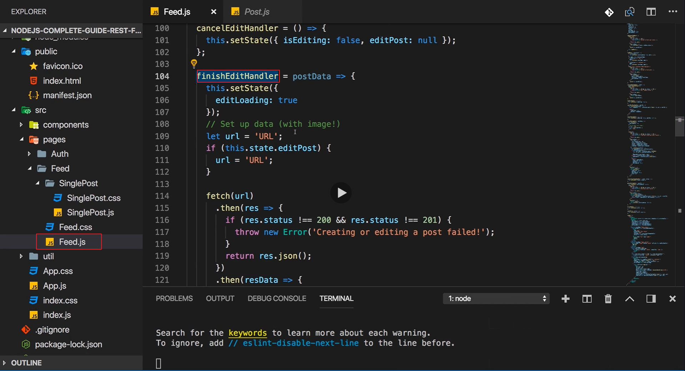
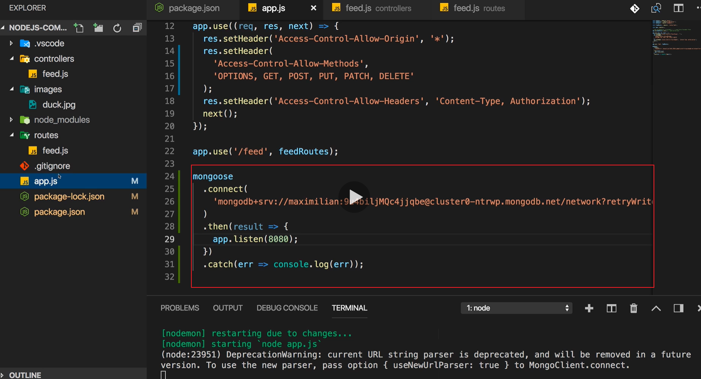
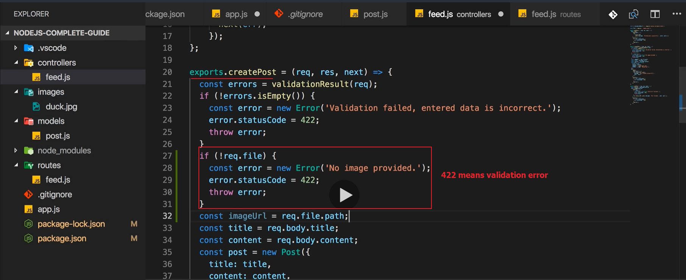
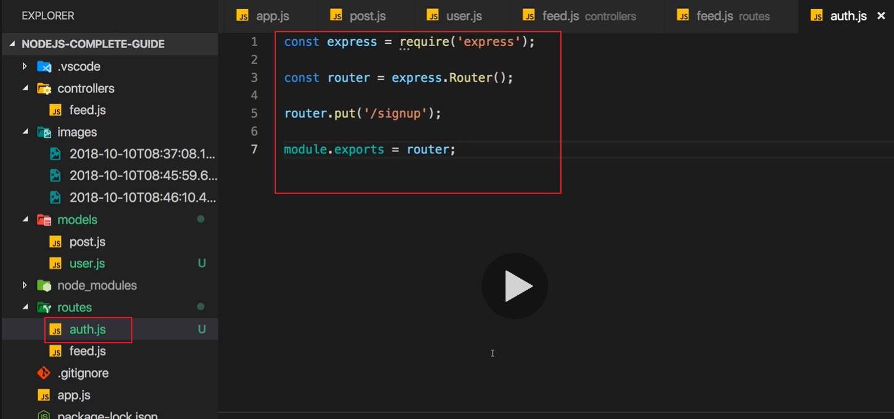

# S25 | Module Introduction

---

## Notes
So it's time to dive deeper into your recipe eyes and build a complete project or a complete back and forth project as arrest API. And in this project we'll have a look at things like authentication and other interesting things like image upload and so on. So what's in this module in detail will plan our rest of your eye or I'll show you a project for which you will need want and will then build it together of course. So in detail we will implement all the corrupt operations our project needs. So creating reading updating and deleting items in a database and so on. That is what we'll do here will define all the rest API endpoints for days and so on will add validation on the server side to make sure that only valid data gets stored in our database. We'll add image upload so that we still can store images even though we're not rendering views anymore. And finally all dive into off indication which will be very important and very interesting too. So let's dive in.
1-2


# S25 | REST APIs & The Rest Of The Course

---

## Notes
Before we start working on the project, let me quickly have a look at rest APIs and the other knowledge you gained throughout the course, is that now all redundant? We learned about things like setting up our node and express app, routing, handling requests responses, request validation, database communication, file handling uploads downloads, sessions and cookies and authentication, these are some big topics we covered throughout the course. Now how do we have to adjust our knowledge now that we build a restful API instead of a view based application? Well regarding the general setup, we already saw that in the last module there are no changes we need to do, we still set up a normal node and express server. Regarding the routing, we also have no significant changes, we just use more http methods, more http verbs now, that's the only difference in the end. For handling requests and responses, you already learned that now we work with json data instead of views, so that is a difference. We render no views anymore, we have no views folder anymore, we don't use ejs handlebars or anything like that, instead we only exchange data. So that is a change but as you learned in the last module, this is also not too hard to implement. Now if we want to add validation for incoming request data, then we will not have to change anything. We still can add validation for example with express validator which we used in the validation module of this course and the way we use it and the logic behind it does not change a single bit. Database communication, so working with database, be that a SQL or NoSQL database also does not change, this happens on the server side in a controller action typically and the logic we write there, the code we write there is not affected by the data we exchange or by the fact whether we render a view or if we send around json data. When we talk about file uploads downloads and so on, there's also not much that changes. On the server side nothing changes actually, on the client side the logic changes a little bit and I will show you how we can implement file upload and of course also serving files in this module. Now for sessions and cookies, there we have changes because we will not use sessions and cookies anymore with rest API and the reason for that simply is that you learned about these restful principles or these rest API principles and one of them was that each request is treated separately, it is looked at independently from previous requests, so we have no connection between the client and server, we have no shared connection history to be precise and therefore, we manage no sessions on the server because the rest API does not care about the clients or whether that client connected to the API before and therefore authentication will also have to change. We'll use a different authentication approach and I'll show you which approach this is and how to implement it in this module too. So overall, there are not too many changes. Some changes, he biggest changes are related to sessions and therefore authentication and I will show you how to implement them but the rest will still work the same you learned it and therefore all the knowledge you gained throughout the course is of course everything but redundant, it's still super important. And with that let's dive in, let's see which project we'll be working on and how we can work on it.
3


# S25 | Understanding the Frontend Setup

---

## Notes
Attached to this video, you find a new project and this is now not a nodejs project, instead this is now a reactjs project. Reactjs is a frontend javascript framework, it runs in the browser and it allows you to create such a single page application which I mentioned in the last course module. You can simply download the attached project, extract it into a new folder and then navigate into that folder in a terminal or simply open that folder in an IDE like visual studio code and then inside of that extracted project, run npm install to install all the dependencies of that project. Now I mentioned that this is not a nodejs project, why do we need to run npm install then? Because it's pretty common that we manage any dependencies in javascript projects even for browser side projects with npm, with the node package manager. The packages I'm installing here are only packages that are getting used in the browser though, there are no node express or anything like that packages beneath them. Indeed if you have a look at the package.json file, you'll only find react related packages here which do run in the browser. So don't be confused by the fact that we're using npm, these packages here still only run in the browser and we're just using npm to install these packages because in modern front end development, you have very complex setups, you have very complex package dependencies and using a package manager like npm can speed that up. Now once you ran all of that, you can run npm start to start a development server which is now actually a nodejs server serving your application but it's not related to the node server we will build, it's not related to our backend, this is only a dummy development server which simply serves the build version of our frontend application, so it serves a simple html file which you can actually see in the public folder, this one which does not have a lot of content which is what I mentioned earlier or in the last module actually that single page applications have very trivial html files but we have some hooks here which are used by the react application which is built in the source folder, there is the source code and that will be mounted onto these hooks here automatically in the browser which leads to an application like this. You will see an error by default when you first start this up, we'll fix the error throughout the module and there, you will see this interface and this interface is now fully rendered through reactjs . If you inspect the source code, so if you view the page source, you will find the html page I just showed you with these hooks and then a couple of script imports at the bottom and if you inspect the dom though, you will see way more html elements and these are all rendered dynamically by react, so by the browser side javascript framework and if you want to learn more about react, I get a whole course on that of course so check that out. We'll not write react code here, almost all the code we'll work with is already prepared by me, we'll just have to tweak some things as we create our rest API but this is the frontend we'll use together with our rest API and the idea of course is that you get a feeling for how frontend and backend, so the react app and the rest API are decoupled and can still work together now. So this is the project we'll work with, it's a very simple social network blog messaging like application, we can have our users status which you can update here, we can create new posts here, we can later also edit and delete posts and we'll later also add authentication. Right now nothing is working because I got no backend attached, this is also the reason why we have an error message right at the start but we will get rid of that throughout this module of course. So this is the frontend and this is now the frontend I want to connect to my backend. So let's now see which kind of restful API endpoints this frontend could need before we then start implementing them step by step.
4-6


# S25 |  Planning the API

---

## Notes
So let's analyze this react application to find out which rest API endpoints we want to provide. Now you don't need to know react for that, no worries. The app.js file is essentially our entry file where our react application starts or where it basically starts rendering the first screens and there we also have some logic on which we'll have to work on later. For example for logging users in, we'll later have to insert a real url here that allows us to do that and the same for signing up and so on. Now in the pages folder, you'll find a feed folder and there the feed.js file is what's responsible for this page with the new post button and so on. There we also have a couple of routes, for example here where we fetch the status of the currently logged in user but then also additional routes for loading existing posts, here where I want to reach some url that serves up some posts but also later down, hooks or methods where we can edit the user status, where we can also add new posts or edit existing posts, we'll do this in the finish edit handler and where we can delete posts, something we'll do in the delete post handler. There you already see I have a couple of fetch methods set up but the url is always missing and that is something we'll have to do of course, we'll have to add our own url and make sure that this works or that we have the respective endpoints for that. On the single post screen here, we load a single post if we click on it and there indeed, we also want to reach out to the backend and fetch data for that single post. So in short, which endpoints will we need and now I switch back to my rest API which we started building in the last course module, you also find this snapshot attached to this video. There I already got a route for getting all posts and for creating a new post, that is great, we will also need routes for getting a single post, for editing a single post, for deleting a single post and we'll also need routes for logging a user in, signing users up, so creating new users, for viewing the status of a user and for editing the status of a user. These are the routes we will need and with that, let's start working on that and let's implement them step by step. We already got a route to get posts and to create a new post which does not sound like the worst start, let's maybe continue with these so that we can start implementing the appropriate code in our react application to get posts and to create posts. 


# S25 | Fetching Lists of Posts

---

## Notes
So let's start working on the rest API again and for that I'll run npm start in my rest API nodejs project too and that is also the reason why I'm using different ports by the way. Here I'm starting the application on port 8080, my frontend application automatically takes port 3000 and this simulates that these two ends of my application are served by different servers in the end which is a pretty common scenario since frontend only applications like react can be served on so-called static hosts which are optimized for applications that only consist of html, javascript and css and hence you might indeed have two different servers even if you created both the backend and the frontend. So we have different ports and therefore we have different domains and therefore we definitely need our course headers otherwise nothing would work and with that, we can now start working on our feed routes. We actually got two routes already, /posts and /post for creating a new post and for getting existing posts and now let's add some logic so to our controller actions to actually return something useful and to enable the user to create new posts. Let's maybe start with getting posts because that would allow us see at least some dummy data, so that is something useful. For that in get posts, we actually already return a list of dummy data posts, each post has a title and some content. Now it's of course always up to you how you want your data to look like in an application. In this application because my frontend also expects it, I want to have a post which in the end consists of a title which has a user attached to it, a creator or an author which has a creation date which has an image and which has some content. This is what I want to output in my frontend so the data we store on the server should have all these fields in the end. Now we don't have to start with the full package though, I already have a title and content here, now let's maybe add some image url here and for that I'll create a new images folder and for the moment I will just copy an image into that folder, later we'll of course add image upload. I'll copy in my good old duck image which I used before in the course and here it is, the lovely duck.jpg and I want to serve that duck. So here in image url I will actually provide images/duck.jpg as a path because that is my local path on the server here. It's missing my domain and so on, we'll have to attach this on the frontend but this is now a post as I could serve it. If I now save this, we can actually fetch that data with a get request to localhost 8080/feed because that is what we have as a filter to reach the feed routes, so /feed/posts. Now let's try that out in our frontend application, there we fetch our posts in a feed.js file in the source pages feed folder, in there you should find a load posts function. Load posts is a function that is called by the react code and so on in the end and what we do here is I also support pagination which we'll add later, for now I just want to reach out to my url which is http localhost 8080, written like this and then /feed/posts like this. So this route I just talked about in the rest API. This should fetch all these posts, then here I just check if the status code is not equal to 200 which would mean that something went wrong and then I throw a new error which is handled in your react application otherwise I extract my body and then here, I have my body and I use some react logic to load that body in the end and to hopefully display it. If I save that and I go back to my application, I'll get an error regarding the name, the author name which is missing, I'm not supporting users yet so this will be a problem for the moment and we'll also get an error regarding the date eventually. So to avoid this, we should go back to our controller and add some dummy data for this too. Let's add a creator object because that is what I'll be looking for in my react code which should be an object with a name where you can enter any name you want, later we'll of course connect this to a real user in the database and let's also add a date and here you can simply create a new date with, well new date like this. Last but not least, you also want to add some ID and that should be _id because I'll be looking for _id in the frontend code in the react application because later we'll use mongoose again here and that of course or mongodb in general and that of course simply adds IDs with _id, so here you can enter any ID you want. Now if you save that updated controller code and the server therefore restarts, you can reload and you'll still get that error which is related to our status, our user status which we still can't fetch but if you simply click that away, you see that first post here and that is looking better than before. The invalid date is a problem because actually the field should be named createdAt, not date, there was a tiny mistake on my side, on the server it should be createdAt. With that if you reload, you'll see this post. So fetching posts works, of course it's just dummy data though. To work with real data, I want to be able to create new posts by clicking new post, so that is something we can add as a next step. 
7-18


 


# S25 | Adding a Create Post Endpoint


---

## Notes
Let's make sure we can create new posts so that this new post button does not only open the modal but we can actually add a new post, for now without the image upload. So let me go back to my rest API and there we already have a create post route of course so we can continue working on that. We expect the title and a content there and for now this is the only data which I will really need to worry about because well as I just said, we'll not worry about the image for now. You can pick an image here but ultimately even though it's previewed here, it will not be uploaded. But it does not matter, we can implement this in a way that at least the title and the content is uploaded. For this we already got our route in place, a post route to feed post and there, we then extract our title and content and we, well for now basically echo back that message. Let's try that and let's go to our frontend application so to the react code and in there, let's simply go to the feed.js file and there you should find a finish edit handler function. This is the function which is responsible for handling the case that we clicked on except here once we entered a valid title and content, by the way here I also got validation in place, frontend validation which is not the matter of course because it's not related to node at all, it's just a user experience thing that we use browser side javascript to validate the input right away, you can learn more about that in my react course if you want. Still worth noting that we have some validation in place here, not validation on the server though. So if I now click accept, I want to reach my /feed/postroute, for that here we have to edit this url. This url here will actually be required later when we start editing posts, for now we want to create a new one, so here the url will be http localhost 8080, so our backend url /feed/post, this is the route we set up on the backend. Here we send a fetch request to that url and we need to configure that request because it will be a post request. So the method here can be post but actually I'll write this in a more flexible way too because when we later edit this, we'll use a different method, so here I will create a new variable method which I'll set to post which we then later could override in here. So here I'll not hardcode posts down there but instead use my method variable. I will also need to add a body, the data which I want to set and that has to be json data so I will use json stringify to convert a javascript object to json and then I pass a javascript object here and this javascript object in the end should hold the code which I want to, well send to my backend. In this object for now, I simply want to set my title and that can be extracted from post data, an argument I receive in this function, so post data will hold the data the user entered, post data title and then here also the content to post data content, so this is again what we add in the react application. Last but not least to send this request in a way that the server understands it, we need to add some headers here where we set the right content type, so here I'll set content type to application json to inform the server that I do indeed send some json data. So with that, I'm targeting the right url and I'm sending json data and I'm sending a title and a content and this should be everything I need on the server. So let's save this and it should reload automatically as long as you keep npm start running here and therefore, well it reloaded the app here and let's create a new post, the title has to be at least five characters long such so as the content, choose a file otherwise you're not allowed to submit this even though the file is not getting uploaded right now and click accept. Now you will run into an error here which is related to the frontend missing some crucial data it needs to update everything correctly. However let's go back one step and let's actually console log res data here, still in that finish edit handler, just in the then block after fetching and save again. The app will reload and you can enter something into that new post model again, testing again and hit accept again and you'll get that same error but before that error, you'll see a log which actually proves that on the rest API, everything worked correctly. You get back that post created successfully message and the post with the data you entered. The error is simply stemming from the fact that on the server, we're not doing everything we expect it to do because we're not creating or we're not attaching a user, we're not creating a date and so on. These are all things we can fix though by going back to our controller on the server and there when we create a new post or when we echo back that post, first of all it should have an _id not an ID, it should also have a creator field which is again a javascript object with a name of your choice and later this will not be dummy data anymore but real data, so we add this creator and we should add a created add field and that created add field is simply a new date. And now with that being echoed back, if we save that server side code and we reload the frontend application, we can test this one more time, click accept and now we don't get an error instead we see our post there. So now we indeed do create our data on the server or at least we fake to do so and we return that back to the client where we can now render it. Now editing will not work though we can select it for editing at least, deleting will also not work and viewing will neither but we got our basic flow set up. Now since we're creating a new post here, what is missing on the server though, at least two things are missing and what is missing? Well validation, server side validation, we only got client side validation but that can always be tricked because users can see your browser side javascript code, they could disable it, they could basically find ways around that so it's not a safe mechanism, it's only meant to improve user experience. So we need to validate on the server and of course we want to store the data in a real database, so we should add mongodb or SQL solution again and that is what we'll do over the next lectures. 
19-28





# S25 | Adding Server Side Validation

---

## Notes
So validation in the database is missing. Now I'll start by adding validation here and for that, I'll quit my server side npm start process because I need to install a new package and I'll use the same package which I used in the validation module of this course. Therefore you should definitely watch that module to learn how validation works because I'll not repeat everything here, we already learned it after all. So here I'll just install that package which was express validator, that is a package that helps us with implementing validation into our node express applications. After that is installed, you can restart npm start and now do you remember how you add it? Have a look at this module I just mentioned if you don't. You go to your routes and there, you add some middleware which does that validation. For that, you first of all need to import something from the express validator package and there from the /check sub-package and that something is either the check method or the body method to check the request body or with the check method also the headers, the query parameters and so on, I want to check the request body here. Now for a get route, validation makes no sense because no data is submitted but for the post route it makes sense and there I'll add an array of middleware that will be applied which will be related to validation. There for example I will use body to check the title field. Now the title field can be validated in any way you want, I can tell you that on the frontend however, I am validating that title field and you can see that in the components, feed feed edit component, that I am validating this to have a minimum length of five characters and to be non-empty which is of course the case if it is at least five characters long, the content also has to be five characters long. So that's just a little side note on what I'm doing on the frontend and the backend should of course meet that same pattern. So my body title will first of all be trimmed to not have any whitespace in there and then I'll use the isLength validator with an object to set a minimum length of five. Now this is the title, now after a comma, I'll add my next middleware where I will validate the content, we can also trim that and basically set the same validator, obviously you can be more creative than that but I just want to re-iterate how validation works and really show you that it works in exactly the same way in rest APIs because you build a normal node in express application in the end, that does not change here. So with that, we added these two validation steps for our incoming data, for title and the content and now we can implement some logic to send an error if our server side validation logic is not met. For this we go to our controller, to the feed.js file in our controllers folder and there we also need to import something from that express validator package, so here I also require express validator/check and that something which I am importing here is the validation result function. With that imported in create post, we can simply create a new errors constant and use that validation result function on the request, it will then automatically extract any errors that validation package gathered and we can check if not errors is empty which means we have errors. If that is not empty, we have errors and then I will return a response with a status code of 422 which is of course our validation failed status code where I send some json data and there you can have a message of validation failed, validation failed, entered data is incorrect or whatever you want, it will be on your frontend to do something with that message or not and you could add the errors here by using that errors constant and then using the array method to extract an array of errors and also add this to the json object. So with that, we're returning this response if validation fails. Now thanks to our client side validation, with the correct rules we could not reproduce that because I'm already checking for a minimum length of 5 on the frontend but if we increase the title minimum length to 7 for now on the server, now if I go back to the frontend and I enter a title which is only 5 characters long and therefore long enough for the client side validation but too short for the server side validation which is of course a mismatch you don't want to have in a real app but it's great for testing, if I do that and I accept here, I actually get an error, creating or editing a post failed, that is an error message I'm just showing on the frontend. But if you have a look at our console log in the dev tools, we see a 422 error here and if we click on that we're taken to the network tab, we see that read request and if we inspect that, we see our response here and that indeed has that message we sent on the server side, validation failed and so on and it has this errors array where we see that the title failed. So you see that the server side validation is working and that is all I wanted to show you here, of course I revert back to 5 characters minimum length on the server now too so that the client side validation logic and the server side logic are in line otherwise we would have very bad user experiences because users get the feedback that their input is correct and then the server would throw an error. So with that, we added validation for this post route and now we can move on to adding a database.
29-35


# S25 |  Setting Up a Post Model

---

## Notes
So time to add some database logic and I will again use mongodb and mongoose and I will use that same mongodb atlas server we configured earlier in the course. So go back to that mongodb module if you want to see how that worked and if you want to use MySQL or something like this, you can of course also take the knowledge you gain in the MySQL related modules of the course and implement your own SQL solution here, to follow along smoothly you should use mongodb though. I will again use the mongoose package, so let's install it with npm install --save mongoose and that will be required to connect to the database and to then of course also create our mongoose models, store data and so on. I'll restart npm start thereafter and now first of all let's connect. For this let's open the app.js file and let's import mongoose here by simply requiring mongoose. Now as you learned in the mongodb and the mongoose modules of this course, we then esstablish a connection by using mongoose connect here and now we need a url, a connection url. Now as I mentioned, I'll use that same connection url I used before in the course so that does not change, I will just copy that, here it is, that is my atlas server to which I can connect and this now establishes a connection and then I can add then and a catch block, catch in case this connection establishing fails, then I want to log the error but if we are successful, if we are in the then block here, then I will start my node server and start listening to requests. If we save that, it now gets restarted and it should succeed, you can ignore this deprecation warning here by the way. Now we're connected to mongoose or to mongodb through mongoose and now what can we do? Well we have to create some models to work with right because that is how we interact with the database ultimately. So let's create a models folder here in our node rest API and I'll create a post.js file in there to define how a post should look like. There I will simply import mongoose by requiring mongoose from the mongoose package, we can then extract the schema from that mongoose object, that schema constructor and use that to create a new post schema, you can name that however you want but you use new schema to now define how a post should look like in your database and in your application. Now you can of course define this in whichever way you want, I want to have a title in there which will be of type string and you learned all about that schema declaration thing in the mongoose module, so I'll be walking through that a bit faster. So type will be string and let's say it's required and we then also will have an image url or image or however you want to name it and that will also be a string, it will be a url pointing at that file and this will also be required. Now we'll also have a content of course where the type is string as well and which also is required, so thus far not too exciting. Now I also will have a creator here and that will later be a link to a user, for now I don't have that so for now it will just be an object and be required but this is only temporary, we'll change this later. So this is my current set up. Now I will pass an option to the schema constructor which we haven't seen before, we can configure this and in that object I'm passing as a second argument to the schema constructor, I can add the timestamps key and set this to true and mongoose will then automatically add timestamps when a new version is added to the database, when a new object is added to the database. So we automatically get a createdAt and updatedAt timestamp out of the box then and you can learn more about that feature in the official mongoose docs of course. Last but not least, we now need to export this and you learned that we don't export the schema but a model based on the schema. So I use mongoose and then the model method to create a model based on a schema, you can name that model however you want, I'll name it post and therefore this will create a post database and I will export my post schema here or use my post schema, so this is the model defined. One important note about my connection string by the way in app.js, there I'm connecting to a database and I will connect to my messages database, you can name this however you want. So now we'll connect to this database and thanks to this model, there mongoose will use a posts collection for us when we start using that model. Well speaking of that, let's start using that model in the next lecture.
36-40





# S25 | Storing Posts in the Database

---

## Notes
Well speaking of that, let's now use that model. We're exporting it here, let's now use it in the feed controller. There we first of all need to import it, so here I'll import post by requiring it from my models folder from the post file and now we can use that post model in create post after we validated the input here. There I will create a new post with my post model as a constructor, we pass a javascript object and there we define basically what we do down there, so we can cut that and move it up here, I don't need to set createdAt because mongoose will do that for me thanks to that timestamps option we set here and of course I don't need to set _id because mongoose will create that for me as well. Title and content should be passed and the creator as well for the moment. So now you'll learn that we can just call save on the model to save it to the database and this will give us a promise or a promise-like object where we can catch any errors and here I will log the error for now, we'll later add real error handling of course and I get a result which I also want to log here and I will also send my response, whoops, in here, in the then block I'll send a response, 201 is the status code, the post object here however will be the result object I get back here because that should be my created post. If we now save that server side code and we go back to our frontend application, we should need to change anything in our react code instead we can just try this, does this work? Let's choose an image, upload still does not work, we'll do this later, checking it and this seems to fail. If we go back, I see path image url is required which makes sense because in my model, I set image url as a required property, so in my feed controller when I create a new post, I should also add an image url here and for now that can point to images duck.jpg, we'll later add file upload as I mentioned. So my mistake, we should add this on the server side, make sure we store an image url so that we meet the requirements of our model and now let's try this again. Does that work? Take the duck, enter some content, click accept, this looks good post created successfully and there we see indeed this is the data or the post which was stored with the creator, the content, this automatically generated createdAt and updatedAt timestamp thanks to the timestamps option and the automatically generated ID. So that is working and on the server side, I'll also get no error, I only see that created object being printed thanks to that console log. So that is working fine and now as a next step we can work on serving that image and on accepting image uploads and on handling that error.
41-45


# S25 | Static Images & Error Handling

---

## Notes
So let's make sure we can serve that image and in the future also accept image uploads. Now for serving that image, we have to make sure we serve that images folder statically, at least is the approach I want to use, you learned all about that in my file uploads and downloads module and the general logic there still applies, so check that out to learn more about that. In app.js, I want to set up static serving of my images folder. For that up there after I register my body parser, I'll use another middleware and I will do that for any request that goes to /images, here I'll use a middleware built into express, the static middleware which I use by calling the static function and now I want to serve my images folder. For that let's import the path package, the core path package node provides and then here we can use path join to construct an absolute path to that images folder. By using the special dirname variable which is available globally in nodejs and gives us access to the directory path to that file, to the app.js file and in that same location as this app.js file, we find the images folder, so we can pass images as a second argument and path join will construct an absolute path to this images folder and that is the folder we'll serve statically for requests going to /images. With that we should be able to use our image in the frontend code or to see it. If we save that server side code, to view the image on the frontend however, we'll need to be able to click view here because the image will only be included on the detail page and that however will not work because we need a route to serve a single post which we don't have yet, so we'll have to postpone this. It will actually be what I work on next but before we do that, I want to set up proper error handling. In the feed controller, right now when I catch an error here I log it and there when I validate the input, I return an error response manually. You can do that and you could also return your own error response down there but you learned that you can set up a general error handling function in expressjs and I want to use that function. Now how do I use it though? Let's maybe start with validation. Instead of returning a function manually here, I will create a new error object with new error and the message I set up here is the message I'll pass to my error object. I'll then also add my own custom property which you can name however you want and I'll name it status code and set this to 422. Now I will throw that error and I can remove that return statement. Now what does throwing an error do here? It will automatically since I'm not doing this in an asynchronous code snippet or anything like that, it will automatically exit the function execution here and instead try to reach the next error handling function or error handling middleware provided in the express application. We also got another possible error and that is in here if something goes wrong with storing the post, there I don't want to log the error instead here I will check if my error has a status code field which it will not have but theoretically if I had more complex code where I throw my own errors, there might be some error that has it. So I check if that exists and if it does not exist, hence the exclamation mark here, if it does not exist, I will add it and I will set my status code to 500 then because it's some server side error. Now you learned that since I'm inside of a promise chain, so inside of an async code snippet, throwing an error will not do the trick, this will not reach the next error handling middleware. Instead you have to use the next function here and pass the error to it and this will now go and reach the next error handling express middleware. Now the last step is that we register that middleware and we do so in app.js. There let's go all the way to the bottom after all my routes here and let's use a new middleware which has this error handling definition of getting an error as the first argument and then request response and next. This will be executed whenever an error is thrown or forwarded with next and here I want to log it so that we as a developer can see what's wrong in an easier way and then I'll extract my status code here, from error status code, so from that error object, I'll extract my message from error.message. This property exists by default and it holds the message you pass to the constructor of the error object and now I can return an error or a response with the status code of the status I extracted and we can set this to a default value of 500 with this syntax by the way, so in case this should be undefined, it will now take 500. So we return this status code and we use json data of course where I have a message of the message I extracted. And now I have this general error handling functionality which should work which I can quickly validate by going to my feed routes and changing that validation logic again to seven for the title as a minimal length and now let's try to enter a title that is not long enough and let's see if we now still see an error. We do, we still get that error being thrown with the right status code, so this works even though I'm now using my custom error handling function which is a bit of a more elegant way of handling errors now. So this is working, let's now move on to creating the route for getting a single post so that we can finally also see if we can see our image.
46-51


# S25 | Fetching a Single Post

---

## Notes
So time to add a new route in the feed.js file in the routes folder. There I will add a new get route and that will be a route for a single post. So the route is get/post and then we need a dynamic parameter, /postID for example because we'll encode the ID of the post we want to fetch in the url. So this is my path, now we need a fitting controller action, so let's go to the feed controller and in there, I'll export by get post controller action with request response next and here first of all, let's extract the post ID from the incoming request params. So there I can get my post ID, post ID here, this property I'm trying to access has to match exactly the name I assign in my route, so post ID here after the colon. So now I'm extracting, whoops, I'm extracting that post ID here, now we have to find a post with that ID in the database. So let's use our post model and use the find by id method to find a post with this post ID. We then have a then block or a catch block depending on whether this fails or not. In the catch block, I'll use that same logic as I used for creating a post, I check if we have an error status code, if not I add it and otherwise I just next my error and yes you could refactor into a single function which you then always use. So here I have this error handling code, in the then block here, I will get my post and first of all I'll check if this is undefined, so if this is not a true-ish value. If it is, I know that no post was found and then I'll actually throw a new error, so I'll create a new error object, could not find post, I'll set the status code to 404 because that is a not found error and now I'll throw the error. This can be confusing because I'm inside of then and you learned that you should use next in there but if you throw an error inside of a then block, the next catch block will be reached and that error will be passed as an error to the catch block. So all I do with throwing is I end up in this function and there I do indeed next the error, so I just always use that function, that's all I'm doing, I still throw an error if I can't find the post. If I do find it, I will return a response with a status code of 200 which shows that it was a success or I do return some json data with some message, you don't have to set the message by the way, this is purely optional of course, where I say post fetched and of course my post like this, so I'm returning the post I'm fetching here as a property post in that object. So now we have that controller action in place, now if I go back to my routes I can assign that controller to that route here, so feed controller get post is the action I want to use and this will not work however because in my frontend, I fetch the wrong post, so I fetch some dummy data because in my feed controller get post, I'm not using the database, I'm instead just returning dummy data. Now since we are using a database now, since we have added a database, we should of course fetch data from there as well. So for that, let me use post find to find all posts and then I have an error or a success case, if I have an error, I'll use that same logic I use down there to add a status code if it does not exist and then next the error, if I succeed I get some posts here however. And now I want to return these posts, so I will send a response with a status code of 200 where I send some json data and that json data will be an object where again I will add a message which you don't have to, fetched posts successfully and most importantly I'll add my posts of course and the posts I add here are the posts I fetched with posts find, so these posts. Now we can get rid of that response down there with our dummy response, re-format this and now we have this logic in place to fetch the actual posts we have in the database. If we now save that and we go back to the frontend and reload, it should load that post. Does that work? Now of course we will now want to be able to click on view and see that single post for which we already added the route. We just need to adjust our frontend code, so the react code to load that single post and you do that in the source pages feed single post folder in the singlepost.js file, in there you have componentDidMount which executes when this page loads essentially where we extract the post ID from the url in the frontend and now we just need to target the right url here which is of course http localhost 8080 /feed /post/ and then that post ID. With that we have a get request that should get us our post. If you now save that and you click on view, you should load your post here, however the image is not displayed. The reason for that is that we're looking for the wrong url or that we're not using the image at all to be precise. In the frontend, in the same componentDidMount function you just worked in, in this set state block here, you should add an image key and it has to be named image because that is a key I'm looking for in that frontend application in the other code which I prepared and there you want to also define that url to your server, so localhost8080/ and then use res data. post, accessing the response data, there the post property which we do use to store our post in, in get post we have that post property here which holds our post. So this is what I am accessing now in the frontend and there, image url, that is the key name, how it is stored in the database, add a comma thereafter and save that. And now this page should automatically reload and you should see that duck. Of course we didn't upload that, I prepared it but at least you see it. Now you can go back to the feed and see your posts here, we'll get off that error message later too by the way. So with that, we got this in place, let's now work on image upload next. 
52-60


# Image Names & Windows
In the next lecture, you'll learn how to upload images in a REST world.

One important note for Windows users only:

On Windows, the file name that includes a date string is not really supported and will lead to some strange CORS errors. Adjust your code like this to avoid such errors:

Instead of
```js
const storage = multer.diskStorage({
    destination: function(req, file, cb) {
        cb(null, 'images');
    },
    filename: function(req, file, cb) {
        cb(null, new Date().toISOString() + file.originalname);
    }
});
```
which we'll write in the next lecture, you should use this slightly modified version:
```js
const { v4: uuidv4 } = require('uuid');
 
const storage = multer.diskStorage({
    destination: function(req, file, cb) {
        cb(null, 'images');
    },
    filename: function(req, file, cb) {
        cb(null, uuidv4())
    }
});
```
For this, install the uuid package by running:

npm install --save uuid

To ensure that images can be loaded correctly on the frontend, you should also change the logic in the feed.js controller:

in createPosts, change the imageUrl const:train
```js
exports.createPost = (req, res, next) => {
    ...
    const imageUrl = req.file.path.replace("\\" ,"/");
    ...
}
```
and in updatePost (once we added that later):
```js
exports.updatePost = (req, res, next) => {
    ...
    imageUrl = req.file.path.replace("\\","/");
}
```
On macOS and Linux, you can ignore that and stick to the code I show in the videos.

# S25 | Uploading Images

---

## Notes
If you remember that slide from earlier, file uploads require no changes on the server side, only on the client side. So what do you learn now is not that important to you if you're not working on the client side yourself, on the server side the logic is exactly the same or pretty much the same we used before, let's still implement it again. Here I'm back in the node application and I want to accept uploaded files. Now in the past we did this with a special body parser, a special middleware and that was multer. So let's install that again with npm install --save multer in the node rest API project, not in the react project. So there we install multer just as we did it earlier in the course and with it installed, let's go to the app.js file and I will implement exactly the same logic as I did before. So I'll go through that really quickly, you should check out that file upload download module if you want to learn all the details. I will first of all import multer into my app.js file and with it imported, I will configure some things for it, maybe here. I will configure the file storage with multer disk storage to control where the files get stored and there, we have a destination key which is a function in the end, an arrow function where I get request object, information about the file multer detected and a callback I should call once I'm done defining the destination. I'm done immediately here, got no error and the destination is images pointing at that images folder here. So that's the first thing here, we add another function to the disks storage object and that's the file name function which defines how the file should be named, get the same arguments as in the destination function and I call that callback with null as an error and the filename will be a combination of the date which I convert to a string and then a dash and then the original filename, really simple, exactly the same logic I used before. I'll also define a file filter where I also have or which also is a function which gets request, information about the file and a callback and in here, I'll check for a couple of mime types. I'll see if my file mime type is equal to image/png or if file mime type is equal to image/jpg or if file mime type is equal to image/jpeg with an e, that is my if condition. If anything of that is true, then it is a valid file and therefore I return no error and true as a second argument in the callback otherwise it would be invalid and I still have no error but I return false here and this is again something you learned in the file upload module. Last but not least, I need to register multer and I will use it here, maybe after the json body parser. I will use multer as a function, pass an object to configure it, assign a storage to my own file storage constant we just created and add a file filter which points at that file filter constant we just created. On that multer function, I'll then also call single image to inform multer that I'll extract a single file stored in some field named image in the incoming requests. Now every incoming request is parsed for that file or for such files. With that, multer is registered and now we can use the file in our controller where we create a new post. For that in create post, I can first of all check if request file, if that is not set because if it is not set, then I'm missing a file so I will create a new error here, no image provided maybe, I will set my status code to 422 because it's also kind of a validation error and I will throw that error, that's the first check. Now if I do find a file then everything is good, multer was able to extract a valid file, so then I'll just set up an image url constant and access request file and there the path variable which multer generates which holds the path to the file as it was stored on my server. And now this image url is what I use here as an image url of course instead of my dummy data. Now we should be able to extract files and really store them. Let me now run this but of course now we also need to tweak our frontend to be able to make that work and I didn't do this in advance because there is something special which I want you to know. In the react code, so on the frontend, go to that feed.js file in pages feed and there, let's go to the finish edit handler. There we're setting up everything we need to send a request to the backend to create a new post and right now, we're doing this with json data. Now we won't use json data anymore because json data is only text, so only data that can be represented as a text which a file can't be or not easily, it will be very big quickly and very big files are a huge issue or impossible to upload like this. So we can't use json for data where we have both a file and normal text data, instead we'll again use form data. Now we did use form data automatically when earlier in the course where we had a traditional app with rendered views, when we used a form with this multipart form ank type which we added to the form html element if you remember. So this form data is what we'll also use here but we'll not use anything to any form element, we'll do it all in javascript instead. Here where I have this marker, this comment, we can create a new form data object with a built-in object that browser side javascript offers, the form data object. This now allows us to append data to that object, for example the title, first argument to append is the name of the field, second argument is the actual data. So here we'll have post data.title, exactly what we passed to the json data before. Of course we don't just append the title, we also append the content, so let's append that and now we also want to append an image because we can append files as well. Now this should be named image because we'll be looking for this field on our rest API and now here, I can reach out to post data image because that is where I will get my image in my frontend code. With these three fields, I got form data prepared that now has mixed content, text and a file and now I want to use that form data as a body for my request. We should not set the header to application json anymore because that would be incorrect and would break our app because we would try to parse it incorrectly on the server side, instead the form data will automatically set the headers, that is kind of convenient. All we need to do is we need to set form data as our body and the rest will be done for us. If we now save that and we create a new post, let me create a post here, a duck and choose that lovely duck image again, this is a duck and click accept. Now this was pretty quick, if I now click view here, I see my duck here which is looking good and on the server side, I also see this image which was generated, which has a time stamp and this is the uploaded image, I got no error here so this is all looking good. So uploading files also works, as you saw on the server side it has exactly the same logic, on the client side things need to change but of course this is a node course, so it depends on which client you are using, how you need to adjust your code there.
61-76





# S25 | Updating Posts

---

## Notes
We're making very good progress, we're able to create posts, view posts, view a single post, upload files, validate content, all great. Now what is missing? We want to be able to edit posts, we want to be able to delete posts and authentication and users and connecting posts to users, this is all missing, now let's continue with editing and deleting posts before we dive into the authentication and user related things. So for that, let's go to our feed routes in our node rest API project and there, I'll add a new route, I want to be able to edit posts now and for that I will use a new http method which we haven't used before. Editing a post essentially is like replacing it, replacing the old post with a new one, we'll keep the old ID but that is it. Since we'll replace a resource, I'll use the put method here and the put method is one you learned about in the last module but which we haven't used before because with normal browser forms, you're not able to send it, through asynchronous requests triggered by javascript you are however. Now we need a url here and the url will be /post and then also the ID of the post encoded in the url, so colon post ID. Now we also need a controller action to handle that, the important thing about put requests and the same is true for patch requests by the way is that they also have a request body, just like post requests but you can also have parameters in the url, well that would have been the case for post requests too by the way but the important thing is we have a body for these request, we can add a request body and that will hold the actual post data that I want to well use and that I want to use to replace my existing post, so let's work on the controller now. In the feed controller at the bottom, I'll add a new action and I'll name it update host, the name is up to you but this is what we'll do, we'll update the post in there, this is the function and in here, in this function, I can first of all retrieve my post ID from my request params because we just added it there, right. In my route, host ID is a parameter which of course I can extract. Now when updating a post I also will extract my title, so request body title, I will extract my content, request body content and I want to extract my file, my image url, however for that url we have two options when updating. The first option is and that will be my default, that image url is part of the incoming request and it's just some text in the request body. That would be the case if no new file was added, if no new file was picked, then my frontend code has all the logic to take the existing url and keep that but we might have picked a file and in this case request file will be set and I can now set image url equal to request file path, this is the alternative. After all of this, at least one of the two should be set, so if image url is not set at this point because we were not able to extract it from there and we did not make it into this if statement, then we should throw an error so here I will prepare a new error, no file picked, I'll set my status code to 422 and I will throw that error here. So that's my first little piece of validation, we'll add more validation of course, normally we should have an image url however. Now I have one little mistake here by the way, this should be image here, what I retrieve from the frontend and we need to tweak our frontend a little bit too. There in feed.js, in source pages feed, feed.js, when we load all posts, so in load posts, that is when we basically load to post data from the server including our image url. Now we then store the post here in the frontend so that the rest of the react application, the rest of the code I prepared can handle that, we need to tweak this line a little bit. There you should access res data posts but we have to map this, which is a default javascript method into a different kind of array or every element has to be changed a little bit. Map takes a function that executes on every element in the array and it gets the element which in our case is a post as an argument and then we return, well the updated version of that object, so I return a new object here where I will use the spread operator to get all the properties of my post object and then I'll add an image path key here which is post.imageurl . Now image url here is referring to the property I am storing on my server side, there we are restoring a path to an image in the image url key, you could have name this differently, if you named it differently here, you would have to name it differently here. Now I'm storing the original path here because when I'm viewing a single post for example, I do extract that image url and I append my url to the domain. Now the path should be well just a path without a domain because I'm keeping that here and this will get reused later when we edit this through this edit modal, behind the scenes this path will be stored and if I don't choose a new file here, this path will be submitted with my edited post and there, the path will be stored in a property named image, you can see that in the components, the feed edit component under feed, feed edit, there you could see all the internals, if you know a little bit of react you can see the internals and see that I'm extracting my image path and I'm storing it in an image key ultimately. I don't want to dive too deep into react but this is what I'm doing on the frontend and this was one adjustment that was required and on the server side, we can now extract our image here from the body and either this is set or we selected a new file in which case a file will be found. So now we can continue working on update post and we can continue working by first of all adding more validation which we do in our routes of course. Well there I will copy that array from my post route and I will add it here, so for my put route I also want to validate the title, by the way we should switch that back to 5 characters of length for both posting and putting. So I will validate these two things, I'll not validate my image because that is done directly in the controller action and I don't need to do any other validations for now. So with that added, let's go back to the controller and let's copy the validation logic from the post route where I gather all my errors and then I check for errors not being empty and then I would throw an error. So before I extract anything else, I'll check these things in update post, whether I have any errors and if I have, I'll throw an error. If I don't have errors, I continue, check the file and if we make it down here, so after all these if statements, then I know I have valid data and now we can update it in the database. To update it in the database, I will find my post by ID for the post ID which I extracted from the url, then I can do something or we might have an error, if we have an error, I'll reuse that error handling logic you find in other places, in other actions, so I'll add my status code in the next, the error. If I am successful, I know we have no database error, I still need to check if post is undefined which means we didn't find a post, in which case I will also throw an error just as we did it for getting a single post, I can copy that logic and again if you are copying a lot of code, you might of course also refactor that, I like the more verbose approach to make sure we all understand each step we take in each action creator and if we make it past this if check inside of the then block, then we found a post and then I want to update the post of course. So here I'll set my post title equal to the title I extracted, I'll set my post image url equal to the image url I extracted and I'll set my post content equal to the content I extracted and then I can return post save here to save that updated post back to the database, overriding the old post but keeping the old ID and then here we get the result of that save operation and here I want to return a response with a status code of 200. We didn't create a new resource so it's not 201, with some json code or some json data where I say post updated maybe and where I return that updated post which is stored in the result in the end. So this is now the updating logic here, there is one more thing we can add and that is some logic to delete the image. For that I'll add a little helper function down there, clear image which is a function that accepts a file path as an argument and then I will use the file system package nodejs offers, so I'll import it at the top by requiring fs and with that imported in that clear image function here, I'll first of all construct my file path for which I'll also import the path package by the way so let's import that at the top too and now the file path can be constructed by joining dir name, then going up one folder because we're running this inside of the controllers folder which is not where we will find images, so we should go up one folder to be in the root folder and then we look for whatever file path we got here. So images and then the image name would be the case in our application and I can then use the unlink function to delete that file by passing the file path to it and we can also log any error message and I want to trigger that clear image function when ever I uploaded a new image. So inside of my update post action creator, right before I save my updated post maybe, I'll check if my image url which is the path to the image, if that is not equal to post image url. So to the image url I stored in my post before, if they're not equal it obviously changed, so I uploaded a new file and that is where I will execute clear image and pass the old image url, so the old path as an argument. Now with that, we got all in place here in the controller, now we can go to the route and there we still need to register that controller action on the put route, so on the feed controller I access update post here, that's one important step and on the frontend so in the react code, we also need to do something. There in source feed, feed.js in the finish edit handler function there, we need to adjust our code now. There we set up our form data which is correct for updating as well but if we are in edit mode which will be the case if we make it inside this if statement due to the logic I configured on the frontend, we want to send a request to localhost 8080 /feed/post/ and now we need the post ID which we get from this state edit post._id, that is where it will be stored in my react app and I'll set the method to put because we created a put route. Now with that, we can save all that and try that out and hopefully not get an error. Let's edit the second doc here and add a couple of exclamation marks in both title and content. Let's not choose a new file, it's looking good, I see my exclamation marks there, I see them in the content as well. Here I get a confirmation message that should looks good and on the backend, I still only have one image, well that makes sense because I didn't replace it anyways. Let's now replace it by editing that same doc again, let's not change title and content but choose a different file, maybe that coffee mug, click accept, post updated is looking good, it's not a doc any more so the title is not correct but on the backend, we only have the coffee mug now, so updating seems to work and of course we can confirm this by viewing that image as well, there we also see all the updated data. So that is working and with that, only deleting is missing before we can finally start working on authentication.
77-88


89-101


# S25 |  Deleting Posts

---

## Notes
To ensure that we can also delete posts, let's start in our node rest project and add a new route. This will be a delete route using the delete http method, we register such a route by using router.delete. Now here, the path will be /post/:postid, for delete routes you can't send a body but as with all routes, you can of course encode data into the urls and that is what I'm doing here. Now the route is one thing, obviously we also need a controller action, so let's go back to our feed controller and before clear image, I'll export my new action which I'll add which will be my delete action. So I'll name it delete post here, it will be my standard middleware with these three arguments being passed to the function and in there, I first of all extract the post ID from my request params as we did it multiple times throughout the course. Then we can use the post model to find a post by ID and that will be my post with this ID of course. Now why would I find it by ID first? I can of course also use post, find by id and remove. Well I will use this eventually but later once we edit a user, I want to verify whether that user created the post before I delete it, so I'll first of all find the post with success or not and if I have an error, I'll use that old error handling code I had before and in the then block, I'll have my post where I will check whether the creator is the currently logged in user, so check logged in user, this is something I can't do yet because we have no logged in user obviously. For now there is one thing I can do though, I can use clear image to access the post I retrieved and delete the image for the image url that is stored there. There is one other thing I actually should do and that is I should check whether that post exists. So I can copy that logic from up there where I see whether post is undefined and if it is undefined, I throw an error. Now if that succeeded, I delete the post image and then I return post find by ID and remove because now I will remove it and here, I pass my posts ID again, I can add one more then block with the result of that operation and in here, I'll know whether that succeeded and most importantly, I'll return with a status code of 200 which means yes we were successful and a json data package where I will just say deleted post in a message, of course you could send any data you want. So with that, my delete post action is configured here in the controller, back in my route, I can now use my feed controller delete post and assign it to that delete route and now we just need to work on the frontend and hook up this route. So there in the feed.js file which we worked in a lot already, you'll find the delete post handler and there, you simply need to update that url you see in there. So let's replace url with http localhost 8080 /feed/post/ and then post ID which is an argument we'll get in this function. Now important, we want to send a delete request so we need to pass a second argument to fetch here and set the method to delete and that is it for now, this should now send such a request when we click the delete button. So make sure you save this and you're back in the code and thereafter, let's go back to the feed and let's click delete, maybe on the first item. Now after reloading, it's gone here and the duck image was deleted as well. If I reload this app, we also should not fetch it again so it really seems to be gone. So now deleting also works.

102-106


# S25 |  Adding Pagination

---

## Notes
Now before we actually move onto authentication, there's one more thing we can do on the frontend and that is pagination, so splitting our list of posts across multiple pages and I want to do that first. Now for that we need multiple posts, so let's quickly create a couple of posts like a cup of coffee, choose that cup image which fits it quite well, so tasty, whatever you want and click accept and let's add another post, a real duck because I replaced that image of the other duck so maybe it's time to add another one, this is a duck, click accept and now you see here I only see two posts on the frontend, I don't see any more posts in that. If I reload, I see three however but I actually want to limit that, I want to limit the amount of posts I see there and instead pass some information to the frontend that allows the frontend to show some next and previous buttons at the bottom. Now all the logic for this was already added to the frontend but on the backend, I need to return different data, I need to paginate my data. For that, we should dive into our controller and there into the get posts method or action because that is where I fetch all posts of course and that is where I want to implement pagination . Now it turns out that in my frontend, feed.js, where I load my posts so in the load posts method there, I actually do set some pages, I have my own pagination logic in there and I can pass that page data back onto my backend. I want to do that through query parameters and I want to do that in load posts in the frontend code, here in my url I'll add questionmark page equals to add a page query parameter and I'll add this page variable which I'm creating up here and this will be managed internally in my frontend app, so this will be either 1 or 2 or whichever page I'll try to load there. So now I pass that page query parameter to my backend and there, I now need to extract it to implement pagination. So in my get post action here, I can extract the current page by accessing request and then query parameters are stored in the query object and then page, I'll set this to one as a default. You saw the syntax a couple of times, this or syntax checks whatever this is undefined in which case it would assign this value so that I always start on page 1. Then I'll set the per page value to two and I do this because I have the same value in the frontend. Now of course you could find a more elaborate solution where you pass that per page data from the backend to the frontend so that the frontend can adjust dynamically but here I want to show the general setup and how this works, so I am hardcoded per page here and I have hardcoded it in the frontend. Now I'll create a new variable, total items which I'll need to determine how many items I have in the database because now I'll add a new find request and I will add count documents here to find out how many documents I actually have, this will not retrieve the documents, it will just count them. Then I can have success or fail, if I fail I'll have the same logic as before, so I'll check the status code, add it if it does not exist and forward the error. If I succeed, then in this then block, in this function there, I'll know how many items I have and I'll store that value in my total items variable. I created that variable so that I can now also use that data in other functions than this function because in here, in this then block, I now want to return my old fetching logic so that I first of all count and once I got the count, I actually find the documents and retrieve them. So here I will return this and all that logic, so this then block essentially, I'll cut that out. I'll remove the catch block, I'll add the then block after the first then block and this catch block will now take care about both counting and then this internal finding. However here I will not just find of course, I want to add pagination and the logic is the same as before. We can skip a certain amount of items with the skip method and there, I calculate the current page minus one times per page, so that if I am on page 1, this will result in 0 and I skip no items, if I'm on page 2, this will result in one and I skip all the items that were on page 1 and I also want to limit the amount of items I retrieve with the limit method and here I take per page, so the amount of items I want to have on each page. This is what I now return in there and then the posts here are these well limited amounts of posts. In my response I now don't just to return to posts though, in my frontend I also have some logic to take the total amount of posts into account so that in my react frontend I know when to show the next and previous buttons. For that I'll add another argument to the data that I returned in the response, I'll add total items in there, I'll be looking for this total items property in my frontend code, so you should get this right not misspell it and the value will be my total items variable, so this variable value which I assign here will be stored down there. With that if I save that backend, if I reload the frontend, you now see a next button here, if you click it we load the next page and we only have one item and I can go back. So now I have pagination added as well, as you saw in the same way as before because rest APIs are not that different in the end, just handled differently because we have a separate frontend.
107-115


# S25 | Adding a User Model

---

## Notes.
Now we worked a lot on our posts, I now want to work on my users and for that, we first of all need to add a new model in our node project. There, I'll add a user.js file where I define how a user should look like in my application. So here I'll import mongoose and of course feel free to do these steps on your own, we did them a couple of times, I will access my schema here and then I'll define my user schema with new schema here and we'll add some properties of course, by the end I'll export a mongoose model which I'll name user hence it'll get stored in a users collection which uses this user schema. Now how should a user look like? Obviously that is totally up to you, to fit my frontend, a user should have an e-mail which will be of type string and which is required, a user also will have a password which is of type string and which will be required. A user also will have a name in my application, type string and required, you guessed it and a user here also will have a status, so status is also of type string and required, that is this thing which caused this error in the frontend all the time because we couldn't load it. Now a user will also have a couple of posts, so I'll add my posts here, this will be an array and now each object in that array will be of type schema types object ID because this will be a reference to a post and therefore I add this ref key and add the post model, so I'll store references to posts in my users or on my users. This is how users should look like, if you want you can also add the timestamps, I don't need them here, so now I got my model set up. We can now use that model to set up a sign up and later, also a login route. So let's create a new route and I'll name that user.js or maybe auth.js because it will be authentication related. In there just as before, we import express by requiring express, we then create that express router by calling express router as a function like this and we have of course export this router. Now in-between we define our user or our authentication related routes and there for example, I want to have a post route and you could argue that you also set a put route maybe, let's go for a put route because actually we create a user once, so we could also say whether it's new or we overwrite existing data, we put the data but both would be fine. Here we'll have sign up as a route let's say and then I need some controller of course. Now I'll also add validation and to actually reach these routes, we have to go to the app.js file and there where I import my feed routes, I'll duplicate this and also set up an auth routes constant where I import routes auth. And then at the bottom of the file where I have my feed routes, I'll also add /auth to forward requests that start with /auth in the path to auth routes. Now we are able to reach these routes and now we need the controller. So let's work on the controller and add validation in the next lecture.
116-120





# S25 | Adding User Signup Validation

---

## Notes
I will create a new controller, auth.js that is related to my users, to my user data, to my authentication logic and in there I'll first of all import my user model by requiring it from my models folder, the user file. Now we need at least two actions here and the first one is of course the action to sign a new user up. So I'll name this action sign up and I'll get my request, my response and that next function and in here I want to add all the logic I need to create a new user in the database. So for that let's extract the email from request body email, let's extract the name of the user from request body name and let's extract the password from request body password. Now obviously to extract all of that, we need to know that it's there, so we should add validation. For this I'll go to my auth routes again and just as in feed.js, I will add this express validator check, so I will copy that import from feed.js and add it to auth.js and on sign up, I'll then add an array of validation related middleware. I'll check my request body and there, the email field whether it is an email, you can also just to bring this back into memory define our own messages if we want to, please enter a valid email, this will then be stored in the error object we can retrieve. We can also add our own custom validator here to check whether the email address already exists, for this I'll import my user model, so require that from the models folder and then custom and you learned that in the validation module by the way in case you want to dive deeply into that again. The custom function or the custom validator method here takes a function as an argument which retrieves the value we're looking at and then an object from which we can extract the request as a property with this destructuring syntax and this function then should return true if validation succeeds or return a promise if the validation actually uses some async task, so if the validation does something which takes a little longer as in our case. So I will return user find one and I want to find one user where the email of that user as stored in the database matches the value of the e-mail we're looking at. Now then I have my user document here, so my user object as I've found it in the database and if that is set and that's the only case I'm caring about, if that is set then I will reject a promise, so I will return promise reject and that will cause the validation to fail, all other scenarios will cause it to succeed and then I'll return email address already exists. So that's just another validation we can add. Of course I don't just want to validate the email though, so let's also validate another field in the request body, before I do that though, just one step I forgot, I will normalize the email as well but now I can look at other body fields like the password. The password can be trimmed and should then have let's say a length of at least 5 characters or whatever you want and I'll add another check where I'll look into my body, there to the name, trim it to remove excess whitespace and this should now not be empty. With that, I got all my validation logic added, now that I'm in here I can also already import my controller, so my auth controller can be imported from controllers auth and now I'll use that auth controller as the last middleware on my sign up route and reach out to the sign up action in there. Now validation was added, now back in the auth controller, we want to collect any validation errors right at the start and for that I need to import something from the express validator package again and that will be that validation result function which I require from express validator/check, so this validation result function here and I collect errors by calling that and passing the request to it and now if not errors is empty, so if we got errors, then I know that something went wrong or that I have errors and in this case I want to create a new error where I say validation failed, something like that and I'll set a status code of 422 and I can also maybe pass some data, a new property I'll add where I store my errors array like this and then I can throw my error here. Didn't do that before but this would allow me to keep my errors which were retrieved by that validation package, I now just have to go to app.js, to my error handling function and there retrieve the data from error, the data property and also add this to the response I'm sending in case of an error. This is totally optional but just to show how you could keep your original errors and pass them to the frontend as well. So now I'm doing this, I'm doing that validation and throwing an error if it fails, if we make it past this if check, we know we have all that data we need and now we can start storing the user in the database. Now there are parts of the authentication module which still matter here and one of them is that we should encrypt the password. So let's finish sign up in a secure way in the next lecture.

121-127


