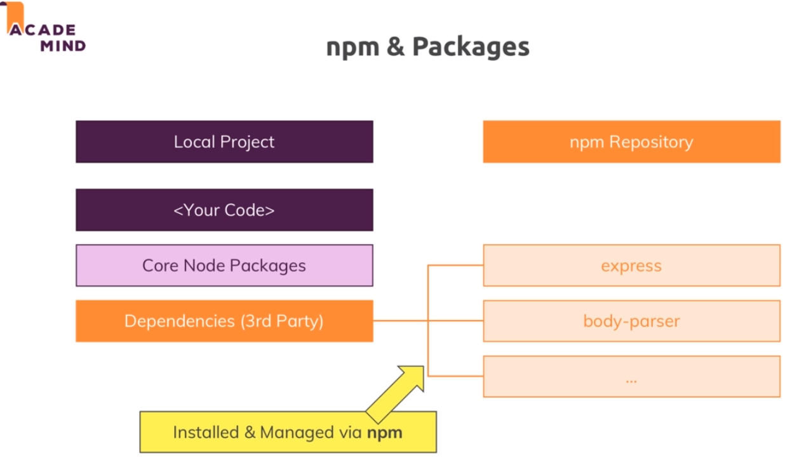
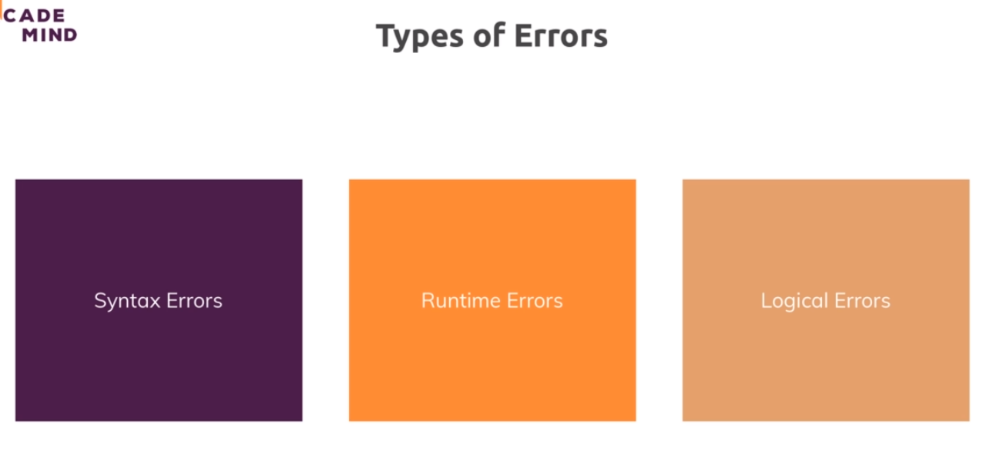
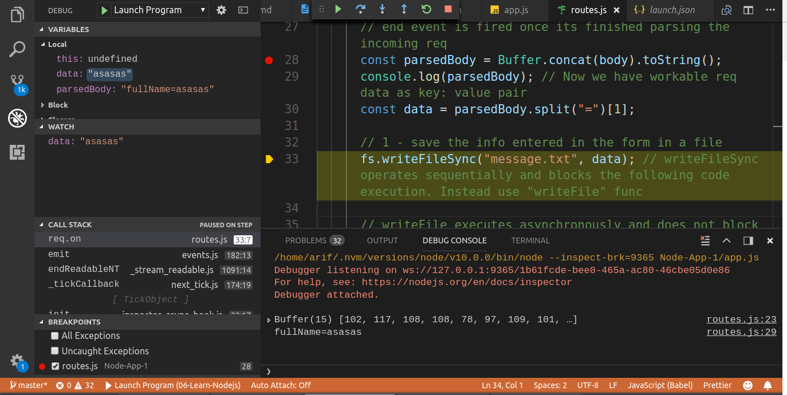
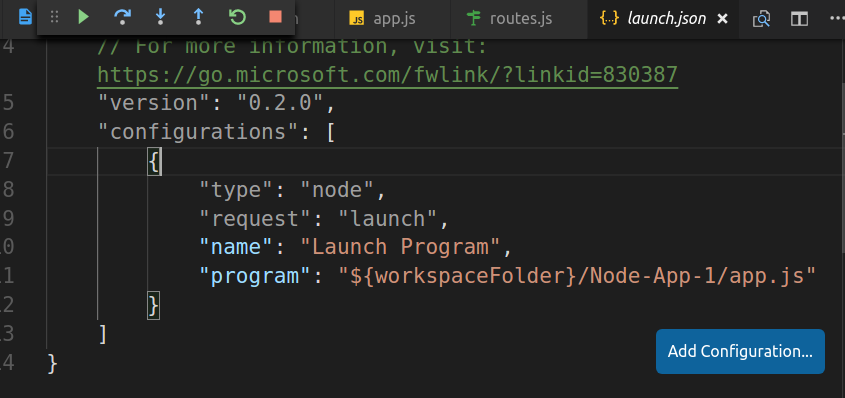
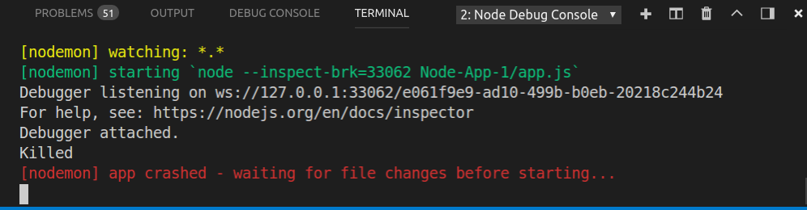

# S3 | Understanding the basics

## S3-L35 | Blocking and Non-Blocking Code

```javascript
    // 1 - save the info entered in the form in a file
      //[Blocking]
      fs.writeFileSync("message.txt", data); // writeFileSync operates sequentially and blocks the following code execution. Instead use "writeFile" func 

      // writeFile executes asynchronously and does not block code until file is written to disc. It also accepts a 3rd argument which is 
      //[Non-Blocking]
      fs.writeFile('message.txt', data, (error) => {
        // 2 - redirect the user to url = '/'
        res.statusCode = 302; // redirection code
        res.setHeader("Location", "/"); // redirection url
        return res.end(); // return from the function after res prepared.
      });
```

## S3-L37 | Using the Node Module System

### Lets split the code into multiple files and use them together. Here we create a routes.js file to handle the routing.

```javascript
//[routes.js]
const requestHandler = (req, res) => {
    if (url === "/") {

    }
    if (url === "/message" && method === "POST") {

    }
}
/**
 * module.exports is a global object exposed by node js which has a exports property.
 * Assigning something e.g function or object to it allows node.js to use the registered object
 * by importing it whereever it is required.
*/
module.exports = requestHandler;
```

```javascript
//[App.js]
const http = require("http");

const routes = require('./routes'); // will cause node.js to look for any module.exports in the path, grab that and assign that to const routes.

const server = http.createServer(routes);
  
server.listen(3001); // servers starts listening to incoming requests.
```
### Exporting multiple things 

```javascript 
//[Way-1]
module.exports = {
    handler: requestHandler,
    someText: 'Some hard coded text'
}

//[Way-2]
module.exports.handler = requestHandler;
module.exports.someText = 'some hard coded text';

```

# S4 | Improved Development Workflow and Debugging

## S4-L41 | Understanding npm scripts

### Objective

    Run the app.js file without manually typing `$ node app.js` and have a generic code without having to guess the entry point of the project.

### How 

1. `$ npm init` - adds a package.json file which helps in 3rd party package management.

2. Add the following code in the file `package.json`

    ```diff
    "scripts": {
        "test": "echo \"Error: no test specified\" && exit 1",
    +    "start": "node app.js" // "script_name" : "command"
    },
    ```
    How to run the script ? - `start` is a spacial script name - you can just run `$ npm start` to run the script and thus the command it is assigned.

3. You can add other custom scripts like 
    ```diff
    "scripts": {
        "test": "echo \"Error: no test specified\" && exit 1",
        "start": "node app.js",
    +    "start-server": "node app.js"
    }
    ```
    How to run the script ? - `$ npm run start-server`

## S4-L42 | Installing 3rd party packages

 

### Lets install a utility package

1. This should allow us to make changes to our code that would automatically trigger node server to restart which was done manually before.
<br>

2. What is the package name that allows this ? 
   _nodemon_
<br>
3. How do we install this package ?

    ```
    $ npm install nodemon --save //install as production dependancy
    OR
    $ npm install nodemon --save-dev //install as just a development dependancy
    OR 
    $ npm install nodemon -g //install globally in machine, not in the project. So that you can use it anywhere.

    ```

    Lets execute `$ npm install nodemon --save-dev`. 
<br>
4. You will see the following added in the package.json file
    
    ```
        "devDependencies": {
        "nodemon": "^1.18.7"
    }
    ``` 
    <br>
5. Where is it installed ? 
    Inside the `node_modules` folder.
<br>
6. What if someone deletes the `node_modules` folder? 
    Just execute `$ npm install` to install all package dependencies again.

## S4-L43 | Global Features vs Core Modules vs Third-Party Modules

[Check out the Summary](https://www.udemy.com/nodejs-the-complete-guide/learn/v4/t/lecture/12251346?start=0)


## S4-L44 | Using Nodemon for Autorestarts

### Update "package.json"

```diff
"scripts": {
    "test": "echo \"Error: no test specified\" && exit 1",
-    "start": "node app.js",
+    "start": "nodemon app.js",
    "start-server": "node app.js"
}
```
Now executing `$ npm start` will cause nodemon to run app.js and watch for any changes and restart the server automatically.

Note that nodemon is installed locally in the project not globally. So executing something like `$ nodemon app.js` will cause _error_. 

To solve the error execute `$ npm install -g nodemon` - the "`-g`" flag ensures that the package gets added as a global package which you now can use anywhere on your machine, directly from inside the terminal or command prompt.

## S4-L46 | Understanding different error types

 

## S4-L49 | Logical Errors (_vscode debugger intro_)

### Debugger
 

### Debugger Congifiguration
 

### Links for further study
1. [Debugging in Visual Studio Code](https://code.visualstudio.com/docs/editor/debugging)

1. [Node.js debugging in VS Code](https://code.visualstudio.com/docs/nodejs/nodejs-debugging)


## S4-L51 | Restarting the Debugger Automatically After Editing our App

### Objective 
Just as we are able to restart the server automatically with _nodemon_ whenever we update the source code,

We want to restart the debugger as well.

### How ?
1. Go to Debug > Add Configuration
2. Change the `launch.json` file as follows 
```diff
"configurations": [

        {
            "type": "node",
            "request": "launch",
            "name": "Launch Program",
            "program": "${workspaceFolder}/Node-App-1/app.js",
+            "restart": true,
+            "runtimeExecutable": "nodemon"
+            "console": "integratedTerminal"
        }
]
```

`"restart": true,` - this causes the debugger to restart

`"runtimeExecutable": "nodemon"` - this ensures that instead of using **node** by default we use the installed **nodemon** package to restart the debugger for any source code updates.

`"console": "integratedTerminal"` - when using **nodemon** we should be using the _integratedTerminal_ as the **console** to be able to close nodemon after exiting debugger using `Ctrl C`. This is not possible from the dubug console.

 
You can now exit nodemon by pressing `Ctrl C`.
 
<span style="color: red">Error</span> - Currently this setup fails because it looks for nodemon globally and does not use the local nodemon.

To install nodemon globally  - `$ npm install nodemon -g`