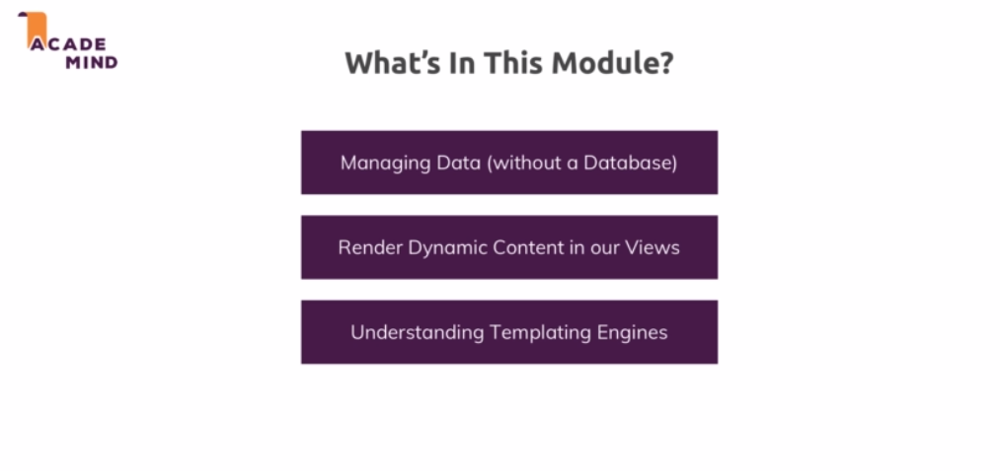
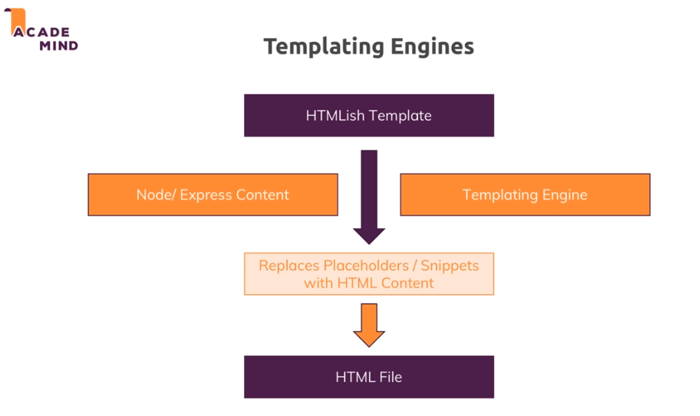

# S6 | Working with Dynamic Content & Adding Templating Engines

---

## S6-L76 | Module Introduction

---



## S6-L77 | Sharing Data Across Requests and Across Users

---

### Objective

Store the input from user in an array in nodejs server and console.log the products in another route by importing the products.

### Code

_admin.js_

```js
// ...

// # Store the products
const products = [];

// ...

// ## Handling Incoming request
router.post("/add-product", (req, res, next) => {
  // Add incoming product to products list
  products.push({ title: req.body.title });
  res.redirect("/");
});
```

Change how we exported previously in _admin.js_

```diff 
// Export router, products
+module.exports.routes = router;
+module.exports.products = products;

```

Since we have changed the exports in admin.js we need to modify app.js which uses admin routes.

_app.js_

```diff
-const adminRoutes = require('./routes/admin');
+const adminData = require('./routes/admin');

-app.use('/admin', adminRoutes);
+app.use('/admin', adminData.routes);

```

In _shop.js_ use the products exported from _admin.js_

_shop.js_
```js
const express = require("express");

const path = require('path');

// # Import rootDirectory variable from Utility > path.js
const rootDir = require('../utility/path') 
// # Import admin data
+ const adminData = require('./admin');


const router = express.Router();

router.get("/", (req, res, next) => {
+    console.log('[shop.js]', adminData.products);
     res.sendFile(path.join(rootDir, 'views', 'shop.html'))
});

module.exports = router;

```

### Output
When you add producs from the admin route by hitting the `/admin/add-products` url, you can see the following output.


### Problem
Even if you open a brand new browser ( **user2** ) and visit localhost, you can view the products entered by **user1** from the previous browser. This is not a secured form of sharing data.

We will learn a better approach.


## S6-L78 | Templating Engine - Overview

---

### Intro



### Available Template Engines 


## S6-L79 | Installing and Implementing Pug

---

* Installing all 3 packages : `$ npm install --save ejs pug express-handlebars`.
* We can just tell express **hey we got a templating engine that is express conforming that we installed so please use it to render dynamic templates.**
* We do that by going into the _app.js_ and after we created our express app here and stored it in the app constant, we can set a global configuration value. Now what is that? `app.set()` allows us to set any values globally on our express application.
* See the [documentation](https://expressjs.com/en/4x/api.html#app.set) for details about `app.set()`
* See the link [Using template engines with Express](https://expressjs.com/en/guide/using-template-engines.html) for better concept.
    * Summary :
        1. **A template engine** - enables you to use static template files in your application. At runtime, the template engine replaces `variables` in a template file with actual values, and transforms the template into an HTML file sent to the client. This approach makes it easier to design an HTML page.

            Some popular template engines that work with Express are Pug, Mustache, and EJS.

        2.  **To render template files** - set the following application setting properties, set in app.js in the default app created by the generator:

            * **`views`**, the directory where the template files are located. Eg: app.set('views', './views'). This defaults to the views directory in the application root directory.
            * **`view engine`**, the template engine to use. For example, to use the Pug template engine: app.set('view engine', 'pug').
        3. Then install the corresponding template engine npm package; for example to install Pug: `$ npm install pug --save`


* We could actually read them from the app object with `app.get()` and this would be another way of sharing data across our application
* `view engine` allows us to tell express hey for any dynamic templates we're trying to render (_and there will be a special function for doing that_), please use this engine we're registering here and `views` allows us to tell express where to find these dynamic views. 